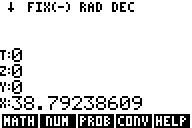
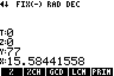

# RPN83P

RPN calculator app for the TI-83 Plus and TI-84 Plus inspired by the HP-42S.

**Version**: 0.1 (2023-08-13)

**Changelog**: [CHANGELOG.md](CHANGELOG.md)

**User Guide**: [USER_GUIDE.md](USER_GUIDE.md)

## Table of Contents

- [Installation](#Installation)
- [Quick Examples](#QuickExamples)
    - [Example 1](#Example1)
    - [Example 2](#Example2)
- [Supported Hardware](#SupportedHardware)
- [User Guide](#UserGuide)
- [Compiling from Source](#Compiling)
- [Tools and Resources](#ToolsResources)
- [License](#License)
- [Feedback](#Feedback)
- [Author](#Author)

## Installation

RPN83P is a flash application (it no longer small enough to create as an
assembly language program). Detailed instructions are given in the [RPN83P User
Guide](USER_GUIDE.md), but here is the quick version:

- Copy the `rpn83p.8xk` file to the TI-83/TI-84 calculator. Use one of following
  link programs:
    - Windows: [TI Connect](https://education.ti.com/en/products/computer-software/ti-connect-sw)
    - Linux: [tilp](https://github.com/debrouxl/tilp_and_gfm)
- Run the program using the `APPS`:
    - Press `APPS`
    - Scroll down to the `RPN83P` entry
    - Press `ENTER`
- Exiting:
    - Quit app: `2ND` `QUIT`
    - Turn off device: `2ND` `OFF`

As a flash app, the RPN83P does not consume precious RAM space, and it is
preserved when the RAM is cleared (either purposefully or accidentally).

## Quick Examples

### Example 1

When the RPN83P is started, it goes directly into the calculator mode, and looks
like this:

> 

Let's us compute the volume of a sphere of radius `2.1`. Recall that the volume
of a sphere is `(4/3) pi r^3`. There are many ways to compute this in an RPN
system, but I tend to start with the more complex, inner expression and work
outwards. Enter the following keystrokes:

- `2`
- `.`
- `1`
- `x^2`
- `2ND` `ANS` (invokes the `LastX` functionality)
- `*` (`r^3` is now in the `X` register)
- `2ND` `pi` (above the `^` button)
- `*` (`pi r^3`)
- `4`
- `*` (`4 pi r^3`)
- `3`
- `/` (`4 pi r^3 / 3`)

The `X` register should show `38.79238609` like this:

> 

### Example 2

Let's calculate the percentage change from `77` to `89`. Press the following:

- `7`
- `7`
- `ENTER`
- `8`
- `9`
- `WINDOW/F2` menu button to invoke the `NUM` item from
  
- `WINDOW/F2` menu button again to invoke the `%CH` item from
  

The display should show `15.58441558%` like this:

> 

(The `Y` register remains at `77` because the `%CH` function does not modify it,
unlike most functions that take 2 arguments. This allows additional calculations
to continue using the original `77` base number.)

Press:

- `ON` (invokes the `ESC/EXIT` functionality)

to go back to the previous menu bar:

> 

### Supported Hardware

This app was designed for TI calculators using the Z80 processor:

- TI-83 Plus
- TI-83 Plus Silver Edition (verified)
- TI-84 Plus
- TI-84 Plus Silver Edition (verified)

## User Guide

See the [RPN83P User Guide](USER_GUIDE.md).

## Compiling from Source

I use Ubuntu Linux 22.04 for my development. The following instructions have
been verified only on my dev machine.

- Clone this repo:
    - `$ git clone git@github.com:bxparks/rpn83p.git`
    - `develop` branch contains the active development
    - `master` branch contains the stable release
- Install [spasm-ng](https://github.com/alberthdev/spasm-ng).
    - I use the static binary zip file, because the `.deb` file would not
      resolve dependencies.
    - Unpack the zip file so that the `spasm` directory is a *sibling* to the
      `rpn83` directory. (See the `SPASM_DIR` variable inside the `Makefile`).
- `$ cd src`
- `$ make`
- Should produce a file named `rpn83p.8xk`.

## Tools and Resources

Here is the tools and resources that I use for development on Ubuntu Linux
22.04:

- spasm-ng Z80 assembler
    - https://github.com/alberthdev/spasm-ng
    - The `releases` section has various packages:
    - Debian/Ubuntu/Mint (`.deb`): could not get this to work
    - Linux (static, `tar.gz`): works for me
- TILP2
    - https://github.com/debrouxl/tilp_and_gfm
    - Data Link from Linux to TI Calculator
    - `$ apt install tilp2`
- tilem2
    - https://www.ticalc.org/archives/files/fileinfo/372/37211.html
    - TI calculator emulator for Linux
    - `$ apt install tilem`
    - `$ apt install tilem-skinedit`
- rom8x
    - https://www.ticalc.org/archives/files/fileinfo/373/37341.html
    - TI calculator ROM extractor
    - Download and extract the zip file.
    - Follow the instructions to copy 1 or 2 applications to the calculator, run
      them on the calculator to generate App Vars which contain the ROM image,
      copy them back to the Linux host machine, then run `rom8x.exe` to generate
      the ROM image using Wine (see next item).
- Wine
    - https://www.winehq.org/
    - `$ apt install wine`, or download directly from winehq.com
    - Needed to run `rom8x.exe` (a Windows executable) on a Linux box.
- GNU Make
    - https://www.gnu.org/software/make/
    - Should already be installed on Ubuntu Linux.
    - `$ apt install make` to install manually.
- Python 3
    - The `python3` interpreter should already be installed on your Linux box.
    - Required to run the [compilemenu.py](tools/compilemenu.py) script that
      compiles the [menudef.txt](src/menudef.txt) file into the
      [menudef.asm](src/menudef.asm) file.
- TI-83 SDK docs
    - https://archive.org/details/83psdk/83psysroutines/
- Learn TI-83 Plus Assembly in 28 Days
    - https://taricorp.gitlab.io/83pa28d/
    - https://gitlab.com/taricorp/83pa28d/
- Hot Dog's Ti-83+ Z80 ASM for the Absolute Beginner
    - https://www.ticalc.org/archives/files/fileinfo/437/43784.html
    - https://www.omnimaga.org/hot-dog's-ti-83-z80-asm-for-the-absolute-beginner
    - Most of this book is aimed at an assembly language beginner.
    - However, Appendix A (_Creating Flash Applications with SPASM_) is the only
      place that I know which explains how to generate a flash app using the
      `spasm-ng` assembler.

## License

[MIT License](https://opensource.org/licenses/MIT)

## Feedback and Support

If you have any questions, comments, or feature requests for this library,
please use the [GitHub
Discussions](https://github.com/bxparks/rpn83p/discussions) for this project.
If you have bug reports, please file a ticket in [GitHub
Issues](https://github.com/bxparks/rpn83p/issues). Feature requests should go
into Discussions first because they often have alternative solutions which are
useful to remain visible, instead of disappearing from the default view of the
Issue tracker after the ticket is closed.

Please refrain from emailing me directly unless the content is sensitive. The
problem with email is that I cannot reference the email conversation when other
people ask similar questions later.

## Author

Created by Brian T. Park (brian@xparks.net).
