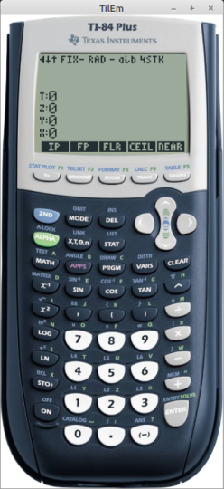

# RPN83P

RPN calculator app for the TI-83 Plus and TI-84 Plus inspired by the HP-42S.

RPN83P is an [RPN](https://en.wikipedia.org/wiki/Reverse_Polish_notation)
calculator app for the [TI-83 Plus
series](https://en.wikipedia.org/wiki/TI-83_series) and the [TI-84 Plus
series](https://en.wikipedia.org/wiki/TI-84_Plus_series) calculators. The app is
inspired mostly by the [HP-42S](https://en.wikipedia.org/wiki/HP-42S)
calculator, with some significant features from the
[HP-12C](https://en.wikipedia.org/wiki/HP-12C) and the
[HP-16C](https://en.wikipedia.org/wiki/HP-16C). RPN83P also hopes to be the
easiest and cheapest gateway app that introduces new users to the beauty and
power of RPN calculators.

Your calculator will look like this when using RPN83P:

RPN83P is a flash application written in Z80 assembly language that consumes 3
pages (48 kiB) of flash memory. Since it is stored in flash, it is preserved if
the RAM is cleared. It consumes about 1025 to 2535 bytes of TI-OS RAM through 4
AppVars, depending on the number of storage registers: `RPN83REG` (500 to 1925
bytes), `RPN83SAV` (140 byte), `RPN83STA` (272 bytes), and `RPN83STK` (120 to
196 bytes).

Summary of features:

- traditional RPN stack (`X`, `Y`, `Z`, `T`), with `LASTX` register
    - configurable stack levels between 4 and 8: `SSIZ`, `SSZ?`
- input edit line with scrollable cursor using arrow keys
    - `LEFT`, `RIGHT`, `2ND LEFT`, `2ND RIGHT`
- 8-line display showing 4 stack registers
- hierarchical menu system similar to HP-42S
- quick reference `HELP` menu
- auto-start capability using the Start-Up app
- storage registers and variables
    - store and recall:`STO nn`, `RCL nn`
    - storage arithmetics: `STO+ nn`, `STO- nn`, `STO* nn`, `STO/ nn`, `RCL+
      nn`, `RCL- nn`, `RCL* nn`, `RCL/ nn`
    - up to 100 numerical storage registers (`nn = 00..99`, default 25)
    - 27 single-letter variables (`nn = A..Z,Theta`)
    - configurable number of storage registers: `RSIZ`, `RSZ?`
- all math functions with dedicated buttons on the TI-83 Plus and TI-84 Plus
    - arithmetic: `/`, `*`, `-`, `+`
    - algebraic: `1/X`, `X^2`, `SQRT`, `^` (i.e. `Y^X`)
    - transcendental: `LOG`, `10^X`, `LN`, `e^X`
    - trigonometric: `SIN`, `COS`, `TAN`, `ASIN`, `ACOS`, `ATAN`
    - constants: `PI` and `E`
- additional menu functions
    - arithmetic: `%`, `%CH`, `GCD`, `LCM`, `PRIM` (prime factor), `IP` (integer
      part), `FP` (fractional part), `FLR` (floor), `CEIL` (ceiling), `NEAR`
      (nearest integer), `ABS`, `SIGN`, `MOD`, `MIN`, `MAX`
    - rounding: `RNDF`, `RNDN`, `RNDG`
    - algebraic: `X^3`, `3ROOTX`
    - transcendental: `XROOTY`,`2^X`, `LOG2`, `LOGB`, `E^X-` (e^x-1), `LN1+`
      (log(1+x))
    - trigonometric: `ATN2`
    - hyperbolic: `SINH`, `COSH`, `TANH`, `ASNH`, `ACSH`, `ATNH`
    - probability: `PERM`, `COMB`, `N!`, `RAND`, `SEED`
    - angle conversions: `>DEG`, `>RAD`, `>REC`, `>POL`, `>HR`, `>HMS`, `HMS+`,
      `HMS-`
- statistics and curve fitting, inspired by HP-42S
    - statistics: `Σ+`, `Σ-`, `SUM`, `MEAN`, `WMN` (weighted mean),
      `SDEV` (sample standard deviation), `SCOV` (sample covariance),
      `PDEV` (population standard deviation), `PCOV` (population covariance)
    - curve fitting: `Y>X`, `X>Y`, `SLOP` (slope), `YINT` (y intercept), `CORR`
      (correlation coefficient)
    - curve fit models: `LINF` (linear), `LOGF` (logarithmic), `EXPF`
      (exponential), `PWRF` (power)
- base conversion and bitwise operations, inspired by HP-16C and HP-42S
    - base conversions: `DEC`, `HEX`, `OCT`, `BIN`
    - logical: `AND`, `OR`, `XOR`, `NOT`, `NEG`
    - rotate and shift: `SL`, `SR`, `ASR`, `RL`, `RR`, `RLC`, `RRC`,
      `SLn`, `SRn`, `RLn`, `RRn`, `RLCn`, `RRCn`
    - bit operations: `CB`, `SB`, `B?`, `REVB` (reverse bits), `CNTB` (count
      bits)
    - arithmetic functions: `BAS+`, `BAS-`, `BAS*`, `BAS/`, `BDIV` (divide with
      remainder)
    - carry flag: `CCF`, `SCF`, `CF?`
    - word sizes: `WSIZ`, `WSZ?`: 8, 16, 24, 32 bits
- time value of money (TVM), inspired by HP-12C, HP-17B, and HP-30b
    - `N`, `I%YR`, `PV`, `PMT`, `FV`
    - `P/YR`, `C/YR`, `BEG`, `END`, `CLTV` (clear TVM)
- complex numbers, inspired by HP-42S and HP-35s
    - stored in RPN stack registers (`X`, `Y`, `Z`, `T`, `LASTX`) and storage
      registers `R00-R99`
    - result modes: `RRES` (real results), `CRES` (complex results)
    - display modes: `RECT`, `PRAD` (polar radians), `PDEG` (polar degrees)
    - linking/unlinking: `2ND LINK` (convert 2 reals to 1 complex, same as
      `COMPLEX` on HP-42S)
    - number entry: `2ND i` (rectangular), `2ND ANGLE` (polar degrees), `2ND
      ANGLE 2ND ANGLE` (polar radians)
    - extended regular functions: `+`, `-`, `*`, `/`, `1/X`, `X^2`, `SQRT`,
      `Y^X`, `X^3`, `3ROOTX`, `XROOTY`, `LOG`, `LN`, `10^X`, `E^X`, `2^X`,
      `LOG2`, `LOGB`
    - complex specific functions: `REAL`, `IMAG`, `CONJ`, `CABS`, `CANG`
    - unsupported: trigonometric and hyperbolic functions (not supported by
      TI-OS)
- unit conversions, inspired by HP-19BII and TI-85
    - 169 units across 12 unit types (LENG, AREA, VOL, TEMP, MASS, FORC, PRES,
      ENER, PWR, TIME, SPD, FUEL)
    - all units of the HP-19BII and TI-85 are supported
- date functions
    - date, time, datetime, timezone, and hardware clock
    - proleptic Gregorian calendar from year 0001 to 9999
    - add or subtract dates, times, datetimes
    - convert datetime to different timezones
    - convert between datetime and epochseconds
    - support alternative Epoch dates (Unix, NTP, GPS, TIOS, Y2K, custom)
    - set and retrieve datetime from the hardware clock (84+/84+SE only)
    - display time and date objects in RFC 3339 (ISO 8601) format
- various modes (`MODE`)
    - floating display: `FIX`, `SCI`, `ENG`
    - trigonometric: `RAD`, `DEG`
    - complex result modes: `RRES`, `CRES`
    - complex display modes: `RECT`, `PRAD`, `PDEG`
    - `SHOW` (`2ND ENTRY`): display all 14 internal digits

Missing features (partial list):

- vectors and matrices
- keystroke programming

**Version**: 1.0.0 (2024-07-19)

**Changelog**: [CHANGELOG.md](CHANGELOG.md)

**Project Home**: https://github.com/bxparks/rpn83p

**User Guide**: [USER_GUIDE.md](docs/USER_GUIDE.md)

## Table of Contents

- [Installation](#installation)
- [Supported Hardware](#supported-hardware)
- [Quick Examples](#quick-examples)
    - [Example 1](#example-1)
    - [Example 2](#example-2)
    - [Example 3](#example-3)
    - [Example 4](#example-4)
- [Documentation](#documentation)
- [Compiling from Source](#compiling-from-source)
- [Tools and Resources](#tools-and-resources)
- [License](#license)
- [Feedback and Support](#feedback-and-support)
- [Author](#author)

## Installation

RPN83P is a flash application that is packaged as a single file named
`rpn83p.8xk`. Detailed instructions are given in the [RPN83P User
Guide](docs/USER_GUIDE.md), but here is the quick version:

- Download the `rpn83p.8xk` file from the
  [releases page](https://github.com/bxparks/rpn83p/releases).
- Upload the file to the TI-83 Plus or TI-84 Plus calculator. Use one of
  following link programs:
    - Windows or MacOS: [TI Connect](https://education.ti.com/en/products/computer-software/ti-connect-sw)
    - Linux: [tilp](https://github.com/debrouxl/tilp_and_gfm) (`$ apt install
      tilp2`)
- Run the program using the `APPS` button:
    - Press `APPS`
    - Scroll down to the `RPN83P` entry
    - Press `ENTER`
- Exiting:
    - Quit app: `2ND` `QUIT`
    - Turn off device: `2ND` `OFF`

The RPN83P app starts directly into the calculator mode, like this:

### Supported Hardware

This app was designed for TI calculators using the Z80 processor:

- TI-83 Plus (6 MHz Z80, 24 kB accessible RAM, 160 kB accessible flash)
- TI-83 Plus Silver Edition (6/15 MHz Z80, 24 kB accessible RAM, 1.5 MB
  accessible flash)
- TI-84 Plus (6/15 MHz Z80, 24 kB accessible RAM, 480 kB accessible flash,
  hardware clock)
- TI-84 Plus Silver Edition (6/15 MHz Z80, 24 kB accessible RAM, 1.5 MB
  accessible flash, hardware clock)
- TI-Nspire with TI-84 Plus Keypad (32-bit ARM processor emulating a Z80, 24
  kB accessible RAM, 1.5 MB accessible flash, hardware clock)
    - **Note**: When uploading the `rpn83p.8xk` file from the PC to the Nspire,
      you need to select "TI-84 Plus" as the calculator model on the PC instead
      of "TI-Nspire". That's because the Nspire is emulating a TI-84+ and the PC
      cannot tell the difference.

The app configures itself to run at 15 MHz on supported hardware, while
remaining at 6 MHz on the TI-83+.

I have tested it on the following calculators that I own:

- TI-83 Plus (OS v1.19)
- TI-83 Plus Silver Edition (OS v1.19)
- TI-84 Plus (OS v2.55MP)
- TI-84 Plus Silver Edition (OS v2.55MP)
- TI-Nspire Clickpad with TI-84 Plus Keypad (OS v2.46)
- TI-Nspire Touchpad with TI-84 Plus Keypad (OS v2.56MP)

Community members have verified that it works on the following variants:

- TI-84 Plus Pocket SE
- TI-84 Pocket.fr (French version of the Pocket SE?)

The following calculators are *not* supported because their internal hardware
and firmware are too different:

- TI-73, 80, 81, 82, 85, 86
- TI-83 (without Plus)
- TI-84 Plus C Silver Edition
- TI-84 Plus CE
- TI-83 Premium CE (French version of the TI-84 Plus CE)
- TI-Nspire CAS, CX, CX CAS, CX II, CX II CAS
- TI-89, 89 Titanium, 92, 92 Plus, Voyage 200

## Quick Examples

### Example 1

Let's compute the volume of a sphere of radius `2.1`. Recall that the volume of
a sphere is `(4/3) pi r^3`. There are many ways to compute this in an RPN
system, but I tend to start with the more complex, inner expression and work
outwards. Enter the following keystrokes:

| **Keys**          | **Display**                            |
| ----------------  | ---------------------                  |
| `2.1`             |  |
| `X^2`             |  |
| `2ND ANS`         |  |
| `*`               |  |
| `2ND PI`          |  |
| `*`               |  |
| `4`               |  |
| `*`               |  |
| `3`               |  |
| `/`               |  |

The `X` register should show `38.79238609`.

Here is an animated GIF that shows this calculation:

(Note that the RPN83P provides a `X^3` menu function that could have been used
for this formula, but I used the `LASTX` feature to demonstrate its use.)

### Example 2

The RPN83P supports most of the base conversion and logical operators found on
the HP-42S and the HP-16C calculators.

Let's calculate the bitwise-and operator between the hexadecimal numbers `B6`
and `65`, then see the result as an octal number (base-8), a binary number
(base-2), then right shift the result 3 bits which sets the Carry Flag, then
view the final result as a decimal number:

| **Keys**              | **Display**                               |
| ---------             | ----------                                |
| `MATH`                |    |
| `DownArrow`           |    |
| `BASE`                |    |
| `HEX`                 |    |
| `ALPHA B` `6`         |    |
| `ENTER`               |    |
| `6` `5`               |    |
| `DownArrow`           |    |
| `LOGI`                |    |
| `AND`                 |    |
| `ON/EXIT` `UpArrow`   |    |
| `OCT`                 |    |
| `BIN`                 |    |
| `DownArrow`           |    |
| `ROTS`                |    |
| `SR` `SR` `SR` (3X)   |    |
| `ON/EXIT` `UpArrow`   |    |
| `DEC`                 |    |

Here is the animated GIF that shows this calculation:

### Example 3

The RPN83P supports the Time Value of Money functionality of the HP-12C
calculator.

In this example:
- We calculate the monthly payment of a $500,000 mortgage over 30 years at 8%,
  then,
- We recalculate the payment at 7%, then,
- We fix the monthly payment at $3000/month and calculate the interest rate
  that is needed for that monthly payment.

Here are the steps:

- Press the `MATH` button to reset the menu to the home row.
- Navigate the menu with the `DownArrow` to get to
  
- Press the `TVM` menu to get to
  
- Press the `DownArrow` to get to
  
- Press the `CLTV` button to clear the TVM variables.
- Press the `UpArrow` to get back to
  
- Press `360` `N` (30 years * 12 months = 360 payments)
- Press `8` `I%YR` (interest percent per year)
- Press `500000` `PV` (present value)
- Press `0` `FV` (future value)
- Press `PMT` (payments)
    - You should see `-3668.822869` ($3668.82)
- Press `7` `I%YR`
- Press `PMT`
    - You should see `-3326.512476` ($3326.51)
- Press `-3000` `PMT`
- Press `I%YR`
    - After a slight delay, you should see 6.006990008 (6%).

Here is the animated GIF that shows this calculation:

### Example 4

Let's add 4 complex numbers, divide by 4 to get their average, view the result
in rectangular, polar radian, and polar degree modes, then extract the complex
magnitude of the result. The following complex numbers were chosen to illustrate
the 4 ways that complex numbers can be entered into RPN83P:

- `100 - i/(2*pi*60*(1e-5))` using `2ND LINK`
- `100 + 250i` using `2ND i`
- `200 ∠ 10°` using `2ND ANGLE`
- `300 ∠ 0.1` using `2ND ANGLE 2ND ANGLE`

The keystrokes are:

- (optional) Press `CLEAR CLEAR CLEAR` to clear the RPN stack.
- Press `MODE` button, `DownArrow`,  `RECT`:
  
- Press `100` `ENTER`
- Press `2` `PI` `*` `60` `*` `1 EE 5` `(-)` `*` `1/X` `(-)` (X: -265.26)
- Press `2ND LINK` (X: 100 i -265.26)
- Press `100` `2ND i` `250` `+` (X: 200 i -15.26)
- Press `200` `2ND ANGLE` `10` `+` (X: 396.96 i 19.47)
- Press `300` `2ND ANGLE` `2ND ANGLE` `0.1` `+` (X: 695.46 i 49.42)
- Press `4` `/` (X: 173.89 i 12.35)
- Press `PRAD` (X: 174.30 ∠ 0.07)
- Press `PDEG` (X: 174.30 ∠° 4.04)
- Press `MATH` button `CPLX`:
  
- Press `CABS` (X: 174.30)

### Exiting the Menu

Press:

- `ON` button (`ESC/EXIT`) multiple times to back to the home menu, or
- `MATH` button (`HOME`) to go back directly.

## Documentation

- [RPN83P User Guide](docs/USER_GUIDE.md)
- [Developer Notes](docs/DEVELOPER.md)
    - [TVM Algorithms](docs/DEVELOPER_TVM.md)
- [Future Enhancements](docs/USER_GUIDE_FUTURE.md)

## Compiling from Source

I use Ubuntu Linux 22.04 for my development. The following instructions have
been verified only on my dev machine.

- Clone this repo:
    - `$ git clone git@github.com:bxparks/rpn83p.git`
    - `develop` branch (default) contains the active development
    - `master` branch contains the stable release
- Install [spasm-ng](https://github.com/alberthdev/spasm-ng).
    - I use the static binary zip file, because the `.deb` file would not
      resolve dependencies.
    - Unpack the zip file so that the `spasm` directory is a *sibling* to the
      `rpn83p` directory. (See the `SPASM_DIR` variable inside the `Makefile`).
- `$ cd src`
- `$ make`
- Should produce a file named `rpn83p.8xk`.

## Tools and Resources

Here are the tools and resources that I used for development on Ubuntu Linux
22.04:

- spasm-ng Z80 assembler
    - https://github.com/alberthdev/spasm-ng
    - The `releases` section has various packages:
    - Debian/Ubuntu/Mint (`.deb`): could not get this to work
    - Linux (static, `tar.gz`): works for me
- TILP2
    - https://github.com/debrouxl/tilp_and_gfm
    - Data Link from Linux to TI Calculator
    - `$ apt install tilp2`
- tilem2
    - https://www.ticalc.org/archives/files/fileinfo/372/37211.html
    - TI calculator emulator for Linux
    - `$ apt install tilem`
    - `$ apt install tilem-skinedit`
- rom8x
    - https://www.ticalc.org/archives/files/fileinfo/373/37341.html
    - TI calculator ROM extractor
    - Download and extract the zip file.
    - Follow the instructions to copy 1 or 2 applications to the calculator, run
      them on the calculator to generate App Vars which contain the ROM image,
      copy them back to the Linux host machine, then run `rom8x.exe` to generate
      the ROM image using Wine (see next item).
- Wine
    - https://www.winehq.org/
    - `$ apt install wine`, or download directly from winehq.com
    - Needed to run `rom8x.exe` (a Windows executable) on a Linux box.
- GNU Make
    - https://www.gnu.org/software/make/
    - Should already be installed on Ubuntu Linux.
    - `$ apt install make` to install manually.
- Python 3
    - The `python3` interpreter should already be installed on your Linux box.
    - Required to run the [compilemenu.py](tools/compilemenu.py) script that
      compiles the [menudef.txt](src/menudef.txt) file into the
      [menudef.asm](src/menudef.asm) file.
- TI-83 SDK docs
    - https://archive.org/details/83psdk/83psysroutines/
- Learn TI-83 Plus Assembly in 28 Days
    - https://taricorp.gitlab.io/83pa28d/
    - https://gitlab.com/taricorp/83pa28d/
- Hot Dog's Ti-83+ Z80 ASM for the Absolute Beginner
    - https://www.ticalc.org/archives/files/fileinfo/437/43784.html
    - https://www.omnimaga.org/hot-dog's-ti-83-z80-asm-for-the-absolute-beginner
    - Most of this book is aimed at an assembly language beginner.
    - However, Appendix A (_Creating Flash Applications with SPASM_) is the only
      place that I know which explains how to generate a flash app using the
      `spasm-ng` assembler.

## License

[MIT License](https://opensource.org/licenses/MIT)

## Feedback and Support

If you have any questions, comments, bugs, or feature requests for this
application, you can file a ticket in the [GitHub
Issues](https://github.com/bxparks/rpn83p/issues). They will be handled on a
best-effort basis. Remember that this software comes with no warranties and no
guarantees of support.

Most of the discussions on the internet are occurring in the [RPN83P
thread](https://www.hpmuseum.org/forum/thread-20867.html) on the [Museum of HP
Calculators](https://www.hpmuseum.org/). That's another option for feedback and
support.

For feature requests, I recommend scanning through the [Future
Enhancements](docs/USER_GUIDE_FUTURE.md) document and verifying that your
feature is not already there.

Please refrain from emailing me directly unless the content is sensitive. The
problem with email is that I cannot reference the email conversation when other
people ask similar questions later.

## Author

Created by Brian T. Park (brian@xparks.net).
