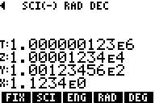

# RPN83P User Guide

RPN calculator app for the TI-83 Plus and TI-84 Plus inspired by the HP-42S.

**Version**: 0.0 (2023-08-11)

**Project Home**: https://github.com/bxparks/rpn83p

## Table of Contents

- [Introduction](#Introduction)
- [Why?](#Why)
    - [Short Answer](#ShortAnswer)
    - [Long Answer](#LongAnswer)
- [Installation](#Installation)
    - [Uploading](#Uploading)
    - [Starting](#Starting)
    - [Quitting](#Quitting)
- [Basic Usage](#BasicUsage)
    - [Screen Areas](#ScreenAreas)
    - [Input and Editing](#InputAndEditing)
    - [RPN Stack](#RPNStack)
    - [Menu System](#MenuSystem)
        - [Menu Hierarchy](#MenuHierarchy)
        - [Menu Buttons](#MenuButtons)
        - [Menu Indicator Arrows](#MenuIndicatorArrows)
    - [Built In Help](#BuiltInHelp)
    - [Error Codes](#ErrorCodes)
- [Functions](#Functions)
    - [Direct Functions](#DirectFunctions)
    - [Menu Functions](#MenuFunctions)
- [Advanced Usage](#AdvancedUsage)
    - [Auto-start](#AutoStart)
    - [Floating Point Display Modes](#FloatingPointDisplayModes)
    - [Trigonometric Modes](#TrigModes)
    - [Base Functions](#BaseFunctions)
        - [Base Modes](#BaseModes)
        - [Base Rendering](#BaseRendering)
        - [Base Integers](#BaseIntegers)
- [Future Enhancements](#FutureEnhancements)
    - [Near Future](#NearFuture)
    - [Medium Future](#MediumFuture)
    - [Far Future](#FarFuture)
    - [Not Planned](#NotPlanned)
- [Bugs and Limitations](#BugsAndLimitations)

## Introduction

The RPN83P is an [RPN](https://en.wikipedia.org/wiki/Reverse_Polish_notation)
calculator app for the [TI-83 Plus](https://en.wikipedia.org/wiki/TI-83_series)
(including the Silver Edition) and the [TI-84
Plus](https://en.wikipedia.org/wiki/TI-84_Plus_series) (including the Silver
Edition). The app is inspired mostly by the
[HP-42S](https://en.wikipedia.org/wiki/HP-42S) calculator, with some sprinkles
of some older HP calculators like the
[HP-12C](https://en.wikipedia.org/wiki/HP-12C) and the
[HP-15C](https://en.wikipedia.org/wiki/HP-15C).

The RPN83P is a flash application that consumes one page (16 kB) of flash
memory. Since it is stored in flash, it is preserved if the RAM is cleared. It
consumes very little RAM: only 5 variables of 18 bytes or about 90 bytes.

Here are some of the high level features:

- traditional 4-level RPN stack (`X`, `Y`, `Z`, `T` registers)
- support for `lastX` register
- hierarchical menu system, inspired by the HP-42S
- support for all math functions with dedicated buttons
    - arithmetic: `/`, `*`, `-`, `+`
    - trigonometric: `SIN`, `COS`, `TAN`, etc.
    - `1/X`, `X^2`, `2ND SQRT`,
    - `^` (i.e. `Y^X`),
    - `LOG`, `10^X`, `LN`, `e^X`
    - constants: `pi` and `e`
- additional menu functions:
    - `%`, `%CH`, `GCD`, `LCM`, `PRIM` (is prime)
    - `ABS`, `SIGN`, `MOD`, `MIN`, `MAX`
    - `IP` (integer part), `FP` (fractional part), `FLR` (floor), `CEIL`
      (ceiling), `NEAR` (nearest integer)
    - probability: `PERM`, `COMB`, `N!`, `RAND`, `SEED`
    - hyperbolic: `SINH`, `COSH`, `TANH`, etc.
    - conversions: `>DEG`, `>RAD`, `>HR`, `>HMS`, `P>R`, `R>P`
    - unit conversions: `>C`, `>F`, `>km`, `>mi`, etc
    - base conversions: `DEC`, `HEX`, `OCT`, `BIN`
- various display modes
    - `RAD`, `DEG`
    - `FIX` (fixed point 0-9 digits)
    - `SCI` (scientific 0-9 digits)
    - `ENG` (engineering 0-9 digits)

Here are some missing features which may be added in the future:

- user registers (`STO 00`, `RCL 00`, etc)
- statistics functions (sum, mean, variance, standard deviation)
- complex numbers
- vectors and matrices
- keystroke programming

## Why?

### Short Answer

This was a fun project that helped me learn Z80 assembly language programming on
TI calculators. It also produced an app that converts a TI calculator into an
RPN calculator that I can actually use.

### Long Answer

When I was in grad school, I used the HP-42S extensively. After graduating, I
sold the calculator because I needed the money. I usually don't regret selling
old stuff in my possession, but that sale is an exception. The old HP-42S
calculators now sell for $200-$300 on eBay, which is a sum of money that I
cannot justify spending for something that is not totally necessary.

I finished my formal school education before graphing calculators became
popular. I had not owned a graphing calculator until a few months ago, so I am
about 20-25 years late to the party. I did not know that the early TI graphing
calculators were using the Z80 processor, and more importantly, I did not know
that they were programmable in assembly language.

The going price for old Z80-based TI calculators seemed entirely reasonable (as
low as $20-30 for working models). I also learned about the 68000-based TI
calculators (e.g. TI-89 Titanium, TI-92 Plus, TI Voyage 200). They were more
expensive than the Z80 calculators, but still within a reasonable price range.
At least compared to old HP calculators which seemed to be unreasonably high.
But maybe that is an indication of their popularity and rarity. When I learned
that these old TI calculators were programmable in assembly language, I decided
that I needed to hack on them. That's how I went from owning zero TI calculators
to owning 5 TI calculators in a few months.

In addition to their programmability, the old TI calculators are appealing to me
for their use of standard AA or AAA batteries, instead of the custom Li-ion
batteries that most electronic devices seem to use these days. Li-ion batteries
have a finite lifetime (2-5 years, depending on their use). Replacement Li-ion
batteries from the original manufacturers tend to be outrageously priced, but
OEM batteries from third parties tend to be substandard clones with chip
firmware that lie about their capacity and lifetimes to the main device. When
these newer devices become obsolete, and their batteries become no longer
available, these calculators will become useless e-waste. Meanwhile, I can
insert my standard sized rechargeable NiMH batteries into 20 or 40 year old
calculators using standard batteries, and they work perfectly fine.

As I learned more about the old TI calculators, I realized that I could probably
create an app that could turn them into a passable, maybe even useful, RPN
calculator. Why RPN? Because I simply cannot use a calculator in algebraic mode.
The debate between the RPN mode and the algebraic mode has probably been going
on for 40-50 years, so I probably cannot add more. Personally, I use algebraic
notation for doing math equations on paper or writing high-level computer
programs. But when I do numerical *computation* on a hand-held device, I cannot
use the algebraic mode. This is especially true when I try to use the more
advanced functions on a TI calculator. They seem so inconsistent and randomly
organized. (For example, I don't understand why the `nPr` and `nCr` functions
implemented as *infix* operators, placed between 2 numbers, instead of as normal
functions `P(n,r)` and `C(n,r)` like other 2-argument functions. Since their
precedence level with respect to the other infix operators (`+`, `*`, `^`, etc)
is not obvious, I will always have to add parenthesis around them anyway, which
seems to defeat the apparent advantage of them being infix operators.)

The RPN83P is inspired by the HP-42S. It is the RPN calculator that I know best.
It also has the advantage of having the
[Free42](https://thomasokken.com/free42/) app (Android, iOS, Windows, MacOS,
Linux) which faithfully reproduces every feature of the HP-42S. This is
essential because I don't own an actual HP-42S anymore. The RPN83P app cannot be
a clone of the HP-42S for several reasons:

- A quick survey of the keyboard layout of the TI-83 and TI-84 calculators shows
  that the button layout and labels are different. As an obvious example, the TI
  calculators have 5 menu buttons below the LCD screen, but the HP-42S has 6
  buttons.
- There may be people who claim that the HP-42S ["was the peak of perfection for
  the classic HP
  calcs"](https://www.hpmuseum.org/cgi-sys/cgiwrap/hpmuseum/archv017.cgi?read=118462),
  but there are features of the HP-42S that can be improved on. For example, the
  HP-42S has a 2-line LCD display which is better than the single-line display
  of earlier HP calculators. The TI-83 and TI-84 LCD screens are big enough to
  show the entire RPN stack as well as the hierarchical menu bar at all times.
- The RPN83P does not implement its own floating point routines, but uses the
  ones provided by the underlying TI-OS. There are essential differences between
  the two systems. For example, the HP-42S supports exponents up to +/-499, but
  the TI-OS supports exponents only to +/-99.

The purpose of the RPN83P project was to help me learn Z80 programming on a TI
calculator, and to convert a TI calculator into an RPN calculator that I can
actually use. If other people find it useful, and if it helps reduce electronic
waste of old TI calculators, then I will have exceeded my expectations of this
project.

## Installation

### Uploading

The RPN83P app is provided as a single file named `rpn83p.8xk`. It must be
uploaded to the calculator using a "link" program from a host computer. There
are a number of options:

**Linux**: Use the [tilp](https://github.com/debrouxl/tilp_and_gfm) program. On
Ubuntu Linux 22.04 systems, the precompiled package can be installed using `$
apt install tilp2`. (I'm not actually sure if the `tilp2` binary is actually
compiled from the `tilp_and_gfm` source code mentioned above)

**Windows** or **MacOS**: Use the [TI
Connect](https://education.ti.com/en/products/computer-software/ti-connect-sw)
software and follow the instructions in [Transferring FLASH Applications to a
Graphing
Calculator](https://education.ti.com/en/customer-support/knowledge-base/sofware-apps/product-usage/11506).

### Starting

After installing `rpn83p.8xk` file, go to the calculator:

- Press the `APPS` key
- Scroll down to the `RPN83P` entry
- Press the `ENTER` key

> 

The RPN83P starts directly into the calculator mode, no fancy splash screen. You
should see a screen that looks like:

> 

### Quitting

The RPN83P application can be quit using:

- `2ND` `QUIT`: to exit to normal TI calculator
- `2ND` `OFF`: to turn the calculator off (the RPN registers will be preserved)

## Basic Usage

This guide assumes that you already know to use an RPN calculator. In
particular, the RPN83P implements the traditional RPN system used by
Hewlett-Packard calculators such as the HP-12C, HP-15C, and the HP-42S. (The
RPN83P does not use the newer RPN system used by the HP-48SX.)

It is beyond the scope of this document to explain how to use an RPN calculator.
One way to learn is to download the [Free42](https://thomasokken.com/free42/)
emulator for the HP-42S (available for Android, iOS, Windows, MacOS, and Linux)
and then download the [HP-42S Owner's
Manual](https://literature.hpcalc.org/items/929).

### Screen Areas

Here are the various UI elements on the LCD screen used by the RPN83P app:

> 

The LCD screen is 96 pixels (width) by 64 pixels (height). That is large enough
to display 8 rows of numbers and letters. They are divided into the following:

- 1: status line
- 2: (currently unused)
- 3: error code line
- 4: T register line
- 5: Z register line
- 6: Y register line
- 7: X register/input line
- 8: menu line

The X register line is also used as the input line when entering new numbers. It
is also used to prompt for command line argument, for example `FIX __` to set
the fixed display mode.)

### Input and Editing

The following buttons are used to enter and edit a number in the input buffer:

- `0`-`9`: digits
- `.`: decimal point
- `(-)`: enters a negative sign, or changes the sign (same as `+/-` or `CHS` on
  HP calculators)
- `DEL`: Backspace (same as `<-` on many HP calculators)
- `CLEAR`: Clear `X` register (same as `CLx` or `CLX` on HP calculators)
- `2ND` `EE`: adds an `E` to allow entry of scientific notation exponent (same
  as `E` or `EEX` on HP calculators)
- `,`: same as `2ND` `EE`, allowing the `2ND` to be omitted for convenience

The `(-)` button acts like the `+/-` or `CHS` button on HP calculators. It
toggles the negative sign, adding it if it does not exist, and removing it if it
does.

The `DEL` key acts like the *backspace* key on HP calculators (usually marked
with a `LEFTARROW` symbol. This is different from the TI-OS where the `DEL` key
removes the character under the cursor. In RPN83P, the cursor is *always* at the
end of the input buffer, so `DEL` is programmed to delete the right-most digit.
If the `X` line is *not* in edit mode (i.e. the cursor is not shown), then the
`DEL` key acts like the `CLEAR` key (see below).

The `CLEAR` key clears the entire input buffer, leaving just a cursor at the end
of an empty string. An empty string will be interpreted as a `0` if the `ENTER`
key or a function key is pressed.

The comma `,` button is not used in the RPN system, so it has been mapped to
behave exactly like the `2ND` `EE` button. This allows scientific notation
numbers to be entered quickly without having to press the `2ND` button
repeatedly.

Emulating the input system of the HP-42S was surprisingly complex and subtle,
and some features and idiosyncrasies of the HP-42S could not be carried over due
to incompatibilities with the underlying TI-OS. I'm not sure that documenting
all the corner cases would be useful because it would probably be tedious to
read. I hope that the input system is intuitive and self-consistent enough that
you can just play around with it and learn how it works.

### RPN Stack

The RPN83P tries to implement the traditional 4-level stack used by many HP
calculators as closely as possible, including some features which some people
may find idiosyncratic. There are 4 slots in the RPN stack named `X`, `Y`, `Z`,
and `T`. The LCD screen on the TI calculators is big enough that all 4 RPN
registers can be shown at all times. (For comparison, the HP-12C and HP-15C have
only a single line display. The HP-42S has a 2-line display, with the bottom
line often commandeered by the menu line so that only the `X` register is
shown.)

These are the buttons which manipulate the RPN stack:

- `(`: rotates RPN stack down (known as `R(downarrow)` on HP calculators)
- `2ND` `{`: rotate RPN stack up (known as `R(uparrow)` on HP calculators)
- `)`: exchanges `X` and `Y` registers
- `ENTER`: saves the input buffer to the `X` register
- `2ND` `ANS`: recalls the last `X`

This mapping of the `(` and `)` to these stack functions is identical to the
mapping used by the [HP-30b](https://en.wikipedia.org/wiki/HP_30b) when it is in
RPN mode. (The HP-30b supports both algebraic and RPN entry modes.)

When a new number is entered (using the `0`-`9` digit keys), the press of the
first digit causes the stack to **lift**, and the calculator enters into the
**edit** mode. This mode is indicated by the appearance of an underscore `_`
cursor.

A stack **lift** causes the previous `X` value to shift into the `Y` register,
the previous `Y` value into the `Z` register, and the previous `Z` value into
the `T` register. The previous `T` value is lost.

The `ENTER` key performs the following actions:

- if the `X` register was in edit mode, the input buffer is closed and the
  number is placed into the `X` register,
- the `X` register is then duplicated into the `Y` register,
- the stack lift is *disabled* for the next number.

This is consistent with the traditional RPN system used by HP calculators up to
and including the HP-42S. It allows the user to press: `2` `ENTER` `3` `*` to
multiply `2*3` and get `6` as the result, because the second number `3` does not
lift the stack.

The parenthesis `(` and `)` buttons are not used in an RPN entry system, so they
have been repurposed for stack manipulation:

- `(` key rotates the stack *down*, exactly as the same as the `R(downarrow)` or
  just a single `(downarrow)` on the HP calculators.
- `2ND` `{` key (above the `(` key) rotates the stack *up*. This functionality
  is not used as often, so it is bound to a key stroke with the `2ND` key.
- `)` key performs an exchange of the `X` and `Y` registers. That functionality
  is usually marked as `X<>Y` on HP calculators.

The `2ND` `ANS` functionality of the TI-OS algebraic mode is unnecessary in the
RPN system because the `X` register is always the most recent result that would
have been stored in `2ND` `ANS`. Therefore, the `2ND` `ANS` has been repurposed
to be the `LastX` functionality of HP calculators. The `LastX` is the value of
the `X` register just before the most recent operation. It can be used to bring
back a number that was accidentally consumed, or it can be used as part of a
longer sequence of calculations.

### Menu System

#### Menu Hierarchy

The menu system of the RPN83P was directly inspired by the HP-42S calculator.
There are over 100 functions supported by the RPN83P menu system, so it is
convenient to arrange them into a nested folder structure. There are 5 buttons
directly under the LCD screen so it makes sense to present the menu items as
sets of 5 items corresponding to those buttons.

The menu system forms a singly-rooted tree of menu items and groups, which look
like this conceptually:

There are 4 components:

- `MenuGroup`: a folder of 1 or more `MenuStrips`
- `MenuStrip`: a list of exactly 5 `MenuNodes` corresponding to the 5 menu
  buttons below the LCD
- `MenuNode`: one slot in the `MenuStrip`, can be *either* a `MenuGroup` or a
  `MenuItem`
- `MenuItem`: a leaf-node that maps directly to a function (e.g. `ASNH`) when
  the corresponding menu button is pressed

#### Menu Buttons

The LCD screen always shows a `MenuStrip` of 5 `MenuItems`. Here are the buttons
which are used to navigate the menu hierarchy:

- `F1`- `F5`: invokes the function shown by the respective menu
- `UP_ARROW`: goes to previous `MenuStrip` of 5 `MenuItems`, within the current
  `MenuGroup`
- `DOWN_ARROW`: goes to next `MenuStrip` of 5 `MenuItems`, within the current
  `MenuGroup`
- `ON`: goes back to the parent `MenuGroup` (similar to the `ON/EXIT` button on
  the HP-42S)
- `MATH`: goes directly to the root `MenuGroup` no matter where you are in the
  menu hierarchy

The appropriate key for the "menu back to parent" function would have been an
`ESC` button. But the TI-83 and TI-84 calculators do not have an `ESC` button
(unlike the TI-92 and TI Voyager 200 series calculators), so the `ON` button was
recruited for this functionality. This seemed to make sense because the HP-42S
uses the `ON` key which doubles as the `EXIT` key to perform this function.

The `HOME` button is useful to go directly to the top of the menu hierarchy from
anywhere in the menu hierarchy. The TI-83 and TI-84 calculators do not have a
`HOME` button (unlike the TI-92 and TI Voyager 200 series again), so the `MATH`
button was taken over to act as the `HOME` key. This choice was not completely
random:

1. The `HOME` button on the [TI-89 series
calculator](https://en.wikipedia.org/wiki/TI-89_series) is located exactly where
the `MATH` is.
2. The RPN83P app does not need the `MATH` button as implemented by the TI-OS,
which opens a dialog box of mathematical functions. In the RPN83P app, that
functionality is already provided by the menu system.
3. When the menu system is at the root, the first menu item on the left is a
menu group named `MATH`, which may help to remember this button mapping.

#### Menu Indicator Arrows

There are 3 menu indicator arrows at the top-left corner of the LCD screen. The
`downarrow` indicates that additional menu strips are available:

> 

When the `DOWN` button is pressed, the menu changes to the next set of 5 menu
items in the next menu strip, and the indicator arrow changes to an `uparrow` to
indicate that we are at the last menu strip of the current group:

> 

Pressing `UP` goes back to the previous menu strip. (Note that since the ROOT
menu group contains only 2 menu strips, you can actually press `DOWN` at the
last menu strip. The menu system *wraps around* to the first menu strip.)

> 

Pressing the `F2/WINDOW` button invokes the `NUM` menu item. This menu item is
actually a `MenuGroup`, so the menu system descends into this folder, and
displays the 5 menu items in the first menu strip:

> 

Pressing the `DOWN` arrow button shows the next menu strip like this:

> 

Notice that the indicator arrows now show both `downarrow` and `uparrow`, which
indicates that there exist one or more menu strips to the top and the one ore
more menu strips to the bottom.

Pressing the `DOWN` arrow button goes to the final menu strip:

> 

The menu indicators show only the `back` arrow, and the `up` arrow. Pressing the
`UP` button goes to the previous menu strip. Pressing the `DOWN` arrow wraps
around to the first menu strip.

When the menu system is in a child menu group, the menu indicator shows a `back`
arrow. This means that the `ON` button (which implements the "back" or "exit"
functionality") can be used to go back to the parent menu group:

> 

## Built In Help

Pressing the `HELP` menu button at the root menu:

> 

activates the Help pages:

> 

> 

> 

> 

Hopefully they are useful for remembering the mapping of the buttons whose TI-OS
keyboard labels do not match the functionality assigned by the RPN83P program.

## Error Codes

The RPN83P supports all error messages from the underlying TI-OS which are
documented in the TI-83 SDK:

- `Err: Argument`
- `Err: Bad Guess`
- `Err: Break`
- `Err: Domain` (`*`)
- `Err: Data Type`
- `Err: Invalid Dim`
- `Err: Dim Mismatch`
- `Err: Divide By 0` (`*`)
- `Err: Increment`
- `Err: Invalid`
- `Err: Iterations`
- `Err: In Xmit`
- `Err: Memory`
- `Err: Non Real`
- `Err: Overflow` (`*`)
- `Err: No Sign Change`
- `Err: Singularity`
- `Err: Stat`
- `Err: StatPlot`
- `Err: Syntax`
- `Err: Tol Not Met`
- `Err: Undefined`

These are shown in the Error Code line on the screen. For example, division by 0
shows this:

> 

The number in parenthesis is the internal numerical value of the error code,
intended for debugging.

The TI SDK documentation does not explain the source of most of these error
codes, and I can reproduce only a small number of errors in the RPN83P app,
marked by (`*`) above.

If an unknown error code is detected the RPN83P will print `Err: UNKNOWN (##)`
message like this:

> 

If the error is reproducible, please file a bug report so that I can add it to
the list of error messages supported by RPN83P.

## Functions

This section contains a description of all functions implemented by the RPN83P
app, accessed through buttons or through the menu system.

### Direct Functions

Most of the mathematical functions that are exposed through physical buttons
are supported by the RPN83P app.

- arithmetic
    - `/`, `*`, `-`, `+`
- trigonometric
    - `SIN`, `COS`, `TAN`
    - `2ND` `SIN^-1`, `2ND` `COS^-1`, `2ND` `TAN^-1`
- algebraic
    - `X^-1`, `X^2`, `sqrt`, `^` (i.e. `Y^X`)
- transcendental
    - `LOG`, `10^X`, `LN`, `e^X`
- constants
    - `pi`, `e`

### Menu Functions

These functions are accessed through the hierarchical menu, using the 5 menu
buttons just under the LCD screen. Use the `UP`, `DOWN`, `ON` (back), and `MATH`
(home) keys to navigate the menu hierarchy.

- `ROOT` (implicit)
    - 
    - 
- `ROOT` > `MATH`
    - 
    - 
    - `X^3`: cube of `X`
    - `3 Root X`: cube root of `X`
    - `ATN2`: `atan2(Y, X)` in degrees or radians, depending on current mode
        - `Y` register is the x-component entered first
        - `X` register is the y-component entered second
    - `2^X`: `2` to the power of `X`
    - `LOG2`: log base 2 of `X`
    - `LOGB`: log base `X` of `Y`
- `ROOT` > `NUM`
    - 
    - 
    - 
    - `%`: `X` percent of `Y`, leaving `Y` unchanged
    - `%CH`: percent change from `Y` to `X`, leaving `Y` unchanged
    - `GCD`: greatest common divisor of `X` and `Y`
    - `LCM`: lowest common multiple of `X` and `Y`
    - `PRIM`: determine if `X` is a prime, returning 1 if prime, 0 otherwise
    - `ABS`: absolute value of `X`
    - `SIGN`: return -1, 0, 1 depending on whether `X` is less than, equal, or
      greater than 0, respectively
    - `MIN`: minimum of `X` and `Y`
    - `MAX`: maximum of `X` and `Y`
    - `IP`: integer part of `X`, truncating towards 0, preserving sign
    - `FP`: fractional part of `X`, preserving sign
    - `FLR`: the floor of `X`, the largest integer <= `X`
    - `CEIL`: the ceiling of `X`, the smallest integer >= `X`
    - `NEAR`: the nearest integer to `X`
- `ROOT` > `PROB`
    - 
    - `COMB`: combination `C(n,r)` = `C(Y, X)`
    - `PERM`: permutation `P(n,r)` = `P(Y, X)`
    - `N!`: factorial of `X`
    - `RAND`: random number in the range `[0,1)`
    - `SEED`: set the random number generator seed to `X`
- `ROOT` > `CONV`
    - 
    - 
    - `>DEG`: convert radians to degrees
    - `>RAD`: convert degrees to radians
    - `P>R`: polar to rectangular
        - input (`Y`, `X`) = `r`, `theta`
        - output (`Y`, `X`) = `x`, `y`
    - `R>P`: rectangular to polar
        - input (`Y`, `X`) = (`x`, `y`)
        - output (`Y`, `X`) = (`r`, `theta`)
    - `>HR`: convert `HH.MMSSssss` to `HH.hhhh`
    - `>HMS`: convert `HH.hhhh` to `HH.MMSSssss`
- `ROOT` > `HELP`: display the help pages
    - use arrow keys to view each help page
- `ROOT` > `MODE`
    - 
    - `FIX`: fixed mode with `N` digits after the decimal point
        - set `N` to `99` for floating number of digits
        - status line indicator is `FIX(N)`
    - `SCI`: scientific notation with `N` digits after the decimal point
        - set `N` to `99` for floating number of digits
        - status line indicator is `SCI(N)`
    - `ENG`: engineering notation with `N` digits after the decimal point
        - set `N` to `99` for floating number of digits
        - status line indicator is `ENG(N)`
    - `RAD`: use radians for trigonometric functions
    - `DEG`: use degrees for trigonometric functions
- `ROOT` > `HYP`
    - 
    - 
    - `SINH`: hyperbolic `sin()`
    - `COSH`: hyperbolic `cos()`
    - `TANH`: hyperbolic `tan()`
    - `ASNH`: hyperbolic `asin()`
    - `ACSH`: hyperbolic `acos()`
    - `ATNH`: hyperbolic `atan()`
- `ROOT` > `UNIT`
    - 
    - 
    - 
    - 
    - 
    - 
    - `>C`: Fahrenheit to Celsius
    - `>F`: Celsius to Fahrenheit
    - `>hPa`: hectopascals (i.e. millibars) to inches of mercury (Hg)
    - `>iHg`: inches of mercury (Hg) to hectopascals (i.e. millibars)
    - `>km`: miles to kilometers
    - `>mi`: kilometers to miles
    - `>m`: feet to meters
    - `>ft`: meters to feet
    - `>cm`: inches to centimeters
    - `>in`: centimeters to inches
    - `>um`: mils (1/1000 of inch) to micrometers
    - `>mil`: micrometers to mils (1/1000 of inch)
    - `>kg`: pounds to kilograms
    - `>lbs`: kilograms to pounds
    - `>g`: ounces to grams
    - `>oz`: grams to ounces
    - `>L`: US gallons to liters
    - `>gal`: liters to US gallons
    - `>mL`: fluid ounces to milliliters
    - `>foz`: milliliters to fluid ounces
    - `>kJ`: kilo calories to kilo Joules
    - `>cal`: kilo Joules to kilo calories
    - `>kW`: horsepowers (mechanical) to kilo Watts
    - `>hp`: kilo Watts to horsepowers (mechanical)
- `ROOT` > `BASE`
    - 
    - 
    - `DEC`: use decimal base 10, set base indicator to `DEC`
    - `HEX`: use hexadecimal base 16, set base indicator to `HEX`
        - display all register values as 32-bit unsigned integer
    - `OCT`: use octal base 8, set base indicator to `OCT`
        - display all register values as 32-bit unsigned integer
    - `BIN`: use binary base 2, set base indicator to `BIN`
        - display all register values as 32-bit unsigned integer
        - max of 13 digits
    - `AND`: `X` `bit-and` `Y`
    - `OR`: `X` `bit-or` `Y`
    - `XOR`: `X` `bit-xor` `Y`
    - `NOT`: one's complement of `X`
    - `NEG`: two's complement of `X`

## Advanced Usage

### Auto-start

For convenience, you may choose to auto-start the RPN83P application as soon as
you turn on the calculator.

- Download the
  [Start-Up](https://education.ti.com/en/software/details/en/77ec7de5d3694f4595c262fdfc2acc4b/83startupcustomization) application from TI
- Press `APPS`, then scroll down to `Start-up`
- Configure:
    - Display: `ON`
    - Type: `APP`
    - Name: `RPN83P` (hit `ENTER` and scroll down to select this)
- Select `FINISH` and hit `ENTER`

The LCD screen should look like this before hitting `FINISH`:

> 

Turn off the calculator and turn it back on. It should directly go into the
RPN83P application.

### Floating Point Display Modes

The RPN83P app provides access to the same floating point display modes as the
original TI-OS. For reference, here are the options available in the TI-OS when
the `MODE` button is pressed:

> 

In RPN83P, the `MODE` button presents a menu bar instead:

> 

**HP-42S Compatibility Note**: The HP-42S uses the `DISP` button to access this
functionality. For the RPN83P, it seemed to make more sense to the follow the
TI-OS convention which places the floating display modes under the `MODE`
button.

The `NORMAL` mode in TI-OS is named `FIX` in RPN83P following the lead of the
HP-42S. It is also short enough to fit into the menu label nicely, and has the
same number of letters as the `SCI` and `ENG` modes which helps with the
top-line indicator.

Suppose the RPN stack has the following numbers:

> 

Pressing the `FIX` menu item shows a `FIX _ _` prompt for the number of digits
after the decimal point, like this:

> 

Type `4` then `ENTER`. The display changes to this:

> 

Notice that the floating point mode indicator at the top of the screen now shows
`FIX(4)`.

Try changing to scientific notation mode, by pressing: `SCI` `4` `ENTER`, to get this:

> 

The top-line indicator shows `SCI(4)`.

You can change to engineering notation mode, by pressing: `ENG` `4` `ENTER`, to
get this:

> 

The top-line indicator shows `ENG(4)`.

To set the number of digits after the decimal point to be dynamic (i.e. the
equivalent of `FLOAT` option in the TI-OS `MODE` menu), type in a number greater
than 9 when prompted for `FIX _ _`, `SCI _ _`, or `ENG _ _`. Usually, I use
`99`. For example, to use scientific notation mode with a variable number of
fractional digits, press `SCI` `99`:

> 

Then hit `ENTER` to get this:

> 

Notice that the top-line floating point indicator now shows `SCI(-)`.

Finally, type `FIX` `99` `ENTER` to go back to the default floating point mode.

> 

**HP-42S Compatibility Note**: The HP-42S automatically performs an `ENTER`
after 2 digits are entered at the prompt, for example `FIX` `99`. The RPN83P
always requires the `ENTER` because I think this is a bit more consistent, and
allows the user to edit and fix any typos. But I think I would be willing to
emulate the HP-42S better if enough people think the HP-42S way is better. Maybe
I could add a configuration option.

**HP-42S Compatibility Note**: The RPN83P uses the underlying TI-OS floating
point display modes, so it cannot emulate the HP-42S exactly. In particular, the
`ALL` display mode of the HP-42S is not directly available, but it is basically
equivalent to `FIX 99` on the RPN83P.

### Trigonometric Modes

Just like the TI-OS, the RPN83P uses the radian mode by default when calculating
trigonometric functions. The top status line shows `RAD`:

> 

If we calculate `sin(pi/6)` in radian mode, by typing `PI` `6` `/` `SIN`, we get
`0.5` as expected.

Press the `DEG` menu button to change to degree mode. The top status line shows
`DEG`:

> 

We can calculate `sin(30deg)` by typing: `30` `SIN` to get `0.5`.

**Warning**: The polar to rectangular conversion functions (`R>P` and `P>R`) are
also affected by the current Trig Mode setting.

**HP-42S Compatibility Note**: The RPN83P does not offer the
[gradian](https://en.wikipedia.org/wiki/Gradian) mode `GRAD` because the
underlying TI-OS does not support the gradian mode directly. It is probably
possible to add this feature by intercepting the trig functions and performing
some pre and post unit conversions. But I'm not sure if it's worth the effort
since gradian trig mode is not commonly used.

### BASE Functions

The `BASE` functions are available through the `ROOT` > `BASE` hierarchy:

- 
    - 
    - 

These functions allow conversion of integers into different bases (10, 16, 8,
2), as well as performing bitwise functions on those integers (bit-and, bit-or,
bit-xor, etc). They are useful for computer science and programming. The `BASE`
modes and functions work somewhat differently compared to the HP-42S, so
additional documentation is provided here.

#### BASE Modes

**DEC** (decimal)

The `DEC` (decimal) mode is the default. All numbers on the RPN stack are
displayed using the currently selected floating point mode (e.g. `FIX`, `ENG`,
and `SCI`) and the number of digits after the decimal point. Here is an example
screenshot:

> 

**HEX** (hexadecimal)

The `HEX` (hexadecimal) mode displays all numbers on the RPN stack using base
16. Only the integer part is rendered. It is converted into an unsigned 32-bit
integer, and printed using 8 hexadecimal digits. If there are fractional digits
after the decimal point, a decimal point `.` is printed at the end of the 8
digits to indicate that the fractional part is not shown. Negative numbers are
not valid and three dots are printed instead. Three dots are printed if the
integer part is `>= 2^32`.

The hexadecimal digits `A` through `F` are entered using `ALPHA` `A`, through
`ALPHA` `F`. You can lock the `ALPHA` mode using `2ND` `A-LOCK`, but that causes
the decimal buttons `0` to `9` to send letters instead which prevents those
digits to be entered, so it is not clear that the Alpha Lock mode is actually
useful in this context.

> 

**OCT** (octal)

The `OCT` (octal) mode displays all numbers on the RPN stack using base 8. Only
the integer part is rendered. It is converted into an unsigned 32-bit integer,
and printed using 11 octal digits. If there are fractional digits after the
decimal point, a decimal point `.` is printed at the end of the 11 digits to
indicate that the fractional part is not shown. Negative numbers are not valid
and three-dots are printed instead. Three dots are printed if the integer part
is `>= 2^32`.

The digits `0` through `7` are entered normally. The digits `8` and `9` are
disabled in octal mode.

> 

**BIN** (binary)

The `BIN` (binary) mode displays all numbers on the RPN stack using base 2. Only
the integer part is rendered. It is converted into an unsigned 32-bit integer,
and printed using 14 binary digits (the maximum allowed by the width of the LCD
screen). The there are fractional digits after the decimal point, a decimal
point `.` is printed at the end of the 14 digits to indicate that the fractional
part is not shown. Negative numbers are not valid and three-dots are printed
instead. Three dots are also printed if the integer part is `>= 2^14` (i.e. `>=
16384`).

Only the digits `0` and `1` are active in the binary mode. The rest are
disabled.

> 

#### Base Rendering

Unlike the HP-42S, the `HEX`, `OCT` and `BIN` modes are simply *display* modes
that only affect how the numbers are rendered. These modes do not affect any
arithmetic or mathematical operations. In particular, the arithmetic buttons
`/`, `*`, `-`, and `+` do not change their behavior in the `HEX`, `OCT`, `BIN`
modes, in contrast to the HP-42S which remaps those buttons to the `BASE/`,
`BASE*`, `BASE-`, and `BASE+` functions instead.

For example, suppose the following numbers are in the RPN stack in `DEC` mode:

> 

Changing to `HEX` mode shows this:

> 

Pressing the `+` button adds the `X` and `Y` registers, with no change in
behavior from the `DEC` mode, including the hidden fractional part:

> 

Changing back to `DEC` mode shows that the numbers were added normally:

> 

#### Base Integers

The HP-42S uses a 36-bit *signed* integer for BASE rendering and operations. To
be honest, I have never been able to fully understand and become comfortable
with the HP-42S implementation of the BASE operations. First, 36 bits is a
strange number, it is not an integer size used by modern microprocessors (8, 16,
32, 64 bits). Second, the HP-42S does not display leading zeros in `HEX` `OCT`,
or `BIN` modes. While this is consistent with the decimal mode, I find it
confusing to see the number of rendered bits change depending on its value.

The RPN83P deviates from the HP-42S by using a 32-bit *unsigned* integer
internally, and rendering the various HEX, OCT, and BIN numbers using the same
number of digits all the time. This means that `HEX` mode always displays 8
digits, `OCT` mode always displays 11 digits, and `BIN` mode always displays 14
digits (due to size limitation of the LCD screen). I find this far less
confusing when doing bitwise operations (e.g. bit-and, bit-or, bit-xor).

Since the internal integer representation is *unsigned*, the `(-)` (change sign)
button is disabled. Instead, the menu system provides a `NEG` function which
performs a [two's complement](https://en.wikipedia.org/wiki/Two%27s_complement)
operation which turns a `00000001` hex number into `FFFFFFFF`. The `NEG`
function is closely related to the `NOT` function which performs a [one's
complement](https://en.wikipedia.org/wiki/Ones%27_complement) operation where
the `00000001` becomes `FFFFFFFE`.

If you want to see the decimal value of a hex number that has its sign-bit (the
most significant bit) turned on (so it would be interpreted as a negative number
if it were interpreted as a 32-bit signed integer), you can run the `NEG`
function on it, then hit the `DEC` menu item to convert it to decimal. The
displayed value will be the decimal value of the original hex number, without
the negative sign.

Currently, the integer size for base conversions and functions is hardcoded to
be 32 bits. I hope to add the ability to change the integer size in the future.

## Future Enhancements

There are a number of features which I would like to add in the future. I have
grouped them as follows:

### Near Future

- bit shift and rotation operators
    - shift left
    - shift right
    - rotate left
    - rotate right
    - arithmetic shift right (preserve sign bit)
- user-accessible registers
    - Most HP calculators provide user-accessible registers identified by a
      number. For example `STO 00` stores the current `X` value to Register
      `00`.
    - I hope to add most of these in the near future:
        - `RCL NN`, `STO NN`, `STO+ NN`, `STO- NN`, `STO* NN`, `STO/ NN`
    - The HP-42S supports registers identified by a string. Not sure if this
      feature is worth the effort.
- user selectable integer size for `BASE` functions
    - currently, binary, octal, hexadecimal routines are implemented internally
      using 32-bit unsigned numbers
    - the user ought to be able to specify the integer size for those
      operations: 8 bits, 16 bits, 32 bits, maybe 48 bits and 64 bits
    - the user-interface will be a challenge: for large integer sizes, the
      number of digits will no longer fit inside the 14-15 digits available on a
      single line.
- system memory
    - It might be useful to expose some system status functions, like memory.
    - But since we can always drop into the TI-OS and use `2ND` `MEM` to get
      that information, it is not clear that this is worth the effort.

### Medium Future

- complex numbers
    - The TI-OS provides internal subroutines to handle complex numbers, so in
      theory, this should be relatively easy.
    - I think the difficulty will be the user interface. A complex number
      requires 2 floating point numbers to be entered and displayed, and I have
      not figured out how to do that within the UI of the RPN83P application.
- `STAT` functions
    - There are lot of features that I need to research:
        - average, std deviation, variance
        - linear fitting
        - logarithmic fitting
        - exponential fitting
        - power law fitting
- real time clock
    - I believe the TI-84 Plus has an RTC.
    - It would be interesting to expose some time, date, and timezone features.

### Far Future

I'm not sure these features are worth the effort, but I may do them for
curiosity and the technical challenge:

- programming
    - Although I think it is technically possible for the RPN83P app to support
      keystroke programming, like the HP-42S, I am not sure that the calculator
      world needs yet another calculator programming language.
    - Is it sufficient that the user can drop into TI-BASIC programming if that
      is required?
- matrix and vectors
    - I don't know how much matrix functionality is provided by TI-OS SDK.
    - Making the user-interface reasonable could be a challenge.
    - I'm not sure that adding matrix functions into a calculator is worth the
      effort. For any non-trivial calculations, it is probably easier to use a
      desktop computer and application (e.g. MATLAB, Octave, Mathematica).

### Not Planned

- graphing
    - The TI-OS has extensive support for graphing equations.
    - It does not make sense to duplicate that work in the RPN83P application.
- computer algebra system (CAS)
    - The TI-83 Plus and TI-84 Plus do not support CAS, so it is highly unlikely
      that the RPN83P will support CAS either.
- rational numbers
    - Not something that I have ever needed, so I probably will not want to
      spend my time implementing it.

## Bugs and Limitations

- `PRIM` (isPrime) is quite slow, about as slow as a TI-BASIC program.
    - Uses the TI-OS floating numbers and subroutines, which works pretty
      well for smallish integers.
    - Can probably make this significantly faster by implementing the algorithm
      using native Z80 integer operations.
    - (Need to write a `div(u32, u16) -> u32` function).
- `PROB` and `COMB` arguments are limited to `< 256`
    - Should be relatively easy to extend this to `< 2^16` or `<2^32`.
- `GCD` and `LCM` functions are slow
    - Could be made significantly faster.
- Too many digits when using `BASE 2`
    - A single line in the RPN83P app can display 14 digits.
    - A 32-bit integer in base 2 requires 32 digits, so the display will often
      overflow when using base 2.
- `UNIT` conversions
    - several places assume US customary units (e.g. US gallons) instead of
      British or Canadian imperial units
    - it'd be nice to support both types, if we can make the menu labels
      self-documenting and distinctive
