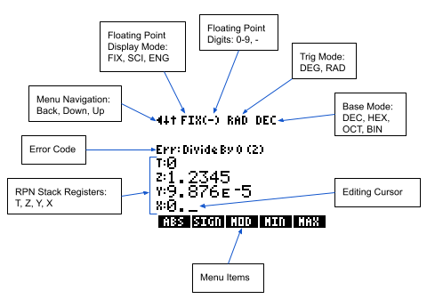
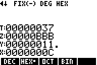
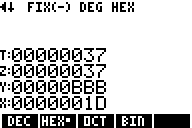
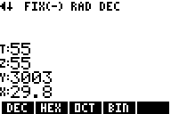

# RPN83P User Guide

RPN calculator app for the TI-83 Plus and TI-84 Plus inspired by the HP-42S.

**Version**: 0.0 (2023-08-07)

**Project Home**: https://github.com/bxparks/rpn83p

## Table of Contents

- [Introduction](#Introduction)
- [Installation](#Installation)
- [Basic Usage](#BasicUsage)
    - [Screen Areas](#ScreenAreas)
    - [Input and Editing](#InputAndEditing)
    - [RPN Stack](#RPNStack)
    - [Menu Hierarchy and Navigation](#MenuHierarchy)
- [Advanced Usage](#AdvancedUsage)
- [Functions](#Functions)
    - [Direct Functions](#DirectFunctions)
    - [Menu Functions](#MenuFunctions)
    - [Base Functions](#BaseFunctions)
        - [Base Modes](#BaseModes)
        - [Base Mode and Rendering](#BaseRendering)
        - [Base Integers](#BaseIntegers)
- [Future Enhancements](#FutureEnhancements)
    - [Near Future](#NearFuture)
    - [Medium Future](#MediumFuture)
    - [Far Future](#FarFuture)
    - [Not Planned](#NotPlanned)
- [Bugs and Limitations](#BugsAndLimitations)

## Introduction

The RPN83P is an [RPN](https://en.wikipedia.org/wiki/Reverse_Polish_notation)
calculator app for the [TI-83 Plus](https://en.wikipedia.org/wiki/TI-83_series)
(including the Silver Edition) and the [TI-84
Plus](https://en.wikipedia.org/wiki/TI-84_Plus_series) (including the Silver
Edition). The app is inspired mostly by the
[HP-42S](https://en.wikipedia.org/wiki/HP-42S) calculator, with some sprinkles
of some older HP calculators like the
[HP-12C](https://en.wikipedia.org/wiki/HP-12C) and the
[HP-15C](https://en.wikipedia.org/wiki/HP-15C).

The RPN83P is a flash application that consumes one page (16 kB) of flash
memory. Since it is stored in flash, it is preserved if the RAM is cleared. It
consumes very little RAM: only 5 variables of 18 bytes or about 90 bytes.

Here are some of the high level features:

- traditional 4-level RPN stack (`X`, `Y`, `Z`, `T` registers)
- support for `lastX` register
- hierarchical menu system, inspired by the HP-42S
- support for all math functions with dedicated buttons
    - arithmetic: `/`, `*`, `-`, `+`
    - trigonometric: `SIN`, `COS`, `TAN`, etc.
    - `1/X`, `X^2`, `2ND SQRT`,
    - `^` (i.e. `Y^X`),
    - `LOG`, `10^X`, `LN`, `e^X`
    - constants: `pi` and `e`
- additional menu functions:
    - `%`, `Delta%`, `GCD`, `LCM`, `PRIM` (is prime?)
    - `ABS`, `SIGN`, `MOD`, `MIN`, `MAX`
    - `IP` (integer part), `FP` (fractional part), `FLR` (floor), `CEIL`
      (ceiling), `NEAR` (nearest integer)
    - probability: `PERM`, `COMB`, `N!`, `RAND`, `SEED`
    - hyperbolic: `SINH`, `COSH`, `TANH`, etc.
    - conversions: `>DEG`, `>RAD`, `>HR`, `>HMS`, `P>R`, `R>P`
    - unit conversions: `>C`, `>F`, `>km`, `>mi`, etc
    - base conversions: `DEC`, `HEX`, `OCT`, `BIN`
- various display modes
    - `RAD`, `DEG`
    - `FIX` (fixed point 0-9 digits)
    - `SCI` (scientific 0-9 digits)
    - `ENG` (engineering 0-9 digits)

Here are some missing features which may be added in the future:

- user registers (`STO 00`, `RCL 00`, etc)
- statistics functions (sum, mean, variance, standard deviation)
- complex numbers
- vectors and matrices
- keystroke programming

## Installation

The RPN83P app is provided as a single file named `rpn83p.8xk`. It must be
uploaded to the calculator using a "link" program from a host computer. There
are a number of options:

**Linux**: Use the [tilp](https://github.com/debrouxl/tilp_and_gfm) program. On
Ubuntu Linux 22.04 systems, the precompiled package can be installed using `$
apt install tilp2`. (I'm not actually sure if the `tilp2` binary is actually
compiled from the `tilp_and_gfm` source code mentioned above)

**Windows** or **MacOS**: Use the [TI
Connect](https://education.ti.com/en/products/computer-software/ti-connect-sw)
software and follow the instructions in [Transferring FLASH Applications to a
Graphing
Calculator](https://education.ti.com/en/customer-support/knowledge-base/sofware-apps/product-usage/11506).

After installing `rpn83p.8xk` file, go to the calculator:

- Press the `APPS` key
- Scroll down to the `RPN83P` entry
- Press the `ENTER` key

You should see a screen that looks like:

> 

The following are various ways to quit or exit out of certain contexts:

- `2ND` `QUIT`: to exit to normal TI calculator
- `2ND` `OFF`: to turn the calculator off (the RPN registers will be preserved)
- `ON`: to incrementally back out from nested menus

## Basic Usage

This guide assumes that you already know to use an RPN calculator. In
particular, the RPN83P implements the traditional RPN system used by
Hewlett-Packard calculators such as the HP-12C, HP-15C, and the HP-42S. (The
RPN83P does not use the newer RPN system used by the HP-48SX.)

It is beyond the scope of this document to explain how to use an RPN calculator.
One way to learn is to download the [Free42](https://thomasokken.com/free42/)
emulator for the HP-42S, available for Android, iOS, Windows, MacOS, and Linux),
and then download and read the [HP-42S Owner's
Manual](https://literature.hpcalc.org/items/929).

### Screen Areas

Here are the various UI elements on the LCD screen used by the RPN83P app:

> 

The LCD screen is 96 pixels (width) by 64 pixels (height). That is large enough
to display 8 rows of numbers and letters. They are divided in the following:

- 1: status line
- 2: (currently unused)
- 3: error code line
- 4: T register line
- 5: Z register line
- 6: Y register line
- 7: X register/input line
- 8: menu line

The X register line is also used as the input line when entering new numbers. It
is also used to prompt for command line argument, for example `FIX __` to set
the fixed display mode.)

### Input and Editing

The following buttons are used to enter and edit a number in the input buffer:

- `0`-`9`: digits
- `(-)`: change sign (same as `+/-` or `CHS` on HP calculators)
- `.`: decimal point
- `2ND` `EE`: exponent for scientific notation (same as `E` or `EEX` on HP
  calculators)
- `,`: same as `2ND` `EE` for convenience
- `DEL`: Backspace (same as `<-` on many HP calculators)
- `CLEAR`: Clear `X` register (same as `CLx` or `CLX` on HP calculators)

When the cursor (`_`) is shown, indicating the **edit** mode, the `DEL` key acts
like the *backspace* key on HP calculators. The `DEL` key always removes the
right-most digit, because the cursor is always at the end of the input string of
digits.

The `CLEAR` key clears the entire input buffer, leaving just a cursor at the end
of an empty string. An empty string will be interpreted as a `0`. Note that when
the cursor is *not* shown, the `DEL` key also acts like the `CLEAR` key.

The comma `,` button is not used in the RPN system, so it has been mapped to
behave exactly like the `2ND` `EE` button. This allows scientific notation
numbers to be entered quickly without having to press the `2ND` button
repeatedly.

### RPN Stack

The RPN83P tries to implement the traditional 4-level stack used by many HP
calculators as closely as possible, including some features which some people
may find idiosyncratic. There are 4 slots in the RPN stack named `X`, `Y`, `Z`,
and `T`. The LCD screen on the TI calculators is big enough that all 4 RPN
registers can be shown at all times. (For comparison, the HP-12C and HP-15C have
only a single line display. The HP-42S has a 2-line display, with the bottom
line often commandeered by the menu line so that only the `X` register is
shown.)

There are 4 keys which are relevant for the RPN stack:

- `(`: rotates RPN stack down (known as `R(downarrow)` on HP calculators)
- `2ND` `{`: rotate RPN stack up (known as `R(uparrow)` on HP calculators)
- `)`: exchanges `X` and `Y` registers
- `ENTER`: saves the input buffer to the `X` register, and *disables* the
  stack lift for the next number entry
- `2ND` `ANS`: recalls the last `X`

When a new number is entered (using the `0`-`9` digit keys), the press of the
first digit causes the stack to **lift**, and the calculator enters into the
**edit** mode. This mode is indicated by the appearance of an underscore `_`
cursor.

A stack **lift** causes the previous `X` value to shift into the `Y` register,
the previous `Y` value into the `Z` register, and the previous `Z` value into
the `T` register. The previous `T` value is lost.

The `Enter` key performs the following actions:

- if the `X` register was in edit mode: the input buffer is closed and the
  number is placed into the `X` register,
- the `X` register is then duplicated into the `Y` register,
- it *disables* the stack lift for the next number.

This is consistent with the traditional RPN system used by HP calculators up to
and including the HP-42S. It allows the user to press: `2` `ENTER` `3` `*` to
multiply `2*3` and get `6` as the result, because the second number `3` does not
lift the stack.

The parenthesis `(` and `)` buttons are not used in an RPN entry system, so they
have been repurposed for stack manipulation.

The `(` key rotates the stack down, exactly as the same as the `R(downarrow)` or
just a single `(downarrow)` on the HP calculators. The `2ND` `{` key (above the
`(` key) performs the opposite stack rotation, rotating the stack up. This
functionality is not used as often, so it is bound to a key stroke with the
`2ND` key.

The `)` key performs an exchange of the `X` and `Y` registers. That
functionality is usually marked as `X<>Y` on HP calculators.

This mapping of the `(` and `)` to these stack functions is identical to the
mapping used by the [HP-30b](https://en.wikipedia.org/wiki/HP_30b) when it is in
RPN mode. (The HP-30b supports both algebraic and RPN entry modes.)

The `2ND` `ANS` functionality of the TI-OS algebraic mode is unnecessary in the
RPN used by RPN83P, because the `X` register is always the most recent result
that would have been stored in `2ND` `ANS`. Therefore, the `2ND` `ANS` is
repurposed to be the `LastX` functionality of HP calculators. The `LastX` is the
value of the `X` register just before the most recent operation. It can be used
to bring back a number that was accidentally consumed, or it can be used as part
of a longer sequence of calculations.

### Menu Hierarchy and Navigation

The menu system of the RPN83P was borrowed directly from the HP-42S calculator.
There are over 100 functions supported by the RPN83P menu system, so it is
convenient to arrange them into a nested folder structure. There are 5 buttons
directly under the LCD screen so it makes sense to present the menu items as
sets of 5 items corresponding to those buttons.

The menu system forms a singly-rooted tree of menu items and groups, which look
like this conceptually:

> 

There are 4 components:

- `MenuGroup`: a list of 1 or more `MenuStrips`
- `MenuStrip`: a list of exactly 5 `MenuNodes` corresponding to the 5 menu
  buttons below the LCD
- `MenuNode`: one slot in the `MenuStrip`, can be *either* a `MenuGroup` or a
  `MenuItem`
- `MenuItem`: a leaf-node that maps directly to a function (e.g. `ASNH`) when
  the corresponding menu button is pressed

The LCD screen always shows a `MenuStrip` of 5 `MenuItems`. There are 4 buttons
that are used to navigate the menu hierarchy:

- `UP_ARROW`: go to previous `MenuStrip` of 5 `MenuItems`, if the current
  `MenuGroup` group has multiple menu strips, otherwise does nothing
- `DOWN_ARROW`: go to next `MenuStrip` of 5 `MenuItems`, if the current
  `MenuGroup` has multiple menu strips, otherwise does nothing
- `ON`: go back in the menu hierarchy to the parent `MenuGroup` (similar to the
  `ON/EXIT` button on the HP-42S)
- `MATH`: go to the root `MenuGroup`, the top of the menu hierarchy

When you press a menu button that corresponds to a `MenuGroup`, the menu system
descends into the group, and shows the first set of 5 `MenuItems` in the first
`MenuStrip` in that group.

If there are multiple `MenuStrips` in that group, you can use the `UP_ARROW` and
`DOWN_ARROW` keys move from one `MenuStrip` to the next menu strip within the
same `MenuGroup`. Pressing `UP` at the first strip will wrap around to the last
strip. Pressing `DOWN` at the last strip will wrap around to the first strip.

To move from a child `MenuGroup` back up to the parent `MenuGroup`, the
appropriate key would have been an `ESC` button. But the TI-83 and TI-84
calculators do not have an `ESC` button (unlike the TI-92 and TI Voyager 200
series calculators), so the `ON` button was recruited for this functionality.
The choice of the `ON` button was not completely random, because the HP-42S uses
the `ON` key which doubles as the `EXIT` key to perform implement this function.

Pressing the `ON` button multiple times will eventually bring you back to the
top of the menu hierarchy. Sometimes it is convenient to be able to go back to
the root of the menu system in a single press. That button would be the `HOME`
button, but the TI-83 and TI-84 calculators do not have a `HOME` button (unlike
the TI-92 and TI Voyager 200 series again). Instead, the RPN83P app takes over
the `MATH` button to act as the `HOME` key. This choice is not completely
random: First, the `HOME` button on the TI-89 Titanium is located exactly where
the `MATH` is. And second, when the menu is at the root, the first menu item on
the left is a `MenuGroup` named `MATH`, which may help to remember this button
mapping.

## Advanced Usage

For convenience, you may choose to auto-run the RPN83P application as soon as
you turn on the calculator.

- Download the
  [Start-Up](https://education.ti.com/en/software/details/en/77ec7de5d3694f4595c262fdfc2acc4b/83startupcustomization) application from TI
- Press `APPS`, then scroll down to `Start-up`
- Configure:
    - Display: `ON`
    - Type: `APP`
    - Name: `RPN83P` (hit `ENTER` and scroll down to select this)
- Select `FINISH` and hit `ENTER`

The LCD screen should look like this before hitting `FINISH`:

> 

Turn off the calculator and turn it back on. It should directly go into the
RPN83P application.

## Functions

### Direct Functions

These functions are available directly from the physical buttons on the
calculator keyboard.

- arithmetic
    - `/`, `*`, `-`, `+`
- trigonometric
    - `SIN`, `COS`, `TAN`
    - `2ND` `SIN^-1`, `2ND` `COS^-1`, `2ND` `TAN^-1`
- algebraic
    - `X^-1`, `X^2`, `sqrt`, `^` (i.e. `Y^X`)
- transcendental
    - `LOG`, `10^X`, `LN`, `e^X`
- constants
    - `pi`, `e`

### Menu Functions

These functions are accessed through the hierarchical menu, using the 5 menu
buttons just under the LCD screen. Use the `UP`, `DOWN`, `ON` (back), and `MATH`
(home) keys to navigate the menu hierarchy.

- `ROOT` (implicit)
    - 
    - 
- `ROOT` > `MATH`
    - 
    - 
    - `X^3`: cube of `X`
    - `3 Root X`: cube root of `X`
    - `ATN2`: `atan2(Y, X)` in degrees or radians, depending on current mode
        - `Y` register is the x-component entered first
        - `X` register is the y-component entered second
    - `2^X`: `2` to the power of `X`
    - `LOG2`: log base 2 of `X`
    - `LOGB`: log base `X` of `Y`
- `ROOT` > `NUM`
    - 
    - 
    - 
    - `%`: `X` percent of `Y`, leaving `Y` unchanged
    - `Delta %`: percent change from `Y` to `X`, leaving `Y` unchanged
    - `GCD`: greatest common divisor of `X` and `Y`
    - `LCM`: lowest common multiple of `X` and `Y`
    - `PRIM`: determine if `X` is a prime, returning 1 if prime, 0 otherwise
    - `ABS`: absolute value of `X`
    - `SIGN`: return -1, 0, 1 depending on whether `X` is less than, equal, or
      greater than 0, respectively
    - `MIN`: minimum of `X` and `Y`
    - `MAX`: maximum of `X` and `Y`
    - `IP`: integer part of `X`, truncating towards 0, preserving sign
    - `FP`: fractional part of `X`, preserving sign
    - `FLR`: the floor of `X`, the largest integer <= `X`
    - `CEIL`: the ceiling of `X`, the smallest integer >= `X`
    - `NEAR`: the nearest integer to `X`
- `ROOT` > `PROB`
    - 
    - `COMB`: combination `C(n,r)` = `C(Y, X)`
    - `PERM`: permutation `P(n,r)` = `P(Y, X)`
    - `N!`: factorial of `X`
    - `RAND`: random number in the range `[0,1)`
    - `SEED`: set the random number generator seed to `X`
- `ROOT` > `CONV`
    - 
    - 
    - `>DEG`: convert radians to degrees
    - `>RAD`: convert degrees to radians
    - `P>R`: polar to rectangular
        - input (`Y`, `X`) = `r`, `theta`
        - output (`Y`, `X`) = `x`, `y`
    - `R>P`: rectangular to polar
        - input (`Y`, `X`) = (`x`, `y`)
        - output (`Y`, `X`) = (`r`, `theta`)
    - `>HR`: convert `HH.MMSSssss` to `HH.hhhh`
    - `>HMS`: convert `HH.hhhh` to `HH.MMSSssss`
- `ROOT` > `HELP`: display the help pages
    - use arrow keys to view each help page
- `ROOT` > `MODE`
    - 
    - `FIX`: fixed mode with `N` digits after the decimal point
        - set `N` to `99` for floating number of digits
        - status line indicator is `FIX(N)`
    - `SCI`: scientific notation with `N` digits after the decimal point
        - set `N` to `99` for floating number of digits
        - status line indicator is `SCI(N)`
    - `ENG`: engineering notation with `N` digits after the decimal point
        - set `N` to `99` for floating number of digits
        - status line indicator is `ENG(N)`
    - `RAD`: use radians for trigonometric functions
    - `DEG`: use degrees for trigonometric functions
- `ROOT` > `HYP`
    - 
    - 
    - `SINH`: hyperbolic `sin()`
    - `COSH`: hyperbolic `cos()`
    - `TANH`: hyperbolic `tan()`
    - `ASNH`: hyperbolic `asin()`
    - `ACSH`: hyperbolic `acos()`
    - `ATNH`: hyperbolic `atan()`
- `ROOT` > `UNIT`
    - 
    - 
    - 
    - 
    - 
    - 
    - `>C`: Fahrenheit to Celsius
    - `>F`: Celsius to Fahrenheit
    - `>hPa`: hecto Pascals (i.e. millibars) to inches of Mercury
    - `>km`: miles to kilometers
    - `>mi`: kilometers to miles
    - `>m`: feet to meters
    - `>ft`: meters to feet
    - `>cm`: inches to centimeters
    - `>in`: centimeters to inches
    - `>um`: mils (1/1000 of inch) to micrometers
    - `>mil`: micrometers to mils (1/1000 of inch)
    - `>kg`: pounds to kilograms
    - `>lbs`: kilograms to pounds
    - `>g`: ounces to grams
    - `>oz`: grams to ounces
    - `>L`: US gallons to liters
    - `>gal`: liters to US gallons
    - `>mL`: fluid ounces to milliliters
    - `>foz`: milliliters to fluid ounces
    - `>kJ`: kilo calories to kilo Joules
    - `>cal`: kilo Joules to kilo calories
    - `>kW`: horsepowers (mechanical) to kilo Watts
    - `>hp`: kilo Watts to horsepowers (mechanical)
- `ROOT` > `BASE`
    - 
    - 
    - `DEC`: use decimal base 10, set base indicator to `DEC`
    - `HEX`: use hexadecimal base 16, set base indicator to `HEX`
        - display all register values as 32-bit unsigned integer
    - `OCT`: use octal base 8, set base indicator to `OCT`
        - display all register values as 32-bit unsigned integer
    - `BIN`: use binary base 2, set base indicator to `BIN`
        - display all register values as 32-bit unsigned integer
        - max of 13 digits
    - `AND`: `X` `bit-and` `Y`
    - `OR`: `X` `bit-or` `Y`
    - `XOR`: `X` `bit-xor` `Y`
    - `NOT`: one's complement of `X`
    - `NEG`: two's complement of `X`

### BASE Functions

#### BASE Modes

The `BASE` mode and its functions are useful for computer science and
programming. This mode works somewhat differently compared to the HP-42S, so
additional documentation is provided below.

**DEC** (decimal)

The `DEC` (decimal) mode is the default. All numbers on the RPN stack are
displayed using the currently selected floating point mode (e.g. `FIX`, `ENG`,
and `SCI`) and the number of digits after the decimal point. Here is an example
screenshot:

> 

**HEX** (hexadecimal)

The `HEX` (hexadecimal) mode displays all numbers on the RPN stack using base
16. Only the integer part is rendered. It is converted into an unsigned 32-bit
integer, and printed using 8 hexadecimal digits. If there are fractional digits
after the decimal point, a decimal point `.` is printed at the end of the 8
digits to indicate that the fractional part is not shown. Negative numbers are
not valid and three dots are printed instead. Three dots are printed if the
integer part is `>= 2^32`.

The hexadecimal digits `A` through `F` are entered using `ALPHA` `A`, through
`ALPHA` `F`. You can lock the `ALPHA` mode using `2ND` `A-LOCK`, but that causes
the decimal buttons `0` to `9` to send letters instead which prevents those
digits to be entered, so it is not clear that the Alpha Lock mode is actually
useful in this context.

> 

**OCT** (octal)

The `OCT` (octal) mode displays all numbers on the RPN stack using base 8. Only
the integer part is rendered. It is converted into an unsigned 32-bit integer,
and printed using 11 octal digits. If there are fractional digits after the
decimal point, a decimal point `.` is printed at the end of the 11 digits to
indicate that the fractional part is not shown. Negative numbers are not valid
and three-dots are printed instead. Three dots are printed if the integer part
is `>= 2^32`.

The digits `0` through `7` are entered normally. The digits `8` and `9` are
disabled in octal mode.

> 

**BIN** (binary)

The `BIN` (binary) mode displays all numbers on the RPN stack using base 2. Only
the integer part is rendered. It is converted into an unsigned 32-bit integer,
and printed using 14 binary digits (the maximum allowed by the width of the LCD
screen). The there are fractional digits after the decimal point, a decimal
point `.` is printed at the end of the 11 digits to indicate that the fractional
part is not shown. Negative numbers are not valid and three-dots are printed
instead. Three dots are also printed if the integer part is `>= 2^14` (i.e. `>=
16384`).

Only the digits `0` and `1` are active in the binary mode. The rest are
disabled.

> 

#### Base Modes and Rendering

Unlike the HP-42S, the `HEX`, `OCT` and `BIN` modes are simply *display* modes
that only affect how the numbers are rendered. These modes do not affect any
arithmetic or mathematical operations. In particular, the arithmetic buttons
`/`, `*`, `-`, and `+` do not change their behavior in the `HEX`, `OCT`, `BIN`
modes, in contrast to the HP-42S which remaps those buttons to the `BASE/`,
`BASE*`, `BASE-`, and `BASE+` functions instead.

For example, suppose the following numbers are in the RPN stack in `DEC` mode:

> 

Changing to `HEX` mode shows this:

> 

Pressing the `+` button adds the `X` and `Y` registers, with no change in
behavior from the `DEC` mode, including the hidden fractional part:

> 

Changing back to `DEC` mode shows that the numbers were added normally:

> 

#### Base Integers

The HP-42S uses a 36-bit *signed* integer for BASE rendering and operations. To
be honest, I have never been able to fully understand and become comfortable
with the HP-42S implementation of the BASE operations. First, 36 bits is a
strange number, it is not an integer size used by any common microprocessor that
I am aware of (8 bits, 16 bits, 32 bits, and 64 bits). Second, the HP-42S does
not display leading zeros in hexadecimal, octal, or binary modes. While this is
consistent with the normal decimal mode, I have always found it confusing to see
the number of digits in those base modes to constantly change depending on the
value.

The RPN83P deviates from the HP-42S by using a 32-bit *unsigned* integer
internally, and rendering the various HEX, OCT, and BIN numbers using the same
number of digits all the time. This means that `HEX` mode always displays 8
digits, `OCT` mode always displays 11 digits, and `BIN` mode always displays 14
digits (due to size limitation of the LCD screen). I find this far less
confusing when doing bitwise operations (e.g. bit-and, bit-or, bit-xor).

Since the internal integer representation is *unsigned*, the `(-)` (change sign)
button is disabled. Instead, the menu system provides a `NEG` function which
performs a [two's complement](https://en.wikipedia.org/wiki/Two%27s_complement)
operation which turns a `00000001` hex number into `FFFFFFFF`. The `NEG`
function is closely related to the `NOT` function which performs a [one's
complement](https://en.wikipedia.org/wiki/Ones%27_complement) operation where
the `00000001` becomes `FFFFFFFE`.

If you want to see the decimal value of a hex number that has its sign-bit (the
most significant bit) turned on (so it would be interpreted as a negative number
if it were interpreted as a 32-bit signed integer), you can run the `NEG`
function on it, then hit the `DEC` menu item to convert it to decimal. The
displayed value will be the decimal value of the original hex number, without
the negative sign.

Currently, the integer size for base conversions and functions is hardcoded to
be 32 bits. I hope to change this to be user-selectable in the future.

## Future Enhancements

There are a number of features which I would like to add in the future. I have
grouped them as follows:

### Near Future

- bit shift and rotation operators
    - shift left
    - shift right
    - rotate left
    - rotate right
    - arithmetic shift right (preserve sign bit)
- user-accessible registers
    - Most HP calculators provide user-accessible registers identified by a
      number. For example `STO 00` stores the current `X` value to Register
      `00`.
    - I hope to add most of these in the near future:
        - `RCL NN`, `STO NN`, `STO+ NN`, `STO- NN`, `STO* NN`, `STO/ NN`
    - The HP-42S supports registers identified by a string. Not sure if this
      feature is worth the effort.
- user selectable integer size for `BASE` functions
    - currently, binary, octal, hexadecimal routines are implemented internally
      using 32-bit unsigned numbers
    - the user ought to be able to specify the integer size for those
      operations: 8 bits, 16 bits, 32 bits, maybe 48 bits and 64 bits
    - the user-interface will be a challenge: for large integer sizes, the
      number of digits will no longer fit inside the 14-15 digits available on a
      single line.
- system memory
    - It might be useful to expose some system status functions, like memory.
    - But since we can always drop into the TI-OS and use `2ND` `MEM` to get
      that information, it is not clear that this is worth the effort.

### Medium Future

- complex numbers
    - The TI-OS provides internal subroutines to handle complex numbers, so in
      theory, this should be relatively easy.
    - I think the difficulty will be the user interface. A complex number
      requires 2 floating point numbers to be entered and displayed, and I have
      not figured out how to do that within the UI of the RPN83P application.
- `STAT` functions
    - There are lot of features that I need to research:
        - average, std deviation, variance
        - linear fitting
        - logarithmic fitting
        - exponential fitting
        - power law fitting
- real time clock
    - I believe the TI-84 Plus has an RTC.
    - It would be interesting to expose some time, date, and timezone features.

### Far Future

I'm not sure these features are worth the effort, but I may do them for
curiosity and the technical challenge:

- programming
    - Although I think it is technically possible for the RPN83P app to support
      keystroke programming, like the HP-42S, I am not sure that the calculator
      world needs yet another calculator programming language.
    - Is it sufficient that the user can drop into TI-BASIC programming if that
      is required?
- matrix and vectors
    - I don't know how much matrix functionality is provided by TI-OS SDK.
    - Making the user-interface reasonable could be a challenge.
    - I'm not sure that adding matrix functions into a calculator is worth the
      effort. For any non-trivial calculations, it is probably easier to use a
      desktop computer and application (e.g. MATLAB, Octave, Mathematica).

### Not Planned

- graphing
    - The TI-OS has extensive support for graphing equations.
    - It does not make sense to duplicate that work in the RPN83P application.
- computer algebra system (CAS)
    - The TI-83 Plus and TI-84 Plus do not support CAS, so it is highly unlikely
      that the RPN83P will support CAS either.
- rational numbers
    - Not something that I have ever needed, so I probably will not want to
      spend my time implementing it.

## Bugs and Limitations

- `PRIM` (isPrime) is quite slow, about as slow as a TI-BASIC program.
    - Uses the TI-OS floating numbers and subroutines, which works pretty
      well for smallish integers.
    - Can probably make this significantly faster by implementing the algorithm
      using native Z80 integer operations.
    - (Need to write a `div(u32, u16) -> u32` function).
- `PROB` and `COMB` arguments are limited to `< 256`
    - Should be relatively easy to extend this to `< 2^16` or `<2^32`.
- `GCD` and `LCM` functions are slow
    - Could be made significantly faster.
- Too many digits when using `BASE 2`
    - A single line in the RPN83P app can display 14 digits.
    - A 32-bit integer in base 2 requires 32 digits, so the display will often
      overflow when using base 2.
- `UNIT` conversions
    - several places assume US customary units (e.g. US gallons) instead of
      British or Canadian imperial units
    - it'd be nice to support both types, if we can make the menu labels
      self-documenting and distinctive
