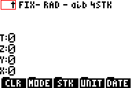
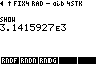
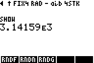

# RPN83P User Guide

RPN calculator app for the TI-83 Plus and TI-84 Plus inspired by the HP-42S.

**Version**: 0.11.0-dev (2024-05-16)

**Project Home**: https://github.com/bxparks/rpn83p

## Table of Contents

- [Introduction](#introduction)
- [Why?](#why)
    - [Short Answer](#short-answer)
    - [Long Answer](#long-answer)
- [Installation](#installation)
    - [Obtaining the Program File](#obtaining-the-program-file)
    - [Uploading](#uploading)
    - [Starting](#starting)
    - [Quitting](#quitting)
    - [Supported Hardware](#supported-hardware)
- [Basic Usage](#basic-usage)
    - [Screen Areas](#screen-areas)
    - [Input and Editing](#input-and-editing)
    - [RPN Stack](#rpn-stack)
    - [Menu System](#menu-system)
        - [Menu Hierarchy](#menu-hierarchy)
        - [Menu Buttons](#menu-buttons)
        - [Menu Indicator Arrows](#menu-indicator-arrows)
        - [Menu Shortcuts](#menu-shortcuts)
        - [Menu Shortcut Jump Back](#menu-shortcut-jump-back)
    - [Built In Help](#built-in-help)
    - [Error Codes](#error-codes)
- [Functions](#functions)
    - [Direct Functions](#direct-functions)
    - [Menu Functions](#menu-functions)
- [Advanced Usage](#advanced-usage)
    - [Auto-start](#auto-start)
    - [Input Limits and Long Numbers](#input-limits-and-long-numbers)
    - [Floating Point Display Modes](#floating-point-display-modes)
    - [SHOW Mode](#show-mode)
    - [Floating Point Rounding](#floating-point-rounding)
    - [Trigonometric Modes](#trigonometric-modes)
    - [Comma-EE Button Mode](#comma-ee-button-mode)
    - [Storage Registers](#storage-registers)
    - [Storage Variables](#storage-variables)
    - [Prime Factors](#prime-factors)
    - [BASE Functions](#base-functions)
    - [STAT Functions](#stat-functions)
    - [TVM Functions](#tvm-functions)
    - [Complex Numbers](#complex-numbers)
    - [DATE Functions](#date-functions)
- [TI-OS Interaction](#ti-os-interaction)
- [Future Enhancements](#future-enhancements)

## Introduction

RPN83P is an [RPN](https://en.wikipedia.org/wiki/Reverse_Polish_notation)
calculator app for the [TI-83 Plus
series](https://en.wikipedia.org/wiki/TI-83_series) and the [TI-84 Plus
series](https://en.wikipedia.org/wiki/TI-84_Plus_series) calculators. The app is
inspired mostly by the [HP-42S](https://en.wikipedia.org/wiki/HP-42S)
calculator, with some significant features from the
[HP-12C](https://en.wikipedia.org/wiki/HP-12C) and the
[HP-16C](https://en.wikipedia.org/wiki/HP-16C).

The RPN83P is a flash application written in Z80 assembly language that consumes
3 pages (48 kiB) of flash memory. Since it is stored in flash, it is preserved
if the RAM is cleared. It consumes about 1025 to 2535 bytes of TI-OS RAM through
4 AppVars, depending on the number of storage registers: `RPN83REG` (500 to 1925
bytes), `RPN83SAV` (142 byte), `RPN83STA` (272 bytes), and `RPN83STK` (120 to
196 bytes).

Summary of features:

- traditional RPN stack (`X`, `Y`, `Z`, `T`), with `LastX` register
    - configurable stack levels between 4 and 8: `SSIZ`, `SSZ?`
- input edit line with scrollable cursor using arrow keys
    - `LEFT`, `RIGHT`, `2ND LEFT`, `2ND RIGHT`
- 8-line display showing 4 stack registers
- hierarchical menu system similar to HP-42S
- quick reference `HELP` menu
- storage registers and variables
    - store and recall:`STO nn`, `RCL nn`
    - storage arithmetics: `STO+ nn`, `STO- nn`, `STO* nn`, `STO/ nn`, `RCL+
      nn`, `RCL- nn`, `RCL* nn`, `RCL/ nn`
    - up to 100 numerical storage registers (`nn = 00..99`, default 25)
    - 27 single-letter variables (`nn = A..Z,Theta`)
    - configurable number of storage registers: `RSIZ`, `RSZ?`
- all math functions with dedicated buttons on the TI-83 Plus and TI-84 Plus
    - arithmetic: `/`, `*`, `-`, `+`
    - algebraic: `1/X`, `X^2`, `SQRT`, `^` (i.e. `Y^X`)
    - transcendental: `LOG`, `10^X`, `LN`, `e^X`
    - trigonometric: `SIN`, `COS`, `TAN`, `ASIN`, `ACOS`, `ATAN`
    - constants: `pi` and `e`
- additional menu functions
    - arithmetic: `%`, `%CH`, `GCD`, `LCM`, `PRIM` (prime factor), `IP` (integer
      part), `FP` (fractional part), `FLR` (floor), `CEIL` (ceiling), `NEAR`
      (nearest integer), `ABS`, `SIGN`, `MOD`, `MIN`, `MAX`
    - rounding: `RNDF`, `RNDN`, `RNDG`
    - algebraic: `X^3`, `3RootX`
    - transcendental: `XRootY`,`2^X`, `LOG2`, `LOGB`, `E^X-` (e^x-1), `LN1+`
      (log(1+x))
    - trigonometric: `ATN2`
    - hyperbolic: `SINH`, `COSH`, `TANH`, `ASNH`, `ACSH`, `ATNH`
    - probability: `PERM`, `COMB`, `N!`, `RAND`, `SEED`
    - angle conversions: `>DEG`, `>RAD`, `>HR`, `>HMS`, `>REC`, `>POL`
    - unit conversions: `>C`, `>F`, `>hPa`, `>inHg`, `>km`, `>mi`, `>m`, `>ft`,
      `>cm`, `>in`, `>um`, `>mil`, `>kg`, `>lbs`, `>g`, `>oz`, `>L`, `>gal`,
      `>mL`, `>floz`, `>kJ`, `>cal`, `>kW`, `>hp`
- statistics and curve fitting, inspired by HP-42S
    - statistics: `Sigma+`, `Sigma-`, `SUM`, `MEAN`, `WMN` (weighted mean),
      `SDEV` (sample standard deviation), `SCOV` (sample covariance),
      `PDEV` (population standard deviation), `PCOV` (population covariance)
    - curve fitting: `Y>X`, `X>Y`, `SLOP` (slope), `YINT` (y intercept), `CORR`
      (correlation coefficient)
    - curve fit models: `LINF` (linear), `LOGF` (logarithmic), `EXPF`
      (exponential), `PWRF` (power)
- base conversion and bitwise operations, inspired by HP-16C and HP-42S
    - base conversions: `DEC`, `HEX`, `OCT`, `BIN`
    - bitwise operations: `AND`, `OR`, `XOR`, `NOT`, `NEG`, `REVB` (reverse
      bits), `CNTB` (count bits)
    - integer arithmetics: `B+`, `B-`, `B*`, `B/`, `BDIV` (divide with
      remainder)
    - shift and rotate: `SL`, `SR`, `ASR`, `RL`, `RR`, `RLC`, `RRC`,
      `SLn`, `SRn`, `RLn`, `RRn`, `RLCn`, `RRCn`
    - carry flag and bit masks: `CCF`, `SCF`, `CF?`, `CB`, `SB`, `B?`
    - word sizes: `WSIZ`, `WSZ?`: 8, 16, 24, 32 bits
- time value of money (TVM), inspired by HP-12C, HP-17B, and HP-30b
    - `N`, `I%YR`, `PV`, `PMT`, `FV`, `P/YR`, `BEG`, `END`, `CLTV` (clear TVM)
- complex numbers, inspired by HP-42S and HP-35s
    - stored in RPN stack registers (`X`, `Y`, `Z`, `T`, `LastX`) and storage
      registers `R00-R99`
    - result modes: `RRES` (real results), `CRES` (complex results)
    - display modes: `RECT`, `PRAD` (polar radians), `PDEG` (polar degrees)
    - linking/unlinking: `2ND LINK` (convert 2 reals to 1 complex, same as
      `COMPLEX` on HP-42S)
    - number entry: `2ND i` (rectangular), `2ND ANGLE` (polar degrees), `2ND
      ANGLE 2ND ANGLE` (polar radians)
    - extended regular functions: `+`, `-`, `*`, `/`, `1/x`, `x^2`, `SQRT`,
      `Y^X`, `X^3`, `3RootY`, `XRootY`, `LOG`, `LN`, `10^x`, `e^x`, `2^x`,
      `LOG2`, `LOGB`
    - complex specific functions: `REAL`, `IMAG`, `CONJ`, `CABS`, `CANG`
    - unsupported: trigonometric and hyperbolic functions (not supported by
      TI-OS)
- date functions
    - support date, time, datetime, timezone, and hardware clock
    - add or subtract dates, times, datetimes
    - convert datetime to different timezones
    - convert between datetime and epochseconds
    - support alternate Epoch dates (Unix, NTP, GPS, TIOS, Y2K, custom)
    - set and retrieve datetime from the hardware clock (84+/84+SE only)
    - display time and date objects in RFC 3339 (ISO 8601) format
- various modes (`MODE`)
    - floating display: `FIX`, `SCI`, `ENG`
    - trigonometric: `RAD`, `DEG`
    - complex result modes: `RRES`, `CRES`
    - complex display modes: `RECT`, `PRAD`, `PDEG`
    - `SHOW` (`2ND ENTRY`): display all 14 internal digits

Missing features (partial list):

- vectors and matrices
- keystroke programming

## Why?

### Short Answer

This project helped me relearn Z80 assembly language programming using TI
calculators. It also produced a scientific RPN app that can run on calculators
which are easily and cheaply obtainable. There are no scientific RPN calculators
currently in production from HP. The prices for many HP calculators in the used
market are unreasonably high, so RPN83P may fill a gap for some people in some
cases.

### Long Answer

When I was in grad school, I used the HP-42S extensively. After graduating, I
sold the calculator, which I have regretted later. The old HP-42S calculators
now sell for $200-$300 on eBay, which is a sum of money that I cannot justify
spending.

I finished my formal school education before graphing calculators became
popular, so I didn't know anything about them until a few months ago. I did not
know that the early TI graphing calculators used the Z80 processor, and more
importantly, I did not know that they were programmable in assembly language.

I realized that I could probably create an app that could turn them into
passable, maybe even useful, RPN calculators. The debate over RPN mode versus
algebraic mode has probably been going on for 40-50 years, so I probably cannot
add more. Personally, I use algebraic notation for doing math equations on paper
or writing high-level computer programs. But when I do numerical *computation*
on a hand-held device, I am most comfortable using the RPN mode.

There are many RPN calculator apps for the smartphone, but the touchscreen of a
phone can become tedious for calculations that require large number of
keystrokes. For those cases, a physical device is more convenient and less error
prone.

The RPN83P app is inspired by the HP-42S. It is the RPN calculator that I know
best. It also has the advantage of having the
[Free42](https://thomasokken.com/free42/) app (Android, iOS, Windows, MacOS,
Linux) which faithfully reproduces every feature of the HP-42S. This is
essential because I don't own an actual HP-42S anymore to verify obscure edge
cases which may not be documented. Another advantage of the HP-42S is that a
hardware clone is currently in production by SwissMicros as the
[DM42](https://www.swissmicros.com/product/dm42). This increases the number of
users who may be familiar with the user interface and behavior of the HP-42S.

The RPN83P app cannot be a clone of the HP-42S for several reasons:

- The keyboard layout and labels of the TI-83 and TI-84 calculators are
  different. As an obvious example, the TI calculators have 5 menu buttons below
  the LCD screen, but the HP-42S has 6 menu buttons.
- The RPN83P does not implement its own floating point routines, but uses the
  ones provided by the underlying TI-OS. There are essential differences between
  the two systems. For example, the HP-42S supports exponents up to +/-499, but
  the TI-OS supports exponents only to +/-99.

Although the HP-42S may be close to ["peak of perfection for the classic HP
calcs"](https://www.hpmuseum.org/cgi-sys/cgiwrap/hpmuseum/archv017.cgi?read=118462),
I think there are features of the HP-42S that could be improved. For example,
the HP-42S has a 2-line LCD display which is better than the single-line display
of earlier HP calculators. But the TI-83 and TI-84 LCD screens are big enough to
show the entire RPN stack as well as the hierarchical menu bar at all times, so
it makes sense to take advantage of the larger LCD screen size.

The purpose of the RPN83P project was to help me learn Z80 programming on a TI
calculator, and to convert an old TI calculator into a scientific RPN calculator
that I can actually use. The host calculator hardware is readily and cheaply
available, so I hope other people find it useful.

## Installation

### Obtaining the Program File

The RPN83P app is packaged as a single file named `rpn83p.8xk`. There are at
least 2 ways to obtain this:

- [RPN83P Releases page on GitHub](https://github.com/bxparks/rpn83p/releases)
    - go to the latest release
    - click and download the `rpn83p.8xk` file
- Compile the binary locally
    - See [Compiling from Source](#Compiling) section below

### Uploading

The `rpn83p.8xk` file must be uploaded to the calculator using a "link" program
from a host computer. There are a number of options:

- **Linux**: Use the [tilp](https://github.com/debrouxl/tilp_and_gfm) program.
  On Ubuntu Linux 22.04 systems, the precompiled package can be installed using
  `$ apt install tilp2`. (I'm not actually sure if the `tilp2` binary is
  actually compiled from the `tilp_and_gfm` source code mentioned above)

- **Windows** or **MacOS**: Use the [TI
  Connect](https://education.ti.com/en/products/computer-software/ti-connect-sw)
  software and follow the instructions in [Transferring FLASH
  Applications](https://education.ti.com/en/customer-support/knowledge-base/sofware-apps/product-usage/11506).

**Warning**: If you are upgrading from a previous version of RPN83P, you may
need to manually remove the `RPN83P` app from the calculator, before uploading
the new `rpn83p.8xk` file. I don't know why, but sometimes the calculator gets
stuck at the `Defragmenting...` step and never finishes uploading the file. To
manually remove, go to `2ND MEM`, `2` (Mem Mgmt/Del), `ALPHA A` (Apps), scroll
down to the `RPN83P`, hit `DEL`, press `2` (Yes).

### Starting

After installing `rpn83p.8xk` file, go to the calculator:

- Press the `APPS` key
- Scroll down to the `RPN83P` entry
- Press the `ENTER` key


The RPN83P starts directly into the calculator mode, no fancy splash screen. You
should see a screen that looks like:


### Quitting

The RPN83P application can be quit using:

- `2ND` `QUIT`: to exit to normal TI calculator
- `2ND` `OFF`: to turn the calculator off (the RPN registers and storage
  registers will be preserved)

Upon exit, the state of the RPN83P app will be saved in an AppVar named
`RPN83SAV`. When the app is restarted, the calculator will resume from exactly
where it left off, including the exact cursor position of any pending input.
When restarted, if the `RPN83SAV` variable does not pass validation (e.g. does
not exist; was archived; is wrong size; contains an incompatible schema version;
does not pass a CRC checksum) then the application starts from a clean slate.

### Supported Hardware

This app was designed for TI calculators using the Z80 processor:

- TI-83 Plus (6 MHz Z80, 24 kB accessible RAM, 160 kB accessible flash, no RTC)
- TI-83 Plus Silver Edition (6/15 MHz Z80, 24 kB accessible RAM, 1.5 MB
  accessible flash, no RTC)
- TI-84 Plus (6/15 MHz Z80, 24 kB accessible RAM, 480 kB accessible flash, RTC)
- TI-84 Plus Silver Edition (6/15 MHz Z80, 24 kB accessible RAM, 1.5 MB
  accessible flash, RTC)
- TI-Nspire with TI-84 Plus Keypad (32-bit ARM processor emulating a Z80, 24 kB
  accessible RAM, 1.5 MB accessible flash, RTC)
    - **Note**: When uploading the `rpn83p.8xk` file from the PC to the Nspire,
      you need to select "TI-84 Plus" as the calculator model on the PC instead
      of "TI-Nspire". That's because the Nspire is emulating a TI-84+ and the PC
      cannot tell the difference.

The app configures itself to run at 15 MHz on supported hardware, while
remaining at 6 MHz on the TI-83+.

I have tested it on the following calculators that I own:

- TI-83 Plus (OS v1.19)
- TI-83 Plus Silver Edition (OS v1.19)
- TI-84 Plus Silver Edition (OS v2.55MP)
- TI-Nspire with TI-84 Plus Keypad (OS v2.46)

Community members have verified that it works on the following variants:

- TI-84 Plus
- TI-84 Plus Pocket SE
- TI-84 Pocket.fr (French version of the Pocket SE?)

The following calculators are *not* supported because their internal hardware
and firmware are too different:

- TI-83 (without Plus)
- TI-84 Plus C Silver Edition
- TI-84 Plus CE
- TI-83 Premium CE (French version of the TI-84 Plus CE)
- TI-Nspire CAS, CX, CX CAS, CX II, CX II CAS
- TI-89, 89 Titanium, 92, 92 Plus, Voyage 200

## Basic Usage

This guide assumes that you already know to use an RPN calculator. In
particular, the RPN83P implements the traditional RPN system used by
Hewlett-Packard calculators such as the HP-12C, HP-15C, and the HP-42S. (The
RPN83P does not use the newer RPN system used by the HP-48 series and other
similar HP calculators.)

It is beyond the scope of this document to explain how to use an RPN calculator.
One way to learn is to download the [Free42](https://thomasokken.com/free42/)
emulator for the HP-42S (available for Android, iOS, Windows, MacOS, and Linux)
and then download the [HP-42S Owner's
Manual](https://literature.hpcalc.org/items/929).

### Screen Areas

Here are the various UI elements on the LCD screen used by the RPN83P app:


The LCD screen is 96 pixels (width) by 64 pixels (height). That is large enough
to display 8 rows of numbers and letters. They are divided into the following:

- 1: status line
- 2: (currently unused)
- 3: error code line
- 4: T register line
- 5: Z register line
- 6: Y register line
- 7: X register/input line
- 8: menu line

The X register line is also used as the input line when entering new numbers. It
is also used to prompt for command line argument, for example `FIX _ _` to set
the fixed display mode.

### Input and Editing

The following buttons are used to enter and edit a number in the input buffer:


- `0`-`9`: digits
- `.`: decimal point
- `(-)`: enters a negative sign, or changes the sign (same as `+/-` or `CHS` on
  HP calculators)
- `DEL`: Backspace (same as `<-` on many HP calculators)
- `CLEAR`: Clear `X` register, same as `CLX`; *or* clear the input buffer
- `CLEAR CLEAR CLEAR`: Clear the stack, same as `CLST`
- `2ND EE`: adds an `E` to allow entry of scientific notation exponent (same as
  `E` or `EEX` on HP calculators)
- `,`: component separator for record types (see
  [USER_GUIDE_DATE.md](USER_GUIDE_DATE.md))

The following keys are related to complex numbers and are explained in more
detail in the [Complex Numbers](#complex-numbers) section below:

- `2ND LINK`: convert `X` and `Y` into a complex number in `X`, or the reverse
- `2ND ANGLE`: enter a complex number in polar degree form
- `2ND ANGLE` `2ND ANGLE`: enter a complex number polar radian form
- `2ND i`: enter a complex number in rectangular form

The `(-)` button acts like the `+/-` or `CHS` button on HP calculators. It
toggles the negative sign, adding it if it does not exist, and removing it if it
does.

The `DEL` key acts like the *backspace* key on HP calculators (usually marked
with a `LEFTARROW` symbol. This is different from the TI-OS where the `DEL` key
removes the character under the cursor. In RPN83P, the cursor is *always* at the
end of the input buffer, so `DEL` is programmed to delete the right-most digit.
If the `X` line is *not* in edit mode (i.e. the cursor is not shown), then the
`DEL` key acts like the `CLEAR` key (see below).

The `CLEAR` key performs slightly different actions depending on the context:
- If the `X` register is normally displayed, `CLEAR` goes into edit mode with an
  empty input buffer.
- If the `X` register is already in edit mode, `CLEAR` clears input buffer.
- If the `X` register is in edit mode and the input buffer is already empty,
  then `CLEAR` shows a message to the user: `CLEAR Again to Clear Stack`.
- If the `CLEAR` button is pressed immediately again, the RPN stack is cleared.
  This is the same functionality as the `ROOT > CLR > CLST` menu button.

In an RPN system, it is generally not necessary to clear the RPN stack before
any calculations. However, many users want to see a clean slate on the display
to reflect their mental state when starting a new calculation. The `CLST` menu
function provides this feature, but is nested under the `ROOT > CLR > CLST` menu
hierarchy. If you are deeply nested under another part of the menu hierarchy, it
can be cumbersome to navigate back up to the `ROOT`, invoke the `CLST` button,
then make your way back to the original menu location. To solve this problem,
the RPN83P app will invoke `CLST` function when `CLEAR` is hit 3 times. (The
TI-OS does not support `2ND CLEAR`, it returns the same code as `CLEAR`.)

An empty string will be interpreted as a `0` if the `ENTER` key or a function
key is pressed.

The comma `,` button is used for record types (see
[USER_GUIDE_DATE.md](USER_GUIDE.md)) so the `E` symbol for scientific notation
numbers must be entered using the `2ND EE` key. However, it is possible to flip
the behavior of the comma and the `2ND EE` buttons using a `MODE` setting. See
[Comma-EE Button Mode](#comma-ee-button-mode) below.

Emulating the input system of the HP-42S was surprisingly complex and subtle,
and some features and idiosyncrasies of the HP-42S could not be carried over due
to incompatibilities with the underlying TI-OS. But some features were
deliberately implemented differently. For example, on the HP-42S, when the input
buffer becomes empty after pressing the `<-` backspace button multiple times, or
pressing the `CLEAR > CLX` menu button, the cursor disappears and the `X`
register is shown as `0.0000`. But internally, the HP-42S is in a slightly
different state than normal: the Stack Lift is disabled, and entering another
number will replace the `0.0000` in the `X` register instead of lifting it up to
the `Y` register. In RPN83P, when the `DEL` key or the `CLEAR` key is pressed,
the `X` register always enters into Edit mode with an empty input buffer, and
the cursor will *always* be shown with an empty string. The presence of the
cursor indicates that the Edit Mode is in effect and that the Stack Lift is
disabled.

I'm not sure that documenting all the corner cases would be useful in this
document because it would probably be tedious to read. I hope that the input
system is intuitive and self-consistent enough that you can just play around
with it and learn how it works.

### RPN Stack

The RPN83P tries to implement the traditional 4-level stack used by many HP
calculators as closely as possible, including some features which some people
may find idiosyncratic. There are 4 slots in the RPN stack named `X`, `Y`, `Z`,
and `T`. The LCD screen on the TI calculators is big enough that all 4 RPN
registers can be shown at all times. (For comparison, the HP-12C and HP-15C have
only a single line display. The HP-42S has a 2-line display, with the bottom
line often commandeered by the menu line so that only the `X` register is
shown.)

These are the buttons which manipulate the RPN stack:


- `(`: rolls RPN stack down (known as `R(downarrow)` on HP calculators)
- `)`: exchanges `X` and `Y` registers
- `2ND u`: rolls RPN stack up (known as `R(uparrow)` on HP calculators)
- `ENTER`: saves the input buffer to the `X` register
- `2ND` `ANS`: recalls the last `X`

This mapping of the `(` and `)` to these stack functions is identical to mapping
used by other HP calculators that support both Algebraic and RPN modes (e.g. the
[HP-17BII and 17bII+](https://en.wikipedia.org/wiki/HP-17B) and the
[HP-30b](https://en.wikipedia.org/wiki/HP_30b)).

When a new number is entered (using the `0`-`9` digit keys), the press of the
first digit causes the stack to **lift**, and the calculator enters into the
**edit** mode. This mode is indicated by the appearance of an underscore `_`
cursor.

A stack **lift** causes the previous `X` value to shift into the `Y` register,
the previous `Y` value into the `Z` register, and the previous `Z` value into
the `T` register. The previous `T` value is lost.

The `ENTER` key performs the following actions:

- if the `X` register was in edit mode, the input buffer is closed and the
  number is placed into the `X` register,
- the `X` register is then duplicated into the `Y` register,
- the stack lift is *disabled* for the next number.

This is consistent with the traditional RPN system used by HP calculators up to
and including the HP-42S. It allows the user to press: `2` `ENTER` `3` `*` to
multiply `2*3` and get `6` as the result, because the second number `3` does not
lift the stack.

The parenthesis `(` and `)` buttons are not used in an RPN entry system, so they
have been repurposed for stack manipulation:

- `(` key rolls the stack *down*, exactly as the same as the `R(downarrow)` or
  just a single `(downarrow)` on the HP calculators.
- `)` key performs an exchange of the `X` and `Y` registers. That functionality
  is usually marked as `X<>Y` on HP calculators.

The `2ND u` is bound to the `R(up)` command. You can think of the `u` as a
mnemonic for "up". This command is marginally useful when the RPN stack size is
only 4, but becomes more important when the RPN stack size is increased beyond
4.

The `2ND` `ANS` functionality of the TI-OS algebraic mode is unnecessary in the
RPN system because the `X` register is always the most recent result that would
have been stored in `2ND` `ANS`. Therefore, the `2ND` `ANS` has been repurposed
to be the `LastX` functionality of HP calculators. The `LastX` is the value of
the `X` register just before the most recent operation. It can be used to bring
back a number that was accidentally consumed, or it can be used as part of a
longer sequence of calculations.

### Menu System

#### Menu Hierarchy

The menu system of the RPN83P was directly inspired by the HP-42S calculator.
There are over 250 functions supported by the RPN83P menu system, so it is
convenient to arrange them into a nested folder structure. There are 5 buttons
directly under the LCD screen so it makes sense to present the menu items as
sets of 5 items corresponding to those buttons.

The menu system forms a singly-rooted tree of menu items and groups, which look
like this conceptually:


There are 4 components:

- `MenuGroup`: a folder of 1 or more `MenuRows` (e.g. `NUM`)
- `MenuRow`: a list of exactly 5 `MenuNodes` corresponding to the 5 menu
  buttons below the LCD
- `MenuNode`: one slot in the `MenuRow`, can be *either* a `MenuGroup` or a
  `MenuItem`
- `MenuItem`: a leaf-node that maps directly to a function (e.g. `GCD`) when
  the corresponding menu button is pressed

#### Menu Buttons

The LCD screen always shows a `MenuRow` of 5 `MenuItems`. Here are the buttons
which are used to navigate the menu hierarchy:


- `F1`- `F5`: invokes the function shown by the respective menu
- `UP_ARROW`: goes to previous `MenuRow` of 5 `MenuItems`, within the current
  `MenuGroup`
- `DOWN_ARROW`: goes to next `MenuRow` of 5 `MenuItems`, within the current
  `MenuGroup`
- `ON`: goes back to the parent `MenuGroup` (similar to the `ON/EXIT` button on
  the HP-42S)
- `MATH`: goes directly to the root `MenuGroup` no matter where you are in the
  menu hierarchy

The appropriate key for the "menu back to parent" function would have been an
`ESC` button. But the TI-83 and TI-84 calculators do not have an `ESC` button
(unlike the TI-89, TI-92, and TI Voyager 200 series calculators), so the `ON`
button was recruited for this functionality. This seemed to make sense because
the HP-42S
uses the `ON` key which doubles as the `EXIT` or `ESC` key to perform this
function.

The `HOME` button is useful to go directly to the top of the menu hierarchy from
anywhere in the menu hierarchy. The TI-83 and TI-84 calculators do not have a
`HOME` button (unlike the TI-89, TI-92, and TI Voyager 200 series again), so the
`MATH` button was taken over to act as the `HOME` key. This choice was not
completely random:

1. The `HOME` button on the [TI-89 series
calculator](https://en.wikipedia.org/wiki/TI-89_series) is located exactly where
the `MATH` is.
2. The RPN83P app does not need the `MATH` button as implemented by the TI-OS,
which opens a dialog box of mathematical functions. In the RPN83P app, that
functionality is already provided by the menu system.
3. When the menu system is at the root, the first menu item on the left is a
menu group named `MATH`, which may help to remember this button mapping.

**HP-42S Compatibility Note**: As far I can tell, the menu system of the HP-42S
is *multiplely rooted* and pressing a given menu button (e.g. `BASE`) activates
the menu hierarchy of that particular button. I think this works because the
menu bar on the HP-42S is not displayed by default, so there is no single ROOT
node of its menu system. Some of the HP-42S menu bars can stack on top of each
other, so that the `EXIT` button goes back to the previous menu bar. But some
menu bars do not. I have never figured out the rhyme and reason for this
behavior. The RPN83P app, on the other hand, always displays its menu bar, so it
was simpler for the user (and the programmer of this app) to create a *singly
rooted* menu hierarchy with the menu bar always starting from the implicit
`ROOT` menu node.

#### Menu Indicator Arrows

There are 3 menu arrows at the top-left corner of the LCD screen. The
`downarrow` indicates that additional menu rows are available:


When the `DOWN` button is pressed, the menu changes to the next set of 5 menu
items in the next menu row, and the menu arrows show both an `uparrow` and a
`downarrow` to indicate that there are more menu items above and below the
current menu bar:


Pressing `DOWN` goes to the last set of 5 menu items, and the menu arrows show
only the `uparrow` to indicate that this is the last of the series:



You can press `UP` twice goes back to the first menu row, or you can press
`DOWN` from the last menu row to wrap around to the beginning:


Pressing the `F2/WINDOW` button from here invokes the `NUM` menu item. This menu
item is actually a `MenuGroup`, so the menu system descends into this folder,
and displays the 5 menu items in the first menu row:


Pressing the `DOWN` arrow button shows the next menu row:


Pressing the `DOWN` arrow button goes to the final menu row:


Notice that inside the `NUM` menu group, the menu arrows show a `back` arrow.
This means that the `ON` button (which implements the "BACK", "EXIT", or "ESC"
functionality) can be used to go back to the parent menu group:


#### Menu Shortcuts

Some menu groups can be accessed quickly through dedicated keys on the TI
calculator which happen to have the same label as the menu item:

- `MODE`: bound to `ROOT > MODE`
- `STAT`: bound to `ROOT > STAT`
- `MATH`: repurposed to be `HOME` (aka `ROOT`)

The `MATH` button is slightly different. It is not bound to `ROOT > MATH`.
Rather it has been repurposed to be the `HOME` button which goes to the top of
the menu hierarchy `ROOT`.

#### Menu Shortcut Jump Back

Normally when the `ON/EXIT/ESC` button is pressed, the menu bar goes up to the
parent of the current MenuGroup. That makes sense because the user normally must
travel through the parent to reach the child MenuGroup. But the keyboard
shortcuts break this rule.

When the `MODE` button is pressed, the menu bar goes directly to the `ROOT >
MODE` MenuGroup from anywhere in the menu hierarchy. Since the `MODE` functions
involve quick changes to the floating point display or the trigonometric angle
units, it seems likely that the user would want to go back to the original menu
bar after making the `MODE` changes. Therefore, the `ON/EXIT/ESC` button has
been programmed to jump back to the *previous* menu bar if the `ROOT > MODE`
menu was invoked through the `MODE` button.

The `STAT` shortcut, however, does *not* implement the jump back feature.
Instead, the `ON/EXIT/ESC` acts normally and the menu goes up to the parent of
the `STAT` MenuGroup to the `ROOT` of the menu system. This behavior was chosen
because it seemed more likely that the user would spend a significant amount of
time inside the `STAT` menu functions. The more time spent inside the `STAT`
menu, the less likely it seemed the user would remember where the original menu
bar was, and unlikely to want to go back there using the `ON/EXIT/ESC` key.

## Built In Help

Pressing the `HELP` menu button at the root menu activates the Help pages:


The contents of these pages are updated frequently so the screenshots below may
not be identical to the current version:


The Help pages are intended to capture some of the more obscure tidbits about
the RPN83P app which may be hard to remember. Hopefully it reduces the number of
times that this User Guide needs to be consulted.

The message at the bottom of each page is not completely honest. A number of
navigational keys are recognized by the Help system:

- `UP`, `LEFT`: previous page with wraparound
- `DOWN`, `RIGHT`: next page with wraparound
- `DEL`, `MATH`, `CLEAR`, `ON`: exit Help
- any other button: next page *without* wraparound, exiting on the last page

## Error Codes

The RPN83P supports all error messages from the underlying TI-OS which are
listed in the TI-83 SDK. The SDK unfortunately does not describe how these
errors are actually triggered. By trial-and-error, I could reverse engineer only
a few of them as described below:

- `Err: Argument`: incorrect number of arguments
- `Err: Bad Guess`
- `Err: Break`
- `Err: Domain`: invalid argument or argument outside range
- `Err: Data Type`: invalid argument type (e.g. complex number)
- `Err: Invalid Dim`: list index larger than list size
- `Err: Dim Mismatch`
- `Err: Divide By 0`: divide by 0
- `Err: Increment`
- `Err: Invalid`
- `Err: Iterations`
- `Err: In Xmit`
- `Err: Memory`
- `Err: Non Real` (I could never reproduce this, the TI-OS seems to use `Err:
  Domain` or `Err: Data Type` instead)
- `Err: Overflow`: result exceeds `9.99999999E99`
- `Err: No Sign Change`
- `Err: Singularity`
- `Err: Stat`
- `Err: StatPlot`
- `Err: Syntax`: incorrect math expression syntax
- `Err: Tol Not Met`
- `Err: Undefined`: variable not found

These are shown in the Error Code line on the screen. For example, if we try to
divide `1 / 0`, a division by 0 error is shown:


If a TI-OS function returns an internal error code outside of the ones
documented in the SDK, RPN83P will print an error message in the form of `Err:
UNKNOWN (##)` like this:


The number in parenthesis is the internal numerical value of the error code. If
the error is reproducible, please file a [bug
report](https://github.com/bxparks/rpn83p/issues) containing the numerical error
code and the steps needed to reproduce it so that I can add it to the list of
error messages supported by RPN83P.

## Functions

This section contains a description of all functions implemented by the RPN83P
app, accessed through buttons or through the menu system.

### Direct Functions

All mathematical functions that are exposed through physical buttons are
supported by the RPN83P app.

- arithmetic
    - `/`, `*`, `-`, `+`
- algebraic
    - `X^-1`, `X^2`, `sqrt`, `^` (i.e. `Y^X`)
- trigonometric
    - `SIN`, `COS`, `TAN`
    - `2ND` `SIN^-1`, `2ND` `COS^-1`, `2ND` `TAN^-1`
- transcendental
    - `LOG`, `10^X`, `LN`, `e^X`
- constants
    - `pi`, `e`

### Menu Functions

These functions are accessed through the hierarchical menu, using the 5 menu
buttons just under the LCD screen. Use the `UP`, `DOWN`, `ON` (EXIT/ESC), and
`MATH` (HOME) keys to navigate the menu hierarchy.

- `ROOT` (implicit)
    - 
    - 
    - 
-  (`ROOT > MATH`)
    - 
    - 
    - `X^3`: cube of `X`
    - `3RootX`: cube root of `X`
    - `XRootY`: `X` root of `Y`
    - `ATN2`: `atan2(X, Y)` in degrees or radians, depending on current mode
        - `Y`: y-component, entered first
        - `X`: x-component, entered second
        - (order of `Y` and `X` is the same as the `>POL` conversion function)
    - `2^X`: `2` to the power of `X`
    - `LOG2`: log base 2 of `X`
    - `LOGB`: log base `X` of `Y`
    - `E^X-`: `e^x-1` accurate for small `x`
    - `LN1+`: `log(1+x)` accurate for small `x`
-  (`ROOT > NUM`)
    - 
    - 
    - 
    - 
    - `%`: `X` percent of `Y`, leaving `Y` unchanged
    - `%CH`: percent change from `Y` to `X`, leaving `Y` unchanged
    - `GCD`: greatest common divisor of `X` and `Y`
    - `LCM`: lowest common multiple of `X` and `Y`
    - `PRIM`: prime factor of `X`
        - returns 1 if prime
        - returns the smallest prime factor otherwise
        - See [Prime Factors](#prime-factors) section below.
    - `IP`: integer part of `X`, truncating towards 0, preserving sign
    - `FP`: fractional part of `X`, preserving sign
    - `FLR`: the floor of `X`, the largest integer <= `X`
    - `CEIL`: the ceiling of `X`, the smallest integer >= `X`
    - `NEAR`: the nearest integer to `X`
    - `ABS`: absolute value of `X`
    - `SIGN`: return -1, 0, 1 depending on whether `X` is less than, equal, or
      greater than 0, respectively
    - `MOD`: `Y` mod `X` (remainder of `Y` after dividing by `X`)
    - `MIN`: minimum of `X` and `Y`
    - `MAX`: maximum of `X` and `Y`
    - `RNDF`: round to `FIX/SCI/ENG` digits after the decimal point
    - `RNDN`: round to user-specified `n` digits (0-9) after the decimal point
    - `RNDG`: round to remove guard digits, leaving 10 mantissa digits
-  (`ROOT > PROB`)
    - 
    - `COMB`: combination `C(n,r)` = `C(Y, X)`
    - `PERM`: permutation `P(n,r)` = `P(Y, X)`
    - `N!`: factorial of `X`
    - `RAND`: random number in the range `[0,1)`
    - `SEED`: set the random number generator seed to `X`
-  (`ROOT > CPLX`)
    - 
    - `REAL`: extract the real component of the complex number
    - `IMAG`: extract the imaginary component of the complex number
    - `CONJ`: calculate the complex conjugate
    - `CABS`: calculate the magnitude of the complex number
    - `CANG`: calculate the angle (i.e. argument) of the complex number
-  (`ROOT > HELP`)
    - display the Help pages
    - use arrow keys to view each Help page
-  (`ROOT > BASE`)
    - 
    - 
    - 
    - 
    - 
    - 
    - 
    - 
    - `DEC`: use decimal base 10
    - `HEX`: use hexadecimal base 16
        - display register values as 32-bit unsigned integer
    - `OCT`: use octal base 8
        - display register values as 32-bit unsigned integer
    - `BIN`: use binary base 2
        - display register values as 32-bit unsigned integer
    - `AND`: `X` `bit-and` `Y`
    - `OR`: `X` `bit-or` `Y`
    - `XOR`: `X` `bit-xor` `Y`
    - `NOT`: one's complement of `X`
    - `NEG`: two's complement of `X`
    - `SL`: shift left logical one bit
    - `SR`: shift right logical one bit
    - `ASR`: arithmetic shift right one bit
    - `SLn`: shift left logical `Y` by `X` bits
    - `SRn`: shift right logical `Y` by `X` bits
    - `RL`: rotate left circular one bit
    - `RR`: rotate right circular one bit
    - `RLC`: rotate left through carry flag one bit
    - `RRC`: rotate right through carry flag one bit
    - `RLn`: rotate left circular `Y` by `X` bits
    - `RRn`: rotate right circular `Y` by `X` bits
    - `RLCn`: rotate left through carry flag `Y` by `X` bits
    - `RRCn`: rotate right through carry flag `Y` by `X` bits
    - `CB`: clear bit `X` of `Y`
    - `SB`: set bit `X` of `Y`
    - `B?`: get bit `X` of `Y` as 0 or 1
    - `REVB`: reverse bits of `X`
    - `CNTB`: count number of 1 bits of `X` (same as `#B` on HP-16C)
    - `B+`: add `X` and `Y` using unsigned 32-bit integer math
    - `B-`: subtract `X` from `Y` using unsigned 32-bit integer math
    - `B*`: multiply `X` and `Y` using unsigned 32-bit integer math
    - `B/`: divide `X` into `Y` using unsigned 32-bit integer math
    - `BDIV`: divide `X` into `Y` with remainder, placing the quotient in `X`
      and the remainder in `Y`
    - `CCF`: clear carry flag
    - `SCF`: set carry flag
    - `CF?`: return carry flag state as 0 or 1
    - `WSIZ`: set integer word size (supported values: 8, 16, 24, 32)
    - `WSZ?`: return current integer word size (default: 32)
-  (`ROOT > HYP`)
    - 
    - 
    - `SINH`: hyperbolic `sin()`
    - `COSH`: hyperbolic `cos()`
    - `TANH`: hyperbolic `tan()`
    - `ASNH`: hyperbolic `asin()`
    - `ACSH`: hyperbolic `acos()`
    - `ATNH`: hyperbolic `atan()`
-  (`ROOT > STAT`)
    - See Chapter 15 of the _HP-42S User's Manual_
    - 
    - 
    - 
    - `Sigma+`: add `Y` and `X` data point to STAT registers
    - `Sigma-`: remove `Y` and `X` data point from STAT registers
    - `ALLSigma`: collect statistical sums for all curve fit models
    - `LINSigma`: collect statistical sums for the linear curve fit model
    - `CLSigma`: clear STAT registers `[R11,R16]` (if LINSigma selected) or
      `[R11,R23]` (if AllSigma selected)
    - `SUM`: return Sum of `Y` and Sum of `X` in the `Y` and `X` registers
    - `MEAN`: return average `<Y>` and `<X>` in the `Y` and `X` registers
    - `WMN`: return the weighted mean of `Y` and weighted mean of `X` in the `Y`
      and `X` registers
        - `weighted mean Y = Sum(XY)/Sum(X)`
        - `weighted mean X = Sum(XY)/Sum(Y)`
    - `N`: return the number of data items entered
    - `SDEV`: sample standard deviation of `Y` and `X`
        - `sdev(X) = sqrt(N/(N-1)) pdev(X)`
        - `sdev(Y) = sqrt(N/(N-1)) pdev(Y)`
    - `SCOV`: sample covariance
        - `scov(X,Y) = (N/(N-1)) pcov(X,Y)`
    - `PDEV`: population standard deviation of `Y` and `X`
        - `pdev(X) = <X^2> - <X>^2`
        - `pdev(Y) = <Y^2> - <Y>^2`
    - `PCOV`: population covariance
        - `pcov(X,Y) = <XY> - <X><Y>`
    -  (`ROOT > STAT` >
      `SIGMA`)
        - 
        - 
        - 
        - Recall the given STAT register stored (follows the same convention as
          the [Plus42](https://thomasokken.com/plus42/) app)
        - `SigmaX` - sum of `X`
        - `SigmaX2` - sum of `X^2`
        - `SigmaY` - sum of `Y`
        - `SigmaY2` - sum of `Y^2`
        - `SigmaXY` - sum of `XY`
        - `SigmaN` - `N` total number of data points
            - this should be labeled `Sigma 1` to be mathematically correct, but
              it looks awkward in the UI
        - `SigmaLX` - sum of `Ln(X)`
        - `SigmaLX2` - sum of `Ln(X)^2`
        - `SigmaLY` - sum of `Ln(Y)`
        - `SigmaLY2` - sum of `Ln(Y)^2`
        - `SigmaLXL` - sum of `Ln(X) Ln(Y)`
        - `SigmaXLY` - sum of `X Ln(Y)`
        - `SigmaYLX` - sum of `Y Ln(X)`
    -  (`ROOT > STAT` >
      `CFIT`)
        - See Chapter 15 of the _HP-42S User's Manual_
        - 
        - 
        - `Y>X`: forecast X from Y
        - `X>Y`: forecast Y from X
        - `SLOP`: slope of curve fit model, i.e. `m` parameter
        - `YINT`: y-intercept of curve fit model, i.e. `b` parameter
        - `CORR`: correlation coefficient of the least square curve fit
        - `LINF`: linear fit model, `y = mx + b`
        - `LOGF`: logarithmic fit model, `y = m ln(x) + b`
        - `EXPF`: exponential fit model, `y = b e^(mx)`
        - `PWRF`: power fit model, `y = b x^m`
        - `BEST`: automatically select the best model, i.e. the one with the
          largest absolute value of the correlation coefficient. The `CORR`
          value is returned in the `X` register for reference.
-  (`ROOT > CONV`)
    - 
    - 
    - `>DEG`: convert radians to degrees
    - `>RAD`: convert degrees to radians
    - `>REC`: polar to rectangular
        - input: `Y`=y, `X`=x
        - output: `Y`=theta, `X`=r
        - (consistent with HP-42S)
    - `>POL`: rectangular to polar
        - input: `Y`=theta, `X`=r
        - output: `Y`=y, `X`=x
        - (consistent with HP-42S)
    - `>HR`: convert `HH.MMSSssss` to `HH.hhhh`
    - `>HMS`: convert `HH.hhhh` to `HH.MMSSssss`
-  (`ROOT > TVM`)
    - 
    - 
    - 
    - `N`: set or calculate Number of payment periods
    - `I%YR`: set or calculate Interest Percent per Year
    - `PV`: set or calculate Present Value
    - `PMT`: set or calculate Payment per period
    - `FV`: set or calculate Future Value
    - `P/YR`: set number of payments per year
    - `BEG`: payment occurs at the Beginning of each period
    - `END`: payment occurs at the End of each period
    - `CLTV`: clear TVM variables and parameters
    - `IYR1`: set `I%YR` guess 1 for TVM Solver
    - `IYR2`: set `I%YR` guess 2 for TVM Solver
    - `TMAX`: set iteration max for TVM Solver
    - `RSTV`: reset TVM Solver parameters to factory defaults
-  (`ROOT > CLR`)
    - 
    - `CLX`: clear `X` stack register (stack lift disabled)
    - `CLST`: clear all RPN stack registers
    - `CLRG`: clear all storage registers `R00` to `R99`
    - `CLSigma`: clear STAT storage registers [`R11`, `R16`] or [`R11`, `R23`]
    - `CLTV`: clear TVM variables and parameters
-  (`ROOT > MODE`)
    - 
    - 
    - 
    - 
    - `FIX`: fixed mode with `N` digits after the decimal point
        - set `N` to `99` for floating number of digits
        - status line indicator is `FIX(N)`
    - `SCI`: scientific notation with `N` digits after the decimal point
        - set `N` to `99` for floating number of digits
        - status line indicator is `SCI(N)`
    - `ENG`: engineering notation with `N` digits after the decimal point
        - set `N` to `99` for floating number of digits
        - status line indicator is `ENG(N)`
    - `RAD`: use radians for trigonometric functions
    - `DEG`: use degrees for trigonometric functions
    - `RRES`: real results only from real arguments
    - `CRES`: complex results allowed from real arguments
    - `RECT`: display complex number in rectangular form
    - `PRAD`: display complex number in polar radian form
    - `PDEG`: display complex number in polar degree form
    - `RSIZ`: set register size `[25,100]`
    - `RSZ?`: get register size
    - `SSIZ`: set stack size `[4,8]`
    - `SSZ?`: get stack size
    - `,EE`: set Comma-EE button to normal mode
    - `EE,`: set Comma-EE button to inverted mode
    - `{..}`: display record objects in raw format
      (see [USER_GUIDE_DATE.md](USER_GUIDE_DATE.md))
    - `".."`: display record objects in string format
      (see [USER_GUIDE_DATE.md](USER_GUIDE_DATE.md))
-  (`ROOT > STK`)
    - 
    - `DUP`: duplicate `X` value and lift stack values up
    - `R(up)`: roll stack up, also bound to `2ND u` button
    - `R(down)`: roll stack down, also bound to `(` button
    - `DROP`: delete the `X` value and drop stack values down
    - `X<>Y`: exchange `X` and `Y`, also bound to `)` button
-  (`ROOT > UNIT`)
    - 
    - 
    - 
    - 
    - 
    - 
    - `>C`: Fahrenheit to Celsius
    - `>F`: Celsius to Fahrenheit
    - `>hPa`: hectopascals (i.e. millibars) to inches of mercury (Hg)
    - `>iHg`: inches of mercury (Hg) to hectopascals (i.e. millibars)
    - `>km`: miles to kilometers
    - `>mi`: kilometers to miles
    - `>m`: feet to meters
    - `>ft`: meters to feet
    - `>cm`: inches to centimeters
    - `>in`: centimeters to inches
    - `>um`: mils (1/1000 of inch) to micrometers
    - `>mil`: micrometers to mils (1/1000 of inch)
    - `>kg`: pounds to kilograms
    - `>lbs`: kilograms to pounds
    - `>g`: ounces to grams
    - `>oz`: grams to ounces
    - `>L`: US gallons to liters
    - `>gal`: liters to US gallons
    - `>mL`: fluid ounces to milliliters
    - `>foz`: milliliters to fluid ounces
    - `>kJ`: kilo calories to kilo Joules
    - `>cal`: kilo Joules to kilo calories
    - `>kW`: horsepowers (mechanical) to kilo Watts
    - `>hp`: kilo Watts to horsepowers (mechanical)
-  (`ROOT > DATE`)
    - 
    - 
    - 
        - 
        - 
    - 
    - 
    - 
    - `LEAP`: determine if given year is a leap year
    - `DOW`: calculate the DayOfWeek of given Date, DateTime, ZonedDateTime
    - `D>DY`: convert Date to Epoch days
    - `DY>D`: convert Epoch days to Date
    - `D*>S`: convert Date-related object to seconds
    - `S>DR`: convert seconds to Duration
    - `S>T`: convert seconds to Time
    - `S>DZ`: convert Epoch seconds to ZonedDateTime using the Application
      timezone
    - `S>UT`: convert Epoch seconds to ZonedDateTime using UTC timezone
    - `TZ>H`: convert TimeZone to floating point hours
    - `H>TZ`: convert hours to TimeZone
    - 
      (`ROOT > DATE > EPCH`)
        - `UNIX`: select Unix Epoch date of 1970-01-01
        - `NTP`: select NTP Epoch date of 1900-01-01
        - `GPS`: select GPS Epoch date of 1980-01-06
        - `TIOS`: select TI-OS Epoch date of 1997-01-01
        - `Y2K`: select Epoch date of 2000-01-01
        - `CEPC`: select custom Epoch date
        - `EPC`: set custom Epoch date
        - `EPC?`: get current custom Epoch date
    - `DSHK`: shrink a ZonedDateTime or DateTime by truncating
    - `DEXD`: extend Date or DateTime into DateTime or ZonedDateTime
    - `DCUT`: cut (split) a ZonedDateTime or DateTime into smaller objects
    - `DLNK`: link (merge) smaller objects into DateTime or ZonedDateTime
    - `NOW`: get the current hardware clock as Epoch seconds
    - `NOWD`: get the current hardware clock as a Date
    - `NOWT`: get the current hardware clock as a Time
    - `NWDZ`: get the current hardware clock as a ZonedDateTime using the
      Application timezone
    - `NWUT`: get the current hardware clock as a ZonedDateTime using UTC
      timezone
    - `TZ`: set the Application timezone
    - `TZ?`: get the current Application timezone
    - `CTZ`: set the hardware clock timezone
    - `CTZ?`: get the hardware clock timezone
    - `SETC`: set the datetime of the hardware clock

## Advanced Usage

### Auto-start

For convenience, you may choose to auto-start the RPN83P application as soon as
you turn on the calculator.

- Download the
  [Start-Up](https://education.ti.com/en/software/details/en/77ec7de5d3694f4595c262fdfc2acc4b/83startupcustomization) application from TI
- Press `APPS`, then scroll down to `Start-up`
- Configure:
    - Display: `ON`
    - Type: `APP`
    - Name: `RPN83P` (hit `ENTER` and scroll down to select this)
- Select `FINISH` and hit `ENTER`

The LCD screen should look like this before hitting `FINISH`:


Turn off the calculator and turn it back on. It should directly go into the
RPN83P application.

### Input Limits and Long Numbers

The input buffer is rendered using the Large Font which means that only 14
characters can be displayed on a single line. Entering numbers longer than 14
characters is now (v0.9) supported by scrolling excess characters off the screen
to the left. When a leading digit scrolls off, an ellipsis character appears on
the left to indicate that some digits are hidden.

For example, if the number "123456.78901234" is entered, the input buffer look
normal after 14 characters (see left), then when the 15th character is entered,
some digits scroll off to the left (see right):


In normal mode, the input system is configured to accept up to 20 digits because
a TI-OS floating point number in scientific notation requires 20 digits to enter
in full precision (14 significant digits plus 6 digits of notation overhead).

In `BASE` mode, the digit limit is a variable that depends on the `WSIZ` and the
base number (`DEC`, `HEX`, `OCT`, `BIN`). As shown in [Base Input Digit
Limit](#base-input-digit-limit), the input system will accept as many as 32
digits for a `BIN` binary number.

When the input system detects a [complex number in inlined entry
mode](#complex-number-entry), through the presence of a `2ND i` or `2ND ANGLE`
delimiter, the maximum number of characters is increased to 41 to allow 2
floating point numbers to be entered with full precision.

### Floating Point Display Modes

The RPN83P app provides access to the same floating point display modes as the
original TI-OS. For reference, here are the options available in the TI-OS when
the `MODE` button is pressed:


In RPN83P, the `MODE` button presents a menu bar instead:


**HP-42S Compatibility Note**: The HP-42S uses the `DISP` button to access this
functionality. For the RPN83P, it seemed to make more sense to the follow the
TI-OS convention which places the floating display modes under the `MODE`
button.

The `NORMAL` mode in TI-OS is named `FIX` in RPN83P following the lead of the
HP-42S. It is also short enough to fit into the menu label nicely, and has the
same number of letters as the `SCI` and `ENG` modes which helps with the
top-line indicator.

Suppose the RPN stack has the following numbers:


Pressing the `FIX` menu item shows a `FIX _ _` prompt for the number of digits
after the decimal point, like this:


Type `4` then `ENTER`. The display changes to this:


(You can also press `FIX` `04` which will automatically invoke the `ENTER` to
apply the change.)

Notice that the floating point mode indicator at the top of the screen now shows
`FIX(4)`.

Try changing to scientific notation mode, by pressing: `SCI` `04` to get this:


The top-line indicator shows `SCI(4)`.

You can change to engineering notation mode, by pressing: `ENG` `04`, to
get this:


The top-line indicator shows `ENG(4)`.

To set the number of digits after the decimal point to be dynamic (i.e. the
equivalent of `FLOAT` option in the TI-OS `MODE` menu), type in a number greater
than 9 when prompted for `FIX _ _`, `SCI _ _`, or `ENG _ _`. I usually use
`99`, but `11` would also work. For example, to use scientific notation mode
with a variable number of fractional digits, press `SCI` `99` to get this:


Notice that the top-line floating point indicator now shows `SCI(-)`.

Finally, type `FIX` `99` to go back to the default floating point mode.


**HP-42S Compatibility Note**: The RPN83P uses the underlying TI-OS floating
point display modes, so it cannot emulate the HP-42S exactly. In particular, the
`ALL` display mode of the HP-42S is not directly available, but it is basically
equivalent to `FIX 99` on the RPN83P.

### SHOW Mode

Many HP RPN calculators have a display mode that shows all significant digits
that are stored internally. On the HP-42S and HP-16C, the button that activates
this is labeled `SHOW`. On the HP-12C and HP-15C, the button is labeled
`Prefix`.

The RPN83P app implements the `SHOW` functionality using the `2ND` `ENTRY` key
sequence (just above the `ENTER` button). This key was selected because `ENTRY`
is unused in our RPN system, and because it is located close to the `ENTER` key.
The Show mode reverts back to the normal display mode when *any* key is pressed
(exception `OFF` and `QUIT`). Unlike the HP-42S which automatically reverts back
to the normal mode after a 2-3 second delay, the TI calculator must wait for a
keyboard event from the user.

Normally, the Show mode displays all 14 digits of the internal floating point
format of the `X` register in scientific notation. For example, `sqrt(2)` is
normally displayed with 10 significant digits as `1.414213562`, but in Show mode
it looks like this:


If the `X` value is an exact integer internally, then the value is printed in
integer form instead of scientific notation. For example `2^46` is an exact
integer that will normally appear as `7.036874418E13`, but in Show mode looks
like this:


The Show mode has a slight variation in `BASE` mode. For `DEC`, `HEX`, and `OCT`
modes, the `SHOW` function behaves as before, showing the internal floating
point number in scientific or integer notation. However, in `BIN` mode, the
`SHOW` function displays the `X` value in *binary* notation, allowing all digits
of the binary number to be shown. This behavior is consistent with the `SHOW`
function on the HP-42S. For example, the hex number `01D62BB7` in normal `BIN`
mode looks like `...011 1011 0111` because only 12 digits can be displayed on a
single line. But in Show mode, all 32 digits (assuming `WSIZ` was 32) will be
displayed like this:


### Floating Point Rounding

There are 3 menu functions under the `ROOT > NUM` menu group that provide
rounding functions:

- 
    - 

They round the floating point number in different ways:

- `RNDF`
    - rounds to the number of digits after the decimal point specified by the
      current `FIX/SCI/ENG` mode
    - for example, `FIX(4)` is rounded to 4 digits after the decimal point
    - for `FIX(-)`, no rounding is performed
- `RNDN`
    - rounds to the user-specified `n` digits (0-9) after the decimal point
    - `n` is given in the argument of the `RNDN` command which displays a `ROUND
      _` prompt
- `RNDG`
    - rounds to remove the guard digits which leaves 10 mantissa digits
    - the location of the decimal point has no effect

The `RNDG` function is useful for a number which looks like an integer but is
internally a floating point number with rounding errors hidden in the guard
digits. By applying the `RNDG` function, we can force the floating point number
to become an integer.

Here are some examples of rounding the value of `1000*PI = 3141.5926535898`:

| **Keys**              | **Display** |
| ----------------      | --------------------- |
| `MODE` `FIX 99`       |  |
| `MATH` `NUM` `UP`     |  |
| `PI` `1000` `*`       |  |
| `2ND ENTRY` (SHOW)    |  |
| `MODE` `FIX 04`       |  |
| `ON/EXIT`             |  |
| `RNDF`                |  |
| `2ND ENTRY` (SHOW)    |  |
| `2ND ANS` (LastX)     |  |
| `RNDN 2`              |  |
| `2ND ENTRY` (SHOW)    |  |
| `2ND ANS` (LastX)     |  |
| `RNDG`                |  |
| `2ND ENTRY` (SHOW)    |  |
| `MODE` `FIX 99`       |  |

### Trigonometric Modes

Just like the TI-OS, the RPN83P uses the radian mode by default when calculating
trigonometric functions. The top status line shows `RAD`:


If we calculate `sin(pi/6)` in radian mode, by typing `PI` `6` `/` `SIN`, we get
`0.5` as expected.

Press the `DEG` menu button to change to degree mode. The top status line shows
`DEG`:


We can calculate `sin(30deg)` by typing: `30` `SIN` to get `0.5`.

**Warning**: The polar to rectangular conversion functions (`>REC` and `>POL`)
are also affected by the current Trig Mode setting.

**HP-42S Compatibility Note**: The RPN83P does not offer the
[gradian](https://en.wikipedia.org/wiki/Gradian) mode `GRAD` because the
underlying TI-OS does not support the gradian mode directly. It is probably
possible to add this feature by intercepting the trig functions and performing
some pre and post unit conversions. But I'm not sure if it's worth the effort
since gradian trig mode is not commonly used.

### Comma-EE Button Mode

The `,EE` and `EE,` selectors under `ROOT > MODE` configure the behavior of the
`Comma-EE` button:

-  (`ROOT > MODE`)
    - 
    - `,EE`: the `Comma-EE` button behaves as labeled on the keyboard (factory
      default)
    - `EE,`: the `Comma-EE` button is inverted

Prior to v0.10, the `Comma-EE` button invoked the `EE` function for *both* comma
`,` and `2ND EE`. This allowed scientific notation numbers to be entered easily,
without having to press the `2ND` button.

However, in v0.10 when record objects were added to support DATE functions (see
[USER_GUIDE_MODE.md](USER_GUIDE_DATE.md)), the comma symbol was selected to be
the separator between the components of those objects. But that meant that
entering numbers in scientific notation would require the `2ND` key again. For
users who rarely or never use the DATE functions, the `EE,` option can be used
to invert key bindings of the `Comma-EE` button to allow easier entry of
scientific notation.

### Storage Registers

Similar to the HP-42S, the RPN83P provides up to **100** storage registers
labeled `R00` to `R99`. The default is **25**. They are accessed using the `STO`
and `2ND` `RCL` keys. To store a number into register `R00`, press:

- `STO` `00`

To recall register `R00`, press:

- `2ND` `RCL` `00`

To clear the all storage registers, use the `CLRG` soft menu function under the
`CLR` menu folder:

- 
    - 

The message `REGS cleared` will be displayed on the screen.

#### Storage Register Arithmetics

Similar to the HP-42S and the HP-15C, storage register arithmetic operations are
supported using the `STO` and `RCL` buttons followed by an arithmetic button.

For example:

- `STO` `+` `00`: add `X` to `R00`
- `STO` `-` `00`: subtract `X` from `R00`
- `STO` `*` `00`: multiply `X` to `R00`
- `STO` `/` `00`: divide `X` into `R00`

Similarly:

- `RCL` `+` `00`: add `R00` to `X`
- `RCL` `-` `00`: subtract `R00` from `X`
- `RCL` `*` `00`: multiply `R00` to `X`
- `RCL` `/` `00`: divide `R00` into `X`

Indirect storage registers, the `STO` `IND` `nn` and `RCL` `IND` `nn`
functionality from the HP-42S, are not supported (as of v0.9.0).

#### Storage Register Size

The default number of registers is 25. The total number of registers can be
changed up to a maximum of 100 using the `RSIZ` menu function under `MODE` menu
folder (quickly accessed using the `MODE` button):

- 
    - 

The `RSIZ` command is named `SIZE` on the HP-42S. On RPN83P, there are 3 "size"
commands (`WSIZ`, `RSIZ`, `SSIZ`) and it seemed too confusing to use `SIZE` for
this command so I named it `RSIZ` instead.

Here is an example of using `RSIZ` to change the number of registers to 50:

| **Keys**              | **Display** |
| ----------------      | --------------------- |
| `MODE` `DOWN` `DOWN`  |  |
| `RSIZ` `50`           |  |
| `ENTER`               |  |

One of the following messages will be displayed, depending on how the number of
storage registers changed:

- `REGS Expanded`
- `REGS Shrunk`
- `REGS Unchanged`

### Storage Variables

The HP-42S supports variables with alphanumeric names of up to 7 characters
long. For example, pressing `STO ABC` stores the `X` value into a variable named
`ABC`. The RPN83P supports only single-letter variables because the
underlying TI-OS supports only a single-letter. There are 27 variables
available:

- `A`-`Z`, and
- `Theta` (Greek letter above the `3` button)

Those single letters are accessible from the TI-83/84 keyboard using the `ALPHA`
key (which acts like the `2ND` key).

To store a number into `A`, press:

- `STO` `ALPHA` `A` `ENTER`

To recall from variable `A`, press:

- `2ND` `RCL` `ALPHA` `A` `ENTER`

| **Keys**          | **Display** |
| ----------------  | --------------------- |
| `42`              |  |
| `STO ALPHA A`     |  |
| `ENTER`           |  |
| `2ND RCL ALPHA A` |  |
| `ENTER`           |  |

The `ENTER` key is required because both `STO` and `RCL` expect 2 character
arguments (corresponding to the 2-digit storage registers). The TI-OS supports
only a single letter, so the `ENTER` is required to terminate the entry of the
argument.

(I actually tried implementing an automatic `ENTER` after a single letter. But I
found it too easy to enter the wrong letter with the `ALPHA` key with no
opportunity to fix the typing error. By always requiring 2 characters, we can
double-check the letter before hitting the `ENTER` key.)

Storage arithmetic operations (`STO+`, `RLC+`, etc) are supported as expected:

- `STO` `+` `A`: add `X` to `A`
- `STO` `-` `A`: subtract `X` from `A`
- `STO` `*` `A`: multiply `X` to `A`
- `STO` `/` `A`: divide `X` into `A`

Similarly:

- `RCL` `+` `A`: add `A` to `X`
- `RCL` `-` `A`: subtract `A` from `X`
- `RCL` `*` `A`: multiply `A` to `X`
- `RCL` `/` `A`: divide `A` into `X`

| **Keys**                  | **Display** |
| ----------------          | --------------------- |
| `3`                       |  |
| `STO ALPHA A`             |  |
| `ENTER`                   |  |
| `2`                       |  |
| `2ND RCL * ALPHA A`       |  |
| `ENTER`                   |  |
| `STO + ALPHA A`           |  |
| `ENTER`                   |  |
| `2ND RCL ALPHA A ENTER`   |  |

Storage variables are implemented through the underlying TI-OS. These variables
are preserved and accessible to TI-BASIC programs after quitting the RPN83P
application. Storage variables can hold either Real or Complex numbers, but
unlike the numerical registers (R00-R99), they *cannot* hold the more advanced
record objects (e.g. Date, Time, DateTime) defined in
[USER_GUIDE_DATE.md](USER_GUIDE_DATE.md).

### Prime Factors

The `PRIM` function calculates the lowest prime factor of the number in `X`. The
result will be `1` if the number is a prime. Unlike almost all other functions
implemented by RPN83P, the `PRIM` function does not replace the original `X`.
Instead it pushes the prime factor onto the stack, causing the original `X` to
move to the `Y` register. This behavior was implemented to allow easier
calculation of all prime factors of a number as follows.

After the first prime factor is calculated, the `/` can be pressed to calculate
the remaining factor in the `X` register. We can now press `PRIM` again to
calculate the next prime factor. Since the `PRIM` preserves the original number
in the `Y` register, this process can be repeated multiple times to calculate
all prime factors of the original number.

For example, let's find the prime factors of `119886 = 2 * 3 * 13 * 29 * 53`:

- Press `119886`
- Press `PRIM` to get `2`
- Press `/` to divide down to `59943`
- Press `PRIM` to get `3`
- Press `/` to divide down to `19981`
- Press `PRIM` to get `13`
- Press `/` to divide down to `1537`
- Press `PRIM` to get `29`
- Press `/` to divide down to `53`
- Press `PRIM` to get `1`, which makes `53` the last prime factor.

For computational efficiency, `PRIM` supports only integers between `2` and
`2^32-1` (4 294 967 295). This allows `PRIM` to use integer arithmetic, making
it about 7X faster than the equivalent algorithm using floating point routines.
Any number outside of this range produces an `Err: Domain` message. (The number
`1` is not considered a prime number.)

If the input number is a very large prime, the calculation may take a long time.
The number that takes the longest time is `65521*65521` = `4_293_001_441`,
because 65521 is the largest prime less than `2^16=65536`. Here are the running
times of the `PRIM` function for this number for various TI models that I own:

| **Model**                     | **PRIM Running Time** |
| ---                           | ---                   |
| TI-83+ (6 MHz)                | 20 s                  |
| TI-83+SE (15 MHz)             | 7.7 s                 |
| TI-84+SE (15 MHz)             | 9.5 s                 |
| TI-Nspire w/ TI-84+ keypad    | 8.2 s                 |

During the calculation, the "run indicator" on the upper-right corner will be
active. You can press `ON` key to break from the `PRIM` loop with an `Err:
Break` message.

### BASE Functions

The `BASE` functions allow numbers to be converted between 4 different bases
(DEC, HEX, OCT, and BIN) and support various arithmetic and bitwise operations
similar to the HP-16C.

See [USER_GUIDE_BASE.md](USER_GUIDE_BASE.md) for full details.

### STAT Functions

The RPN83P implements *all* statistical and curve fitting functionality of the
HP-42S, as described in Ch. 15 of the _HP-42S User's Manual_. Additional
reference material can be found at:

- https://en.wikipedia.org/wiki/Algorithms_for_calculating_variance
- https://en.wikipedia.org/wiki/Simple_linear_regression
- https://en.wikipedia.org/wiki/Covariance_and_correlation

Most of the menu names are the same as the HP-42S. Here are some of the
differences:

- The organization of the menu items is different because the TI calculator has
  only 5 menu buttons instead of 6 on the HP-42S. I also did not like the
  complexity of the HP-42S menus for the `STAT` functions; it is nested
  unnecessarily deeply. I have simplified the menu hierarchy for the RPN83P to
  just 2 levels instead of 3.
- The HP-42S `WMN` (weighted mean) returns only the weighted mean of `X`. If you
  wanted the weighted mean of `Y` instead, you are forced to re-enter the data
  points by swapping the `X` and `Y` values, or manually calculate it from the
  raw summation registers. The RPN83P calculates both weighted means so that you
  can choose the appropriate value.
- The RPN83P contains an `N` menu item that simply returns the number of data
  points entered for convenience. This value can be retrieved using `2ND RCL
  16`, but it is unreasonable to expect users to remember this storage register
  number.
- The HP-42S calculates only the sample standard deviation `SDEV`. The RPN83P
  supports both the sample standard deviation `SDEV` or the population standard
  deviation `PDEV`. The ratio of `SDEV/PDEV` is `sqrt(N/(N-1))` but it is
  convenient to have both types available in the menu.
- The RPN83P supports the calculation of the
  [covariance](https://en.wikipedia.org/wiki/Covariance_and_correlation) in 2
  forms, the sample covariance `SCOV` and population covariance `PCOV`. They are
  needed internally for least square curve fitting, so it seemed appropriate to
  expose them to the user through the menu buttons. The ratio of
  `SCOV(X,Y)/PCOV(X,Y)` is `N/(N-1)`.

The curve fit models under the `CFIT` menu group are identical to the HP-42S.
The linear curve fit `LINF` is available with either `LINSigma` or `ALLSigma`
selected. The other models (`LOGF`, `EXPF`, `PWRF`) are available only when the
`ALLSigma` option is selected, because they require additional summation
registers to be active and updated.

On the HP-42S, the clear menu item `CLSigma` is available only under the `CLEAR`
menu hierarchy. On the RPN83P, the `CLSigma` menu appears in 2 places for
convenience, under the `CLR` hierarchy *and* under the `STAT` hierarchy. The
number of storage registers that are cleared depends on whether `LINSigma` or
`ALLSigma` are selected, just like the HP-42S.

There are a few STAT features which are _not_ implemented on the RPN83P:

- The storage registers allocated to the `STAT` functions are hardcoded to be
  `R11-R23`. On the HP-42S, the register allocation can be changed.
- RPN83P does not (yet) support vectors and matrices, so it is not possible to
  enter the data into a matrix first, then perform the `STAT` functions over the
  matrix.

**Example**

Let's enter the data points given in the HP-42S manual, the "maximum and minimum
monthly winter rainfall values in Corvallis, Oregon".

```
Month   Y(max)  X(min)
-----   ----    ----
Oct      9.70   0.10
Nov     18.28   0.22
Dec     14.47   2.33
Jan     15.51   1.99
Feb     15.23   0.12
Mar     11.70   0.43
```

We would enter these data points like this:

- Press `STAT` to see 
- Press `ALLSigma` (select all curve fit models)
- Press `CLSigma` to clear the summation registers. You should see a status
  message `STAT cleared`.
- Enter the data points in pairs, with the `Y` value first, then `X`:
    - `9.70` `ENTER` `0.10` `Sigma+`. You should see a `1`.
    - `18.28` `ENTER` `0.22` `Sigma+`. You should see a `2`.
    - `14.47` `ENTER` `2.33` `Sigma+`. You should see a `3`.
    - `15.51` `ENTER` `1.99` `Sigma+`. You should see a `4`.
    - `15.23` `ENTER` `0.12` `Sigma+`. You should see a `5`.
    - `11.70` `ENTER` `0.43` `Sigma+`. You should see a `6`.

(Note that the "stack lift" is disabled by the `Sigma+` and `Sigma-` buttons,
similar to the `ENTER` key. So the `N` values will be replaced by the next
`Ymax` value.)

Let's calculate the basic statistics measures:

- Press `DOWN` arrow key to see
  
- Press `SUM` to get `Y:84.89` and `X:5.19`
- Press `MEAN` to get `Y:14.14833333` and `X:.865`
- Press `WMN` to get `Y:14.72643545` and `X:.9003439746`
- Press `N` to get `X:6`
- Press `DOWN` arrow key to see
  
- Press `SDEV` to get `Y:3.032500069` and `X:1.015613115`
- Press `SCOV` to get `X:.60007`
- Press `PDEV` to get `Y:2.768281155` and `X:.9271236883`
- Press `PCOV` to get `X:.5000583333`

Let's perform some curve fits. It is not obvious that the maximum rainfall
for a given month is correlated with the minimum rainfall for the same month. We
can use the CFIT routines to figure this out:

- Press `CFIT` to see
  
- Press the `DOWN` arrow to see
  
- Verify that the `LINF` (linear fit) is selected
- Press the `UP` arrow to get back to the main `CFIT` row.
- Press `SLOP` to get `X:.5817619514`. This is the slope variable `m`.
- Press `YINT` to get `X:13.64510925`. This is the y-intercept variable `b`.
- Press `CORR` to get `X:.1948376107`. This is the correlation coefficient `r`.
  A value of `0.19` means that the correlation between min and max rainfall is
  fairly weak. A high correlation would be close to 1.0.

Let's see if a different curve fit model does better.

- Press `DOWN` arrow to get to
  
- Press `BEST` button to request the app to automatically determine the
  best curve model. You should see `X:.2963586116` and the menu should have
  changed to select `PWRF`, like this:
  

**HP-42S Compatibility Note**: Unlike the HP-42S, `BEST` menu on the RPN83P
returns the `CORR` value of the best curve fit model. It seemed like a useful
bit of information to see, and it provides visual feedback that the `BEST`
function has finished, since the RPN83P seems significantly slower than the
HP-42S, at least on the emulators.

The RPN83P app has determined that the best curve fit model for the data is the
power curve `y = b x^m`, with a correlation coefficient `r = .2963586116`. It is
still a weak correlation, but better than the linear model.

You can perform forecasting with the `Y>X` and `X>Y` menus:

- Enter `1.5` (min rainfall) then press `X>Y`. It predicts a maximum rainfall of
  `14.75`.
- Enter `12` (max  rainfall) then press `Y>X`. It predicts a minimum rainfall of
  `0.02188`.

These predictions should be regarded with suspicion because the correlation
coefficient of `r=.29635` is quite low, and the power fit may not be a good
model for this data. For example, typing `20` `Y>X` (max rainfall of 20.0) gives
an `X=752.098` (a minimum rainfall of 752) which is not reasonable.

### TVM Functions

The Time Value of Money (TVM) functionality is inspired by RPN financial
calculators such as the HP-12C, HP-17B, and the HP-30b. They are available
through the `ROOT > TVM` menu.

See [USER_GUIDE_TMV.md](USER_GUIDE_TMV.md) for full details.

## Complex Numbers

The RPN83P has extensive support for complex numbers. They can be entered in
rectangular form `a+bi`, polar radian form `r e^(i theta)`, or polar degree form
(`theta` in degrees). They can be also be displayed in all three forms. The
entry modes and the display modes are independent of each other. Most math
functions are able to operate on complex numbers.

See [USER_GUIDE_COMPLEX.md](USER_GUIDE_COMPLEX.md) for full details.

## DATE Functions

The functions under the `DATE` menu allow arithmetic and conversion operations
on various objects (Date, Time, DateTime, TimeZone, ZonedDateTime, DayOfWeek,
Duration) that represent the Gregorian Calendar dates and UTC times. Timezones
are implemented as fixed offsets from UTC, and datetimes can be converted into
different timezones easily. In addition, the DATE functions can access the
hardware real-time clock (RTC) incorporated into some calculators (TI-84+,
TI-84+SE, TI-Nspire).

See [USER_GUIDE_DATE.md](USER_GUIDE_DATE.md) for full details.

## TI-OS Interaction

The RPN83P app interacts with the underlying TI-OS in the following ways.

- The `RPN83STK` appVar holds the RPN stack registers (`X`, `Y`, `Z`, `T`,
  `LastX`).
- The `RPN83REG` appVar holds the 25 storage registers (`R00` to `R99`).
- The `RPN83SAV` appVar preserves the internal state of the app upon exiting.
  When the app is restarted, the appVar is read back in, so that it can continue
  exactly where it had left off.
- The `X` register of RPN83P is copied to the `ANS` variable in the TI-OS when
  the RPN83P app exits. This means that the most recent `X` register from RPN83P
  is available in the TI-OS calculator using `2ND` `ANS`.
- When the RPN83P app is started, it examines the content of the `ANS` variable.
  If it is a Real or Complex value (i.e. not a matrix, not a string, etc), then
  it is copied into the `LastX` register of the RPN83P. Since the `LastX`
  functionality is invoked in RPN83P as `2ND` `ANS`, this means that the TI-OS
  `ANS` value becomes available in RPN83P as `2ND` `ANS`.
- The 27 single-letter variables (A-Z,Theta) accessible to TI-BASIC are also
  available in RPN83P through the `STO {letter}` and `RCL {letter}` commands.

The RPN83P app uses some of the same flags and global variables for its `MODE`
configuration as the TI-OS version of `MODE`. Starting with v0.9, these
configurations are now decoupled and kept independent. Changing the `MODE`
settings in one app will not cause changes to the other. Some of these `MODE`
settings include:

- trigonometric mode: `RAD` or `DEG`
- floating point number settings: `FIX` (named `NORMAL` in TI-OS), `SCI`, `ENG`

The TVM module in the RPN83P uses some of the same TI-OS floating point
variables used by the `Finance` app (automatically provided by the TI-OS on the
TI-84 Plus). Specifically, any values stored in the `N`, `I%YR`, `PV`, `PMT`,
`FV`, and `P/YR` variables will reappear in the Finance app with slightly
different names (`N`, `I%`, `PV`, `PMT`, `FV`, and `P/Y` respectively). The two
variables that I could not synchronize between the 2 apps are:

- `BEG`/`END` flag because I could not figure out where the Finance app stores
  this, and
- `C/Y` (compoundings per year) is always set equal to `P/YR` in the RPN83P app

## Future Enhancements

Moved to [FUTURE.md](FUTURE.md).
