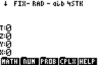
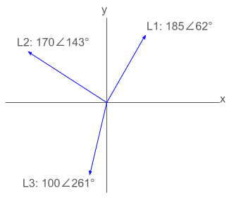
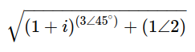

# RPN83P User Guide

RPN calculator app for the TI-83 Plus and TI-84 Plus inspired by the HP-42S.

**Version**: 0.9.0 (2024-01-06)

**Project Home**: https://github.com/bxparks/rpn83p

## Table of Contents

- [Introduction](#introduction)
- [Why?](#why)
    - [Short Answer](#short-answer)
    - [Long Answer](#long-answer)
- [Installation](#installation)
    - [Obtaining the Program File](#obtaining-the-program-file)
    - [Uploading](#uploading)
    - [Starting](#starting)
    - [Quitting](#quitting)
    - [Supported Hardware](#supported-hardware)
- [Basic Usage](#basic-usage)
    - [Screen Areas](#screen-areas)
    - [Input and Editing](#input-and-editing)
    - [RPN Stack](#rpn-stack)
    - [Menu System](#menu-system)
        - [Menu Hierarchy](#menu-hierarchy)
        - [Menu Buttons](#menu-buttons)
        - [Menu Indicator Arrows](#menu-indicator-arrows)
        - [Menu Shortcuts](#menu-shortcuts)
        - [Menu Shortcut Jump Back](#menu-shortcut-jump-back)
    - [Built In Help](#built-in-help)
    - [Error Codes](#error-codes)
- [Functions](#functions)
    - [Direct Functions](#direct-functions)
    - [Menu Functions](#menu-functions)
- [Advanced Usage](#advanced-usage)
    - [Auto-start](#auto-start)
    - [Input Limits and Long Numbers](#input-limits-and-long-numbers)
    - [Floating Point Display Modes](#floating-point-display-modes)
    - [SHOW Mode](#show-mode)
    - [Trigonometric Modes](#trigonometric-modes)
    - [Storage Registers](#storage-registers)
    - [Prime Factors](#prime-factors)
    - [BASE Functions](#base-functions)
        - [Base Modes](#base-modes)
        - [Shift and Rotate](#shift-and-rotate)
        - [Base Arithmetic](#base-arithmetic)
        - [Carry Flag](#carry-flag)
        - [Bit Operations](#bit-operations)
        - [Base Word Size](#base-word-size)
        - [Base Input Digit Limit](#base-input-digit-limit)
        - [Base Mode Retention](#base-mode-retention)
    - [STAT Functions](#stat-functions)
    - [TVM Functions](#tvm-functions)
        - [TVM Menu Buttons](#tvm-menu-buttons)
        - [TVM Payments Per Year](#tvm-payments-per-year)
        - [TVM BEG and END](#tvm-beg-and-end)
        - [TVM Solver Control](#tvm-solver-control)
        - [TVM Clear](#tvm-clear)
        - [TVM Variable Recall](#tvm-variable-recall)
        - [TVM Examples](#tvm-examples)
    - [Complex Numbers](#complex-numbers)
        - [Complex Numbers and Screen Size](#complex-numbers-and-screen-size)
        - [Complex Number Entry](#complex-number-entry)
        - [Complex Display Modes](#complex-display-modes)
        - [Complex Polar Mode Overflow](#complex-polar-mode-overflow)
        - [Complex SHOW](#complex-show)
        - [Complex FIX, SCI, ENG](#complex-fix-sci-eng)
        - [Complex Functions](#complex-functions)
        - [Complex Computation Modes](#complex-computation-modes)
        - [Complex Numbers and Trigonometric
          Modes](#complex-numbers-and-trigonometric-modes)
        - [Complex Numbers in Storage
          Registers](#complex-numbers-in-storage-registers)
- [TI-OS Interaction](#ti-os-interaction)
- [Future Enhancements](#future-enhancements)

## Introduction

RPN83P is an [RPN](https://en.wikipedia.org/wiki/Reverse_Polish_notation)
calculator app for the [TI-83 Plus](https://en.wikipedia.org/wiki/TI-83_series)
(including the Silver Edition) and the [TI-84
Plus](https://en.wikipedia.org/wiki/TI-84_Plus_series) (including the Silver
Edition). The app is inspired mostly by the
[HP-42S](https://en.wikipedia.org/wiki/HP-42S) calculator, with some significant
features from the
[HP-12C](https://en.wikipedia.org/wiki/HP-12C) and the
[HP-16C](https://en.wikipedia.org/wiki/HP-16C).

The RPN83P is a flash application written in Z80 assembly language that consumes
2 pages (32 kiB) of flash memory. Since it is stored in flash, it is preserved
if the RAM is cleared. It consumes about 735 bytes of TI-OS RAM through 3
AppVars: `RPN83REG` (496 bytes), `RPN83STK` (116 bytes), and `RPN83SAV` (123
bytes).

Summary of features:

- traditional 4-level RPN stack (`X`, `Y`, `Z`, `T`), with `LastX` register
- 8-line display showing all stack registers
- hierarchical menu system similar to HP-42S
- quick reference `HELP` menu
- storage registers
    - store and recall:`STO nn`, `RCL nn`
    - storage arithmetics: `STO+ nn`, `STO- nn`, `STO* nn`, `STO/ nn`, `RCL+
      nn`, `RCL- nn`, `RCL* nn`, `RCL/ nn`
    - 25 storage registers: `nn = 00..24`
- all math functions with dedicated buttons on the TI-83 Plus and TI-84 Plus
    - arithmetic: `/`, `*`, `-`, `+`
    - algebraic: `1/X`, `X^2`, `SQRT`, `^` (i.e. `Y^X`)
    - transcendental: `LOG`, `10^X`, `LN`, `e^X`
    - trigonometric: `SIN`, `COS`, `TAN`, `ASIN`, `ACOS`, `ATAN`
    - constants: `pi` and `e`
- additional menu functions
    - arithmetic: `%`, `%CH`, `GCD`, `LCM`, `PRIM` (prime factor), `IP` (integer
      part), `FP` (fractional part), `FLR` (floor), `CEIL` (ceiling), `NEAR`
      (nearest integer), `ABS`, `SIGN`, `MOD`, `MIN`, `MAX`
    - algebraic: `X^3`, `3RootX`
    - transcendental: `XRootY`,`2^X`, `LOG2`, `LOGB`, `E^X-` (e^x-1), `LN1+`
      (log(1+x))
    - trigonometric: `ATN2`
    - hyperbolic: `SINH`, `COSH`, `TANH`, `ASNH`, `ACSH`, `ATNH`
    - probability: `PERM`, `COMB`, `N!`, `RAND`, `SEED`
    - angle conversions: `>DEG`, `>RAD`, `>HR`, `>HMS`, `>REC`, `>POL`
    - unit conversions: `>C`, `>F`, `>hPa`, `>inHg`, `>km`, `>mi`, `>m`, `>ft`,
      `>cm`, `>in`, `>um`, `>mil`, `>kg`, `>lbs`, `>g`, `>oz`, `>L`, `>gal`,
      `>mL`, `>floz`, `>kJ`, `>cal`, `>kW`, `>hp`
- statistics and curve fitting, inspired by HP-42S
    - statistics: `Sigma+`, `Sigma-`, `SUM`, `MEAN`, `WMN` (weighted mean),
      `SDEV` (sample standard deviation), `SCOV` (sample covariance),
      `PDEV` (population standard deviation), `PCOV` (population covariance)
    - curve fitting: `Y>X`, `X>Y`, `SLOP` (slope), `YINT` (y intercept), `CORR`
      (correlation coefficient)
    - curve fit models: `LINF` (linear), `LOGF` (logarithmic), `EXPF`
      (exponential), `PWRF` (power)
- base conversion and bitwise operations, inspired by HP-16C and HP-42S
    - base conversions: `DEC`, `HEX`, `OCT`, `BIN`
    - bitwise operations: `AND`, `OR`, `XOR`, `NOT`, `NEG`, `REVB` (reverse
      bits), `CNTB` (count bits)
    - integer arithmetics: `B+`, `B-`, `B*`, `B/`, `BDIV` (divide with
      remainder)
    - shift and rotate: `SL`, `SR`, `ASR`, `RL`, `RR`, `RLC`, `RRC`,
      `SLn`, `SRn`, `RLn`, `RRn`, `RLCn`, `RRCn`
    - carry flag and bit masks: `CCF`, `SCF`, `CF?`, `CB`, `SB`, `B?`
    - word sizes: `WSIZ`, `WSZ?`: 8, 16, 24, 32 bits
- time value of money (TVM), inspired by HP-12C, HP-17B, and HP-30b
    - `N`, `I%YR`, `PV`, `PMT`, `FV`, `P/YR`, `BEG`, `END`, `CLTV` (clear TVM)
- complex numbers, inspired by HP-42S and HP-35s
    - stored in RPN stack registers (`X`, `Y`, `Z`, `T`, `LastX`) and storage
      registers `R00-R24`
    - computation modes: `RRES` (real results), `CRES` (complex results)
    - display modes: `RECT`, `PRAD` (polar radians), `PDEG` (polar degrees)
    - linking/unlinking: `2ND LINK` (convert 2 reals to 1 complex, same as
      `COMPLEX` on HP-42S)
    - number entry: `2ND i` (rectangular), `2ND ANGLE` (polar degrees), `2ND
      ANGLE 2ND ANGLE` (polar radians)
    - extended regular functions: `+`, `-`, `*`, `/`, `1/x`, `x^2`, `SQRT`,
      `Y^X`, `X^3`, `3RootY`, `XRootY`, `LOG`, `LN`, `10^x`, `e^x`, `2^x`,
      `LOG2`, `LOGB`
    - complex specific functions: `REAL`, `IMAG`, `CONJ`, `CABS`, `CANG`
    - unsupported: trigonometric and hyperbolic functions (not supported by
      TI-OS)
- various modes (`MODE`)
    - floating display: `FIX`, `SCI`, `ENG`
    - trigonometric: `RAD`, `DEG`
    - complex computation: `RRES`, `CRES`
    - complex display: `RECT`, `PRAD`, `PDEG`
    - `SHOW` (`2ND ENTRY`): display all 14 internal digits

Missing features (partial list):

- vectors and matrices
- keystroke programming

## Why?

### Short Answer

This project helped me relearn Z80 assembly language programming using TI
calculators. It also produced a scientific RPN app that can run on calculators
which are easily and cheaply obtainable. There are no scientific RPN calculators
currently in production from HP. The prices for many HP calculators in the used
market are unreasonably high, so RPN83P may fill a gap for some people in some
cases.

### Long Answer

When I was in grad school, I used the HP-42S extensively. After graduating, I
sold the calculator, which I have regretted later. The old HP-42S calculators
now sell for $200-$300 on eBay, which is a sum of money that I cannot justify
spending.

I finished my formal school education before graphing calculators became
popular, so I didn't know anything about them until a few months ago. I did not
know that the early TI graphing calculators used the Z80 processor, and more
importantly, I did not know that they were programmable in assembly language.

I realized that I could probably create an app that could turn them into
passable, maybe even useful, RPN calculators. The debate over RPN mode versus
algebraic mode has probably been going on for 40-50 years, so I probably cannot
add more. Personally, I use algebraic notation for doing math equations on paper
or writing high-level computer programs. But when I do numerical *computation*
on a hand-held device, I am most comfortable using the RPN mode.

There are many RPN calculator apps for the smartphone, but the touchscreen of a
phone can become tedious for calculations that require large number of
keystrokes. For those cases, a physical device is more convenient and less error
prone.

The RPN83P app is inspired by the HP-42S. It is the RPN calculator that I know
best. It also has the advantage of having the
[Free42](https://thomasokken.com/free42/) app (Android, iOS, Windows, MacOS,
Linux) which faithfully reproduces every feature of the HP-42S. This is
essential because I don't own an actual HP-42S anymore to verify obscure edge
cases which may not be documented. Another advantage of the HP-42S is that a
hardware clone is currently in production by SwissMicros as the
[DM42](https://www.swissmicros.com/product/dm42). This increases the number of
users who may be familiar with the user interface and behavior of the HP-42S.

The RPN83P app cannot be a clone of the HP-42S for several reasons:

- The keyboard layout and labels of the TI-83 and TI-84 calculators are
  different. As an obvious example, the TI calculators have 5 menu buttons below
  the LCD screen, but the HP-42S has 6 menu buttons.
- The RPN83P does not implement its own floating point routines, but uses the
  ones provided by the underlying TI-OS. There are essential differences between
  the two systems. For example, the HP-42S supports exponents up to +/-499, but
  the TI-OS supports exponents only to +/-99.

Although the HP-42S may be close to ["peak of perfection for the classic HP
calcs"](https://www.hpmuseum.org/cgi-sys/cgiwrap/hpmuseum/archv017.cgi?read=118462),
I think there are features of the HP-42S that could be improved. For example,
the HP-42S has a 2-line LCD display which is better than the single-line display
of earlier HP calculators. But the TI-83 and TI-84 LCD screens are big enough to
show the entire RPN stack as well as the hierarchical menu bar at all times, so
it makes sense to take advantage of the larger LCD screen size.

The purpose of the RPN83P project was to help me learn Z80 programming on a TI
calculator, and to convert an old TI calculator into a scientific RPN calculator
that I can actually use. The host calculator hardware is readily and cheaply
available, so I hope other people find it useful.

## Installation

### Obtaining the Program File

The RPN83P app is packaged as a single file named `rpn83p.8xk`. There are at
least 2 ways to obtain this:

- [RPN83P Releases page on GitHub](https://github.com/bxparks/rpn83p/releases)
    - go to the latest release
    - click and download the `rpn83p.8xk` file
- Compile the binary locally
    - See [Compiling from Source](#Compiling) section below

### Uploading

The `rpn83p.8xk` file must be uploaded to the calculator using a "link" program
from a host computer. There are a number of options:

- **Linux**: Use the [tilp](https://github.com/debrouxl/tilp_and_gfm) program.
  On Ubuntu Linux 22.04 systems, the precompiled package can be installed using
  `$ apt install tilp2`. (I'm not actually sure if the `tilp2` binary is
  actually compiled from the `tilp_and_gfm` source code mentioned above)

- **Windows** or **MacOS**: Use the [TI
  Connect](https://education.ti.com/en/products/computer-software/ti-connect-sw)
  software and follow the instructions in [Transferring FLASH
  Applications](https://education.ti.com/en/customer-support/knowledge-base/sofware-apps/product-usage/11506).

**Warning**: If you are upgrading from a previous version of RPN83P, you may
need to manually remove the `RPN83P` app from the calculator, before uploading
the new `rpn83p.8xk` file. I don't know why, but sometimes the calculator gets
stuck at the `Defragmenting...` step and never finishes uploading the file. To
manually remove, go to `2ND MEM`, `2` (Mem Mgmt/Del), `ALPHA A` (Apps), scroll
down to the `RPN83P`, hit `DEL`, press `2` (Yes).

### Starting

After installing `rpn83p.8xk` file, go to the calculator:

- Press the `APPS` key
- Scroll down to the `RPN83P` entry
- Press the `ENTER` key


The RPN83P starts directly into the calculator mode, no fancy splash screen. You
should see a screen that looks like:



### Quitting

The RPN83P application can be quit using:

- `2ND` `QUIT`: to exit to normal TI calculator
- `2ND` `OFF`: to turn the calculator off (the RPN registers and storage
  registers will be preserved)

Upon exit, the state of the RPN83P app will be saved in an AppVar named
`RPN83SAV`. When the app is restarted, the calculator will resume from exactly
where it left off, including the exact cursor position of any pending input.
When restarted, if the `RPN83SAV` variable does not pass validation (e.g. does
not exist; was archived; is wrong size; contains an incompatible schema version;
does not pass a CRC checksum) then the application starts from a clean slate.

### Supported Hardware

This app was designed for TI calculators using the Z80 processor:

- TI-83 Plus (6 MHz Z80, 24 kB accessible RAM, 160 kB accessible flash, no RTC)
- TI-83 Plus Silver Edition (6/15 MHz Z80, 24 kB accessible RAM, 1.5 MB
  accessible flash, no RTC)
- TI-84 Plus (6/15 MHz Z80, 24 kB accessible RAM, 480 kB accessible flash, RTC)
- TI-84 Plus Silver Edition (6/15 MHz Z80, 24 kB accessible RAM, 1.5 MB
  accessible flash, RTC)

The app configures itself to run at 15 MHz on supported hardware, while
remaining at 6 MHz on the TI-83+.

I have tested it on the following calculators that I own:

- TI-83 Plus (OS v1.19)
- TI-83 Plus Silver Edition (OS v1.19)
- TI-84 Plus Silver Edition (OS v2.55MP)

Community members have verified that it works on the following variants:

- TI-84 Plus
- TI-84 Plus Pocket SE
- TI-84 Pocket.fr

The following calculators are *not* supported because their internal hardware
and firmware are too different:

- TI-84 Plus C Silver Edition
- TI-84 Plus CE
- TI-83 Premium CE (French version of the TI-84 Plus CE)

## Basic Usage

This guide assumes that you already know to use an RPN calculator. In
particular, the RPN83P implements the traditional RPN system used by
Hewlett-Packard calculators such as the HP-12C, HP-15C, and the HP-42S. (The
RPN83P does not use the newer RPN system used by the HP-48 series and other
similar HP calculators.)

It is beyond the scope of this document to explain how to use an RPN calculator.
One way to learn is to download the [Free42](https://thomasokken.com/free42/)
emulator for the HP-42S (available for Android, iOS, Windows, MacOS, and Linux)
and then download the [HP-42S Owner's
Manual](https://literature.hpcalc.org/items/929).

### Screen Areas

Here are the various UI elements on the LCD screen used by the RPN83P app:


The LCD screen is 96 pixels (width) by 64 pixels (height). That is large enough
to display 8 rows of numbers and letters. They are divided into the following:

- 1: status line
- 2: (currently unused)
- 3: error code line
- 4: T register line
- 5: Z register line
- 6: Y register line
- 7: X register/input line
- 8: menu line

The X register line is also used as the input line when entering new numbers. It
is also used to prompt for command line argument, for example `FIX _ _` to set
the fixed display mode.

### Input and Editing

The following buttons are used to enter and edit a number in the input buffer:


- `0`-`9`: digits
- `.`: decimal point
- `(-)`: enters a negative sign, or changes the sign (same as `+/-` or `CHS` on
  HP calculators)
- `DEL`: Backspace (same as `<-` on many HP calculators)
- `CLEAR`: Clear `X` register, same as `CLX`; *or* clear the input buffer
- `CLEAR CLEAR CLEAR`: Clear the stack, same as `CLST`
- `2ND` `EE`: adds an `E` to allow entry of scientific notation exponent (same
  as `E` or `EEX` on HP calculators)
- `,`: same as `2ND` `EE`, allowing the `2ND` to be omitted for convenience

The following keys are related to complex numbers and are explained in more
detail in the [Complex Numbers](#complex-numbers) section below:

- `2ND LINK`: convert `X` and `Y` into a complex number in `X`, or the reverse
- `2ND ANGLE`: enter a complex number in polar degree form
- `2ND ANGLE` `2ND ANGLE`: enter a complex number polar radian form
- `2ND i`: enter a complex number in rectangular form

The `(-)` button acts like the `+/-` or `CHS` button on HP calculators. It
toggles the negative sign, adding it if it does not exist, and removing it if it
does.

The `DEL` key acts like the *backspace* key on HP calculators (usually marked
with a `LEFTARROW` symbol. This is different from the TI-OS where the `DEL` key
removes the character under the cursor. In RPN83P, the cursor is *always* at the
end of the input buffer, so `DEL` is programmed to delete the right-most digit.
If the `X` line is *not* in edit mode (i.e. the cursor is not shown), then the
`DEL` key acts like the `CLEAR` key (see below).

The `CLEAR` key performs slightly different actions depending on the context:
- If the `X` register is normally displayed, `CLEAR` goes into edit mode with an
  empty input buffer.
- If the `X` register is already in edit mode, `CLEAR` clears input buffer.
- If the `X` register is in edit mode and the input buffer is already empty,
  then `CLEAR` shows a message to the user: `CLEAR Again to Clear Stack`.
- If the `CLEAR` button is pressed immediately again, the RPN stack is cleared.
  This is the same functionality as the `ROOT > CLR > CLST` menu button.

In an RPN system, it is generally not necessary to clear the RPN stack before
any calculations. However, many users want to see a clean slate on the display
to reflect their mental state when starting a new calculation. The `CLST` menu
function provides this feature, but is nested under the `ROOT > CLR > CLST` menu
hierarchy. If you are deeply nested under another part of the menu hierarchy, it
can be cumbersome to navigate back up to the `ROOT`, invoke the `CLST` button,
then make your way back to the original menu location. To solve this problem,
the RPN83P app will invoke `CLST` function when `CLEAR` is hit 3 times. (The
TI-OS does not support `2ND CLEAR`, it returns the same code as `CLEAR`.)

An empty string will be interpreted as a `0` if the `ENTER` key or a function
key is pressed.

The comma `,` button is not used in the RPN system, so it has been mapped to
behave exactly like the `2ND` `EE` button. This allows scientific notation
numbers to be entered quickly without having to press the `2ND` button
repeatedly.

Emulating the input system of the HP-42S was surprisingly complex and subtle,
and some features and idiosyncrasies of the HP-42S could not be carried over due
to incompatibilities with the underlying TI-OS. But some features were
deliberately implemented differently. For example, on the HP-42S, when the input
buffer becomes empty after pressing the `<-` backspace button multiple times, or
pressing the `CLEAR > CLX` menu button, the cursor disappears and the `X`
register is shown as `0.0000`. But internally, the HP-42S is in a slightly
different state than normal: the Stack Lift is disabled, and entering another
number will replace the `0.0000` in the `X` register instead of lifting it up to
the `Y` register. In RPN83P, when the `DEL` key or the `CLEAR` key is pressed,
the `X` register always enters into Edit mode with an empty input buffer, and
the cursor will *always* be shown with an empty string. The presence of the
cursor indicates that the Edit Mode is in effect and that the Stack Lift is
disabled.

I'm not sure that documenting all the corner cases would be useful in this
document because it would probably be tedious to read. I hope that the input
system is intuitive and self-consistent enough that you can just play around
with it and learn how it works.

### RPN Stack

The RPN83P tries to implement the traditional 4-level stack used by many HP
calculators as closely as possible, including some features which some people
may find idiosyncratic. There are 4 slots in the RPN stack named `X`, `Y`, `Z`,
and `T`. The LCD screen on the TI calculators is big enough that all 4 RPN
registers can be shown at all times. (For comparison, the HP-12C and HP-15C have
only a single line display. The HP-42S has a 2-line display, with the bottom
line often commandeered by the menu line so that only the `X` register is
shown.)

These are the buttons which manipulate the RPN stack:


- `(`: rolls RPN stack down (known as `R(downarrow)` on HP calculators)
- `)`: exchanges `X` and `Y` registers
- `ENTER`: saves the input buffer to the `X` register
- `2ND` `ANS`: recalls the last `X`

This mapping of the `(` and `)` to these stack functions is identical to the
mapping used by the [HP-30b](https://en.wikipedia.org/wiki/HP_30b) when it is in
RPN mode. (The HP-30b supports both algebraic and RPN entry modes.)

When a new number is entered (using the `0`-`9` digit keys), the press of the
first digit causes the stack to **lift**, and the calculator enters into the
**edit** mode. This mode is indicated by the appearance of an underscore `_`
cursor.

A stack **lift** causes the previous `X` value to shift into the `Y` register,
the previous `Y` value into the `Z` register, and the previous `Z` value into
the `T` register. The previous `T` value is lost.

The `ENTER` key performs the following actions:

- if the `X` register was in edit mode, the input buffer is closed and the
  number is placed into the `X` register,
- the `X` register is then duplicated into the `Y` register,
- the stack lift is *disabled* for the next number.

This is consistent with the traditional RPN system used by HP calculators up to
and including the HP-42S. It allows the user to press: `2` `ENTER` `3` `*` to
multiply `2*3` and get `6` as the result, because the second number `3` does not
lift the stack.

The parenthesis `(` and `)` buttons are not used in an RPN entry system, so they
have been repurposed for stack manipulation:

- `(` key rolls the stack *down*, exactly as the same as the `R(downarrow)` or
  just a single `(downarrow)` on the HP calculators.
- `)` key performs an exchange of the `X` and `Y` registers. That functionality
  is usually marked as `X<>Y` on HP calculators.

The `2ND` `ANS` functionality of the TI-OS algebraic mode is unnecessary in the
RPN system because the `X` register is always the most recent result that would
have been stored in `2ND` `ANS`. Therefore, the `2ND` `ANS` has been repurposed
to be the `LastX` functionality of HP calculators. The `LastX` is the value of
the `X` register just before the most recent operation. It can be used to bring
back a number that was accidentally consumed, or it can be used as part of a
longer sequence of calculations.

### Menu System

#### Menu Hierarchy

The menu system of the RPN83P was directly inspired by the HP-42S calculator.
There are over 150 functions supported by the RPN83P menu system, so it is
convenient to arrange them into a nested folder structure. There are 5 buttons
directly under the LCD screen so it makes sense to present the menu items as
sets of 5 items corresponding to those buttons.

The menu system forms a singly-rooted tree of menu items and groups, which look
like this conceptually:


There are 4 components:

- `MenuGroup`: a folder of 1 or more `MenuRows` (e.g. `NUM`)
- `MenuRow`: a list of exactly 5 `MenuNodes` corresponding to the 5 menu
  buttons below the LCD
- `MenuNode`: one slot in the `MenuRow`, can be *either* a `MenuGroup` or a
  `MenuItem`
- `MenuItem`: a leaf-node that maps directly to a function (e.g. `GCD`) when
  the corresponding menu button is pressed

#### Menu Buttons

The LCD screen always shows a `MenuRow` of 5 `MenuItems`. Here are the buttons
which are used to navigate the menu hierarchy:


- `F1`- `F5`: invokes the function shown by the respective menu
- `UP_ARROW`: goes to previous `MenuRow` of 5 `MenuItems`, within the current
  `MenuGroup`
- `DOWN_ARROW`: goes to next `MenuRow` of 5 `MenuItems`, within the current
  `MenuGroup`
- `ON`: goes back to the parent `MenuGroup` (similar to the `ON/EXIT` button on
  the HP-42S)
- `MATH`: goes directly to the root `MenuGroup` no matter where you are in the
  menu hierarchy

The appropriate key for the "menu back to parent" function would have been an
`ESC` button. But the TI-83 and TI-84 calculators do not have an `ESC` button
(unlike the TI-89, TI-92, and TI Voyager 200 series calculators), so the `ON`
button was recruited for this functionality. This seemed to make sense because
the HP-42S
uses the `ON` key which doubles as the `EXIT` or `ESC` key to perform this
function.

The `HOME` button is useful to go directly to the top of the menu hierarchy from
anywhere in the menu hierarchy. The TI-83 and TI-84 calculators do not have a
`HOME` button (unlike the TI-89, TI-92, and TI Voyager 200 series again), so the
`MATH` button was taken over to act as the `HOME` key. This choice was not
completely random:

1. The `HOME` button on the [TI-89 series
calculator](https://en.wikipedia.org/wiki/TI-89_series) is located exactly where
the `MATH` is.
2. The RPN83P app does not need the `MATH` button as implemented by the TI-OS,
which opens a dialog box of mathematical functions. In the RPN83P app, that
functionality is already provided by the menu system.
3. When the menu system is at the root, the first menu item on the left is a
menu group named `MATH`, which may help to remember this button mapping.

**HP-42S Compatibility Note**: As far I can tell, the menu system of the HP-42S
is *multiply rooted* and pressing a given menu button (e.g. `BASE`) activates
the menu hierarchy of that particular button. I think this works because the
menu bar on the HP-42S is not displayed by default, so there is no single ROOT
node of its menu system. Some of the HP-42S menu bars can stack on top of each
other, so that the `EXIT` button goes back to the previous menu bar. But some
menu bars do not. I have never figured out the rhyme and reason for this
behavior. The RPN83P app, on the other hand, always displays its menu bar, so it
was simpler for the user (and the programmer of this app) to create a *singly
rooted* menu hierarchy with the menu bar always starting from the implicit
`ROOT` menu node.

#### Menu Indicator Arrows

There are 3 menu arrows at the top-left corner of the LCD screen. The
`downarrow` indicates that additional menu rows are available:


When the `DOWN` button is pressed, the menu changes to the next set of 5 menu
items in the next menu row, and the menu arrows show both an `uparrow` and a
`downarrow` to indicate that there are more menu items above and below the
current menu bar:


Pressing `DOWN` goes to the last set of 5 menu items, and the menu arrows show
only the `uparrow` to indicate that this is the last of the series:


You can press `UP` twice goes back to the first menu row, or you can press
`DOWN` from the last menu row to wrap around to the beginning:


Pressing the `F2/WINDOW` button from here invokes the `NUM` menu item. This menu
item is actually a `MenuGroup`, so the menu system descends into this folder,
and displays the 5 menu items in the first menu row:


Pressing the `DOWN` arrow button shows the next menu row:


Pressing the `DOWN` arrow button goes to the final menu row:


Notice that inside the `NUM` menu group, the menu arrows show a `back` arrow.
This means that the `ON` button (which implements the "BACK", "EXIT", or "ESC"
functionality) can be used to go back to the parent menu group:


#### Menu Shortcuts

Some menu groups can be accessed quickly through dedicated keys on the TI
calculator which happen to have the same label as the menu item:

- `MODE`: bound to `ROOT > MODE`
- `STAT`: bound to `ROOT > STAT`
- `MATH`: repurposed to be `HOME` (aka `ROOT`)

The `MATH` button is slightly different. It is not bound to `ROOT > MATH`.
Rather it has been repurposed to be the `HOME` button which goes to the top of
the menu hierarchy `ROOT`.

#### Menu Shortcut Jump Back

Normally when the `ON/EXIT/ESC` button is pressed, the menu bar goes up to the
parent of the current MenuGroup. That makes sense because the user normally must
travel through the parent to reach the child MenuGroup. But the keyboard
shortcuts break this rule.

When the `MODE` button is pressed, the menu bar goes directly to the `ROOT >
MODE` MenuGroup from anywhere in the menu hierarchy. Since the `MODE` functions
involve quick changes to the floating point display or the trigonometric angle
units, it seems likely that the user would want to go back to the original menu
bar after making the `MODE` changes. Therefore, the `ON/EXIT/ESC` button has
been programmed to jump back to the *previous* menu bar if the `ROOT > MODE`
menu was invoked through the `MODE` button.

The `STAT` shortcut, however, does *not* implement the jump back feature.
Instead, the `ON/EXIT/ESC` acts normally and the menu goes up to the parent of
the `STAT` MenuGroup to the `ROOT` of the menu system. This behavior was chosen
because it seemed more likely that the user would spend a significant amount of
time inside the `STAT` menu functions. The more time spent inside the `STAT`
menu, the less likely it seemed the user would remember where the original menu
bar was, and unlikely to want to go back there using the `ON/EXIT/ESC` key.

## Built In Help

Pressing the `HELP` menu button at the root menu activates the Help pages:


The contents of these pages are updated frequently so the screenshots below may
not be identical to the current version:


The Help pages are intended to capture some of the more obscure tidbits about
the RPN83P app which may be hard to remember. Hopefully it reduces the number of
times that this User Guide needs to be consulted.

The message at the bottom of each page is not completely honest. A number of
navigational keys are recognized by the Help system:

- `UP`, `LEFT`: previous page with wraparound
- `DOWN`, `RIGHT`: next page with wraparound
- `DEL`, `MATH`, `CLEAR`, `ON`: exit Help
- any other button: next page *without* wraparound, exiting on the last page

## Error Codes

The RPN83P supports all error messages from the underlying TI-OS which are
listed in the TI-83 SDK. The SDK unfortunately does not describe how these
errors are actually triggered. By trial-and-error, I could reverse engineer only
a few of them as described below:

- `Err: Argument`: incorrect number of arguments
- `Err: Bad Guess`
- `Err: Break`
- `Err: Domain`: invalid argument or argument outside range
- `Err: Data Type`: invalid argument type (e.g. complex number)
- `Err: Invalid Dim`: list index larger than list size
- `Err: Dim Mismatch`
- `Err: Divide By 0`: divide by 0
- `Err: Increment`
- `Err: Invalid`
- `Err: Iterations`
- `Err: In Xmit`
- `Err: Memory`
- `Err: Non Real` (I could never reproduce this, the TI-OS seems to use `Err:
  Domain` or `Err: Data Type` instead)
- `Err: Overflow`: result exceeds `9.99999999E99`
- `Err: No Sign Change`
- `Err: Singularity`
- `Err: Stat`
- `Err: StatPlot`
- `Err: Syntax`: incorrect math expression syntax
- `Err: Tol Not Met`
- `Err: Undefined`: variable not found

These are shown in the Error Code line on the screen. For example, if we try to
divide `1 / 0`, a division by 0 error is shown:


If a TI-OS function returns an internal error code outside of the ones
documented in the SDK, RPN83P will print an error message in the form of `Err:
UNKNOWN (##)` like this:


The number in parenthesis is the internal numerical value of the error code. If
the error is reproducible, please file a [bug
report](https://github.com/bxparks/rpn83p/issues) containing the numerical error
code and the steps needed to reproduce it so that I can add it to the list of
error messages supported by RPN83P.

## Functions

This section contains a description of all functions implemented by the RPN83P
app, accessed through buttons or through the menu system.

### Direct Functions

All mathematical functions that are exposed through physical buttons are
supported by the RPN83P app.

- arithmetic
    - `/`, `*`, `-`, `+`
- algebraic
    - `X^-1`, `X^2`, `sqrt`, `^` (i.e. `Y^X`)
- trigonometric
    - `SIN`, `COS`, `TAN`
    - `2ND` `SIN^-1`, `2ND` `COS^-1`, `2ND` `TAN^-1`
- transcendental
    - `LOG`, `10^X`, `LN`, `e^X`
- constants
    - `pi`, `e`

### Menu Functions

These functions are accessed through the hierarchical menu, using the 5 menu
buttons just under the LCD screen. Use the `UP`, `DOWN`, `ON` (EXIT/ESC), and
`MATH` (HOME) keys to navigate the menu hierarchy.

- `ROOT` (implicit)
    - 
    - 
    - 
- `ROOT` > `MATH`
    - 
    - 
    - `X^3`: cube of `X`
    - `3RootX`: cube root of `X`
    - `XRootY`: `X` root of `Y`
    - `ATN2`: `atan2(X, Y)` in degrees or radians, depending on current mode
        - `Y`: y-component, entered first
        - `X`: x-component, entered second
        - (order of `Y` and `X` is the same as the `>POL` conversion function)
    - `2^X`: `2` to the power of `X`
    - `LOG2`: log base 2 of `X`
    - `LOGB`: log base `X` of `Y`
    - `E^X-`: `e^x-1` accurate for small `x`
    - `LN1+`: `log(1+x)` accurate for small `x`
- `ROOT` > `NUM`
    - 
    - 
    - 
    - `%`: `X` percent of `Y`, leaving `Y` unchanged
    - `%CH`: percent change from `Y` to `X`, leaving `Y` unchanged
    - `GCD`: greatest common divisor of `X` and `Y`
    - `LCM`: lowest common multiple of `X` and `Y`
    - `PRIM`: prime factor of `X`
        - returns 1 if prime
        - returns the smallest prime factor otherwise
        - See [Prime Factors](#prime-factors) section below.
    - `IP`: integer part of `X`, truncating towards 0, preserving sign
    - `FP`: fractional part of `X`, preserving sign
    - `FLR`: the floor of `X`, the largest integer <= `X`
    - `CEIL`: the ceiling of `X`, the smallest integer >= `X`
    - `NEAR`: the nearest integer to `X`
    - `ABS`: absolute value of `X`
    - `SIGN`: return -1, 0, 1 depending on whether `X` is less than, equal, or
      greater than 0, respectively
    - `MOD`: `Y` mod `X` (remainder of `Y` after dividing by `X`)
    - `MIN`: minimum of `X` and `Y`
    - `MAX`: maximum of `X` and `Y`
- `ROOT` > `PROB`
    - 
    - `COMB`: combination `C(n,r)` = `C(Y, X)`
    - `PERM`: permutation `P(n,r)` = `P(Y, X)`
    - `N!`: factorial of `X`
    - `RAND`: random number in the range `[0,1)`
    - `SEED`: set the random number generator seed to `X`
- `ROOT` > `CPLX`
    - 
    - `REAL`: extract the real component of the complex number
    - `IMAG`: extract the imaginary component of the complex number
    - `CONJ`: calculate the complex conjugate
    - `CABS`: calculate the magnitude of the complex number
    - `CANG`: calculate the angle (i.e. argument) of the complex number
- `ROOT` > `HELP`: display the Help pages
    - use arrow keys to view each Help page
- `ROOT` > `BASE`
    - 
    - 
    - 
    - 
    - 
    - 
    - 
    - 
    - `DEC`: use decimal base 10
    - `HEX`: use hexadecimal base 16
        - display register values as 32-bit unsigned integer
    - `OCT`: use octal base 8
        - display register values as 32-bit unsigned integer
    - `BIN`: use binary base 2
        - display register values as 32-bit unsigned integer
    - `AND`: `X` `bit-and` `Y`
    - `OR`: `X` `bit-or` `Y`
    - `XOR`: `X` `bit-xor` `Y`
    - `NOT`: one's complement of `X`
    - `NEG`: two's complement of `X`
    - `SL`: shift left logical one bit
    - `SR`: shift right logical one bit
    - `ASR`: arithmetic shift right one bit
    - `SLn`: shift left logical `Y` by `X` bits
    - `SRn`: shift right logical `Y` by `X` bits
    - `RL`: rotate left circular one bit
    - `RR`: rotate right circular one bit
    - `RLC`: rotate left through carry flag one bit
    - `RRC`: rotate right through carry flag one bit
    - `RLn`: rotate left circular `Y` by `X` bits
    - `RRn`: rotate right circular `Y` by `X` bits
    - `RLCn`: rotate left through carry flag `Y` by `X` bits
    - `RRCn`: rotate right through carry flag `Y` by `X` bits
    - `CB`: clear bit `X` of `Y`
    - `SB`: set bit `X` of `Y`
    - `B?`: get bit `X` of `Y` as 0 or 1
    - `REVB`: reverse bits of `X`
    - `CNTB`: count number of 1 bits of `X` (same as `#B` on HP-16C)
    - `B+`: add `X` and `Y` using unsigned 32-bit integer math
    - `B-`: subtract `X` from `Y` using unsigned 32-bit integer math
    - `B*`: multiply `X` and `Y` using unsigned 32-bit integer math
    - `B/`: divide `X` into `Y` using unsigned 32-bit integer math
    - `BDIV`: divide `X` into `Y` with remainder, placing the quotient in `X`
      and the remainder in `Y`
    - `CCF`: clear carry flag
    - `SCF`: set carry flag
    - `CF?`: return carry flag state as 0 or 1
    - `WSIZ`: set integer word size (supported values: 8, 16, 24, 32)
    - `WSZ?`: return current integer word size (default: 32)
- `ROOT` > `HYP`
    - 
    - 
    - `SINH`: hyperbolic `sin()`
    - `COSH`: hyperbolic `cos()`
    - `TANH`: hyperbolic `tan()`
    - `ASNH`: hyperbolic `asin()`
    - `ACSH`: hyperbolic `acos()`
    - `ATNH`: hyperbolic `atan()`
- `ROOT` > `STAT`
    - See Chapter 15 of the _HP-42S User's Manual_
    - 
    - 
    - 
    - `Sigma+`: add `Y` and `X` data point to STAT registers
    - `Sigma-`: remove `Y` and `X` data point from STAT registers
    - `ALLSigma`: collect statistical sums for all curve fit models
    - `LINSigma`: collect statistical sums for the linear curve fit model
    - `CLSigma`: clear STAT registers `[R11,R16]` (if LINSigma selected) or
      `[R11,R23]` (if AllSigma selected)
    - `SUM`: return Sum of `Y` and Sum of `X` in the `Y` and `X` registers
    - `MEAN`: return average `<Y>` and `<X>` in the `Y` and `X` registers
    - `WMN`: return the weighted mean of `Y` and weighted mean of `X` in the `Y`
      and `X` registers
        - `weighted mean Y = Sum(XY)/Sum(X)`
        - `weighted mean X = Sum(XY)/Sum(Y)`
    - `N`: return the number of data items entered
    - `SDEV`: sample standard deviation of `Y` and `X`
        - `sdev(X) = sqrt(N/(N-1)) pdev(X)`
        - `sdev(Y) = sqrt(N/(N-1)) pdev(Y)`
    - `SCOV`: sample covariance
        - `scov(X,Y) = (N/(N-1)) pcov(X,Y)`
    - `PDEV`: population standard deviation of `Y` and `X`
        - `pdev(X) = <X^2> - <X>^2`
        - `pdev(Y) = <Y^2> - <Y>^2`
    - `PCOV`: population covariance
        - `pcov(X,Y) = <XY> - <X><Y>`
    - `ROOT` > `STAT` > `CFIT`
        - See Chapter 15 of the _HP-42S User's Manual_
        - 
        - 
        - `Y>X`: forecast X from Y
        - `X>Y`: forecast Y from X
        - `SLOP`: slope of curve fit model, i.e. `m` parameter
        - `YINT`: y-intercept of curve fit model, i.e. `b` parameter
        - `CORR`: correlation coefficient of the least square curve fit
        - `LINF`: linear fit model, `y = mx + b`
        - `LOGF`: logarithmic fit model, `y = m ln(x) + b`
        - `EXPF`: exponential fit model, `y = b e^(mx)`
        - `PWRF`: power fit model, `y = b x^m`
        - `BEST`: automatically select the best model, i.e. the one with the
          largest absolute value of the correlation coefficient. The `CORR`
          value is returned in the `X` register for reference.
- `ROOT` > `CONV`
    - 
    - 
    - `>DEG`: convert radians to degrees
    - `>RAD`: convert degrees to radians
    - `>REC`: polar to rectangular
        - input: `Y`=y, `X`=x
        - output: `Y`=theta, `X`=r
        - (consistent with HP-42S)
    - `>POL`: rectangular to polar
        - input: `Y`=theta, `X`=r
        - output: `Y`=y, `X`=x
        - (consistent with HP-42S)
    - `>HR`: convert `HH.MMSSssss` to `HH.hhhh`
    - `>HMS`: convert `HH.hhhh` to `HH.MMSSssss`
- `ROOT` > `TVM` (time value of money)
    - 
    - 
    - 
    - `N`: set or calculate Number of payment periods
    - `I%YR`: set or calculate Interest Percent per Year
    - `PV`: set or calculate Present Value
    - `PMT`: set or calculate Payment per period
    - `FV`: set or calculate Future Value
    - `P/YR`: set number of payments per year
    - `BEG`: payment occurs at the Beginning of each period
    - `END`: payment occurs at the End of each period
    - `CLTV`: clear TVM variables and parameters
    - `IYR1`: set `I%YR` guess 1 for TVM Solver
    - `IYR2`: set `I%YR` guess 2 for TVM Solver
    - `TMAX`: set iteration max for TVM Solver
    - `RSTV`: reset TVM Solver parameters to factory defaults
- `ROOT` > `CLR`
    - 
    - `CLX`: clear `X` stack register (stack lift disabled)
    - `CLST`: clear all RPN stack registers
    - `CLRG`: clear all storage registers `R00` to `R24`
    - `CLSigma`: clear STAT storage registers [`R11`, `R16`] or [`R11`, `R23`]
    - `CLTV`: clear TVM variables and parameters
- `ROOT` > `MODE`
    - 
    - 
    - `FIX`: fixed mode with `N` digits after the decimal point
        - set `N` to `99` for floating number of digits
        - status line indicator is `FIX(N)`
    - `SCI`: scientific notation with `N` digits after the decimal point
        - set `N` to `99` for floating number of digits
        - status line indicator is `SCI(N)`
    - `ENG`: engineering notation with `N` digits after the decimal point
        - set `N` to `99` for floating number of digits
        - status line indicator is `ENG(N)`
    - `RAD`: use radians for trigonometric functions
    - `DEG`: use degrees for trigonometric functions
    - `RRES`: real results only from real arguments
    - `CRES`: complex results allowed from real arguments
    - `RECT`: display complex number in rectangular form
    - `PRAD`: display complex number in polar radian form
    - `PDEG`: display complex number in polar degree form
- `ROOT` > `STK`
    - 
    - `R(up)`: roll stack up
    - `R(down)`: roll stack down, also bound to `(` button
    - `X<>Y`: exchange `X` and `Y`, also bound to `)` button
- `ROOT` > `UNIT`
    - 
    - 
    - 
    - 
    - 
    - 
    - `>C`: Fahrenheit to Celsius
    - `>F`: Celsius to Fahrenheit
    - `>hPa`: hectopascals (i.e. millibars) to inches of mercury (Hg)
    - `>iHg`: inches of mercury (Hg) to hectopascals (i.e. millibars)
    - `>km`: miles to kilometers
    - `>mi`: kilometers to miles
    - `>m`: feet to meters
    - `>ft`: meters to feet
    - `>cm`: inches to centimeters
    - `>in`: centimeters to inches
    - `>um`: mils (1/1000 of inch) to micrometers
    - `>mil`: micrometers to mils (1/1000 of inch)
    - `>kg`: pounds to kilograms
    - `>lbs`: kilograms to pounds
    - `>g`: ounces to grams
    - `>oz`: grams to ounces
    - `>L`: US gallons to liters
    - `>gal`: liters to US gallons
    - `>mL`: fluid ounces to milliliters
    - `>foz`: milliliters to fluid ounces
    - `>kJ`: kilo calories to kilo Joules
    - `>cal`: kilo Joules to kilo calories
    - `>kW`: horsepowers (mechanical) to kilo Watts
    - `>hp`: kilo Watts to horsepowers (mechanical)

## Advanced Usage

### Auto-start

For convenience, you may choose to auto-start the RPN83P application as soon as
you turn on the calculator.

- Download the
  [Start-Up](https://education.ti.com/en/software/details/en/77ec7de5d3694f4595c262fdfc2acc4b/83startupcustomization) application from TI
- Press `APPS`, then scroll down to `Start-up`
- Configure:
    - Display: `ON`
    - Type: `APP`
    - Name: `RPN83P` (hit `ENTER` and scroll down to select this)
- Select `FINISH` and hit `ENTER`

The LCD screen should look like this before hitting `FINISH`:


Turn off the calculator and turn it back on. It should directly go into the
RPN83P application.

### Input Limits and Long Numbers

The input buffer is rendered using the Large Font which means that only 14
characters can be displayed on a single line. Entering numbers longer than 14
characters is now (v0.9) supported by scrolling excess characters off the screen
to the left. When a leading digit scrolls off, an ellipsis character appears on
the left to indicate that some digits are hidden.

For example, if the number "123456.78901234" is entered, the input buffer look
normal after 14 characters (see left), then when the 15th character is entered,
some digits scroll off to the left (see right):


In normal mode, the input system is configured to accept up to 20 digits because
a TI-OS floating point number in scientific notation requires 20 digits to enter
in full precision (14 significant digits plus 6 digits of notation overhead).

In `BASE` mode, the digit limit is a variable that depends on the `WSIZ` and the
base number (`DEC`, `HEX`, `OCT`, `BIN`). As shown in [Base Input Digit
Limit](#base-input-digit-limit), the input system will accept as many as 32
digits for a `BIN` binary number.

When the input system detects a [complex number in inlined entry
mode](#complex-number-entry), through the presence of a `2ND i` or `2ND ANGLE`
delimiter, the maximum number of characters is increased to 41 to allow 2
floating point numbers to be entered with full precision.

### Floating Point Display Modes

The RPN83P app provides access to the same floating point display modes as the
original TI-OS. For reference, here are the options available in the TI-OS when
the `MODE` button is pressed:


In RPN83P, the `MODE` button presents a menu bar instead:


**HP-42S Compatibility Note**: The HP-42S uses the `DISP` button to access this
functionality. For the RPN83P, it seemed to make more sense to the follow the
TI-OS convention which places the floating display modes under the `MODE`
button.

The `NORMAL` mode in TI-OS is named `FIX` in RPN83P following the lead of the
HP-42S. It is also short enough to fit into the menu label nicely, and has the
same number of letters as the `SCI` and `ENG` modes which helps with the
top-line indicator.

Suppose the RPN stack has the following numbers:


Pressing the `FIX` menu item shows a `FIX _ _` prompt for the number of digits
after the decimal point, like this:


Type `4` then `ENTER`. The display changes to this:


(You can also press `FIX` `04` which will automatically invoke the `ENTER` to
apply the change.)

Notice that the floating point mode indicator at the top of the screen now shows
`FIX(4)`.

Try changing to scientific notation mode, by pressing: `SCI` `04` to get this:


The top-line indicator shows `SCI(4)`.

You can change to engineering notation mode, by pressing: `ENG` `04`, to
get this:


The top-line indicator shows `ENG(4)`.

To set the number of digits after the decimal point to be dynamic (i.e. the
equivalent of `FLOAT` option in the TI-OS `MODE` menu), type in a number greater
than 9 when prompted for `FIX _ _`, `SCI _ _`, or `ENG _ _`. I usually use
`99`, but `11` would also work. For example, to use scientific notation mode
with a variable number of fractional digits, press `SCI` `99` to get this:


Notice that the top-line floating point indicator now shows `SCI(-)`.

Finally, type `FIX` `99` to go back to the default floating point mode.


**HP-42S Compatibility Note**: The RPN83P uses the underlying TI-OS floating
point display modes, so it cannot emulate the HP-42S exactly. In particular, the
`ALL` display mode of the HP-42S is not directly available, but it is basically
equivalent to `FIX 99` on the RPN83P.

### SHOW Mode

Many HP RPN calculators have a display mode that shows all significant digits
that are stored internally. On the HP-42S and HP-16C, the button that activates
this is labeled `SHOW`. On the HP-12C and HP-15C, the button is labeled
`Prefix`.

The RPN83P app implements the `SHOW` functionality using the `2ND` `ENTRY` key
sequence (just above the `ENTER` button). This key was selected because `ENTRY`
is unused in our RPN system, and because it is located close to the `ENTER` key.
The Show mode reverts back to the normal display mode when *any* key is pressed
(exception `OFF` and `QUIT`). Unlike the HP-42S which automatically reverts back
to the normal mode after a 2-3 second delay, the TI calculator must wait for a
keyboard event from the user.

Normally, the Show mode displays all 14 digits of the internal floating point
format of the `X` register in scientific notation. For example, `sqrt(2)` is
normally displayed with 10 significant digits as `1.414213562`, but in Show mode
it looks like this:


If the `X` value is an exact integer internally, then the value is printed in
integer form instead of scientific notation. For example `2^46` is an exact
integer that will normally appear as `7.036874418E13`, but in Show mode looks
like this:


The Show mode has a slight variation in `BASE` mode. For `DEC`, `HEX`, and `OCT`
modes, the `SHOW` function behaves as before, showing the internal floating
point number in scientific or integer notation. However, in `BIN` mode, the
`SHOW` function displays the `X` value in *binary* notation, allowing all digits
of the binary number to be shown. This behavior is consistent with the `SHOW`
function on the HP-42S. For example, the hex number `01D62BB7` in normal `BIN`
mode looks like `...011 1011 0111` because only 12 digits can be displayed on a
single line. But in Show mode, all 32 digits (assuming `WSIZ` was 32) will be
displayed like this:


### Trigonometric Modes

Just like the TI-OS, the RPN83P uses the radian mode by default when calculating
trigonometric functions. The top status line shows `RAD`:


If we calculate `sin(pi/6)` in radian mode, by typing `PI` `6` `/` `SIN`, we get
`0.5` as expected.

Press the `DEG` menu button to change to degree mode. The top status line shows
`DEG`:


We can calculate `sin(30deg)` by typing: `30` `SIN` to get `0.5`.

**Warning**: The polar to rectangular conversion functions (`>REC` and `>POL`)
are also affected by the current Trig Mode setting.

**HP-42S Compatibility Note**: The RPN83P does not offer the
[gradian](https://en.wikipedia.org/wiki/Gradian) mode `GRAD` because the
underlying TI-OS does not support the gradian mode directly. It is probably
possible to add this feature by intercepting the trig functions and performing
some pre and post unit conversions. But I'm not sure if it's worth the effort
since gradian trig mode is not commonly used.

### Storage Registers

Similar to the HP-42S, the RPN83P provides **25** storage registers labeled
`R00` to `R24`. They are accessed using the `STO` and `2ND` `RCL` keys. To store
a number into register `R00`, press:

- `STO` `00`

To recall register `R00`, press:

- `2ND` `RCL` `00`

To clear the all storage registers, use the arrow keys for the menu system to
get to:

- 
- Press `CLR` to get
  
- Press `CLRG`

The message `REGS cleared` will be displayed on the screen.

Similar to the HP-42S and the HP-15C, storage register arithmetic operations are
supported using the `STO` and `RCL` buttons followed by an arithmetic button.

For example:

- `STO` `+` `00`: add `X` to `R00`
- `STO` `-` `00`: subtract `X` from `R00`
- `STO` `*` `00`: multiply `X` to `R00`
- `STO` `/` `00`: divide `X` into `R00`

Similarly:

- `RCL` `+` `00`: add `R00` to `X`
- `RCL` `-` `00`: subtract `R00` from `X`
- `RCL` `*` `00`: multiply `R00` to `X`
- `RCL` `/` `00`: divide `R00` into `X`

Indirect storage registers, the `STO` `IND` `nn` and `RCL` `IND` `nn`
functionality from the HP-42S, are not supported (as of v0.9.0).

### Prime Factors

The `PRIM` function calculates the lowest prime factor of the number in `X`. The
result will be `1` if the number is a prime. Unlike almost all other functions
implemented by RPN83P, the `PRIM` function does not replace the original `X`.
Instead it pushes the prime factor onto the stack, causing the original `X` to
move to the `Y` register. This behavior was implemented to allow easier
calculation of all prime factors of a number as follows.

After the first prime factor is calculated, the `/` can be pressed to calculate
the remaining factor in the `X` register. We can now press `PRIM` again to
calculate the next prime factor. Since the `PRIM` preserves the original number
in the `Y` register, this process can be repeated multiple times to calculate
all prime factors of the original number.

For example, let's find the prime factors of `119886 = 2 * 3 * 13 * 29 * 53`:

- Press `119886`
- Press `PRIM` to get `2`
- Press `/` to divide down to `59943`
- Press `PRIM` to get `3`
- Press `/` to divide down to `19981`
- Press `PRIM` to get `13`
- Press `/` to divide down to `1537`
- Press `PRIM` to get `29`
- Press `/` to divide down to `53`
- Press `PRIM` to get `1`, which makes `53` the last prime factor.

For computational efficiency, `PRIM` supports only integers between `2` and
`2^32-1` (4 294 967 295). This allows `PRIM` to use integer arithmetic, making
it about 7X faster than the equivalent algorithm using floating point routines.
Any number outside of this range produces an `Err: Domain` message. (The number
`1` is not considered a prime number.)

If the input number is a very large prime, the calculation may take a long time.
However, testing has verified that the `PRIM` algorithm will always finish in
less than about 33 seconds on a TI-83+ (running at 6 MHz) or 13 seconds on a
TI-83+SE, TI-84+, or TI-84+SE (running at 15 MHz), no matter how large the input
number. During the calculation, the "run indicator" on the upper-right corner
will be active. You can press `ON` key to break from the `PRIM` loop with an
`Err: Break` message.

### BASE Functions

The `BASE` functions are available through the `ROOT` > `BASE` hierarchy:

- 
    - 
    - 
    - 
    - 
    - 
    - 
    - 
    - 

These functions allow conversion of integers into different bases (10, 16, 8,
2), as well as performing bitwise functions on those integers (bit-and, bit-or,
bit-xor, etc). They are useful for computer science and programming. Many of the
`BASE` mode functions were inspired by the HP-16C, which has more extensive
functions in this area compared to the HP-42S.

All menu functions under the `BASE` menu operate on *unsigned integer* values
instead of floating point values. The following word sizes have been
implemented: 8, 16, 24, and 32 bits. Any floating point values on the RPN stack
(e.g. `X` or `Y` registers) are converted into an unsigned integer before being
passed into a logical, bitwise, or arithmetic function. This includes the `DEC`
(base 10) mode.

The maximum value that can be represented when in `BASE` mode is `2^WSIZ-1`,
which is (255, 65535, 16777215, 4294967295) for (8, 16, 24, 32) bit integers
respectively.

#### Base Modes

When the `BASE` menu is selected, one of the base number menu items will be
activated: `DEC`, `HEX`, `OCT`, `BIN`. Normally the default is `DEC`, but the
`BASE` menu remembers the last base number that was used.

The numbers on the RPN stack are not modified internally when the `BASE` menu is
selected, but they are displayed on the screen differently to emphasize that
they are intended to be treated as unsigned integers.

Let's start with the RPN stack containing the following numbers: -1, 17.1, 9E9,
and 1234567, like this:


**DEC** (decimal)

The `DEC` (decimal) mode is the default when the `BASE` menu is selected. All
numbers on the RPN stack are displayed as an integer, *as if* they were
converted to an unsigned integer, but the RPN stack values are not modified. For
the values given above, the display now looks like this:


If the value on the RPN stack is negative, a single `-` sign is shown.
If the value is greater than or equal to `2^WSIZ`, then 3 dots `...` are shown
to indicate that the number is too large.
If the floating point value is within the range of `[0, 2^WSIZ)` but has
non-zero fractional value, a decimal point is shown after the integer part of
the unsigned integer.

**HEX** (hexadecimal)

The `HEX` (hexadecimal) mode displays all numbers on the RPN stack using base
16. Only the integer part is rendered as if the RPN stack values were
converted to an unsigned integer.


If the value on the RPN stack is negative, a single `-` sign is shown.
If the value is greater than or equal to `2^WSIZ`, then 3 dots `...` are shown
to indicate that the number is too large.
If the floating point value is within the range of `[0, 2^WSIZ)` but has
non-zero fractional value, a decimal point is shown after the integer part of
the unsigned integer.

On the keyboard, the hexadecimal digits `A` through `F` are entered using
`ALPHA` `A`, through `ALPHA` `F`. You can lock the `ALPHA` mode using `2ND`
`A-LOCK`, but that causes the decimal buttons `0` to `9` to send letters instead
which prevents those digits to be entered, so it is not clear that the Alpha
Lock mode is actually useful in this context.

**OCT** (octal)

The `OCT` (octal) mode displays all numbers on the RPN stack using base 8. Only
the integer part is rendered as if the RPN stack values were converted to an
unsigned integer.


If the value on the RPN stack is negative, a single `-` sign is shown.
If the value is greater than or equal to `2^WSIZ`, then 3 dots `...` are shown
to indicate that the number is too large.
If the floating point value is within the range of `[0, 2^WSIZ)` but has
non-zero fractional value, a decimal point is shown after the integer part of
the unsigned integer.

On the keyboard, the button digits `0` through `7` are entered normally. The
button digits `8` and `9` are disabled in octal mode.

**BIN** (binary)

The `BIN` (binary) mode displays all numbers on the RPN stack using base 2. Only
the integer part is rendered as if the RPN stack values were converted to an
unsigned integer.


If the value on the RPN stack is negative, a single `-` sign is shown.
If the value is greater than or equal to `2^WSIZ`, then 3 dots `...` are shown
to indicate that the number is too large.
If the floating point value is within the range of `[0, 2^WSIZ)` but has
non-zero fractional value, a decimal point is shown after the integer part of
the unsigned integer.

Binary numbers are displayed in groups of 4 digits to help readability. That
means that maximum number of digits that can be displayed is 12 digits. If
`WSIZ` is 16, 24 or 32, then a number may have non-zero digits which are cutoff
after the 12 digits. When that happens, a small ellipsis character will be shown
on the left most digit to indicate truncation, as shown above.

The `SHOW` function (bound to `2ND ENTRY` on the TI calculators) can be used to
reveal all digits of the binary number, in groups of 4, using as many 4 lines of
text like this:


We can now see that the number `1234567` in Base 2 is `0000 0000 0001 0010 1101
0110 1000 0111`.

On the keyboard, only the button digits `0` and `1` are active in the binary
mode. The rest are disabled.

#### Shift and Rotate

The RPN83P supports most of the common shift and rotate operations implemented
by modern microprocessors, including the Z80 processor used in the TI-83 Plus
and TI-84 Plus calculators. Unfortunately, there seems to be no standard
mnemonics for these shift and rotate operations, and different processors and
calculators use conflicting names. The RPN83P follows the conventions of the
HP-16C for consistency, even though the conventions are sometimes contrary to
the conventions of the Z80 processor:

- `SL` - shift left logical
    - named `SLA` on the Z80 (see Note below regarding `SLL` instruction)
    - named `SL` on the HP-16C
- `SR` - shift right logical
    - named `SRL` on the Z80
    - named `SR` on the HP-16C
- `ASR` - arithmetic shift right
    - named `SRA` on the Z80
    - named `ASR` on the HP-16C
- `SLn` - shift left logical of `Y` for `X` times
    - no equivalent on Z80 or HP-16C
- `SRn` - shift right logical of `Y` for `X` times
    - no equivalent on Z80 or HP-16C
- `RL` - rotate left circular
    - named `RLC` on the Z80
    - named `RL` on the HP-16C
- `RR` - rotate right circular
    - named `RRC` on the Z80
    - named `RR` on the HP-16C
- `RLC` - rotate left through carry flag
    - named `RL` on the Z80
    - named `RLC` on the HP-16C
- `RRC` - rotate right through carry flag
    - named `RR` on the Z80
    - named `RRC` on the HP-16C
- `RLn` - rotate left circular of `Y` for `X` times
    - no equivalent on Z80
    - named `RLn` on the HP-16C
- `RRn` - rotate right circular of `Y` for `X` times
    - no equivalent on Z80
    - named `RRn` on the HP-16C
- `RLCn` - rotate left through carry flag of `Y` for `X` times
    - no equivalent on Z80
    - named `RLCn` on the HP-16C
- `RRCn` - rotate right through carry flag of `Y` for `X` times
    - no equivalent on Z80
    - named `RRCn` on the HP-16C

For all `XXn` operations, if the `n` value (i.e. `X` register) is 0, the
operation does not change the value of `Y`, but the RPN stack collapses by one
position so the `X` value disappears. If the `n` value is `>=` to the `BASE`
word size (`WSZ?`), normally 32, an error message will be displayed.

**Note**: The Z80 apparently has an undocumented instruction named [shift left
logical](https://worldofspectrum.org/z88forever/dn327/z80undoc.htm) which is
shortened to `SLL` or `SL1`. It places a 1 into bit 0 of the register, instead
of a 0. It is unfortunate that term "logical" is used in the exact opposite
to the meaning that I would have expected.

#### Base Arithmetic

Similar to the HP-42S, activating the `BASE` hierarchy of menus changes the
behavior of keyboard arithmetic functions. Specifically, the buttons `+`, `-`,
`*`, `/` are re-bound to their integer counterparts `B+`, `B-`, `B*`, `B/` which
perform 32-bit unsigned arithmetic operations instead of floating point
operations. The numbers in the `X` and `Y` registers are converted into 32-bit
unsigned integers before the integer subroutines are called.

The `BDIV` menu function performs the same integer division operation as `B/`
but returns both the quotient (in `X`) and the remainder (in `Y`). With the
quotient in `X`, it becomes easy to recover the original `X` value by using the
`LastX` function (`2ND` `ANS`), then pressing the `*` button, then the `+`
button to add back the remainder.

**HP-42S Compatibility Note**: The HP-42S calls these integer functions `BASE+`,
`BASE-`, `BASE*`, and `BASE/`. The RPN83P can only display 4-characters in the
menu bar so I had to use shorter names. The HP-42S function called `B+/-` is
called `NEG` on the RPN83P. Early versions of the RPN83P retained the keyboard
arithmetic buttons bound to their floating point operations, but it became too
confusing to see hex, octal, or binary digits on the display, but get floating
point results when performing an arithmetic operation such as `/`. The RPN83P
follows the lead of the HP-42S so that the arithmetic keyboard buttons trigger
the integer operations instead of floating point operations.

For example, suppose the following numbers are in the RPN stack *before*
entering the `BASE` menu:


Entering the `BASE` menu shows this (assuming that the default base number was
`DEC`):


Changing to `HEX` mode shows this:


Pressing the `+` button adds the `X` and `Y` registers, converting the
values to 32-bit unsigned integers before the addition:


Changing back to `DEC` mode shows that the numbers were added using integer
functions, and the fractional digits were truncated:


#### Carry Flag

The RPN83P supports the *Carry Flag* implemented by most (all?) microprocessors.
The Carry Flag is supported by the HP-16C but not by the HP-42S. When the flag
is off, a dash `-` is shown (left). When the Carry Flag is set, a small `C`
letter appears (right):


The Carry Flag can be explicitly cleared, set, and retrieved using the following
menu items:

- `CCF`: clear carry flag
- `SCF`: set carry flag
- `CF?`: get carry flag

Many operations affect the Carry Flag (CF). All shift and rotate operations
affect the CF:

- `SL`: bit 31 shifted into CF
- `SR`: bit 0 shifted into CF
- `ASR`: bit 0 shifted into CF
- `SLn`: bit 31 shifted into CF after shifting `n` positions
- `SRn`: bit 0 shifted into CF after shifting `n` positions
- `RL`: bit 31 shifted into CF
- `RR`: bit 0 shifted into CF
- `RLC`: CF into bit 0; bit 31 into CF
- `RRC`: CF into bit 31; bit 0 into CF
- `RLn`: bit 31 shifted into CF after rotating `n` positions
- `RRn`: bit 0 shifted into CF after rotating `n` positions
- `RLCn`: CF into bit 0; bit 31 into CF after rotating `n` positions
- `RRCn`: CF into bit 31; bit 0 into CF after rotating `n` positions

All integer arithmetic functions affect the CF:

- `B+`: CF set on overflow
- `B-`: CF set on borrow
- `B*`: CF set on overflow
- `B/`: CF always set to 0
- `BDIV`: CF always set to 0

On most microprocessors, the bitwise operations clear the Carry Flag to zero.
However the RPN83P follows the lead of the HP-16C calculator where these
operations do *not* affect the Carry Flag at all:

- `AND`, `OR`, `XOR`, `NEG`, `NOT`, `REVB`, `CNTB`

#### Bit Operations

Specific bits can be cleared or set using the `CB` and `SB` menu items.

- `CB`: clear the `X` bit of `Y`
- `SB`: set the `X` bit of `Y`
- `B?`: get the `X` bit of `Y` as 1 or 0

The range of `X` must be between 0 and 31, or an error code will be generated.

This menu row contains a couple of additional bit manipulation functions:

- `REVB`: reverse the bit patterns of `X`
- `CNTB`: count the number of 1 bits in `X`

None of these bit operations affect the Carry Flag.

#### Base Word Size

The HP-42S uses a 36-bit *signed* integer for BASE rendering and operations. To
be honest, I have never been able to fully understand and become comfortable
with the HP-42S implementation of the BASE operations. First, 36 bits is a
strange number, it is not a multiple of 8 as used by most modern microprocessors
(8, 16, 32, 64 bits). Second, the HP-42S does not display leading zeros in `HEX`
`OCT`, or `BIN` modes. While this is consistent with the decimal mode, it is
confusing to see the number of displayed digits change depending on its value.

The RPN83P deviates from the HP-42S by using *unsigned* integers internally, and
rendering the various HEX, OCT, and BIN numbers using the same number of digits
regardless of the value. The word size of the integer can be changed using the
`WSIZ` menu item (see below). The following word sizes are supported: 8, 16, 24,
and 32 bits. This means that `HEX` mode with a word size of 32 always displays 8
digits, `OCT` mode always displays 11 digits, and `BIN` mode always displays 12
digits (due to size limitation of the LCD screen). I find this less confusing
when doing bitwise operations (e.g. bit-and, bit-or, bit-xor).

Since the internal integer representation is *unsigned*, the `(-)` (change sign)
button is disabled. Instead, the menu system provides a `NEG` function which
performs a [two's complement](https://en.wikipedia.org/wiki/Two%27s_complement)
operation which turns a `00000001` hex number into `FFFFFFFF`. The `NEG`
function is closely related to the `NOT` function which performs a [one's
complement](https://en.wikipedia.org/wiki/Ones%27_complement) operation where
the `00000001` becomes `FFFFFFFE`.

If we want to see the decimal value of a hex number that has its sign-bit (the
most significant bit) turned on (so it would be interpreted as a negative number
if it were interpreted as a signed integer), we can run the `NEG` function on
it, then hit the `DEC` menu item to convert it to decimal. The displayed value
will be the decimal value of the original hex number, without the negative sign.

The word size, defaulting to 32 bits, can be changed using the `WSIZ` menu
function. Pressing it displays `WSIZ _ _` and waits for the argument, just like
the `FIX` and `STO` commands. To simplify the implementation code, only the
following word sizes are supported: 8, 16, 24, and 32, corresponding to 1, 2, 3,
and 4 bytes respectively:


If an unsupported word size is entered, for example `9`, then the error code
`Err:Argument` will be displayed:


Note: The RPN83P app represents all numbers internally using the TI-OS floating
point number format which supports 14 decimal digits. This corresponds to 46.5
bits. Therefore, the largest word size that could be supported in the current
architecture is 40. Supporting a 64-bit word size would require a major
rearchitecture of the application.

Every `BASE` operation respects the current `WSIZ` value, truncating the `X` or
`Y` integers to the word size, before performing the `BASE` operation, then
truncating the result to the word size. For example, if the word size is 16,
then the `RR` (rotate right circular) operation rotates bit 0 to bit 15, instead
of bit 31 if the word size was 32.

The current `WSIZ` value can be retrieved using the `WSZ?` menu function.

**HP-42S Compatibility Note**: The original HP-42S does *not* support the `WSIZ`
command. Its word size is fixed at 36 bits. The Free42 app however does support
it as the `WSIZE` command which I suspect was borrowed from `WSIZE` command on
the HP-16C. Keen observers will note a UI discrepancy: On the HP-16C and HP-42S,
the `WSIZE` command uses the value of `X` register to set the word size, but the
RPN83P *prompts* the user to enter the size using a `WSIZ _ _` prompt similar to
the `FIX` and `STO` commands. This decision was made to solve a major usability
problem on the RPN83P: The `X` register value in the `BASE` menu hierarchy is
shown using the currently selected base mode (e.g. `DEC`, `HEX`, etc). If the
mode was something other than `DEC`, for example `HEX`, then the user needs to
type `10 WSIZ` to set the `WSIZ` to 16 bits, because `10` is the base-16
representation of 16. Even worse, if the base mode was `BIN`, then the user must
type in `100000 WSIZ` to set the word size to `32` because `100000` is the
base-2 representation of `32`. I find this far too confusing. Instead, the
RPN83P uses the command argument prompt `WSIZ _ _` to obtain the word size from
the user in normal base-10 format. The prompt is not affected by the current
base mode so the user can type `8`, `16`, `24`, or `32` to select the new word
size without confusion. The `WSZ?` command returns the current word size in the
`X` register and will be displayed using the current base mode. I could not
think of any way around this, but I assume that this will not cause as much
usability problems as the `WSIZ` command.

#### Base Input Digit Limit

The maximum number of digits allowed to be entered into the input buffer is
determined by a function which depends on both the `WSIZ` and the current base
number (`HEX` 16, `DEC` 10, `OCT` 8, `BIN` 2). Adding a limit during input
hopefully reduces the likelihood that the user will enter a number that is
greater than the maximum number of bits allowed in by the current `WSIZ` and
base number.

Here are the limits:

```
+------+------+-------------+------------+
| Base | WSIZ |  Max Number | Max Digits |
|------+------+-------------+------------|
|  DEC |    8 |         255 |          3 |
|  DEC |   16 |       65535 |          5 |
|  DEC |   24 |    16777215 |          8 |
|  DEC |   32 |  4294967295 |         10 |
|------+------+-------------+------------|
|  HEX |    8 |          FF |          2 |
|  HEX |   16 |        FFFF |          4 |
|  HEX |   24 |      FFFFFF |          6 |
|  HEX |   32 |    FFFFFFFF |          8 |
|------+------+-------------+------------|
|  OCT |    8 |         377 |          3 |
|  OCT |   16 |      177777 |          5 |
|  OCT |   24 |    77777777 |          8 |
|  OCT |   32 | 37777777777 |         10 |
|------+------+-------------+------------|
|  BIN |    8 |         255 |          8 |
|  BIN |   16 |       65535 |         16 |
|  BIN |   24 |    16777215 |         24 |
|  BIN |   32 |  4294967295 |         32 |
+------+------+------------ +------------+
```

Limiting the number of digits during input does not completely prevent the user
from entering a number which is immediately out-of-bounds of the `WSIZ` limit.
That's because in certain bases like `OCT`, the maximum number of allowed bits
falls inside a single digit. In other bases, like `DEC`, the number of binary
bits does not correspond exactly to the representation in decimal. (A future
enhancement may be to parse the input buffer upon `ENTER` and refuse to accept
the number if it is greater than the maximum allowed by the `WSIZ`.)

The longest binary number that can be displayed on a single line in edit mode is
14 digits. If the `WSIZ` is greater than 14 (i.e. greater than 8), then a binary
number in `BIN` can exceed this limit and entering more digits will cause the
left digits to scroll off the screen.

#### Base Number Retention

The `DEC`, `HEX`, `OCT` and `BIN` modes are useful only within the `BASE`
hierarchy of menus. When the menu leaves the `BASE` hierarchy, the numbers on
the RPN stack revert back to using floating points. This is similar to the
HP-42S. However, unlike the HP-42S, the RPN83P remembers the most recent base
number and restores its setting if the `BASE` menu hierarchy is selected again.

### STAT Functions

The RPN83P implements *all* statistical and curve fitting functionality of the
HP-42S, as described in Ch. 15 of the _HP-42S User's Manual_. Additional
reference material can be found at:

- https://en.wikipedia.org/wiki/Algorithms_for_calculating_variance
- https://en.wikipedia.org/wiki/Simple_linear_regression
- https://en.wikipedia.org/wiki/Covariance_and_correlation

Most of the menu names are the same as the HP-42S. Here are some of the
differences:

- The organization of the menu items is different because the TI calculator has
  only 5 menu buttons instead of 6 on the HP-42S. I also did not like the
  complexity of the HP-42S menus for the `STAT` functions; it is nested
  unnecessarily deeply. I have simplified the menu hierarchy for the RPN83P to
  just 2-levels instead of 3.
- The HP-42S `WMN` (weighted mean) returns only the weighted mean of `X`. If you
  wanted the weighted mean of `Y` instead, you are forced to re-enter the data
  points by swapping the `X` and `Y` values, or manually calculate it from the
  raw summation registers. The RPN83P calculates both weighted means so that you
  can choose the appropriate value.
- The RPN83P contains an `N` menu item that simply returns the number of data
  points entered for convenience. This value can be retrieved using `2ND RCL
  16`, but it is unreasonable to expect users to remember this storage register
  number.
- The HP-42S calculates only the sample standard deviation `SDEV`. The RPN83P
  supports both the sample standard deviation `SDEV` or the population standard
  deviation `PDEV`. The ratio of `SDEV/PDEV` is `sqrt(N/(N-1))` but it is
  convenient to have both types available in the menu.
- The RPN83P supports the calculation of the
  [covariance](https://en.wikipedia.org/wiki/Covariance_and_correlation) in 2
  forms, the sample covariance `SCOV` and population covariance `PCOV`. They are
  needed internally for least square curve fitting, so it seemed appropriate to
  expose them to the user through the menu buttons. The ratio of
  `SCOV(X,Y)/PCOV(X,Y)` is `N/(N-1)`.

The curve fit models under the `CFIT` menu group are identical to the HP-42S.
The linear curve fit `LINF` is available with either `LINSigma` or `ALLSigma`
selected. The other models (`LOGF`, `EXPF`, `PWRF`) are available only when the
`ALLSigma` option is selected, because they require additional summation
registers to be active and updated.

On the HP-42S, the clear menu item `CLSigma` is available only under the `CLEAR`
menu hierarchy. On the RPN83P, the `CLSigma` menu appears in 2 places for
convenience, under the `CLR` hierarchy *and* under the `STAT` hierarchy. The
number of storage registers that are cleared depends on whether `LINSigma` or
`ALLSigma` are selected, just like the HP-42S.

There are a few STAT features which are _not_ implemented on the RPN83P:

- The storage registers allocated to the `STAT` functions are hardcoded to be
  `R11-R23`. On the HP-42S, the register allocation can be changed.
- RPN83P does not (yet) support vectors and matrices, so it is not possible to
  enter the data into a matrix first, then perform the `STAT` functions over the
  matrix.

**Example**

Let's enter the data points given in the HP-42S manual, the "maximum and minimum
monthly winter rainfall values in Corvallis, Oregon".

```
Month   Y(max)  X(min)
-----   ----    ----
Oct      9.70   0.10
Nov     18.28   0.22
Dec     14.47   2.33
Jan     15.51   1.99
Feb     15.23   0.12
Mar     11.70   0.43
```

We would enter these data points like this:

- Press `STAT` to see
  
- Press `ALLSigma` (select all curve fit models)
- Press `CLSigma` to clear the summation registers. You should see a status
  message `STAT cleared`.
- Enter the data points in pairs, with the `Y` value first, then `X`:
    - `9.70` `ENTER` `0.10` `Sigma+`. You should see a `1`.
    - `18.28` `ENTER` `0.22` `Sigma+`. You should see a `2`.
    - `14.47` `ENTER` `2.33` `Sigma+`. You should see a `3`.
    - `15.51` `ENTER` `1.99` `Sigma+`. You should see a `4`.
    - `15.23` `ENTER` `0.12` `Sigma+`. You should see a `5`.
    - `11.70` `ENTER` `0.43` `Sigma+`. You should see a `6`.

(Note that the "stack lift" is disabled by the `Sigma+` and `Sigma-` buttons,
similar to the `ENTER` key. So the `N` values will be replaced by the next
`Ymax` value.)

Let's calculate the basic statistics measures:

- Press `DOWN` arrow key to see
  
- Press `SUM` to get `Y:84.89` and `X:5.19`
- Press `MEAN` to get `Y:14.14833333` and `X:.865`
- Press `WMN` to get `Y:14.72643545` and `X:.9003439746`
- Press `N` to get `X:6`
- Press `DOWN` arrow key to see
  
- Press `SDEV` to get `Y:3.032500069` and `X:1.015613115`
- Press `SCOV` to get `X:.60007`
- Press `PDEV` to get `Y:2.768281155` and `X:.9271236883`
- Press `PCOV` to get `X:.5000583333`

Let's perform some curve fits. It is not obvious that the maximum rainfall
for a given month is correlated with the minimum rainfall for the same month. We
can use the CFIT routines to figure this out:

- Press `CFIT` to see
  
- Press the `DOWN` arrow to see
  
- Verify that the `LINF` (linear fit) is selected
- Press the `UP` arrow to get back to the main `CFIT` row.
- Press `SLOP` to get `X:.5817619514`. This is the slope variable `m`.
- Press `YINT` to get `X:13.64510925`. This is the y-intercept variable `b`.
- Press `CORR` to get `X:.1948376107`. This is the correlation coefficient `r`.
  A value of `0.19` means that the correlation between min and max rainfall is
  fairly weak. A high correlation would be close to 1.0.

Let's see if a different curve fit model does better.

- Press `DOWN` arrow to get to
  
- Press `BEST` button to request the app to automatically determine the
  best curve model. You should see `X:.2963586116` and the menu should have
  changed to select `PWRF`, like this:
  

**HP-42S Compatibility Note**: Unlike the HP-42S, `BEST` menu on the RPN83P
returns the `CORR` value of the best curve fit model. It seemed like a useful
bit of information to see, and it provides visual feedback that the `BEST`
function has finished, since the RPN83P seems significantly slower than the
HP-42S, at least on the emulators.

The RPN83P app has determined that the best curve fit model for the data is the
power curve `y = b x^m`, with a correlation coefficient `r = .2963586116`. It is
still a weak correlation, but better than the linear model.

You can perform forecasting with the `Y>X` and `X>Y` menus:

- Enter `1.5` (min rainfall) then press `X>Y`. It predicts a maximum rainfall of
  `14.75`.
- Enter `12` (max  rainfall) then press `Y>X`. It predicts a minimum rainfall of
  `0.02188`.

These predictions should be regarded with suspicion because the correlation
coefficient of `r=.29635` is quite low, and the power fit may not be a good
model for this data. For example, typing `20` `Y>X` (max rainfall of 20.0) gives
an `X=752.098` (a minimum rainfall of 752) which is not reasonable.

### TVM Functions

The Time Value of Money (TVM) functionality is inspired by RPN financial
calculators such as the HP-12C, HP-17B, and the HP-30b. They are available
through the `ROOT` > `TVM` menu:

- 
    - 
    - 
    - 

This User Guide assumes that you are already know the theory of the Time Value
of Money, and that you are familiar with TVM functions of RPN financial
calculators. Some introductory information can be found in the manuals of these
calculators:

- [HP-12C User's Guide](https://literature.hpcalc.org/items/47): Section 3:
  Basic Financial Functions
- [HP-30b User's Guide](https://literature.hpcalc.org/items/130): Chapter 3:
  Time Value of Money

#### TVM Menu Buttons

There are 5 menu items that correspond to the 5 variables in the TVM equation:

- `N`: number of payment periods
- `I%YR`: interest percent per year
- `PV`: present value
- `PMT`: payment per period
- `FV`: future value

When 4 variables are known, the 5th variable can be calculated from the other 4.
Just like the HP-12C and HP-30b, each menu button performs a dual function: it
can either store a value to the corresponding TVM variable, or it can calculate
the TVM variable from the other 4 variables. The rules that determine the course
of action are:

- If a value has been entered into the `X` register, then the next press of a
  TVM menu button **stores** the `X` value to the corresponding variable.
- If the most recent action was another TVM menu button, then the next press of
  a TVM menu button **calculates** that variable from the other 4, and returns
  the result in the `X` register.

Since each button has a dual-function, it can sometimes be confusing to remember
which action a given TVM menu button has performed. This is definitely true on
the HP-12C and the HP-30b which provide no feedback regarding the two different
actions. The RPN83P solves this problem by displaying different status messages
after a TVM menu button has completed. The message will read:

- `TVM Stored` if the menu button **stored** the `X` value into the TVM
  variable,
- `TVM Calculated` if the menu button **calculated** the given TVM variable
  from the other 4 variables.

#### TVM Payments Per Year

On the HP-12C, the interest rate button is labeled with an `i` and represents
the interest percentage for each *payment period*. On the HP-30b and most modern
financial calculators, the `i` button has been replaced with `I%YR` (or `I/YR`)
which accepts the interest rate as a nominal *annual* percentage rate. The
RPN83P app follows the modern convention and the interest rate menu button is
named `I%YR`.

The relationship between the `i` button (as implemented on the HP-12C) and the
`I%YR` button as implemented on the RPN83P is:

> `i = IYR / PYR`

where `PYR` is the number of payments per year. In math equations and inside
computer programs, the quantity `i` is usually represented as a fractional rate
instead of a percentage, so there is an addition division by 100.

The RPN83P app allows the `PYR` quantity to be modified using the `P/YR` menu
button. `PYR` is an input-only parameter, not an output parameter, so the `P/YR`
is not a dual-action button. It performs only a *store* function. By default,
the `P/YR` value is set to 12, which makes it easy to calculate monthly mortgage
payments whose rates are given as yearly percentages.

#### TVM BEG and END

The `BEG` and `END` menu buttons act in the same way as the equivalent buttons
on the HP-12C and HP-30b. The `BEG` button specifies that the payments are made
at the beginning of the payment term. The `END` button specifies that the
payments are made at the end of the payment term. A little dot on the menu
button indicates the currently selected option. Both of these are input-only
buttons. The default value is `END`.

#### TVM Solver Control

It is well-known that the `N`, `PV`, `PMT`, and `FV` variables can be solved
using analytical equations. However, there is no closed-form solution for the
`I%YR` quantity, so it must be solved using iterative methods. The TVM Solver is
the submodule that implements the iterative method to solve for `I%YR`.

It can be mathematically deduced that the root-solving equation for `I%YR` can
fall into 3 categories:

- 0 solution, or
- 1 unique solution, or
- 0 or 2 solutions.

The TVM Solver tries to handle the various cases as follows:

- If the TVM Solver can determine immediately that the equation has 0 solution,
  it will return a `TVM No Solution` error message.
- The TVM Solver can fail to find a solution, even though the math says that a
  solution must exist. The TVM Solver will return a `TVM Not Found` error
  message.
- If the equation has 2 solutions, but the TVM Solver finds only one of the 2
  solutions, the solver currently (v0.9.0) does not notify the user that another
  solution may exist. A normal `TVM Calculated` will be returned.
- If there are 2 solutions, but the solver finds neither solution, a `TVM Not
  Found` message will be returned.
- To prevent excessive execution time, the number of iterations performed by the
  TVM Solver has a maximum limit. The default is 15 iterations. If exceeded, the
  message `TVM Iterations` is displayed.

Due to the complexity of the numerical algorithm and the number of iterations
required, calculating the `I%YR` will take noticeably longer than the other
variables. Somewhere between 1-3 seconds on the TI-84 Plus model has been
observed.

The RPN83P currently (v0.9.0) uses the [Newton-Secant
method](https://en.wikipedia.org/wiki/Secant_method) to solve for `I%YR`. For
the purpose of debugging and to allow extra control for advanced users, three
parameters that affect the progression and termination of the algorithm are
exposed:

- `IYR1`: first guess percent per year (default: 0%; allowed: `IYR1 >
  -PYR*100`)
- `IYR2`: second guess percent per year (default: 100%; allowed: `IYR2 >
  -PYR*100`)
- `TMAX`: iteration maximum (default: 15; allowed: 0-255)

For most TVM problems representing real-life situations, the default values
should be sufficient to find a solution. You can override the defaults of these
values by entering a value and pressing the appropriate menu button. A small dot
will be appended to the menu name to indicate that the default value has been
overridden:


We might choose to override `IYR1` and `IYR2` when 2 solutions are known to
exist, but the TVM Solver is unable to find either of them due to the default
initial values. If we know the approximate value of one of the solutions, we can
override the initial guesses to be closer to the solution of interest. This will
help the TVM Solver converge to that solution.

(TODO: Maybe add a menu item to control the convergence error tolerance?
Currently, it is set to 1e-8. Some HP calculators use the number of digits in
the `FIX`, `SCI` or `ENG` display modes to determine the value of the error
tolerance. TI calculators are usually kept in "floating" (aka "display all
digits") mode `FIX(-)`, so I'm not sure it would be useful to use the display
mode to extract size of the tolerance.)

These control parameter can be restored to their default factory values by
pressing the `RSTV` menu. The "overridden" dot on the menu buttons should
disappear.

#### TVM Clear

There are 2 reset or clear menu buttons under the TVM menu hierarchy:

- `RSTV`: Reset the TVM Solver control parameters to factory defaults
- `CLTV`: Clear all TVM variables and parameters, including `RSTV` parameters

The `RSTV` clears *only* the 3 parameters related to the TVM Solver which
calculates the interest rate. The factory default values are:

- `IYR1`: 0%
- `IYR2`: 100%
- `TMAX`: 15

The `CLTV` clears *everything* in the TVM submenu, including the `RSTV`
parameters. The following additional variables are cleared or reset to their
factory values:

- `N`, `I%YR`, `PV`, `PMT`, `FV`: 0
- `P/YR`: 12
- `BEG`, `END`: `END`

#### TVM Variable Recall

Remember that most of TVM menu buttons are dual-action:

- `number + button`: sets the TVM variable to `X` value, and
- `button`: calculates the TVM variable from the other 4 variables.

Other TVM menu buttons (i.e. `P/YR`, `IYR1`, `IYR2`, `TMAX`) are single-action
buttons and support only the storing of their values. There is no ability to
calculate those parameters from other parameters. This convention used by most
(all?) HP financial calculators.

The RPN83P app provides a mechanism to retrieve a TVM variable *without*
performing a calculation. This was useful for debugging during development, but
the functionality was innocuous enough that I retained it for general use. The
recall functionality is available through the `2ND` key:

- `2ND N`: recall the `N` variable
- `2ND I%YR`: recall the `I%YR` variable
- `2ND PV`: recall the `PV` variable
- `2ND PMT`: recall the `PMT` variable
- `2ND FV`: recall the `FV` variable
- `2ND P/YR`: recall the `P/YR` variable
- `2ND IYR1`: recall the `IYR1` variable
- `2ND IYR2`: recall the `IYR2` variable
- `2ND TMAX`: recall the `TMAX` variable

As a rule of thumb, the RPN83P does not use the `2ND` button for its menu
buttons. Usually if a menu button sets an internal variable, the equivalent read
functionality is implemented by another menu button with a name similar to the
original menu with the addition of a question mark (e.g. `WSIZ` and `WSZ?`).
This helps with discovery because each function is directly shown through the
menu system, with no hidden features. But there are so many TVM variables and
parameters, that adding the `?` variant of all those menu buttons would have
made the menu rows too cluttered and hard to navigate. Currently (v0.9.0), the
TVM submenu is the only place where the `2ND` button is used for hidden menu
functionality.

#### TVM Examples

**Example 1**: Calculate the monthly payment on a 30-year, $500,000 mortgage at
7.5%

- Press `CLTV`
- Press 360 `N` (30 years * 12 payments/year)
- Press 7.5 `I%YR`
- Press 500000 `PV`
- Press 0 `FV`
- Press `PMT`
- Answer: -$3496.072543 (should see `TVM Calculated`)

The sign convention of the TVM equation is such that +'ve represents inflow of
cash, and -'ve represents outflow of cash.

**Example 2**: Assuming Example 1, calculate the amount that can be borrowed
if the payment is $3000/month instead of $3496/month

- (Building on Example 1)
- Press -3000 `PMT` (should see `TVM Stored`)
- Press `PV` (should see `TVM Caculated`)
- Answer: $429052.882

**Example 3**: Assuming Examples 1 and 2, calculate the interest rate required
to get a $500,000 mortgage with a $3000/month payment

- (Building on Examples 1 and 2)
- Press 500000 `PV` (should see `TVM Stored` message). This resets the current
  `PV` which became modified by the calculation in Example 2.
- Press `I%YR` (should see `TVM Calculated`)
- Answer: 6.00699%

**Example 4**: If Susan got paid $0.01 per second, compounded every second, at a
10% per annum rate, what is her bank balance after 365 days?

- Press `CLTV`
- Press 3600 `ENTER` 24 `*` 365 `*` (should see 31536000)
- Press `N`
- Press DOWN to next menu row
    - Press `P/YR` (set payments per year to the same 31536000)
    - Press UP to return to the TVM menu row
- Press 10 `I%YR`
- Press 0 PV (bank balance starts at 0)
- Press -0.01 `PMT` (negative to indicate outward cash flow to bank)
- Press `FV` (should see `TVM Calculated`)
- Answer: $331667.0067

Note that the answer is accurate to all displayed digits because we avoided
roundoff errors by using the new `E^X-` and `LN1+` functions internally.

Source:
- [A Penny for your
  Thoughts](https://people.eecs.berkeley.edu/~wkahan/MathSand.pdf) (1983)
- [Looking for TVM formulas](https://www.hpmuseum.org/forum/thread-1012.html)
  (2014)

**Example 5**: Multiple Solutions

The following contrived example has 2 solutions for `I%YR` 14.44% and 53.17%.
We can persuade the TVM module to give us 2 solutions using the `IYR1` and
`IYR2` menu buttons:

- Press `CLTV`
- Press 10 `N`
- Press 50 `PV`
- Press -30 `PMT`
- Press 400 `FV`
- Press 1 `P/YR`
- Press `I%YR` (should see `TVM Not Found`)
- Modify the TVM Solver initial guesses to get the first solution
    - Press 10 `IYR1`
    - Press 20 `IYR2`
- Press `I%YR` (should see `TVM Calculated`)
- Answer: 14.43587133%
- Modify the TVM Solver initial guesses to get the second solution
    - Press 40 `IYR1`
    - Press 60 `IYR2`
- Press `I%YR` (should see `TVM Calculated`)
- Answer: 53.17221327%

Source:
- [Solving the TVM equation for the interest
  rate](https://www.hpmuseum.org/cgi-sys/cgiwrap/hpmuseum/archv021.cgi?read=234439) (2012)

### Complex Numbers

Complex numbers can be entered in rectangular form `a+bi`, polar radian form `r
e^(i theta)`, or polar degree form (`theta` in degrees). They can be also be
displayed in all three forms. The entry modes and the display modes are
independent of each other. For example, a complex number can be entered in
rectangular form, even if the current display mode is polar form. Internally,
complex numbers are *always* stored in rectangular format.

#### Complex Numbers and Screen Size

Complex numbers are rendered using the Small Font of the TI-83 and 84
calculators instead of the Large Font. With the Large Font, we are limited to 16
digits on a single line (including the stack label), which are not sufficient to
display the 2 floating point numbers of a complex number. The Small Font allows
us to display about 24 digits on a single line, which allows us to allocate 10
digits for each component of a complex number.

Here is what the screen looks like with just Large Font (left), and a mix of
Small and Large Fonts (right):


Readability suffers a bit using the small font, but it seems reasonable.

#### Complex Number Entry

There are 2 ways to enter complex numbers on the RPN83P app:

- *linking* two real numbers in the `X` and `Y` registers into a single complex
  number
- *inlining* both components on a single line into the `X` register

**Linking (2ND LINK)**

The linking method borrows from the HP-42S which provides a `COMPLEX` key. It
takes the `Y` and `X` registers and combines them into a complex number `Y +
Xi`. By convention, the real part is entered first, `ENTER` is pressed, then the
imaginary part is entered second. (Interestingly, this is the opposite order
compared to the semantically related `ATN2` function or the `>POL` conversion
function.) If the `COMPLEX` key is pressed again on a complex number, the
reverse happens. The complex number is broken up into 2 real numbers, with the
`Y` register containing the real part, and the `X` register containing the
imaginary part.

The TI-83 Plus and TI-84 Plus calculators do not have a `COMPLEX` button. The
closest alternative key seems to be the `2ND LINK` button which is otherwise
unused in RPN83P.

For example, the number `1-2i` would be entered like this:

```
1
ENTER
2
(-)
2ND LINK
```

The display before and after the `2ND LINK` looks like this:


Notice that the RPN83P follows the convention used by the HP-35s in rendering
the complex number with an imaginary `i` delimiter between the two components.
The negative sign on the `-2` appears *after* the `i`, because it is a delimiter
not a multiplier of the number `-2`.

Pressing `2ND LINK` on a complex number performs the *reverse* operation. The
complex number is broken up into its real components, with the real part going
into `Y` and the imaginary part going into `X`.

**Inlining (2ND i, 2ND ANGLE)**

The inlined entry method borrows from the HP-35s which allows a complex number
to be entered in its entirety on a single line. The `2ND i` button (above the
`.` button), and the `2ND LINK` button (above the `x,t,theta,n` button) are used
to delimit the 2 components of a complex number.

To enter `1-2i` in rectangular mode, we would type:

```
1
2ND i
2
(-)
ENTER
```

The display before and after the `ENTER` looks like this:


To enter `2 e^(i 60deg)` in polar-degree mode, we would type:

```
2
2ND ANGLE
60
ENTER
```

The display before and after the `ENTER` looks like this:


Notice that the complex number separator is the combination of an Angle symbol
and a Degree symbol, which indicates that the input is expecting the angle to be
entered in degrees. After the `ENTER`, the input buffer is parsed and a complex
number is pushed into the `X` register of the RPN stack.

Note also that the number was *entered* in polar form, but the number is
*displayed* in rectangular form. That is because the rendering of complex number
is controlled by the [Complex Display Mode](#complex-display-modes), currently
set to `RECT`, which is independent of how the complex number is entered.

We can enter complex numbers using angles in radians by typing `2ND ANGLE`
twice. For example, to enter `2 Angle 1.047`, use the following keystrokes:

```
2
2ND ANGLE
2ND ANGLE
1.047
ENTER
```

The display before the `ENTER` looks like this, where the Angle symbol appears
without the Degree symbol:


The polar-degree mode was chosen to be the default, and the polar-radian mode
available with an extra keystroke, because it seemed like the degree mode would
be more useful when a complex number is inlined. For example, a [three-phase
electric power](https://en.wikipedia.org/wiki/Three-phase_electric_power) supply
has three lines, each 120 degrees out of phase with each other. In contrast, the
same angle in radians would involve a factor of `Pi` (120 deg = 2pi/3 =
2.094395102 radians) so would be easier to enter using the `2ND LINK`
functionality.

**Special Case for Solitary 2ND i**

A solitary `2ND i` should be interpreted as `0 i 0` (0+0i) if the parsing rules
were strictly followed, because the empty string on both sides of the `2ND i`
delimiter should be interpreted as a `0`. However it seemed convenient to make
an exception for a solitary `2ND i` so that it is parsed as `0 i 1` instead.
This makes it easier to enter the pure imaginary number `i`. Here are
screenshots after a solitary `2ND i` and an `ENTER`:


This special rule is triggered only by a solitary `2ND i`. If there is any digit
before or after the `2ND i`, regular parsing rules are used. For example, `1 2ND
i` is interpreted to be `1+0i` not `1+1i`.

**HP-35s Compatibility Note 1**: The HP-35s uses a Theta symbol to display
complex numbers in polar notation. The problem with the Theta symbol is that in
the Small Font of the TI calculators, it looks too similar to the digit `0`. The
Angle symbol seemed like a better choice as a delimiter because it is visually
distinct from other digit characters. It is also the symbol used by the HP-42S.

**HP-35s Compatibility Note 2**: The HP-35s uses `SHIFT Theta` button to enter
complex numbers in polar notation. The `Theta` symbol is available on a TI
calculator as `ALPHA Theta`. However, the `ALPHA` shift key is used for no other
functionality in the RPN83P app, and I found switching from `2ND` to `ALPHA` to
invoke this function was too confusing for the muscle memory. The `2ND ANGLE`
key, on the other hand, was previously unused in the RPN83P app, and it matches
the Angle symbol used to display complex numbers in polar notation.

#### Complex Display Modes

Just as there are 3 modes that complex numbers can be entered, there are 3 modes
that complex numbers can be displayed. The complex display modes are: `RECT`,
`PRAD`, and `PDEG`. These are available in row 2 of the `MODE` menu group, under
`ROOT > MODE`, but the fastest way to reach this menu row is to use the `MODE`
button shortcut on keyboard:

- 
    - 
    - 

Pressing the `RECT`, `PRAD`, and `PDEG` menu buttons will change the display
into the following:


Note that unlike most calculators with complex number support, the trigonometric
modes (`DEG`, `RAD`) do *not* affect the rendering of complex numbers. The
trigonometric modes affect only the *computation* of trigonometric functions.
The complex display modes (`RECT`, `PRAD`, `PDEG`) are independent of the
trigonometric modes.

This is also a good place to note that the `2ND LINK` function is the only
complex functionality that is affected by the display mode. The `2ND LINK`
function merges 2 real numbers from `Y` and `X` registers using the display mode
that is *currently* in effect. (It did not make sense for it to do anything
else.)

In other words:

- if `RECT`: the resulting number is `Y+Xi`
- if `PRAD`: the resulting number is `Y e^(i X)`
- if `PDEG`: the resulting number is `Y e^(i * X*pi/180)`, where `X` has been
  converted from degrees to radians

For example, let's set the display mode to `PDEG`, and enter the following:

```
1
ENTER
60
2ND LINK
```

The display before and after the `2ND LINK` looks like this:


The *unlinking* process is also affected by the complex display mode. Let's
change the display mode to `RECT`, then hit `2ND LINK` to perform the unlinking.
The display before and after the `2ND LINK` looks like this:


#### Complex Polar Mode Overflow

When a large complex number is converted to polar form, the magnitude value in
the polar form, i.e. the `r` term, may overflow the usual floating point limit
of the calculator. That's because `r=sqrt(a^2+b^2)`. For example,

```
(9e99 + 9e99i) = 1.2728e100 e^(i 0.785398163)
```

The number `1.2728e100` would normally generate an overflow error, but through a
quirk in the underlying TI-OS, the `PRAD` and `PDEG` display modes will display
these polar forms correctly, like this:


However, if we try to unlink the 2 components using the `2ND LINK` function, an
`Err: Overflow` code will be generated, because the magnitude `1.2728e100` is
too large to be stored in the RPN register:


#### Complex SHOW

The `SHOW` functionality (implemented by `2ND ENTRY`) supports complex numbers.
All 14 internal digits of both the real and imaginary parts will be shown, using
the current display mode (`RECT`, `PRAD`, `PDEG`).

Here is the number `1+i` in 3 different modes using the SHOW function:


#### Complex FIX, SCI, ENG

The floating point formatting modes `FIX`, `SCI`, and `ENG` can be applied to
complex numbers. Here are screenshots of a complex number using `FIX(4)`,
`SCI(4)`, and `ENG(4)`:


#### Complex Functions

The TI-OS provides versions of many functions that support complex numbers.
Almost all of those functions have been implemented in the RPN83P app, and
are transparently invoked by using a complex number argument. The following
RPN83P functions have been extended to support complex numbers:

- arithmetic: `+`, `-`, `*`, `/`
- algebraic: `1/X`, `X^2`, `SQRT`, `X^3`, `3RootX`, `Y^X`, `XRootY`
- transcendental: `LOG`, `10^X`, `LN`, `e^X`, `LOG2`, `2^X`, `LOGB`

Trigonometric and hyperbolic functions do *not* support complex numbers because
the underlying TI-OS functions do not support them.

Additional functions specific to complex numbers are under the `ROOT > CPLX`
menu:

- 
    - 

They are:

- `REAL`: extract the real part of a complex number
- `IMAG`: extract the imaginary part of a complex number
- `CONJ`: compute the complex conjugate of complex number
- `CABS`: compute the magnitude `r=sqrt(a^2+b^2)` of complex number
- `CANG`: compute the angle (i.e. "argument") of the complex number

The `CANG` function returns the angle of the complex number in polar form. In
mathematics, this function is normally called the "argument". But the word
"argument" has too many other meanings in software and computer science.
Therefore, this function is named `CANG` (complex angle) to be more
self-descriptive.

Since `CANG` returns the *angle*, it uses the trigonometric mode (`RAD`, `DEG`)
to determine the unit of that angle. It is currently the *only* complex function
that is affected by the trigonometric mode. An alternative was to use the
complex *display* mode (`RECT`, `PRAD`, `PDEG`) to determine the unit of `CANG`,
but it was too confusing for 2 reasons: 1) When the complex number is displayed
in `RECT` format, there is no obvious reason why it should pick `RAD` over
`DEG`, especially when, 2) The trigonometric mode is shown on the screen and can
indicate one unit (e.g. `DEG`) but the `CANG` function could return another unit
(e.g. radians).

**Example 1: Arithmetic**

Here is an example of adding the 3 complex numbers as described in p. 9-6 of the
[HP-35s User's Guide](https://literature.hpcalc.org/items/171), shown in the
following diagram:



We can add them like this:

```
185 2ND ANGLE 62 ENTER
170 2ND ANGLE 143 +
100 2ND ANGLE 261 +

RECT # shows -64.559244 i 166.885025
PRAD # shows 178.937161 Angle 1.93991416
PDEG # shows 178.937161 AngleDeg 111.148894
```

The result can be viewed in the 3 complex display formats by clicking on the
`RECT`, `PRAD`, and `PDEG` menu buttons:


**Example 2: Y^X, SQRT**

In this contrived example, we compute an expression involving all three
representations of complex numbers:

```
# ignore the following comment line, comments are not supported by MarkDown
\[ \sqrt{(1+i)^{(3 \angle 45^{\circ})} + (1 \angle 2)} \]
```



The keystrokes can be:
```
1 2ND i 1
ENTER
3 2ND ANGLE 45
^
1 2ND ANGLE 2ND ANGLE 2
+
2ND SQRT

RECT # shows .576363737 i 1.01949228
PRAD # shows 1.17113606 Angle 1.05624914
PDEG # shows 1.17113606 AngleDeg 60.518618
```

**Example 3: CANG, CABS**

In this example, we calculate the magnitude and angle of the complex number
`1+i`. We want the angle in degrees, so we have to first set the trigonometric
mode to `DEG` (using `MODE DEG`), just like trigonometric functions. Enter the
complex number in rectangular format, it does not matter what the complex
display mode (`RECT`, `PRAD`, `PDEG`) is:

```
MODE DEG # trig mode to DEG
MATH CPLX # CPLX menu
1 2ND i 1 # (1+i)
CANG # shows 45, determined by DEG mode
2ND ANS # LastX
CABS # shows 1.414213562
```

The complex display mode (`RECT`, `PRAD`, `PDEG`) does *not* affect the value
returned by `CANG`.

If you want the angle value as shown on the screen, use the `2ND LINK` function
to unlink the 2 components of the complex number. The value in the `X` register
will be the angle value shown on the screen.

#### Complex Computation Modes

There are 2 computation mode settings under the `MODE` menu group which affect
whether some functions return complex values or real values when the arguments
to the functions are real:

- `RRES` (real results): return only real results for real arguments
- `CRES` (complex results): allow complex results for real arguments

These are available on row 2 of the `MODE` menu group, under `ROOT > MODE`, but
the fastest way to reach this menu row is to use the `MODE` button shortcut:

- 
    - 
    - 

Note that these settings do not affect how functions evaluate *complex*
arguments. If the argument is complex, all functions that support complex
numbers will return complex results.

There are currently only a few functions which are affected by these settings:

- `SQRT`, for arguments < 0
- `LOG`, for arguments < 0
- `LN`, for arguments < 0
- `LOG2`, for arguments < 0
- `LOGB`, for arguments < 0
- `Y^X`, for `Y<0` and non-integer values of `X`
- `XRootY`, for `Y<0` and non-integer values of `X`

If `RRES` is selected, then these functions will return an `Err: Domain` error
message. If `CRES` is selected, these functions will return a complex value.

For example, if we try to take the sqrt(-1), in `RRES` mode, an error will be
printed like this:


But if we change the computation mode to `CRES`, we get a complex result:


#### Complex Numbers and Trigonometric Modes

In the `MODE` menu, there are 2 sets of menus related to degrees and radians:
trigonometric modes and complex display modes. They are essentially
independent of each other. This separation is different from other calculators,
and I hope that this is not too confusing.

The trigonometric modes (`RAD`, `DEG`) affect the computation of trigonometric
functions. They determine the unit of the angles consumed or returned by
trigonometric functions. Complex functions (with the sole exception of `CANG`,
see above) are not affected by the trigonometric modes: 

The complex display modes (`RECT`, `PRAD`, `PDEG`) control how complex numbers
are rendered on the screen. These modes do not affect the behavior of any
complex functions (with the sole exception of `2ND LINK`, see above): 

#### Complex Numbers in Storage Registers

Both the RPN stack registers and the storage registers have been upgraded to
accept real or complex numbers transparently. For example, we can store `1+2i`
into `R00`, then add `2+3i` into it, to get `3+5i`:

```
1 2ND i 2
STO 00
2 2ND i 3
STO+ 00
RCL 00

Answer: 3 i 5
```


## TI-OS Interaction

The RPN83P app interacts with the underlying TI-OS in the following ways.

- The `RPN83STK` appVar holds the RPN stack registers (`X`, `Y`, `Z`, `T`,
  `LastX`).
- The `RPN83REG` appVar holds the 25 storage registers (`R00` to `R24`).
- The `RPN83SAV` appVar preserves the internal state of the app upon exiting.
  When the app is restarted, the appVar is read back in, so that it can continue
  exactly where it had left off.
- The `X` register of RPN83P is copied to the `ANS` variable in the TI-OS when
  the RPN83P app exits. This means that the most recent `X` register from RPN83P
  is available in the TI-OS calculator using `2ND` `ANS`.
- When the RPN83P app is started, it examines the content of the `ANS` variable.
  If it is a Real or Complex value (i.e. not a matrix, not a string, etc),
  then it is copied into the `LastX` register of the RPN83P. Since the `LastX`
  functionality is invoked in RPN83P as `2ND` `ANS`, this means that the TI-OS
  `ANS` value becomes available in RPN83P as `2ND` `ANS`.

The RPN83P app uses some of the same flags and global variables for its `MODE`
configuration as the TI-OS version of `MODE`. Starting with v0.9, these
configurations are now decoupled and kept independent. Changing the `MODE`
settings in one app will not cause changes to the other. Some of these `MODE`
settings include:

- trigonometric mode: `RAD` or `DEG`
- floating point number settings: `FIX` (named `NORMAL` in TI-OS), `SCI`, `ENG`

The TVM module in the RPN83P uses some of the same TI-OS floating point
variables used by the `Finance` app (automatically provided by the TI-OS on the
TI-84 Plus). Specifically, any values stored in the `N`, `I%YR`, `PV`, `PMT`,
`FV`, and `P/YR` variables will reappear in the Finance app with slightly
different names (`N`, `I%`, `PV`, `PMT`, `FV`, and `P/Y` respectively). The two
variables that I could not synchronize between the 2 apps are:

- `BEG`/`END` flag because I could not figure out where the Finance app stores
  this, and
- `C/Y` (compoundings per year) is always set equal to `P/YR` in the RPN83P app

## Future Enhancements

Moved to [Future Enhancements](FUTURE.md).
