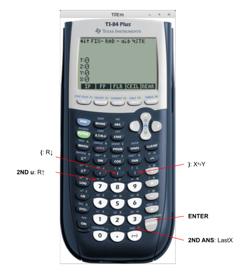
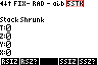
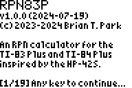
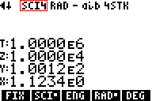
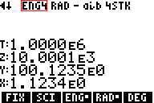
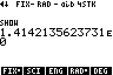

# RPN83P User Guide

RPN calculator app for the TI-83 Plus and TI-84 Plus inspired by the HP-42S.

**Version**: 1.0.0 (2024-07-19)

**Project Home**: https://github.com/bxparks/rpn83p

## Table of Contents

- [Introduction](#introduction)
- [Why?](#why)
    - [Short Answer](#short-answer)
    - [Long Answer](#long-answer)
- [Installation](#installation)
- [Basic Usage](#basic-usage)
    - [Screen Areas](#screen-areas)
    - [Input System](#input-system)
        - [Input Buttons](#input-buttons)
        - [Input Cursor](#input-cursor)
        - [Input Length Limits](#input-length-limits)
        - [DEL Key](#del-key)
        - [CLEAR Key](#clear-key)
        - [Decimal Point](#decimal-point)
        - [EE Key](#ee-key)
        - [Change Sign Key](#change-sign-key)
        - [Record Object Input](#record-object-input)
        - [Complex Number Input](#complex-number-input)
        - [Other Edge Cases](#other-edge-cases)
        - [Input Limitations](#input-limitations)
    - [RPN Stack](#rpn-stack)
        - [RPN Stack Structure](#rpn-stack-structure)
        - [RPN Stack Operations](#rpn-stack-operations)
        - [RPN Stack Size](#rpn-stack-size)
    - [Menu System](#menu-system)
        - [Menu Hierarchy](#menu-hierarchy)
        - [Menu Buttons](#menu-buttons)
        - [Menu Indicator Arrows](#menu-indicator-arrows)
        - [Menu Shortcuts](#menu-shortcuts)
        - [Menu Shortcut Jump Back](#menu-shortcut-jump-back)
    - [Built In Help](#built-in-help)
    - [Error Codes](#error-codes)
- [Functions](#functions)
- [Advanced Usage](#advanced-usage)
    - [Modes](#modes)
        - [Floating Point Display Modes](#floating-point-display-modes)
        - [Trigonometric Modes](#trigonometric-modes)
        - [Complex Result and Display Modes](#complex-result-and-display-modes)
        - [Register and Stack Sizes](#register-and-stack-sizes)
        - [Comma-EE Button Mode](#comma-ee-button-mode)
        - [Raw Versus String Format](#raw-versus-string-format)
        - [SHOW Mode](#show-mode)
    - [Storage Registers](#storage-registers)
        - [Storage Register Arithmetics](#storage-register-arithmetics)
        - [Storage Register Size](#storage-register-size)
    - [Storage Variables](#storage-variables)
- [Advanced Modules](#advanced-modules)
    - [NUM Functions](#num-functions)
    - [BASE Functions](#base-functions)
    - [STAT Functions](#stat-functions)
    - [TVM Functions](#tvm-functions)
    - [Complex Numbers](#complex-numbers)
    - [UNIT Functions](#unit-functions)
    - [DATE Functions](#date-functions)
- [TI-OS Interaction](#ti-os-interaction)
- [Troubleshooting](#troubleshooting)
    - [Clear Display](#clear-display)
    - [Reset MODE to Factory Defaults](#reset-mode-to-factory-defaults)
    - [Wipe to Factory State](#wipe-to-factory-state)
- [Future Enhancements](#future-enhancements)

## Introduction

RPN83P is an [RPN](https://en.wikipedia.org/wiki/Reverse_Polish_notation)
calculator app for the [TI-83 Plus
series](https://en.wikipedia.org/wiki/TI-83_series) and the [TI-84 Plus
series](https://en.wikipedia.org/wiki/TI-84_Plus_series) calculators. The app is
inspired mostly by the [HP-42S](https://en.wikipedia.org/wiki/HP-42S)
calculator, with some significant features from the
[HP-12C](https://en.wikipedia.org/wiki/HP-12C) and the
[HP-16C](https://en.wikipedia.org/wiki/HP-16C). RPN83P also hopes to be the
easiest and cheapest gateway app that introduces new users to the beauty and
power of RPN calculators.

RPN83P is a flash application written in Z80 assembly language that consumes 3
pages (48 kiB) of flash memory. Since it is stored in flash, it is preserved if
the RAM is cleared. It consumes about 1025 to 2535 bytes of TI-OS RAM through 4
AppVars, depending on the number of storage registers: `RPN83REG` (500 to 1925
bytes), `RPN83SAV` (140 byte), `RPN83STA` (272 bytes), and `RPN83STK` (120 to
196 bytes).

Summary of features:

- traditional RPN stack (`X`, `Y`, `Z`, `T`), with `LASTX` register
    - configurable stack levels between 4 and 8: `SSIZ`, `SSZ?`
- input edit line with scrollable cursor using arrow keys
    - `LEFT`, `RIGHT`, `2ND LEFT`, `2ND RIGHT`
- 8-line display showing 4 stack registers
- hierarchical menu system similar to HP-42S
- quick reference `HELP` menu
- auto-start capability using the Start-Up app
- storage registers and variables
    - store and recall:`STO nn`, `RCL nn`
    - storage arithmetics: `STO+ nn`, `STO- nn`, `STO* nn`, `STO/ nn`, `RCL+
      nn`, `RCL- nn`, `RCL* nn`, `RCL/ nn`
    - up to 100 numerical storage registers (`nn = 00..99`, default 25)
    - 27 single-letter variables (`nn = A..Z,Theta`)
    - configurable number of storage registers: `RSIZ`, `RSZ?`
- all math functions with dedicated buttons on the TI-83 Plus and TI-84 Plus
    - arithmetic: `/`, `*`, `-`, `+`
    - algebraic: `1/X`, `X^2`, `SQRT`, `^` (i.e. `Y^X`)
    - transcendental: `LOG`, `10^X`, `LN`, `E^X`
    - trigonometric: `SIN`, `COS`, `TAN`, `ASIN`, `ACOS`, `ATAN`
    - constants: `PI` and `E`
- additional menu functions
    - arithmetic: `%`, `%CH`, `GCD`, `LCM`, `PRIM` (prime factor), `IP` (integer
      part), `FP` (fractional part), `FLR` (floor), `CEIL` (ceiling), `NEAR`
      (nearest integer), `ABS`, `SIGN`, `MOD`, `MIN`, `MAX`
    - rounding: `RNDF`, `RNDN`, `RNDG`
    - algebraic: `X^3`, `3RootX`
    - transcendental: `XROOTY`,`2^X`, `LOG2`, `LOGB`, `E^X-` (e^x-1), `LN1+`
      (log(1+x))
    - trigonometric: `ATN2`
    - hyperbolic: `SINH`, `COSH`, `TANH`, `ASNH`, `ACSH`, `ATNH`
    - probability: `PERM`, `COMB`, `N!`, `RAND`, `SEED`
    - angle conversions: `>DEG`, `>RAD`, `>REC`, `>POL`, `>HR`, `>HMS`, `HMS+`,
      `HMS-`
- statistics and curve fitting, inspired by HP-42S
    - statistics: `Σ+`, `Σ-`, `SUM`, `MEAN`, `WMN` (weighted mean),
      `SDEV` (sample standard deviation), `SCOV` (sample covariance),
      `PDEV` (population standard deviation), `PCOV` (population covariance)
    - curve fitting: `Y>X`, `X>Y`, `SLOP` (slope), `YINT` (y intercept), `CORR`
      (correlation coefficient)
    - curve fit models: `LINF` (linear), `LOGF` (logarithmic), `EXPF`
      (exponential), `PWRF` (power)
- base conversion and bitwise operations, inspired by HP-16C and HP-42S
    - base conversions: `DEC`, `HEX`, `OCT`, `BIN`
    - logical operations: `AND`, `OR`, `XOR`, `NOT`, `NEG`
    - rotate and shift: `SL`, `SR`, `ASR`, `RL`, `RR`, `RLC`, `RRC`,
      `SLn`, `SRn`, `RLn`, `RRn`, `RLCn`, `RRCn`
    - bit operations: `CB`, `SB`, `B?`, `REVB` (reverse bits), `CNTB` (count
      bits)
    - arithmetic functions: `BAS+`, `BAS-`, `BAS*`, `BAS/`, `BDIV` (divide with
      remainder)
    - carry flag: `CCF`, `SCF`, `CF?`
    - word sizes: `WSIZ`, `WSZ?`: 8, 16, 24, 32 bits
- time value of money (TVM), inspired by HP-12C, HP-17B, and HP-30b
    - `N`, `I%YR`, `PV`, `PMT`, `FV`
    - `P/YR`, `C/YR`, `BEG`, `END`, `CLTV` (clear TVM)
- complex numbers, inspired by HP-42S and HP-35s
    - stored in RPN stack registers (`X`, `Y`, `Z`, `T`, `LASTX`) and storage
      registers `R00-R99`
    - result modes: `RRES` (real results), `CRES` (complex results)
    - display modes: `RECT`, `PRAD` (polar radians), `PDEG` (polar degrees)
    - linking/unlinking: `2ND LINK` (convert 2 reals to 1 complex, same as
      `COMPLEX` on HP-42S)
    - number entry: `2ND i` (rectangular), `2ND ANGLE` (polar degrees), `2ND
      ANGLE 2ND ANGLE` (polar radians)
    - extended regular functions: `+`, `-`, `*`, `/`, `1/X`, `X^2`, `SQRT`,
      `Y^X`, `X^3`, `3ROOTX`, `XROOTY`, `LOG`, `LN`, `10^X`, `E^X`, `2^X`,
      `LOG2`, `LOGB`
    - complex specific functions: `REAL`, `IMAG`, `CONJ`, `CABS`, `CANG`
    - unsupported: trigonometric and hyperbolic functions (not supported by
      TI-OS)
- unit conversions, inspired by HP-19BII and TI-85
    - 169 units across 12 unit types (LENG, AREA, VOL, TEMP, MASS, FORC, PRES,
      ENER, PWR, TIME, SPD, FUEL)
    - all units of the HP-19BII and TI-85 are supported
- date functions
    - date, time, datetime, timezone, and hardware clock
    - proleptic Gregorian calendar from year 0001 to 9999
    - add or subtract dates, times, datetimes
    - convert datetime to different timezones
    - convert between datetime and epochseconds
    - support alternate Epoch dates (Unix, NTP, GPS, TIOS, Y2K, custom)
    - set and retrieve datetime from the hardware clock (84+/84+SE only)
    - display time and date objects in RFC 3339 (ISO 8601) format
- various modes (`MODE`)
    - floating display: `FIX`, `SCI`, `ENG`
    - trigonometric: `RAD`, `DEG`
    - complex result modes: `RRES`, `CRES`
    - complex display modes: `RECT`, `PRAD`, `PDEG`
    - `SHOW` (`2ND ENTRY`): display all 14 internal digits

Missing features (partial list):

- vectors and matrices
- keystroke programming

## Why?

### Short Answer

The initial motivation for this project was for me to relearn Z80 assembly
language programming through the process of creating a useful RPN calculator in
the spirit of the HP-42S. Now that I have done more Z80 programming than I had
intended, I continue to work on this project to explore various programming
ideas, numerical algorithms, and mathematical concepts.

In addition, I have added another goal for RPN83P. I want RPN83P to be one of
the most affordable ways for new users to learn and use a full-featured
scientific RPN calculator. HP no longer makes scientific RPN calculators (except
perhaps the reissued HP-15C Collector's Edition which may be a limited release).
The prices for used HP calculators are unreasonably high. The only other
alternatives are the offerings from SwissMicros which are in the $150-$300
range. RPN83P offers access to a scientific RPN app on readily obtainable
TI-83+/84+ calculators in the $20-$50 range. I hope RPN83P can be the gateway
application that introduces a new generation of users to the usefulness of RPN
calculators.

### Long Answer

There are many facets to the "Why?" question. I will try to answer some of them.

**Why HP-42S?**

RPN83P is inspired by the HP-42S because it is the RPN calculator that I know
best. I used it extensively in grad school. After graduating, I sold the
calculator, which I regretted later. Some people consider the HP-42S close to
["peak of perfection for the classic HP
calcs"](https://www.hpmuseum.org/cgi-sys/cgiwrap/hpmuseum/archv017.cgi?read=118462) and I am probably in general agreement with that sentiment.

The HP-42S also has the advantage of having the
[Free42](https://thomasokken.com/free42/) app (Android, iOS, Windows, MacOS,
Linux) which faithfully reproduces every feature of the HP-42S. This is
essential because I don't own an actual HP-42S anymore to verify obscure edge
cases which may not be documented. Another advantage of the HP-42S is that a
hardware clone is currently in production by SwissMicros as the
[DM42](https://www.swissmicros.com/product/dm42). This increases the number of
users who may be familiar with the user interface and behavior of the HP-42S.

**Why Is RPN83P Different From HP-42S?**

The RPN83P app is not a clone of the HP-42S for several reasons:

- The keyboard layout and labels of the TI-83 and TI-84 calculators are
  different. As an obvious example, the TI calculators have 5 menu buttons below
  the LCD screen, but the HP-42S has 6 menu buttons.
- The LCD screen width allows each menu to contain only 4 letters instead of the
  5 supported by the HP-42S. I cannot even use the same menu names as the
  HP-42S.
- The RPN83P app does not implement its own floating point routines, but uses
  the ones provided by the underlying TI-OS. There are functions missing from
  the TI-OS compared to the HP-42S (e.g. trigonometric functions on complex
  numbers). The HP-42S supports exponents up to +/-499, but the TI-OS supports
  exponents only to +/-99.
- I have added additional features to RPN83P which were not originally included
  in the HP-42S (e.g. BASE operations from the HP-16C, and TVM functions from
  the HP-12C).
- The larger LCD screen of the TI-83+/84+ allows 4 registers of the RPN stack to
  be shown, instead of just the `X` and `Y` registers on the HP-42S. There is
  also enough room to show the hierarchical menu bar at all times.

**Why TI-83+/84+?**

The TI-83+ and 84+ series of calculators have been in production since 1999. I
believe the TI-84 Plus model is the last model still in production in 2024. They
are ubiquitous and extremely affordable on the used market ($20-$50 range on
ebay.com, sometimes cheaper when purchased locally). They are programmable in
Z80 assembly language and Texas Instruments published a [TI-83 Plus
SDK](https://archive.org/details/83psdk/83psysroutines/) which is still
available on [Internet Archive](https://archive.org).

The TI-83+/84+ calculators also have an active third party software development
community around them. People have written many essential tools and resources:
Z80 assemblers, ROM extraction tools, desktop emulators, file transfer and
linking tools, and additional online documentation containing information beyond
the official SDK documentation.

The TI-83+/84+ calculators also allow the installation of flash applications.
These are assembly language programs that live in flash memory instead of
volatile RAM. Flash applications survive crashes or power losses, and they can
be far larger than the ~8 kB limit imposed on assembly language programs that
live in RAM. RPN83P is currently about 48 kB and could not have been implemented
as a normal assembly language program.

**Why Not TI-84 Plus CE**

The TI-84 Plus CE model is the next generation of calculators after the TI-84
Plus series. It is based on the eZ80 processor instead of the Z80 processor used
by earlier models. The eZ80 processor is faster and supports larger memory sizes
through the use of a 24-bit address bus and internal registers instead of the
16-bit address bus and registers of the Z80.

Unfortunately in 2020, Texas Instruments decided to [disable assembly language
programming](https://www.cemetech.net/news/2020/5/950/_/ti-83-premium-ceti-84-plus-ce-asmc-removal-updates)
for the 84+CE model with the release of OS 5.3.1 That forced the community to
create a jailbreak for the 84+CE model named
[arTIfiCE](https://www.cemetech.net/news/2020/9/959/_/artifice-restores-ce-native-code-for-now)
in 2020. Furthermore, Texas Instruments does not provide the signing keys
necessary for third party developers to create flash applications which reside
in flash memory. That means that third party software are restricted to assembly
language programs that must live in volatile RAM. Texas Instruments clearly does
not want to support third party software development, and went out of its way to
add friction to the process.

An additional disadvantage of the 84+CE, for me personally, is that it uses a
rechargeable Li-Polymer battery instead of the standard AAA batteries used by
earlier models. These Li-Poly batteries have a finite lifetime, 3-5 years, and
there are many reports of defective batteries on brand new units. In the future,
these batteries will become difficult find, and may cost more than the
calculator itself is worth.

Considering all of the above, I felt that there are better uses of my time than
investing in the 84+CE platform.

**Why Not TI-89, 92+, Voyage 200?**

The TI-89, 89 Titanium, 92 Plus, and Voyage 200 series of calculators use the
Motorola 68000 microprocessor instead of the Z80 processor. Although they can be
programmed in assembly language, a C compiler (or two?) is available for these
calculators. But when I researched the state of third party development tools
for these calculators, I found that the development community was no longer
active.

I could not find a set of understandable documentation that would tell me how to
create a "hello world" application to get started on these calculators. In
contrast, the documentation for the 83+/84+ calculators were relatively easy to
find.

**Why Not Casio?**

Casio calculators are powerful and affordable. In some countries, particularly
in Europe, they are more popular than Texas Instruments calculators. A port of
RPN83P may be created in the future for models of Casio calculators which
support third-party applications.

**Why Not A Smartphone?**

There are already many RPN calculator apps available for smartphones. But using
a calculator on a smartphone has some drawbacks:

- the touchscreen of a phone does not give tactile feedback,
- the smartphone can impose some friction in usage, because we have to take the
  phone out from a pocket, unlock the phone, then find and fire up the
  calculator app,
- the battery life of a smartphone is relatively short compared to a calculator
  which is measured in weeks or months.

**Why Z80 Assembly Language?**

Normally a higher level language like C would be far more productive than Z80
assembly. However, C compilers for the Z80 processor are apparently quite
inefficient because the Z80 processor is not a good match for the language. It
does not have enough general purpose registers and its instruction set lacks
certain stack-relative addressing modes which are crucial to generating
efficient code using the C ABI.

In addition, the TI-83 Plus SDK is written in Z80 assembly language. All of the
TI-OS system calls assume that the calling code is written in assembly language.
Almost all third party documentation available on the internet is written in Z80
assembly language. Documentation for how to write a C program for the 83+/84+
calculators is almost non-existent (I think I came across a single forum post
about it.) Writing RPN83P in assembly seemed like the most reasonable choice.

**Why RPN?**

The first calculators that I used starting in middle school were algebraic
calculators. Once I got my first HP calculator (the HP-42S) in grad school,
there was no going back. RPN is the fastest and easiest way to do certain types
of calculation on a hand-held device.

There are currently almost no manufacturers of RPN calculators anymore.
Hewlett-Packard is no longer in the business of making calculators. It sold off
its calculator division to a company named Moravia in Europe. Moravia continues
to make the HP-12C, the HP Prime, and a few other generic calculators using its
HP license. Moravia reissued the HP-15C Collector's Edition a year ago, but that
may be only a limited run production.

The used market for old HP calculators can seem out of control. The HP-42S in
good working condition becomes more rare with each passing year, and now sells
for $200-$400 on eBay. The HP-35s model is even worse, going for $300-$600.

The SwissMicros company designs and sells a handful of RPN calculators based on
a number of classic HP calculators (e.g. HP-12C, HP-15C, HP-41C, HP-42S,
HP-32SII). They range from $150-$300 in price. The reviews of the SwissMicros
calculators are generally excellent and these are probably the best RPN
calculators that you can buy right now, if money is no object.

At the other end of the spectrum, there are no affordable, entry-level,
scientific RPN calculators made in the world today. This means that students on
limited budget are unlikely to be exposed to an RPN calculator. Without an
influx of new RPN users, RPN calculators will slowly disappear as the previous
generation of RPN users slowly drifts into old age.

RPN83P hopes to be the easiest and cheapest gateway into the world of RPN
calculators for the next generation of users.

**Why Not RPL?**

The easiest answer is that I do not know RPL. I have recently tried to learn RPL
using the (discontinued) HP-50g calculator, but I have not been successful so
far with my limited time. Even if I did learn RPL, I think it would be extremely
difficult to implement RPL on a TI-83+/84+ series using Z80 assembly language.
Assembly language is far less productive compared to a high level language like
C or C++. I also think that the number of potential users of RPL would be far
smaller than RPN, which makes me less motivated.

There are other projects trying to keep RPL alive:

- [newRPL](https://hpgcc3.org/projects/newrpl): reimplementation of HP 48/49/50
  series on the HP-50g (and related) hardware
- [DB48x](https://github.com/c3d/db48x): an RPL implementation on the
  SwissMicros DM42 and DM32 calculators

I don't think that it would be useful for me to duplicate those efforts.

**Why Are Some Features Included and Others Missing?**

Probably just a result of what features were interesting to me, what features
were easy to implement, and what features seemed too difficult or time consuming
to implement for now. See [FUTURE.md](FUTURE.md) for a list of features that
may be implemented in the future.

## Installation

See [USER_GUIDE_INSTALLATION.md](USER_GUIDE_INSTALLATION.md).

## Basic Usage

This guide assumes that you already know to use an RPN calculator. In
particular, the RPN83P implements the traditional RPN system used by
Hewlett-Packard calculators such as the HP-12C, HP-15C, and the HP-42S. (The
RPN83P does not use the newer RPN system used by the HP-48 series and other
similar HP calculators.)

It is beyond the scope of this document to explain how to use an RPN calculator.
One way to learn is to download the [Free42](https://thomasokken.com/free42/)
emulator for the HP-42S (available for Android, iOS, Windows, MacOS, and Linux)
and then download the [HP-42S Owner's
Manual](https://literature.hpcalc.org/items/929).

### Screen Areas

Here are the various UI elements on the LCD screen used by the RPN83P app:

The LCD screen is 96 pixels (width) by 64 pixels (height). That is large enough
to display 8 rows of numbers and letters. They are divided into the following:

- 1: status line
- 2: (currently unused)
- 3: error code line
- 4: T register line
- 5: Z register line
- 6: Y register line
- 7: X register/input line
- 8: menu line

The X register line is also used as the input line when entering new numbers. It
is also used to prompt for command line argument, for example `FIX _ _` to set
the fixed display mode.

### Input System

The input system of RPN83P initially behaved like the HP-42S, using an
underscore cursor that always remained at the end of the input string. With the
implementation of the scrollable cursor using the LEFT and RIGHT arrow keys, it
is actually closer to the HP-48/49/50 series now. However, it should be
emphasized that only the input system is similar to the 48/49/50. The
computation system of RPN83P is still RPN, not RPL.

The input system is intended to be mostly self-explanatory and predictable.
Hopefully most users will not need to read much of this section, except to
consult about some edge cases.

#### Input Buttons

The following buttons are used to enter and edit a number in the input buffer:

- digit entry
    - `0`-`9`: inserts the digit
    - `.`: inserts decimal point
    - `2ND EE`: adds an `E` to mark the exponent of scientific notation
        - usually labeled as `E` or `EEX` on HP calculators
- number mutation
    - `(-)`: toggles the sign of the current number component
        - usually labeled as `+/-` or `CHS` on HP calculators
- deleting digits
    - `DEL`: deletes the char to the left of cursor
        - usually labeled as `<-` on most HP calculators
    - `CLEAR`: clear the input buffer
    - `CLEAR CLEAR CLEAR`: clear the stack, same as `CLST`
- record types
    - `{`: inserts the starting delimiter for record types
    - `}`: inserts the terminating delimiter for record types
    - `,`: inserts the component separator for record types
    - see [USER_GUIDE_DATE.md](USER_GUIDE_DATE.md) for more info
- complex numbers
    - `2ND LINK`: converts `X` and `Y` into a complex number in `X`, or the
      reverse
        - labeled `COMPLEX` on the HP-42S
    - `2ND i`:
        - inserts an `i` character to form a complex number in rectangular form,
          or
        - converts an existing complex delimiter to an `i`
    - `2ND ANGLE`:
        - inserts `∠°` (angle degree) to form a complex number in polar degree
          form, or
        - converts an existing complex delimiter to an `∠°`
    - `2ND ANGLE` `2ND ANGLE`:
        - inserts `∠` (angle) to form a complex number in polar radian form, or
        - converts an existing complex delimiter to an `∠`
    - see [USER_GUIDE_COMPLEX.md](USER_GUIDE_COMPLEX.md) for more info

#### Input Cursor

The cursor of RPN83P is a blinking block character. This is different from the
HP-42S which uses an underscore character. The block character was selected
because this style is supported natively by the underlying TI-OS, and because it
is visually distinctive from the small dashes contained in the menu folder icon.

The `LEFT` and `RIGHT` arrow keys will move the cursor over the input buffer.
This is similar to the HP-48/49/50 series of calculators.

| **Keys**              | **Display**|
| --------------------- | ---------- |
| `1.234`               |  |
| `LEFT`                |  |
| `LEFT`                |  |
| `RIGHT`               |  |

When the number of digits exceeds the display limit, the left-most or right-most
character is replaced with an ellipsis character (three dots) to indicate that
additional digits have been cropped.

The `2ND LEFT` and `2ND RIGHT` arrow keys will move the cursor to the beginning
or end of the input buffer respectively, allowing rapid movement of the cursor
over a long sequence of input characters.

| **Keys**              | **Display**|
| --------------------- | ---------- |
| `1.2345678901234E-12` |  |
| `2ND LEFT`            |  |
| `RIGHT` (10 times)    |  |
| `2ND RIGHT`           |  |

#### Input Length Limits

In normal mode, the input system is configured to accept up to 20 digits because
a TI-OS floating point number in scientific notation requires 20 digits to enter
in full precision (14 significant digits plus 6 digits of notation overhead).

In `BASE` mode, the digit limit is a variable that depends on the `WSIZ` and the
base number (`DEC`, `HEX`, `OCT`, `BIN`). In the worst case, the input system
will allow as many as 32 digits for a `BIN` binary number with `WSIZ` of 32.

When the input system detects a complex number through the presence of a `2ND i`
or `2ND ANGLE` delimiter, the maximum number of characters is increased to 41 to
allow 2 floating point numbers to be entered with full precision along with its
delimiter.

#### DEL Key

The `DEL` key acts like the *backspace* key on HP calculators (usually marked
with a `LEFTARROW` symbol). This is different from the TI-OS where the `DEL` key
removes the character directly under the cursor. On RPN83P, the input system is
always in *insert* mode, in contrast to the TI-OS where the input system is in
*overwrite* mode by default.

If the `X` line is *not* in edit mode (i.e. the cursor is not shown), then the
`DEL` key acts like the `CLEAR` key (see below).

#### CLEAR Key

The `CLEAR` key performs slightly different functions depending on the context:

- If the input has been terminated (i.e. not in edit mode), `CLEAR` clears the
  `X` register, similar to the `CLX` (Clear X Register) menu function.
- If the input is in edit mode, then:
    - If the cursor is at the end of the input line, `CLEAR` erases the entire
      line.
    - If the cursor is at the beginning of the input line, `CLEAR` also erases
      the entire line.
    - If the cursor is in the middle of the input line, then `CLEAR` erases
      *only* to the end of the line.
    - If the input line is already empty when `CLEAR` is pressed, then it
      interprets that as a `CLST` (Clear Stack) operation, and warns the user
      with a message.
    - If the `CLEAR` is pressed again after the warning, then the `CLST`
      operation is performed, clearing the RPN stack.

The `CLEAR` button erases only to the end of line if the cursor is in the middle
of the input buffer, which is convenient when the input line becomes lengthy. I
borrowed this behavior from the `CLEAR` button on the TI-89, TI-89 Titanium,
TI-92+, and TI Voyage 200 calculators. (The `2ND CLEAR` on the HP-50g works in a
similar way, but only in Algebraic mode, not in RPN mode.)

I hope the following example illustrates the different behaviors of `CLEAR`
clearly:

| **Keys**                              | **Display**   |
| ---------------------                 | ----------    |
| `1` `ENTER` `2` `ENTER` `3` `ENTER`   |  |
| `CLEAR` (invokes `CLX`)               |  |
| `4.5678`                              |  |
| `CLEAR` (clears entire line)          |  |
| `4.5678` `LEFT` `LEFT` `LEFT`         |  |
| `CLEAR` (clears to end of line)       |  |
| `CLEAR` (clears entire line)          |  |
| `CLEAR` (requests `CLST`)             |  |
| `CLEAR` (invokes `CLST`)              |  |

In most cases, pressing `CLEAR` 3 times will invoke the `CLST` function.
This is often far more convenient than navigating to the `CLST` menu function
nested under the `ROOT > CLR` menu folder. (Another alternative could have been
`2ND CLEAR` but the TI-OS does not support that keystroke because it returns the
same key code as `CLEAR`.)

An empty string will be interpreted as a `0` if the `ENTER` key or a function
key is pressed.

#### Decimal Point

The decimal point `.` button inserts a decimal point at the cursor location. But
the system tries to be a bit smart about it using the following rules:

- no decimal point is inserted into the mantissa if one has already been entered
  to the left of the cursor
- no decimal point is inserted in the exponent after the `E` character
- no decimal point is inserted inside a Record object defined by curly braces
  `{` and `}`

#### EE Key

The `E` symbol for scientific notation numbers must be entered using the `2ND
EE` key, because the comma `,` key is used for other purposes. However, it is
possible to flip the behavior of the comma and the `2ND EE` buttons using a
`MODE` setting. See [Comma-EE Button Mode](#comma-ee-button-mode) below.

If the `2ND EE` button is pressed in the middle of a string, it will simply
insert an `E` symbol. Similar to the decimal point, the system tries to be a
little bit smart about the insertion:

- no `E` is inserted if one has already been entered to the left of the cursor.
- no `E` is inserted inside a Record object defined by curly braces `{` and `}`

The behavior of the `EE` button on RPN83P is simpler and different from the
HP-48/49/50 series whose behavior I have not figured out.

#### Change Sign Key

Unlike most of the other input-related buttons, the `(-)` CHS button does not
simply insert a negative sign `-` into the string. The behavior of the `(-)`is
fairly complex: it inverts the sign of the number identified by the cursor by
inserting or removing the negative `-` character at the appropriate position of
the number.

- if the RPN stack is *not* in edit mode, `(-)` toggles the sign of the value in
  the `X` register
- in input mode, the `(-)` inverts the sign of the number component currently
  identified by the cursor:
    - if on the mantissa, it inverts the sign of the mantissa
    - if on the exponent, it inverts the sign of the exponent
    - it performs the same actions on the second part of a complex number
    - if on a component of a Record object, it inverts the sign of the component
- if the cursor position contains no number, then a negative sign is inserted

#### Record Object Input

The left-brace `{`, the right-brace `}`, and the comma `,` buttons are used for
record types. They generally act to simply insert their respective characters
into the input buffer, but a handful of reasonable rules have been implemented:

- a comma cannot be added directly after another
- a right-brace cannot be entered directly after another
- a left-brace cannot be entered directly after another
- a left-brace `{` must exist first, before a right-brace `}` can be inserted

See [USER_GUIDE_DATE.md](USER_GUIDE_DATE.md) for more details.

For illustrative purposes, here is a Record type with the cursor in the middle
of the record:

| **Keys**              | **Display**|
| --------------------- | ---------- |
| `DT{2024,5,21,`       |  |
| `LEFT` `LEFT` `LEFT`  |  |

#### Complex Number Input

The `2ND i`, `2ND ANGLE`, and `2ND LINK` buttons are used for entering complex
numbers. They are explained in more detail in
[USER_GUIDE_COMPLEX.md](USER_GUIDE_COMPLEX.md). The complex delimiter keys, `2ND
i` and`2ND ANGLE`, try to be slightly smart about their behavior as well:

- `2ND i`
    - inserts an `i` delimiter if no complex delimiter already exists
    - converts any existing complex delimiter into an `i`
- `2ND ANGLE`
    - inserts a `∠°` (angle degree) delimiter if no complex delimiter already
      exists
    - converts an existing `i` delimiter into an `∠°` (angle degree) delimiter
    - converts an existing `∠°` (angle degree) delimiter into just an `∠`
      (angle) delimiter (i.e. toggles)
    - converts an existing `∠` (angle) delimiter into an `∠°` (angle degree)
      delimiter (i.e. toggles)

Here is an example of how the delimiters override or toggle each other:

| **Keys**              | **Display**|
| --------------------- | ---------- |
| `1.23E2`              |  |
| `2ND i`               |  |
| `98.7` `(-)`          |  |
| `2ND ANGLE`           |  |
| `2ND ANGLE`           |  |
| `2ND i`               |  |

#### Other Edge Cases

The input system of the HP-42S has idiosyncrasies which are sometimes
surprisingly complex and subtle. Some were faithfully emulated on RPN83P, but
others were not.

- On the HP-42S, when the input buffer becomes empty (e.g. after pressing the
  `<-` backspace button multiple times, or pressing the `CLEAR > CLX` menu), the
  cursor disappears and the `X` register shows something like `0.0000`. But
  internally, the HP-42S is in a slightly different state than normal: the Stack
  Lift is disabled, and entering another number will replace the `0.0000` in the
  `X` register instead of lifting it up to the `Y` register.
    - In RPN83P, when the `DEL` key or the `CLEAR` key is pressed, the `X`
      register always enters into Edit mode with an empty input buffer, and the
      cursor will *always* be shown with an empty string.
    - The presence of the cursor indicates that the Edit Mode is in effect and
      that the Stack Lift is disabled.
- Functions which take no arguments and return one or more values were tricky to
  implement correctly. The canonical example of these functions is the `2ND PI`
  key. RPN83P implements these functions in the same way as the HP-42S:
    - If Stack Lift is disabled (e.g. after an `ENTER`), then `2ND PI`
      *replaces* the previous value in the `X` stack register.
    - If the input system is in edit mode (displaying the blinking cursor),
      *and* the input buffer is completely empty, then `2ND PI` *replaces* the
      empty string.
    - But if the input system is in edit mode and the input buffer is *not*
      empty, then `2ND PI` causes the current input buffer to be terminated,
      pushing the input buffer value into the `Y` register, and the `PI` value
      is pushed into the `X` register.
    - This is the one case where an empty string in the input buffer is not the
      same as a `0`.
- On the HP-42S, the `ON/EXIT` button always terminates the input and places the
  input value into the `X` register. This seems to be a side-effect of the
  `ON/EXIT` causing the exit of the current menu bar.
    - On RPN83P, I decided that menu navigation should *not* cause input
      termination whenever possible. This allows the user to start entering a
      number, then navigate to a different menu folder, then continue entering
      the number.
    - Since the `ON/EXIT` button is used to navigate the menu hierarchy, it
      cannot cause input termination, unlike the HP-42S.
    - The only exceptions are menus which change the rendering of the values on
      the RPN stack, for example:
        - `BASE` menu folder, which interprets the values on the RPN stack as
          integers not floating point numbers
        - `FIX`, `SCI`, `ENG`, which render floating point numbers with
          different number of significant digits
        - `RECT`, `PRAD`, `PDEG`, which render complex numbers in different
          formats

#### Input Limitations

There are many ways that the RPN83P input system could be improved. Many of them
arise from a design decision that I made to save some time and effort: the
cursor only looks at its *past* (the characters to the left of the cursor) not
its future (the characters to the right of the cursor). For example, when the
decimal point `.` button is pressed, the input system does not allow a second
decimal point to be insert into a single number component because that would
result in an invalid syntax for the number. However, if the LEFT arrow key is
used to move the cursor to the left of the first decimal point, then the input
system will allow a second (and invalid) decimal point to be inserted into the
number.

It may be possible for update the input system to look to the right of the
cursor when applying various rules about valid versus invalid characters. But
without actually implementing the code, it is hard to estimate how much time and
effort it would take to make those improvements.

### RPN Stack

#### RPN Stack Structure

RPN83P tries to implement the traditional 4-level RPN stack used by many HP
calculators as closely as possible, including some features which some people
may find idiosyncratic. In addition, RPN83P supports larger RPN stack sizes
through the `SSIZ` command. The minimum stack size is 4, but it can be increased
to be as large as 8.

The bottom 4 slots in the RPN stack are named `X`, `Y`, `Z`, and `T` following
the convention used by modern HP RPN calculators. As the stack size increases
towards 8, additional stack registers become available: `A`, `B`, `C`, and `D`.

The LCD screen on the TI calculators is big enough that the bottom 4 registers
(`X`, `Y`, `Z`, `T`) can be shown at all times. (For comparison, the HP-12C and
HP-15C have only a single line display. The HP-42S has a 2-line display, with
the bottom line often commandeered by the menu line so that only the `X`
register is shown.)

#### RPN Stack Operations

These are the buttons which manipulate the RPN stack:

- `(`: rolls RPN stack down (known as `R(downarrow)` on HP calculators)
- `)`: exchanges `X` and `Y` registers
- `2ND u`: rolls RPN stack up (known as `R(uparrow)` on HP calculators)
- `ENTER`: saves the input buffer to the `X` register
- `2ND` `ANS`: recalls the last `X`

This mapping of the `(` and `)` to these stack functions is identical to mapping
used by other HP calculators that support both Algebraic and RPN modes (e.g. the
[HP-17BII and 17bII+](https://en.wikipedia.org/wiki/HP-17B) and the
[HP-30b](https://en.wikipedia.org/wiki/HP_30b)).

When a new number is entered (using the `0`-`9` digit keys), the press of the
first digit causes the stack to **lift**, and the calculator enters into the
**edit** mode. This mode is indicated by the appearance of the blinking block
cursor.

A stack **lift** causes the previous `X` value to shift into the `Y` register,
the previous `Y` value into the `Z` register, and the previous `Z` value into
the `T` register. The previous `T` value is lost.

The `ENTER` key performs the following actions:

- if the `X` register was in edit mode, the input buffer is closed and the
  number is placed into the `X` register,
- the `X` register is then duplicated into the `Y` register,
- the stack lift is *disabled* for the next number.

This is consistent with the traditional RPN system used by HP calculators up to
and including the HP-42S. It allows the user to press: `2` `ENTER` `3` `*` to
multiply `2*3` and get `6` as the result, because the second number `3` does not
lift the stack.

The parenthesis `(` and `)` buttons are not used in an RPN entry system, so they
have been repurposed for stack manipulation:

- `(` key rolls the stack *down*, exactly as the same as the `R(downarrow)` or
  just a single `(downarrow)` on the HP calculators.
- `)` key performs an exchange of the `X` and `Y` registers. That functionality
  is usually marked as `X<>Y` on HP calculators.

The `2ND u` is bound to the `R(up)` command. You can think of the `u` as a
mnemonic for "up". This command is marginally useful when the RPN stack size is
only 4, but becomes more important when the RPN stack size is increased beyond
4.

The `2ND` `ANS` functionality of the TI-OS algebraic mode is unnecessary in the
RPN system because the `X` register is always the most recent result that would
have been stored in `2ND` `ANS`. Therefore, the `2ND` `ANS` has been repurposed
to be the `LASTX` functionality of HP calculators. The `LASTX` is the value of
the `X` register just before the most recent operation. It can be used to bring
back a number that was accidentally consumed, or it can be used as part of a
longer sequence of calculations.

#### RPN Stack Size

The default size of the RPN stack is 4 for compatibility with traditional HP RPN
calculators. However, RPN83P allows the RPN stack size to be changed between 4
and 8, using the `SSIZ` command under the `MODE` menu (which can be quickly
accessed through the `MODE` button):

- 
    - 

The current stack size can be recalled using the `SSZ?` command. It is also
shown in the top status line using the annunciators `4STK`, `5STK`, `6STK`,
`7STK`, and `8STK`.

Here is an example where we start with a stack size of 4, increase it to 8, then
decrease it to 5:

| **Keys**              | **Display** |
| ----------------      | --------------------- |
| `MODE` `DOWN` `DOWN`  |  |
| `SSIZ` `4`            |  |
| `SSIZ` `8`            |  |
| `SSIZ` `5`            |  |
| `SSZ?`                |  |

### Menu System

#### Menu Hierarchy

The menu system of the RPN83P was directly inspired by the HP-42S calculator.
There are over 250 functions supported by the RPN83P menu system, so it is
convenient to arrange them into a nested folder structure. There are 5 buttons
directly under the LCD screen so it makes sense to present the menu items as
sets of 5 items corresponding to those buttons.

The menu system forms a singly-rooted tree of menu items and groups, which look
like this conceptually:

There are 4 components:

- `MenuGroup`: a folder of 1 or more `MenuRows` (e.g. `NUM`)
- `MenuRow`: a list of exactly 5 `MenuNodes` corresponding to the 5 menu
  buttons below the LCD
- `MenuNode`: one slot in the `MenuRow`, can be *either* a `MenuGroup` or a
  `MenuItem`
- `MenuItem`: a leaf-node that maps directly to a function (e.g. `GCD`) when
  the corresponding menu button is pressed

#### Menu Buttons

The LCD screen always shows a `MenuRow` of 5 `MenuItems`. Here are the buttons
which are used to navigate the menu hierarchy:

- `F1`- `F5`: invokes the function shown by the respective menu
- `UP_ARROW`: goes to previous `MenuRow` of 5 `MenuItems`, within the current
  `MenuGroup`
- `DOWN_ARROW`: goes to next `MenuRow` of 5 `MenuItems`, within the current
  `MenuGroup`
- `ON`: goes back to the parent `MenuGroup` (similar to the `ON/EXIT` button on
  the HP-42S)
- `MATH`: goes directly to the root `MenuGroup` no matter where you are in the
  menu hierarchy

The appropriate key for the "menu back to parent" function would have been an
`ESC` button. But the TI-83 and TI-84 calculators do not have an `ESC` button
(unlike the TI-89, TI-92, and TI Voyager 200 series calculators), so the `ON`
button was recruited for this functionality. This seemed to make sense because
the HP-42S
uses the `ON` key which doubles as the `EXIT` or `ESC` key to perform this
function.

The `HOME` button is useful to go directly to the top of the menu hierarchy from
anywhere in the menu hierarchy. The TI-83 and TI-84 calculators do not have a
`HOME` button (unlike the TI-89, TI-92, and TI Voyager 200 series again), so the
`MATH` button was taken over to act as the `HOME` key. This choice was not
completely random:

1. The `HOME` button on the [TI-89 series
calculator](https://en.wikipedia.org/wiki/TI-89_series) is located exactly where
the `MATH` is.
2. The RPN83P app does not need the `MATH` button as implemented by the TI-OS,
which opens a dialog box of mathematical functions. In the RPN83P app, that
functionality is already provided by the menu system.
3. When the menu system is at the root, the first menu item on the left is a
menu group named `MATH`, which may help to remember this button mapping.

**HP-42S Compatibility Note**: As far I can tell, the menu system of the HP-42S
is *multiplely rooted* and pressing a given menu button (e.g. `BASE`) activates
the menu hierarchy of that particular button. I think this works because the
menu bar on the HP-42S is not displayed by default, so there is no single ROOT
node of its menu system. Some of the HP-42S menu bars can stack on top of each
other, so that the `EXIT` button goes back to the previous menu bar. But some
menu bars do not. I have never figured out the rhyme and reason for this
behavior. The RPN83P app, on the other hand, always displays its menu bar, so it
was simpler for the user (and the programmer of this app) to create a *singly
rooted* menu hierarchy with the menu bar always starting from the implicit
`ROOT` menu node.

#### Menu Indicator Arrows

There are 3 menu arrows at the top-left corner of the LCD screen:

- `leftarrow` indicates additional menus in the parent folder,
- `downarrow` indicates additional menu rows below the current row,
- `uparrow` indicates additional menu rows above the current row.

The `DOWN` and `UP` arrows move from one menu row to another, like this:

| **Keys**          | **Display**|
| ----------------- | ---------- |
| `HOME`            |  |
| `DOWN`            |  |
| `DOWN`            |  |
| `UP` `UP`         |  |

Instead of pressing `UP` twice, you can press `DOWN` from the last menu row to
wrap around to the first menu row.

The soft menu keys `F1-F5` are used to enter a menu folder, In the example
below, it goes into the `NUM` menu folder. Since the `leftarrow` indicator is
shown, the `ON/EXIT` key can be used to go back to the parent folder:

| **Keys**          | **Display**|
| ----------------- | ---------- |
| `HOME`            |  |
| `F2/WINDOW`       |  |
| `DOWN`            |  |
| `DOWN` `DOWN`     |  |
| `ON/EXIT`         |  |

#### Menu Shortcuts

Some menu groups can be accessed quickly through dedicated keys on the TI
calculator which happen to have the same label as the menu item:

- `MODE`: bound to `ROOT > MODE`
- `STAT`: bound to `ROOT > STAT`
- `MATH`: repurposed to be `HOME` (aka `ROOT`)

The `MATH` button is slightly different. It is not bound to `ROOT > MATH`.
Rather it has been repurposed to be the `HOME` button which goes to the top of
the menu hierarchy `ROOT`.

#### Menu Shortcut Jump Back

Normally when the `ON/EXIT/ESC` button is pressed, the menu bar goes up to the
parent of the current MenuGroup. That makes sense because the user normally must
travel through the parent to reach the child MenuGroup. But the keyboard
shortcuts break this rule.

When the `MODE` button is pressed, the menu bar goes directly to the `ROOT >
MODE` MenuGroup from anywhere in the menu hierarchy. Since the `MODE` functions
involve quick changes to the floating point display or the trigonometric angle
units, it seems likely that the user would want to go back to the original menu
bar after making the `MODE` changes. Therefore, the `ON/EXIT/ESC` button has
been programmed to jump back to the *previous* menu bar if the `ROOT > MODE`
menu was invoked through the `MODE` button.

The `STAT` shortcut, however, does *not* implement the jump back feature.
Instead, the `ON/EXIT/ESC` acts normally and the menu goes up to the parent of
the `STAT` MenuGroup to the `ROOT` of the menu system. This behavior was chosen
because it seemed more likely that the user would spend a significant amount of
time inside the `STAT` menu functions. The more time spent inside the `STAT`
menu, the less likely it seemed the user would remember where the original menu
bar was, and unlikely to want to go back there using the `ON/EXIT/ESC` key.

## Built In Help

Pressing the `HELP` menu button at the root menu activates the Help pages:

The contents of these pages are updated frequently so the screenshots below may
not be identical to the current version:

The Help pages are intended to capture some of the more obscure tidbits about
the RPN83P app which may be hard to remember. Hopefully it reduces the number of
times that this User Guide needs to be consulted.

The message at the bottom of each page is not completely honest. A few
navigational keys are recognized by the Help system:

- `UP`, `LEFT`: previous page with wraparound
- `DOWN`, `RIGHT`: next page with wraparound
- `DEL`, `MATH`, `CLEAR`, `ON`: exit Help
- any other button: next page *without* wraparound, exiting on the last page

## Error Codes

The RPN83P supports all error messages from the underlying TI-OS which are
listed in the TI-83 SDK. The SDK unfortunately does not describe how these
errors are actually triggered. By trial-and-error, I could reverse engineer only
a few of them as described below:

- `Err: Archived`: storage variable (A-Z,Theta) is archived
- `Err: Argument`: incorrect number of arguments
- `Err: Bad Guess`
- `Err: Break`
- `Err: Domain`: invalid argument or argument outside range
- `Err: Data Type`: invalid argument type (e.g. complex number)
- `Err: Invalid Dim`: list index larger than list size
- `Err: Dim Mismatch`
- `Err: Divide By 0`: divide by 0
- `Err: Increment`
- `Err: Invalid`
- `Err: Iterations`
- `Err: In Xmit`
- `Err: Memory`
- `Err: Non Real` (I could never reproduce this, the TI-OS seems to use `Err:
  Domain` or `Err: Data Type` instead)
- `Err: Overflow`: result exceeds `9.99999999E99`
- `Err: No Sign Change`
- `Err: Singularity`
- `Err: Stat`
- `Err: StatPlot`
- `Err: Syntax`: incorrect math expression syntax
- `Err: Tol Not Met`
- `Err: Undefined`: variable not found

These are shown in the Error Code line on the screen. For example, if we try to
divide `1 / 0`, a division by 0 error is shown:

If a TI-OS function returns an internal error code outside of the ones
documented in the SDK, RPN83P will print an error message in the form of `Err:
UNKNOWN (##)` like this:

The number in parenthesis is the internal numerical value of the error code. If
the error is reproducible, please file a [bug
report](https://github.com/bxparks/rpn83p/issues) containing the numerical error
code and the steps needed to reproduce it so that I can add it to the list of
error messages supported by RPN83P.

## Functions

The direct and menu functions supported by RPN83P are listed for reference in
[USER_GUIDE_FUNCTIONS.md](USER_GUIDE_FUNCTIONS.md).

## Advanced Usage

### Modes

The `MODE` menu folder contains a number of menu items which control the
operating modes or the display modes of the calculator.

- 
    - 
    - 
    - 
    - 

The quickest way to reach this menu folder is to use the `MODE` button on the
keypad, instead of navigating the menu hierarchy. Using the `MODE` button allows
the [Menu Shortcut Jump Back](#menu-shortcut-jump-back) feature to work, so that
pressing `ON/EXIT` takes you right back to the menu before the `MODE` button was
pressed.

#### Floating Point Display Modes

The RPN83P app provides access to the same floating point display modes as the
original TI-OS. For reference, here are the options available in the TI-OS when
the `MODE` button is pressed:

In RPN83P, the `MODE` button presents a menu bar instead:

**HP-42S Compatibility Note**: The HP-42S uses the `DISP` button to access this
functionality. For the RPN83P, it seemed to make more sense to the follow the
TI-OS convention which places the floating display modes under the `MODE`
button.

The `NORMAL` mode in TI-OS is named `FIX` in RPN83P following the lead of the
HP-42S. It is also short enough to fit into the menu label nicely, and has the
same number of letters as the `SCI` and `ENG` modes which helps with the
top-line indicator.

Suppose the RPN stack has the following numbers:

Let's see how these numbers are displayed in the various floating point modes.

**FIX Mode**

Here are the numbers rendered in `FIX` mode:

| **Keys**              | **Display** |
| ----------------      | --------------------- |
| `MODE` `FIX` `4`      |  |
| `ENTER`               |  |
| `FIX` `99`            |  |

Setting `FIX 99` goes back to the default floating number of fractional digits
(i.e. the equivalent of `FLOAT` option in the TI-OS `MODE` menu). Any number
greater than `9` would work (e.g. `11`) but I usually use `99`.

**SCI Mode**

Here are the numbers rendered in `SCI` mode:

| **Keys**              | **Display** |
| ----------------      | --------------------- |
| `MODE` `SCI` `4`      |  |
| `ENTER`               |  |
| `SCI` `99`            |  |

Setting `99` as the number of digits in `SCI` mode makes the number of digits
after the decimal point to be dynamic (i.e. the equivalent of `FLOAT` option in
the TI-OS `MODE` menu), but retains the `SCI` notation.

**ENG Mode**

Here are the numbers rendered in `ENG` mode:

| **Keys**              | **Display** |
| ----------------      | --------------------- |
| `MODE` `ENG` `4`      |  |
| `ENTER`               |  |
| `ENG` `99`            |  |

Setting `99` as the number of digits in `ENG` mode makes the number of digits
after the decimal point to be dynamic (i.e. the equivalent of `FLOAT` option in
the TI-OS `MODE` menu), but retains the `ENG` notation.

**HP-42S Compatibility Note**: The RPN83P uses the underlying TI-OS floating
point display modes, so it cannot emulate the HP-42S exactly. In particular, the
`ALL` display mode of the HP-42S is not directly available, but it is basically
equivalent to `FIX 99` on the RPN83P.

#### Trigonometric Modes

Just like the TI-OS, the RPN83P supports two angle modes, `RAD` (radians) and
`DEG` (degrees), when calculating trigonometric functions. These are selected
using the options under the `MODE` menu folder, and the current trig mode is
shown on the top status line.

| **Keys**              | **Display** |
| ----------------      | --------------------- |
| `MODE` `RAD`          |  |
| `PI` `6` `/` `SIN`    |  |
| `MODE` `DEG`          |  |
| `30` `SIN`            |  |

**Warning**: The polar to rectangular conversion functions (`>REC` and `>POL`)
are also affected by the current Trig Mode setting.

**HP-42S Compatibility Note**: The RPN83P does not offer the
[gradian](https://en.wikipedia.org/wiki/Gradian) mode `GRAD` because the
underlying TI-OS does not support the gradian mode directly. It is probably
possible to add this feature by intercepting the trig functions and performing
some pre and post unit conversions. But I'm not sure if it's worth the effort
since gradian trig mode is not commonly used.

#### Complex Result and Display Modes

The `RRES` and `CRES` menu items control how complex numbers are calculated. The
`RECT`, `PRAD`, and `PDEG` modes control how complex numbers are displayed. All
of these are explained in the [USER_GUIDE_COMPLEX.md](USER_GUIDE_COMPLEX.md)
document.

#### Register and Stack Sizes

The `RSIZ` and `RSZ?` menu items control the storage register size. Those are
explained below in [Storage Register Size](#storage-register-size).

The `SSIZ` and `SSZ?` menu items control the RPN stack size. Those were
explained above in [RPN Stack Size](#rpn-stack-size).

#### Comma-EE Button Mode

The `,EE` and `EE,` selectors under `ROOT > MODE` configure the behavior of the
`Comma-EE` button:

-  (`ROOT > MODE`)
    - 
    - `,EE`: the `Comma-EE` button behaves as labeled on the keyboard (factory
      default)
    - `EE,`: the `Comma-EE` button is inverted

Prior to v0.10, the `Comma-EE` button invoked the `EE` function for *both* comma
`,` and `2ND EE`. This allowed scientific notation numbers to be entered easily,
without having to press the `2ND` button.

However, in v0.10 when record objects were added to support DATE functions (see
[USER_GUIDE_DATE.md](USER_GUIDE_DATE.md)), the comma symbol was selected to be
the separator between the components of those objects. But that meant that
entering numbers in scientific notation would require the `2ND` key again. For
users who rarely or never use the DATE functions, the `EE,` option can be used
to invert key bindings of the `Comma-EE` button to allow easier entry of
scientific notation.

#### Raw Versus String Format

The `{..}` (raw) and `".."` (string) modes control how Record objects (e.g.
Date, Time, DateTime) are displayed. These are explained in the
[USER_GUIDE_DATE.md](USER_GUIDE_DATE.md) document.

#### SHOW Mode

Many HP RPN calculators have a display mode that shows all significant digits
that are stored internally. On the HP-42S and HP-16C, the button that activates
this is labeled `SHOW`. On the HP-12C and HP-15C, the button is labeled
`Prefix`.

The RPN83P app uses the `2ND` `ENTRY` key sequence (just above the `ENTER`
button). This key was selected because `ENTRY` is unused in our RPN system, and
because it is located close to the `ENTER` key.

The SHOW mode reverts back to the normal display mode in the following ways:

- `OFF` and `QUIT`: Exit the app. Upon restart, the app goes back to normal
  display mode.
- `DEL`, `CLEAR`, `ENTER`, `ON/EXIT`: Exit SHOW mode to normal mode, but do not
  process the key in normal mode.
- Any other key: Exit SHOW mode, then continue processing the key in normal
  mode.

Prior to v1.1, any key press in SHOW mode was used to exit to normal mode, and
eaten. A second press of the same key was required in normal mode to process it.
This was found to be too cumbersome. It was more intuitive allow a new number to
be entered directly from SHOW mode, without having to press the digit key twice.
If a digit key is entered (0-9), then we go into edit mode and the digit goes
into the input buffer. If a function key is pressed, the function acts upon the
value in the `X` register displayed by `SHOW`.

Unlike the HP-42S which automatically reverts back to the normal mode after a
2-3 second delay, the TI calculator must wait for a keyboard event from the
user.

Floating point numbers are normally shown with 10 significant digits, but
internally the TI-OS stores floating point numbers using 14 digits. The SHOW
mode displays all 14 digits of the `X` register in scientific notation. For
example, `sqrt(2)` is normally displayed as `1.414213562`, but in SHOW mode it
looks like this:

| **Keys**              | **Display** |
| ----------------      | --------------------- |
| `2` `2ND SQRT`        |  |
| `2ND ENTRY` (SHOW)    |  |

If the `X` value is an exact integer internally, then the value is printed in
integer form instead of scientific notation. For example `2^46` is an exact
integer that will normally appear as `7.036874418E13`, but in SHOW mode looks
like this:

| **Keys**              | **Display** |
| ----------------      | --------------------- |
| `2` `46` `^`          |  |
| `2ND ENTRY` (SHOW)    |  |

The SHOW mode has a slight variation in `BASE` mode. For `DEC`, `HEX`, and `OCT`
modes, the `SHOW` function behaves as before, showing the internal floating
point number in scientific or integer notation. However, in `BIN` mode, the
`SHOW` function displays the `X` value in *binary* notation, allowing all digits
of the binary number to be shown. This behavior is consistent with the `SHOW`
function on the HP-42S. For example, the hex number `01D62BB7` in normal `BIN`
mode looks like `<010 1011 1011 0111` because only 16 digits can be displayed on
a single line. But in SHOW mode, all 32 digits (assuming `WSIZ` was 32) will be
displayed like this:

| **Keys**              | **Display** |
| ----------------      | --------------------- |
| `MATH` `DOWN` `BASE`  |  |
| `HEX`                 |  |
| `01D62BB7`            |  |
| `2ND ENTRY` (SHOW)    |  |
| `BIN`                 |  |
| `2ND ENTRY` (SHOW)    |  |

### Storage Registers

Similar to the HP-42S, the RPN83P initially provides **25** storage registers,
but can be increased to up to **100** registers using the `RSIZ` command. The
registers are labeled `R00` to `R99`.

The registers are accessed using the `STO` and `2ND` `RCL` keys. To store a
number into register `R00`, press:

- `STO` `00`

To recall register `R00`, press:

- `2ND` `RCL` `00`

To clear the all storage registers, use the `CLRG` soft menu function under the
`CLR` menu folder:

- 
    - 

The message `REGS cleared` will be displayed on the screen.

#### Storage Register Arithmetics

Similar to the HP-42S and the HP-15C, storage register arithmetic operations are
supported using the `STO` and `RCL` buttons followed by an arithmetic button.

For example:

- `STO` `+` `00`: add `X` to `R00`
- `STO` `-` `00`: subtract `X` from `R00`
- `STO` `*` `00`: multiply `X` to `R00`
- `STO` `/` `00`: divide `X` into `R00`

Similarly:

- `RCL` `+` `00`: add `R00` to `X`
- `RCL` `-` `00`: subtract `R00` from `X`
- `RCL` `*` `00`: multiply `R00` to `X`
- `RCL` `/` `00`: divide `R00` into `X`

Indirect storage registers, the `STO` `IND` `nn` and `RCL` `IND` `nn`
functionality from the HP-42S, are not supported (as of v0.9.0).

#### Storage Register Size

The total number of registers is 25 by default (the minimum allowed), but can be
increased up to a maximum of 100 using the `RSIZ` menu function under `MODE`
menu folder (which can be accessed quickly using the `MODE` button):

- 
    - 

**HP-42S Compatibility Note**: The `RSIZ` command is named `SIZE` on the HP-42S.
On RPN83P, there are 3 different "size" commands (`RSIZ`, `SSIZ`, `WSIZ`) and it
seemed too confusing to use just `SIZE` so I named it `RSIZ` instead.

Here is an example of using `RSIZ` to change the number of registers to 50:

| **Keys**              | **Display** |
| ----------------      | --------------------- |
| `MODE` `DOWN` `DOWN`  |  |
| `RSIZ` `50`           |  |
| `ENTER`               |  |

One of the following messages will be displayed, depending on how the number of
storage registers changed:

- `REGS Expanded`
- `REGS Shrunk`
- `REGS Unchanged`

### Storage Variables

In the terminology of the HP-42S calculator, *registers* are numerical and
*variables* are alphanumerical (starting with a letter). The HP-42S supports
variables with alphanumeric names of up to 7 characters long. For example,
pressing `STO ABC` stores the `X` value into a variable named `ABC`.

The RPN83P supports only single-letter variables because the underlying TI-OS
supports only a single-letter. There are 27 variables available:

- `A`-`Z`, and
- `Theta` (Greek letter above the `3` button)

Those single letters are accessible from the TI-83/84 keyboard using the `ALPHA`
key (which acts like the `2ND` key).

To store a number into `A`, press:

- `STO` `ALPHA` `A` `ENTER`

To recall from variable `A`, press:

- `2ND` `RCL` `ALPHA` `A` `ENTER`

| **Keys**          | **Display** |
| ----------------  | --------------------- |
| `42`              |  |
| `STO ALPHA A`     |  |
| `ENTER`           |  |
| `2ND RCL ALPHA A` |  |
| `ENTER`           |  |

The `ENTER` key is required because both `STO` and `RCL` expect 2 character
arguments (corresponding to the 2-digit storage registers). The TI-OS supports
only a single letter, so the `ENTER` is required to terminate the entry of the
argument.

(I actually tried implementing an automatic `ENTER` after a single letter. But I
found it too easy to enter the wrong letter with the `ALPHA` key with no
opportunity to fix the typing error. By always requiring 2 characters, we can
double-check the letter before hitting the `ENTER` key.)

Storage arithmetic operations (`STO+`, `RLC+`, etc) are supported as expected:

- `STO` `+` `A`: add `X` to `A`
- `STO` `-` `A`: subtract `X` from `A`
- `STO` `*` `A`: multiply `X` to `A`
- `STO` `/` `A`: divide `X` into `A`

Similarly:

- `RCL` `+` `A`: add `A` to `X`
- `RCL` `-` `A`: subtract `A` from `X`
- `RCL` `*` `A`: multiply `A` to `X`
- `RCL` `/` `A`: divide `A` into `X`

| **Keys**                      | **Display** |
| ----------------              | --------------------- |
| `3`                           |  |
| `STO ALPHA A` `ENTER`         |  |
| `2`                           |  |
| `2ND RCL * ALPHA A` `ENTER`   |  |
| `STO + ALPHA A` `ENTER`       |  |
| `2ND RCL ALPHA A` `ENTER`     |  |

Storage variables are implemented through the underlying TI-OS. These variables
are preserved and accessible to TI-BASIC programs after quitting the RPN83P
application. Storage variables can hold either Real or Complex numbers, but
unlike the numerical registers (R00-R99), they *cannot* hold the more advanced
record objects (e.g. Date, Time, DateTime) defined in
[USER_GUIDE_DATE.md](USER_GUIDE_DATE.md).

## Advanced Modules

Each module below is a collection of functions and features that are related in
some consistent way. The modules can interact with other parts of the RPN83P
application through the RPN stack or storage registers. But for the most part,
they are self-contained. Each module is large enough that its documentation was
extracted into a separate document for ease of maintenance.

### NUM Functions

The `NUM` numerical functions are described in
[USER_GUIDE_NUM.md](USER_GUIDE_NUM.md).

### BASE Functions

The `BASE` functions allow numbers to be converted between 4 different bases
(DEC, HEX, OCT, and BIN) and support various arithmetic and bitwise operations
similar to the HP-16C.

See [USER_GUIDE_BASE.md](USER_GUIDE_BASE.md) for full details.

### STAT Functions

The RPN83P implements *all* 1 and 2 variable statistical and curve fitting
functionality of the HP-42S, as described in Ch. 15 of the _HP-42S User's
Manual_.

See [USER_GUIDE_STAT.md](USER_GUIDE_STAT.md) for full details.

### TVM Functions

The Time Value of Money (TVM) functionality is inspired by RPN financial
calculators such as the HP-12C, HP-17B, and the HP-30b. They are available
through the `ROOT > TVM` menu.

See [USER_GUIDE_TVM.md](USER_GUIDE_TVM.md) for full details.

### Complex Numbers

The RPN83P has extensive support for complex numbers. They can be entered in
rectangular form `a+bi`, polar radian form `r e^(i theta)`, or polar degree form
(`theta` in degrees). They can be also be displayed in all three forms. The
entry modes and the display modes are independent of each other. Most math
functions are able to operate on complex numbers.

See [USER_GUIDE_COMPLEX.md](USER_GUIDE_COMPLEX.md) for full details.

### UNIT Functions

The RPN83P provides unit conversions among 169 units across 12 unit types.

See [USER_GUIDE_UNIT.md](USER_GUIDE_UNIT.md) for full details.

### DATE Functions

The functions under the `DATE` menu allow arithmetic and conversion operations
on various objects (Date, Time, DateTime, TimeZone, ZonedDateTime, DayOfWeek,
Duration) that represent the Gregorian Calendar dates and UTC times. Timezones
are implemented as fixed offsets from UTC, and datetimes can be converted into
different timezones easily. In addition, the DATE functions can access the
hardware real-time clock (RTC) incorporated into some calculators (TI-84+,
TI-84+SE, TI-Nspire).

See [USER_GUIDE_DATE.md](USER_GUIDE_DATE.md) for full details.

## TI-OS Interaction

The RPN83P app interacts with the underlying TI-OS in the following ways.

- AppVar (application variables)
    - `RPN83REG` holds the storage registers (`R00` to `R99`).
    - `RPN83SAV` preserves the internal state of the app upon exiting.
    - `RPN83STA` holds the STAT registers (`ΣX` to `ΣYLX`).
    - `RPN83STK` holds the RPN stack registers (`X`, `Y`, `Z`, `T`, `LASTX`,
      etc).
    - When the app is restarted, the appVars are read back in, so that RPN83P
      can continue exactly where it had left off.
- ANS variable
    - On RPN83P start:
        - If `ANS` is a Real or Complex value (i.e. not a matrix, not a string,
          etc.), then it is copied into the `LASTX` register of the RPN83P.
        - The `2ND ANS` key in RPN83P invokes the `LASTX` functionality which
          then retrieves the TI-OS `ANS` value.
    - On RPN83P exit:
        - The `X` register of RPN83P is copied to the `ANS` variable in TI-OS.
        - The `2ND ANS` key in TI-OS retrieves the `X` register from RPN83P.
- 27 single-letter TI-OS variables (A-Z,Theta)
    - Accessible through the `STO {letter}` and `RCL {letter}` commands.
    - These variables provide another conduit for transferring numbers between
      RPN83P and TI-OS (in addition to the `ANS` variable).
- MODE configurations
    - RPN83P `MODE` menu uses some of the same flags and global variables as the
      TI-OS `MODE` command
        - trigonometric mode: `RAD` or `DEG`
        - floating point number settings: `FIX` (named `NORMAL` in TI-OS),
          `SCI`, `ENG`
    - These configurations are saved upon entering RPN83P then restored upon
      exiting. Changing the `MODE` settings in one app will not cause changes to
      the other.
- TVM variables
    - RPN83P uses the exact same TI-OS floating point variables and flags used
      by the `Finance` app (automatically provided by the TI-OS on the TI-84
      Plus). When these variables are changed in RPN83P, they automatically
      appear in the `Finance` app, and vise versa:
    - RPN83P variable names:
        - `N`, `I%YR`, `PV`, `PMT`, `FV`, `P/YR`, `C/YR`, `BEG`, `END`
    - TI-OS Finance app variable names:
        - `N`, `I%`, `PV`, `PMT`, `FV`, `P/Y`, `C/Y`, `BEGIN`, `END`
    - An interesting consequence of sharing these variables with the TI-OS
      Finance app is that these are the only RPN83P variables which are *not*
      saved in the `RPN83SAV` appVar.

## Troubleshooting

### Clear Display

It is possible for the display to contain leftover pixels or line segments that
did not get properly cleared or overwritten due to some bug. When this happens,
clearing the display using the `CLD` (Clear Display) function under the `CLR`
menu folder will probably fix the problem. This function is modeled after the
`CLD` function on the HP-42S.

I have rarely seen display rendering bugs. In all cases that I can remember, I
was doing some internal debugging which would not be performed by normal users.

### Reset MODE to Factory Defaults

The RPN83P currently has only a handful of settings, and they can be reset
relatively easily through the `MODE` menu (or through the `MODE` button). There
is no explicit `CLxx` menu function under the `CLR` menu folder to reset the
MODE settings to their factory defaults.

If for some reason the factory defaults must be explicitly set, the current
workaround is to use the TI-OS:

- `2ND MEM`
- `2` (Mem Mgmt/Del)
- `B` (AppVars)
- scroll down to the `RPN83SAV` variable
- delete it using the `DEL` button

Upon restarting RPN83P, the various MODE parameters will be set to their factory
defaults.

### Wipe to Factory State

I have resisted the temptation to add a `CLAL` (Clear All) menu function because
it seems too dangerous, and because I'm not sure that everyone has the same
idea about what "all" means.

If RPN83P gets into a state where everything must be reset, a complete wipe
can be performed through the TI-OS:

- `2ND MEM`
- `2` (Mem Mgmt/Del)
- `B` (AppVars)
- delete all variables with the pattern `RPN83***` using the `DEL` button:
    - `RPN83REG` (storage registers)
    - `RPN83SAV` (MODE settings)
    - `RPN83STA` (STAT registers)
    - `RPN83STK` (RPN stack)

When RPN83P restarts, those appVars will be recreated with a completely clean
slate.

## Future Enhancements

Moved to [FUTURE.md](FUTURE.md).
