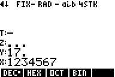

# RPN83P User Guide: BASE Operations

This document describes the `BASE` functions of the RPN83P application which
allow numbers to be converted between 4 different bases (DEC, HEX, OCT, and BIN)
and support various arithmetic and bitwise operations similar to the HP-16C. It
has been extracted from [USER_GUIDE.md](USER_GUIDE.md) due to its length.

**Version**: 0.11.0-dev (2024-05-16)

**Parent Document**: [USER_GUIDE.md](USER_GUIDE.md)

**Project Home**: https://github.com/bxparks/rpn83p

## Table of Content

- [Base Overview](#base-overview)
- [Base Modes](#base-modes)
- [Shift and Rotate](#shift-and-rotate)
- [Base Arithmetic](#base-arithmetic)
- [Carry Flag](#carry-flag)
- [Bit Operations](#bit-operations)
- [Base Word Size](#base-word-size)
- [Base Input Digit Limit](#base-input-digit-limit)
- [Base Mode Retention](#base-mode-retention)

## BASE Overview

The `BASE` functions are available through the `ROOT > BASE` hierarchy:

- 
    - 
    - 
    - 
    - 
    - 
    - 
    - 
    - 

These functions allow conversion of integers into different bases (10, 16, 8,
2), as well as performing bitwise functions on those integers (bit-and, bit-or,
bit-xor, etc). They are useful for computer science and programming. Many of the
`BASE` mode functions were inspired by the HP-16C, which has more extensive
functions in this area compared to the HP-42S.

All menu functions under the `BASE` menu operate on *unsigned integer* values
instead of floating point values. The following word sizes have been
implemented: 8, 16, 24, and 32 bits. Any floating point values on the RPN stack
(e.g. `X` or `Y` registers) are converted into an unsigned integer before being
passed into a logical, bitwise, or arithmetic function. This includes the `DEC`
(base 10) mode.

The maximum value that can be represented when in `BASE` mode is `2^WSIZ-1`,
which is (255, 65535, 16777215, 4294967295) for (8, 16, 24, 32) bit integers
respectively.

## Base Modes

When the `BASE` menu is selected, one of the base number menu items will be
activated: `DEC`, `HEX`, `OCT`, `BIN`. Normally the default is `DEC`, but the
`BASE` menu remembers the last base number that was used.

The numbers on the RPN stack are not modified internally when the `BASE` menu is
selected, but they are displayed on the screen differently to emphasize that
they are intended to be treated as unsigned integers.

Let's start with the RPN stack containing the following numbers: -1, 17.1, 9E9,
and 1234567, like this:


**DEC** (decimal)

The `DEC` (decimal) mode is the default when the `BASE` menu is selected. All
numbers on the RPN stack are displayed as an integer, *as if* they were
converted to an unsigned integer, but the RPN stack values are not modified. For
the values given above, the display now looks like this:



If the value on the RPN stack is negative, a single `-` sign is shown.
If the value is greater than or equal to `2^WSIZ`, then 3 dots `...` are shown
to indicate that the number is too large.
If the floating point value is within the range of `[0, 2^WSIZ)` but has
non-zero fractional value, a decimal point is shown after the integer part of
the unsigned integer.

**HEX** (hexadecimal)

The `HEX` (hexadecimal) mode displays all numbers on the RPN stack using base
16. Only the integer part is rendered as if the RPN stack values were
converted to an unsigned integer.


If the value on the RPN stack is negative, a single `-` sign is shown.
If the value is greater than or equal to `2^WSIZ`, then 3 dots `...` are shown
to indicate that the number is too large.
If the floating point value is within the range of `[0, 2^WSIZ)` but has
non-zero fractional value, a decimal point is shown after the integer part of
the unsigned integer.

On the keyboard, the hexadecimal digits `A` through `F` are entered using
`ALPHA` `A`, through `ALPHA` `F`. You can lock the `ALPHA` mode using `2ND`
`A-LOCK`, but that causes the decimal buttons `0` to `9` to send letters instead
which prevents those digits to be entered, so it is not clear that the Alpha
Lock mode is actually useful in this context.

**OCT** (octal)

The `OCT` (octal) mode displays all numbers on the RPN stack using base 8. Only
the integer part is rendered as if the RPN stack values were converted to an
unsigned integer.


If the value on the RPN stack is negative, a single `-` sign is shown.
If the value is greater than or equal to `2^WSIZ`, then 3 dots `...` are shown
to indicate that the number is too large.
If the floating point value is within the range of `[0, 2^WSIZ)` but has
non-zero fractional value, a decimal point is shown after the integer part of
the unsigned integer.

On the keyboard, the button digits `0` through `7` are entered normally. The
button digits `8` and `9` are disabled in octal mode.

**BIN** (binary)

The `BIN` (binary) mode displays all numbers on the RPN stack using base 2. Only
the integer part is rendered as if the RPN stack values were converted to an
unsigned integer.


If the value on the RPN stack is negative, a single `-` sign is shown.
If the value is greater than or equal to `2^WSIZ`, then 3 dots `...` are shown
to indicate that the number is too large.
If the floating point value is within the range of `[0, 2^WSIZ)` but has
non-zero fractional value, a decimal point is shown after the integer part of
the unsigned integer.

Binary numbers are displayed in groups of 4 digits to help readability. That
means that maximum number of digits that can be displayed is 12 digits. If
`WSIZ` is 16, 24 or 32, then a number may have non-zero digits which are cutoff
after the 12 digits. When that happens, a small ellipsis character will be shown
on the left most digit to indicate truncation, as shown above.

The `SHOW` function (bound to `2ND ENTRY` on the TI calculators) can be used to
reveal all digits of the binary number, in groups of 4, using as many 4 lines of
text like this:


We can now see that the number `1234567` in Base 2 is `0000 0000 0001 0010 1101
0110 1000 0111`.

On the keyboard, only the button digits `0` and `1` are active in the binary
mode. The rest are disabled.

## Shift and Rotate

The RPN83P supports most of the common shift and rotate operations implemented
by modern microprocessors, including the Z80 processor used in the TI-83 Plus
and TI-84 Plus calculators. Unfortunately, there seems to be no standard
mnemonics for these shift and rotate operations, and different processors and
calculators use conflicting names. The RPN83P follows the conventions of the
HP-16C for consistency, even though the conventions are sometimes contrary to
the conventions of the Z80 processor:

- `SL` - shift left logical
    - named `SLA` on the Z80 (see Note below regarding `SLL` instruction)
    - named `SL` on the HP-16C
- `SR` - shift right logical
    - named `SRL` on the Z80
    - named `SR` on the HP-16C
- `ASR` - arithmetic shift right
    - named `SRA` on the Z80
    - named `ASR` on the HP-16C
- `SLn` - shift left logical of `Y` for `X` times
    - no equivalent on Z80 or HP-16C
- `SRn` - shift right logical of `Y` for `X` times
    - no equivalent on Z80 or HP-16C
- `RL` - rotate left circular
    - named `RLC` on the Z80
    - named `RL` on the HP-16C
- `RR` - rotate right circular
    - named `RRC` on the Z80
    - named `RR` on the HP-16C
- `RLC` - rotate left through carry flag
    - named `RL` on the Z80
    - named `RLC` on the HP-16C
- `RRC` - rotate right through carry flag
    - named `RR` on the Z80
    - named `RRC` on the HP-16C
- `RLn` - rotate left circular of `Y` for `X` times
    - no equivalent on Z80
    - named `RLn` on the HP-16C
- `RRn` - rotate right circular of `Y` for `X` times
    - no equivalent on Z80
    - named `RRn` on the HP-16C
- `RLCn` - rotate left through carry flag of `Y` for `X` times
    - no equivalent on Z80
    - named `RLCn` on the HP-16C
- `RRCn` - rotate right through carry flag of `Y` for `X` times
    - no equivalent on Z80
    - named `RRCn` on the HP-16C

For all `XXn` operations, if the `n` value (i.e. `X` register) is 0, the
operation does not change the value of `Y`, but the RPN stack collapses by one
position so the `X` value disappears. If the `n` value is `>=` to the `BASE`
word size (`WSZ?`), normally 32, an error message will be displayed.

**Note**: The Z80 apparently has an undocumented instruction named [shift left
logical](https://worldofspectrum.org/z88forever/dn327/z80undoc.htm) which is
shortened to `SLL` or `SL1`. It places a 1 into bit 0 of the register, instead
of a 0. It is unfortunate that term "logical" is used in the exact opposite
to the meaning that I would have expected.

## Base Arithmetic

Similar to the HP-42S, activating the `BASE` hierarchy of menus changes the
behavior of keyboard arithmetic functions. Specifically, the buttons `+`, `-`,
`*`, `/` are re-bound to their integer counterparts `B+`, `B-`, `B*`, `B/` which
perform 32-bit unsigned arithmetic operations instead of floating point
operations. The numbers in the `X` and `Y` registers are converted into 32-bit
unsigned integers before the integer subroutines are called.

The `BDIV` menu function performs the same integer division operation as `B/`
but returns both the quotient (in `X`) and the remainder (in `Y`). With the
quotient in `X`, it becomes easy to recover the original `X` value by using the
`LastX` function (`2ND` `ANS`), then pressing the `*` button, then the `+`
button to add back the remainder.

**HP-42S Compatibility Note**: The HP-42S calls these integer functions `BASE+`,
`BASE-`, `BASE*`, and `BASE/`. The RPN83P can only display 4-characters in the
menu bar so I had to use shorter names. The HP-42S function called `B+/-` is
called `NEG` on the RPN83P. Early versions of the RPN83P retained the keyboard
arithmetic buttons bound to their floating point operations, but it became too
confusing to see hex, octal, or binary digits on the display, but get floating
point results when performing an arithmetic operation such as `/`. The RPN83P
follows the lead of the HP-42S so that the arithmetic keyboard buttons trigger
the integer operations instead of floating point operations.

For example, suppose the following numbers are in the RPN stack *before*
entering the `BASE` menu:


Entering the `BASE` menu shows this (assuming that the default base number was
`DEC`):


Changing to `HEX` mode shows this:


Pressing the `+` button adds the `X` and `Y` registers, converting the
values to 32-bit unsigned integers before the addition:


Changing back to `DEC` mode shows that the numbers were added using integer
functions, and the fractional digits were truncated:


## Carry Flag

The RPN83P supports the *Carry Flag* implemented by most (all?) microprocessors.
The Carry Flag is supported by the HP-16C but not by the HP-42S. When the flag
is off, a dash `-` is shown (left). When the Carry Flag is set, a small `C`
letter appears (right):


The Carry Flag can be explicitly cleared, set, and retrieved using the following
menu items:

- `CCF`: clear carry flag
- `SCF`: set carry flag
- `CF?`: get carry flag

Many operations affect the Carry Flag (CF). All shift and rotate operations
affect the CF:

- `SL`: bit 31 shifted into CF
- `SR`: bit 0 shifted into CF
- `ASR`: bit 0 shifted into CF
- `SLn`: bit 31 shifted into CF after shifting `n` positions
- `SRn`: bit 0 shifted into CF after shifting `n` positions
- `RL`: bit 31 shifted into CF
- `RR`: bit 0 shifted into CF
- `RLC`: CF into bit 0; bit 31 into CF
- `RRC`: CF into bit 31; bit 0 into CF
- `RLn`: bit 31 shifted into CF after rotating `n` positions
- `RRn`: bit 0 shifted into CF after rotating `n` positions
- `RLCn`: CF into bit 0; bit 31 into CF after rotating `n` positions
- `RRCn`: CF into bit 31; bit 0 into CF after rotating `n` positions

All integer arithmetic functions affect the CF:

- `B+`: CF set on overflow
- `B-`: CF set on borrow
- `B*`: CF set on overflow
- `B/`: CF always set to 0
- `BDIV`: CF always set to 0

On most microprocessors, the bitwise operations clear the Carry Flag to zero.
However the RPN83P follows the lead of the HP-16C calculator where these
operations do *not* affect the Carry Flag at all:

- `AND`, `OR`, `XOR`, `NEG`, `NOT`, `REVB`, `CNTB`

## Bit Operations

Specific bits can be cleared or set using the `CB` and `SB` menu items.

- `CB`: clear the `X` bit of `Y`
- `SB`: set the `X` bit of `Y`
- `B?`: get the `X` bit of `Y` as 1 or 0

The range of `X` must be between 0 and 31, or an error code will be generated.

This menu row contains a couple of additional bit manipulation functions:

- `REVB`: reverse the bit patterns of `X`
- `CNTB`: count the number of 1 bits in `X`

None of these bit operations affect the Carry Flag.

## Base Word Size

The HP-42S uses a 36-bit *signed* integer for BASE rendering and operations. To
be honest, I have never been able to fully understand and become comfortable
with the HP-42S implementation of the BASE operations. First, 36 bits is a
strange number, it is not a multiple of 8 as used by most modern microprocessors
(8, 16, 32, 64 bits). Second, the HP-42S does not display leading zeros in `HEX`
`OCT`, or `BIN` modes. While this is consistent with the decimal mode, it is
confusing to see the number of displayed digits change depending on its value.

The RPN83P deviates from the HP-42S by using *unsigned* integers internally, and
rendering the various HEX, OCT, and BIN numbers using the same number of digits
regardless of the value. The word size of the integer can be changed using the
`WSIZ` menu item (see below). The following word sizes are supported: 8, 16, 24,
and 32 bits. This means that `HEX` mode with a word size of 32 always displays 8
digits, `OCT` mode always displays 11 digits, and `BIN` mode always displays 12
digits (due to size limitation of the LCD screen). I find this less confusing
when doing bitwise operations (e.g. bit-and, bit-or, bit-xor).

Since the internal integer representation is *unsigned*, the `(-)` (change sign)
button is disabled. Instead, the menu system provides a `NEG` function which
performs a [two's complement](https://en.wikipedia.org/wiki/Two%27s_complement)
operation which turns a `00000001` hex number into `FFFFFFFF`. The `NEG`
function is closely related to the `NOT` function which performs a [one's
complement](https://en.wikipedia.org/wiki/Ones%27_complement) operation where
the `00000001` becomes `FFFFFFFE`.

If we want to see the decimal value of a hex number that has its sign-bit (the
most significant bit) turned on (so it would be interpreted as a negative number
if it were interpreted as a signed integer), we can run the `NEG` function on
it, then hit the `DEC` menu item to convert it to decimal. The displayed value
will be the decimal value of the original hex number, without the negative sign.

The word size, defaulting to 32 bits, can be changed using the `WSIZ` menu
function. Pressing it displays `WSIZ _ _` and waits for the argument, just like
the `FIX` and `STO` commands. To simplify the implementation code, only the
following word sizes are supported: 8, 16, 24, and 32, corresponding to 1, 2, 3,
and 4 bytes respectively:


If an unsupported word size is entered, for example `9`, then the error code
`Err:Argument` will be displayed:


Note: The RPN83P app represents all numbers internally using the TI-OS floating
point number format which supports 14 decimal digits. This corresponds to 46.5
bits. Therefore, the largest word size that could be supported in the current
architecture is 40. Supporting a 64-bit word size would require a major
rearchitecture of the application.

Every `BASE` operation respects the current `WSIZ` value, truncating the `X` or
`Y` integers to the word size, before performing the `BASE` operation, then
truncating the result to the word size. For example, if the word size is 16,
then the `RR` (rotate right circular) operation rotates bit 0 to bit 15, instead
of bit 31 if the word size was 32.

The current `WSIZ` value can be retrieved using the `WSZ?` menu function.

**HP-42S Compatibility Note**: The original HP-42S does *not* support the `WSIZ`
command. Its word size is fixed at 36 bits. The Free42 app however does support
it as the `WSIZE` command which I suspect was borrowed from `WSIZE` command on
the HP-16C. Keen observers will note a UI discrepancy: On the HP-16C and HP-42S,
the `WSIZE` command uses the value of `X` register to set the word size, but the
RPN83P *prompts* the user to enter the size using a `WSIZ _ _` prompt similar to
the `FIX` and `STO` commands. This decision was made to solve a major usability
problem on the RPN83P: The `X` register value in the `BASE` menu hierarchy is
shown using the currently selected base mode (e.g. `DEC`, `HEX`, etc). If the
mode was something other than `DEC`, for example `HEX`, then the user needs to
type `10 WSIZ` to set the `WSIZ` to 16 bits, because `10` is the base-16
representation of 16. Even worse, if the base mode was `BIN`, then the user must
type in `100000 WSIZ` to set the word size to `32` because `100000` is the
base-2 representation of `32`. I find this far too confusing. Instead, the
RPN83P uses the command argument prompt `WSIZ _ _` to obtain the word size from
the user in normal base-10 format. The prompt is not affected by the current
base mode so the user can type `8`, `16`, `24`, or `32` to select the new word
size without confusion. The `WSZ?` command returns the current word size in the
`X` register and will be displayed using the current base mode. I could not
think of any way around this, but I assume that this will not cause as much
usability problems as the `WSIZ` command.

## Base Input Digit Limit

The maximum number of digits allowed to be entered into the input buffer is
determined by a function which depends on both the `WSIZ` and the current base
number (`HEX` 16, `DEC` 10, `OCT` 8, `BIN` 2). Adding a limit during input
hopefully reduces the likelihood that the user will enter a number that is
greater than the maximum number of bits allowed in by the current `WSIZ` and
base number.

Here are the limits:

```
+------+------+-------------+------------+
| Base | WSIZ |  Max Number | Max Digits |
|------+------+-------------+------------|
|  DEC |    8 |         255 |          3 |
|  DEC |   16 |       65535 |          5 |
|  DEC |   24 |    16777215 |          8 |
|  DEC |   32 |  4294967295 |         10 |
|------+------+-------------+------------|
|  HEX |    8 |          FF |          2 |
|  HEX |   16 |        FFFF |          4 |
|  HEX |   24 |      FFFFFF |          6 |
|  HEX |   32 |    FFFFFFFF |          8 |
|------+------+-------------+------------|
|  OCT |    8 |         377 |          3 |
|  OCT |   16 |      177777 |          5 |
|  OCT |   24 |    77777777 |          8 |
|  OCT |   32 | 37777777777 |         10 |
|------+------+-------------+------------|
|  BIN |    8 |         255 |          8 |
|  BIN |   16 |       65535 |         16 |
|  BIN |   24 |    16777215 |         24 |
|  BIN |   32 |  4294967295 |         32 |
+------+------+------------ +------------+
```

Limiting the number of digits during input does not completely prevent the user
from entering a number which is immediately out-of-bounds of the `WSIZ` limit.
That's because in certain bases like `OCT`, the maximum number of allowed bits
falls inside a single digit. In other bases, like `DEC`, the number of binary
bits does not correspond exactly to the representation in decimal. (A future
enhancement may be to parse the input buffer upon `ENTER` and refuse to accept
the number if it is greater than the maximum allowed by the `WSIZ`.)

The longest binary number that can be displayed on a single line in edit mode is
14 digits. If the `WSIZ` is greater than 14 (i.e. greater than 8), then a binary
number in `BIN` can exceed this limit and entering more digits will cause the
left digits to scroll off the screen.

## Base Number Retention

The `DEC`, `HEX`, `OCT` and `BIN` modes are useful only within the `BASE`
hierarchy of menus. When the menu leaves the `BASE` hierarchy, the numbers on
the RPN stack revert back to using floating points. This is similar to the
HP-42S. However, unlike the HP-42S, the RPN83P remembers the most recent base
number and restores its setting if the `BASE` menu hierarchy is selected again.
