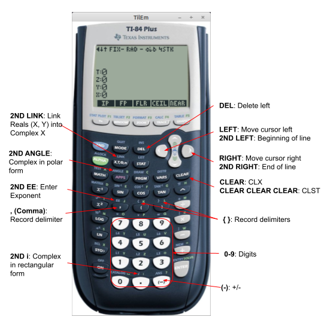

# RPN83P User Guide: Chapter 3: Basic Concepts

This document describes the screen elements, input system, the RPN stack, the
menu system, the help system, and the error codes used by RPN83P.

This guide assumes that you already know to use an RPN calculator. In
particular, the RPN83P implements the traditional RPN system used by
Hewlett-Packard calculators such as the HP-12C, HP-15C, and the HP-42S. (The
RPN83P does not use the newer RPL system used by the HP-48/49/50 series or the
Entry RPN system of the HP-20b/30b series.)

It is beyond the scope of this document to explain how to use an RPN calculator.
One way to learn is to download the [Free42](https://thomasokken.com/free42/)
emulator for the HP-42S (available for Android, iOS, Windows, MacOS, and Linux)
and then download the [HP-42S Owner's
Manual](https://literature.hpcalc.org/items/929).

**Version**: 1.1.0 (2025-10-07)\
**Project Home**: https://github.com/bxparks/rpn83p \
**Parent Document**: [USER_GUIDE.md](USER_GUIDE.md)

## Table of Contents

- [Screen Areas](#screen-areas)
- [Input System](#input-system)
    - [Input Buttons](#input-buttons)
    - [Input Cursor](#input-cursor)
    - [Input Length Limits](#input-length-limits)
    - [DEL Key](#del-key)
    - [CLEAR Key](#clear-key)
    - [Decimal Point](#decimal-point)
    - [EE Key](#ee-key)
    - [Change Sign Key](#change-sign-key)
    - [Record Object Input](#record-object-input)
    - [Complex Number Input](#complex-number-input)
    - [Input Termination](#input-termination)
    - [Other Edge Cases](#other-edge-cases)
    - [Input Limitations](#input-limitations)
- [RPN Stack](#rpn-stack)
    - [RPN Stack Structure](#rpn-stack-structure)
    - [RPN Stack Operations](#rpn-stack-operations)
    - [RPN Stack Size](#rpn-stack-size)
- [Menu System](#menu-system)
    - [Menu Hierarchy](#menu-hierarchy)
    - [Menu Buttons](#menu-buttons)
    - [Menu Indicator Arrows](#menu-indicator-arrows)
    - [Menu Shortcuts](#menu-shortcuts)
    - [Menu Shortcut Jump Back](#menu-shortcut-jump-back)
- [Built In Help](#built-in-help)
- [Error Codes](#error-codes)
- [SHOW Mode](#show-mode)

## Screen Areas

Here are the various UI elements on the LCD screen used by the RPN83P app:

The LCD screen is 96 pixels (width) by 64 pixels (height). That is large enough
to display 8 rows of numbers and letters. They are divided into the following:

- 1: status line
- 2: (currently unused)
- 3: error code line
- 4: T register line
- 5: Z register line
- 6: Y register line
- 7: X register/input line
- 8: menu line

The X register line is also used as the input line when entering new numbers. It
is also used to prompt for command line argument, for example `FIX _ _` to set
the fixed display mode.

## Input System

The input system of RPN83P initially behaved like the HP-42S, using an
underscore cursor that always remained at the end of the input string. With the
implementation of the scrollable cursor using the LEFT and RIGHT arrow keys, it
is actually closer to the HP-48/49/50 series now. However, it should be
emphasized that only the input system is similar to the 48/49/50. The
computation system of RPN83P is still RPN, not RPL.

The input system is intended to be mostly self-explanatory and predictable.
Hopefully most users will not need to read much of this section, except to
consult about some edge cases.

### Input Buttons

The following buttons are used to enter and edit a number in the input buffer:

- digit entry
    - `0`-`9`: inserts the digit
    - `.`: inserts decimal point
    - `2ND EE`: adds an `E` to mark the exponent of scientific notation
        - usually labeled as `E` or `EEX` on HP calculators
- number mutation
    - `(-)`: toggles the sign of the current number component
        - usually labeled as `+/-` or `CHS` on HP calculators
- deleting digits
    - `DEL`: deletes the char to the left of cursor
        - usually labeled as `<-` on most HP calculators
    - `CLEAR`: clear the input buffer
    - `CLEAR CLEAR CLEAR`: clear the stack, same as `CLST`
- record types
    - `{`: inserts the starting delimiter for record types
    - `}`: inserts the terminating delimiter for record types
    - `,`: inserts the component separator for record types
    - see [USER_GUIDE_DATE.md](USER_GUIDE_DATE.md) for more info
- complex numbers
    - `2ND LINK`: converts `X` and `Y` into a complex number in `X`, or the
      reverse
        - labeled `COMPLEX` on the HP-42S
    - `2ND i`:
        - inserts an `i` character to form a complex number in rectangular form,
          or
        - converts an existing complex delimiter to an `i`
    - `2ND ANGLE`:
        - inserts `∠°` (angle degree) to form a complex number in polar degree
          form, or
        - converts an existing complex delimiter to an `∠°`
    - `2ND ANGLE` `2ND ANGLE`:
        - inserts `∠` (angle) to form a complex number in polar radian form, or
        - converts an existing complex delimiter to an `∠`
    - see [USER_GUIDE_COMPLEX.md](USER_GUIDE_COMPLEX.md) for more info

### Input Cursor

The cursor of RPN83P is a blinking block character. This is different from the
HP-42S which uses an underscore character. The block character was selected
because this style is supported natively by the underlying TI-OS, and because it
is visually distinctive from the small dashes contained in the menu folder icon.

The `LEFT` and `RIGHT` arrow keys will move the cursor over the input buffer.
This is similar to the HP-48/49/50 series of calculators.

| **Keys**              | **Display**|
| --------------------- | ---------- |
| `1.234`               |  |
| `LEFT`                |  |
| `LEFT`                |  |
| `RIGHT`               |  |

When the number of digits exceeds the display limit, the left-most or right-most
character is replaced with an ellipsis character (three dots) to indicate that
additional digits have been cropped.

The `2ND LEFT` and `2ND RIGHT` arrow keys will move the cursor to the beginning
or end of the input buffer respectively, allowing rapid movement of the cursor
over a long sequence of input characters.

| **Keys**              | **Display**|
| --------------------- | ---------- |
| `1.2345678901234E-12` |  |
| `2ND LEFT`            |  |
| `RIGHT` (10 times)    |  |
| `2ND RIGHT`           |  |

### Input Length Limits

In normal mode, the input system is configured to accept up to 20 digits because
a TI-OS floating point number in scientific notation requires 20 digits to enter
in full precision (14 significant digits plus 6 digits of notation overhead).

In `BASE` mode, the digit limit is a variable that depends on the `WSIZ` and the
base number (`DEC`, `HEX`, `OCT`, `BIN`). In the worst case, the input system
will allow as many as 32 digits for a `BIN` binary number with `WSIZ` of 32.

When the input system detects a complex number through the presence of a `2ND i`
or `2ND ANGLE` delimiter, the maximum number of characters is increased to 41 to
allow 2 floating point numbers to be entered with full precision along with its
delimiter.

### DEL Key

The `DEL` key acts like the *backspace* key on HP calculators (usually marked
with a `LEFTARROW` symbol). This is different from the TI-OS where the `DEL` key
removes the character directly under the cursor. On RPN83P, the input system is
always in *insert* mode, in contrast to the TI-OS where the input system is in
*overwrite* mode by default.

If the `X` line is *not* in edit mode (i.e. the cursor is not shown), then the
`DEL` key acts like the `CLEAR` key (see below).

### CLEAR Key

The `CLEAR` key performs slightly different functions depending on the context:

- If the input has been terminated (i.e. not in edit mode), `CLEAR` clears the
  `X` register, similar to the `CLX` (Clear X Register) menu function.
- If the input is in edit mode, then:
    - If the cursor is at the end of the input line, `CLEAR` erases the entire
      line.
    - If the cursor is at the beginning of the input line, `CLEAR` also erases
      the entire line.
    - If the cursor is in the middle of the input line, then `CLEAR` erases
      *only* to the end of the line.
    - If the input line is already empty when `CLEAR` is pressed, then it
      interprets that as a `CLST` (Clear Stack) operation, and warns the user
      with a message.
    - If the `CLEAR` is pressed again after the warning, then the `CLST`
      operation is performed, clearing the RPN stack.

The `CLEAR` button erases only to the end of line if the cursor is in the middle
of the input buffer, which is convenient when the input line becomes lengthy. I
borrowed this behavior from the `CLEAR` button on the TI-89, TI-89 Titanium,
TI-92+, and TI Voyage 200 calculators. (The `2ND CLEAR` on the HP-50g works in a
similar way, but only in Algebraic mode, not in RPN mode.)

I hope the following example illustrates the different behaviors of `CLEAR`
clearly:

| **Keys**                              | **Display**   |
| ---------------------                 | ----------    |
| `1` `ENTER` `2` `ENTER` `3` `ENTER`   |  |
| `CLEAR` (invokes `CLX`)               |  |
| `4.5678`                              |  |
| `CLEAR` (clears entire line)          |  |
| `4.5678` `LEFT` `LEFT` `LEFT`         |  |
| `CLEAR` (clears to end of line)       |  |
| `CLEAR` (clears entire line)          |  |
| `CLEAR` (requests `CLST`)             |  |
| `CLEAR` (invokes `CLST`)              |  |

In most cases, pressing `CLEAR` 3 times will invoke the `CLST` function.
This is often far more convenient than navigating to the `CLST` menu function
nested under the `ROOT > CLR` menu folder. (Another alternative could have been
`2ND CLEAR` but the TI-OS does not support that keystroke because it returns the
same key code as `CLEAR`.)

An empty string will be interpreted as a `0` if the `ENTER` key or a function
key is pressed.

### Decimal Point

The decimal point `.` button inserts a decimal point at the cursor location. But
the system tries to be a bit smart about it using the following rules:

- no decimal point is inserted into the mantissa if one has already been entered
  to the left of the cursor
- no decimal point is inserted in the exponent after the `E` character
- no decimal point is inserted inside a Record object defined by curly braces
  `{` and `}`

### EE Key

The `E` symbol for scientific notation numbers must be entered using the `2ND
EE` key, because the comma `,` key is used for other purposes. However, it is
possible to flip the behavior of the comma and the `2ND EE` buttons using a
`MODE` setting. See [Comma-EE Button Mode](#comma-ee-button-mode) below.

If the `2ND EE` button is pressed in the middle of a string, it will simply
insert an `E` symbol. Similar to the decimal point, the system tries to be a
little bit smart about the insertion:

- no `E` is inserted if one has already been entered to the left of the cursor.
- no `E` is inserted inside a Record object defined by curly braces `{` and `}`

The behavior of the `EE` button on RPN83P is simpler and different from the
HP-48/49/50 series whose behavior I have not figured out.

### Change Sign Key

Unlike most of the other input-related buttons, the `(-)` CHS button does not
simply insert a negative sign `-` into the string. The behavior of the `(-)`is
fairly complex: it inverts the sign of the number identified by the cursor by
inserting or removing the negative `-` character at the appropriate position of
the number.

- if the RPN stack is *not* in edit mode, `(-)` toggles the sign of the value in
  the `X` register
- in input mode, the `(-)` inverts the sign of the number component currently
  identified by the cursor:
    - if on the mantissa, it inverts the sign of the mantissa
    - if on the exponent, it inverts the sign of the exponent
    - it performs the same actions on the second part of a complex number
    - if on a component of a Record object, it inverts the sign of the component
- if the cursor position contains no number, then a negative sign is inserted

### Record Object Input

The left-brace `{`, the right-brace `}`, and the comma `,` buttons are used for
record types. They generally act to simply insert their respective characters
into the input buffer, but a handful of reasonable rules have been implemented:

- a comma cannot be added directly after another
- a right-brace cannot be entered directly after another
- a left-brace cannot be entered directly after another
- a left-brace `{` must exist first, before a right-brace `}` can be inserted

See [USER_GUIDE_DATE.md](USER_GUIDE_DATE.md) for more details.

For illustrative purposes, here is a Record type with the cursor in the middle
of the record:

| **Keys**              | **Display**|
| --------------------- | ---------- |
| `DT{2024,5,21,`       |  |
| `LEFT` `LEFT` `LEFT`  |  |

### Complex Number Input

The `2ND i`, `2ND ANGLE`, and `2ND LINK` buttons are used for entering complex
numbers. They are explained in more detail in
[USER_GUIDE_COMPLEX.md](USER_GUIDE_COMPLEX.md). The complex delimiter keys, `2ND
i` and`2ND ANGLE`, try to be slightly smart about their behavior as well:

- `2ND i`
    - inserts an `i` delimiter if no complex delimiter already exists
    - converts any existing complex delimiter into an `i`
- `2ND ANGLE`
    - inserts a `∠°` (angle degree) delimiter if no complex delimiter already
      exists
    - converts an existing `i` delimiter into an `∠°` (angle degree) delimiter
    - converts an existing `∠°` (angle degree) delimiter into just an `∠`
      (angle) delimiter (i.e. toggles)
    - converts an existing `∠` (angle) delimiter into an `∠°` (angle degree)
      delimiter (i.e. toggles)

Here is an example of how the delimiters override or toggle each other:

| **Keys**              | **Display**|
| --------------------- | ---------- |
| `1.23E2`              |  |
| `2ND i`               |  |
| `98.7` `(-)`          |  |
| `2ND ANGLE`           |  |
| `2ND ANGLE`           |  |
| `2ND i`               |  |

### Input Termination

On the HP-42S, input termination is aggressive. For example:

- The activation of any menu (e.g. `MODES` or `CONVERT`) terminates
  the input.
- Moving to a different menu row using the UpArrow or DownArrow, within the same
  menu, terminates the input.
- Deactivation of a menu using `ON/EXIT` button also terminates the input.
- Selecting `STO` or `RCL`, then canceling the command argument prompt using
  `ON/EXIT` will terminate the input.

On RPN83P, input termination is delayed for as long as it makes sense. I think
this makes the user-interface easier and more friendly. For example:

- Menu navigation (with the exception of `BASE`, see below) does *not* cause
  termination.
    - This allows the user to start entering a number, then navigate to a
      different menu folder, then continue entering the number.
- The `ON/EXIT` button to navigate up the menu hierarchy does not cause input
  termination.
- Selecting the `MODE` keyboard button shortcut does *not* cause input
  termination.
- Invoking changes inside the `MODE` button does *not* cause input termination.
  For example:
    - Changing the `FIX`, `SCI`, or `ENG` value does not cause termination
    - Changing the complex number display mode `RECT`, `PRAD`, `PDEG` does not
      cause termination. This allow the user to start entering a complex number
      through the `2ND LINK` process, then change their mind whether to link the
      2 numbers in rectangular form `a+bi` or in a polar form (`r∠θ`).
- Canceling a command argument prompt (e.g. `STO`, `RCL`, `RNDN`, `FIX`, etc),
  before the completion of the parameter, does *not* cause input termination.
- Even seemingly drastic configuration changes such as `RSIZ` (register size)
  and `SSIZ` (stack size) will *not* cause input termination.
    - They can make the internal configuration changes without depending on the
      value of the `X` register, the input does not need to be terminated.

The `BASE` menu folder and its children folders (`LOGI`, `ROTS`, `BITS`, `BFCN`,
`BCFS`) are exceptions because the `BASE` mode affects how the digits in the
input buffer are parsed and interpreted.

- Changing the BASE modes (`DEC`, `HEX`, `OCT`, `BIN`) will cause input
  termination.
    - If we switch to another BASE mode, the input must be terminated so that
      the pending digits can be parsed correctly.
- Any menu navigation into or out of a BASE menu (i.e. from non-BASE into BASE,
  or from BASE to a non-BASE) will cause input termination.
    - Similar reason as above, the digits in the input buffer are affected by
      the BASE mode.
- Menu navigation *within* the BASE menu folder hierarchy will *not* cause input
  termination.
    - For example, navigating from `BASE > ROTS` to `BASE > LOGI` will not
      terminate the input.
- Pressing the `MODE` keyboard button from inside a `BASE` menu folder *does*
  cause input termination.
    - Internally, the `MODE` button causes menu navigation to `ROOT > MODE`
      which is in a different menu hierarchy from `ROOT > BASE`, so we have
      transitioned to be outside of the `BASE` hierarchy.

### Other Edge Cases

The input system of the HP-42S has idiosyncrasies which are sometimes
surprisingly complex and subtle. Some were faithfully emulated on RPN83P, but
others were not.

- On the HP-42S, when the input buffer becomes empty (e.g. after pressing the
  `<-` backspace button multiple times, or pressing the `CLEAR > CLX` menu), the
  cursor disappears and the `X` register shows something like `0.0000`. But
  internally, the HP-42S is in a slightly different state than normal: the Stack
  Lift is disabled, and entering another number will replace the `0.0000` in the
  `X` register instead of lifting it up to the `Y` register.
    - In RPN83P, when the `DEL` key or the `CLEAR` key is pressed, the `X`
      register always enters into Edit mode with an empty input buffer, and the
      cursor will *always* be shown with an empty string.
    - The presence of the cursor indicates that the Edit Mode is in effect and
      that the Stack Lift is disabled.
- Functions which take no arguments and return one or more values were tricky to
  implement correctly. The canonical example of these functions is the `2ND PI`
  key. RPN83P implements these functions in the same way as the HP-42S:
    - If Stack Lift is disabled (e.g. after an `ENTER`), then `2ND PI`
      *replaces* the previous value in the `X` stack register.
    - If the input system is in edit mode (displaying the blinking cursor),
      *and* the input buffer is completely empty, then `2ND PI` *replaces* the
      empty string.
    - But if the input system is in edit mode and the input buffer is *not*
      empty, then `2ND PI` causes the current input buffer to be terminated,
      pushing the input buffer value into the `Y` register, and the `PI` value
      is pushed into the `X` register.
    - This is the one case where an empty string in the input buffer is not the
      same as a `0`.

### Input Limitations

There are many ways that the RPN83P input system could be improved. Many of them
arise from a design decision that I made to save some time and effort: the
cursor only looks at its *past* (the characters to the left of the cursor) not
its future (the characters to the right of the cursor). For example, when the
decimal point `.` button is pressed, the input system does not allow a second
decimal point to be insert into a single number component because that would
result in an invalid syntax for the number. However, if the LEFT arrow key is
used to move the cursor to the left of the first decimal point, then the input
system will allow a second (and invalid) decimal point to be inserted into the
number.

It may be possible for update the input system to look to the right of the
cursor when applying various rules about valid versus invalid characters. But
without actually implementing the code, it is hard to estimate how much time and
effort it would take to make those improvements.

## RPN Stack

### RPN Stack Structure

RPN83P tries to implement the traditional 4-level RPN stack used by many HP
calculators as closely as possible, including some features which some people
may find idiosyncratic. In addition, RPN83P supports larger RPN stack sizes
through the `SSIZ` command. The minimum stack size is 4, but it can be increased
to be as large as 8.

The bottom 4 slots in the RPN stack are named `X`, `Y`, `Z`, and `T` following
the convention used by modern HP RPN calculators. As the stack size increases
towards 8, additional stack registers become available: `A`, `B`, `C`, and `D`.

The LCD screen on the TI calculators is big enough that the bottom 4 registers
(`X`, `Y`, `Z`, `T`) can be shown at all times. (For comparison, the HP-12C and
HP-15C have only a single line display. The HP-42S has a 2-line display, with
the bottom line often commandeered by the menu line so that only the `X`
register is shown.)

### RPN Stack Operations

These are the buttons which manipulate the RPN stack:

- `(`: rolls RPN stack down (known as `R↓` on HP calculators)
- `)`: exchanges `X` and `Y` registers
- `2ND u`: rolls RPN stack up (known as `R↑` on HP calculators)
- `ENTER`: saves the input buffer to the `X` register
- `2ND` `ANS`: recalls the last `X`

This mapping of the `(` and `)` to these stack functions is identical to the
mapping used by other HP calculators that support both Algebraic and RPN modes
(e.g. the [HP-17BII and 17bII+](https://en.wikipedia.org/wiki/HP-17B) and the
[HP-30b](https://en.wikipedia.org/wiki/HP_30b)).

When a new number is entered (using the `0`-`9` digit keys), the press of the
first digit causes the stack to **lift**, and the calculator enters into the
**edit** mode. This mode is indicated by the appearance of the blinking block
cursor.

A stack **lift** causes the previous `X` value to shift into the `Y` register,
the previous `Y` value into the `Z` register, and the previous `Z` value into
the `T` register. The previous `T` value is lost.

The `ENTER` key performs the following actions:

- if the `X` register was in edit mode, the input buffer is closed and the
  number is placed into the `X` register,
- the `X` register is then duplicated into the `Y` register,
- the stack lift is *disabled* for the next number.

This is consistent with the traditional RPN system used by HP calculators up to
and including the HP-42S. It allows the user to press: `2` `ENTER` `3` `*` to
multiply `2*3` and get `6` as the result, because the second number `3` does not
lift the stack.

The parenthesis `(` and `)` buttons are not used in an RPN entry system, so they
have been repurposed for stack manipulation:

- `(` key rolls the stack *down*, exactly as the same as the `R↓` (sometimes
  just a single `↓`) on the HP calculators.
- `)` key performs an exchange of the `X` and `Y` registers. That functionality
  is usually marked as `X<>Y` on HP calculators.

The `2ND u` is bound to the `R↑` command. You can think of the `u` as a
mnemonic for "up". This command is marginally useful when the RPN stack size is
only 4, but becomes more important when the RPN stack size is increased beyond
4.

The `2ND` `ANS` functionality of the TI-OS algebraic mode is unnecessary in the
RPN system because the `X` register is always the most recent result that would
have been stored in `2ND` `ANS`. Therefore, the `2ND` `ANS` has been repurposed
to be the `LASTX` functionality of HP calculators. The `LASTX` is the value of
the `X` register just before the most recent operation. It can be used to bring
back a number that was accidentally consumed, or it can be used as part of a
longer sequence of calculations.

### RPN Stack Size

The default size of the RPN stack is 4 for compatibility with traditional HP RPN
calculators. However, RPN83P allows the RPN stack size to be changed between 4
and 8, using the `SSIZ` command under the `MODE` menu (which can be quickly
accessed through the `MODE` button):

- 
    - 

The current stack size can be recalled using the `SSZ?` command. It is also
shown in the top status line using the annunciators `4STK`, `5STK`, `6STK`,
`7STK`, and `8STK`.

Here is an example where we start with a stack size of 4, increase it to 8, then
decrease it to 5:

| **Keys**              | **Display** |
| ----------------      | --------------------- |
| `MODE` `DOWN` `DOWN`  |  |
| `SSIZ` `4`            |  |
| `SSIZ` `8`            |  |
| `SSIZ` `5`            |  |
| `SSZ?`                |  |

## Menu System

### Menu Hierarchy

The menu system of the RPN83P was directly inspired by the HP-42S calculator.
There are over 250 functions supported by the RPN83P menu system, so it is
convenient to arrange them into a nested folder structure. There are 5 buttons
directly under the LCD screen so it makes sense to present the menu items as
sets of 5 items corresponding to those buttons.

The menu system forms a singly-rooted tree of menu items and groups, which look
like this conceptually:

There are 4 components:

- `MenuGroup`: a folder of 1 or more `MenuRows` (e.g. `NUM`)
- `MenuRow`: a list of exactly 5 `MenuNodes` corresponding to the 5 menu
  buttons below the LCD
- `MenuNode`: one slot in the `MenuRow`, can be *either* a `MenuGroup` or a
  `MenuItem`
- `MenuItem`: a leaf-node that maps directly to a function (e.g. `GCD`) when
  the corresponding menu button is pressed

### Menu Buttons

The LCD screen always shows a `MenuRow` of 5 `MenuItems`. Here are the buttons
which are used to navigate the menu hierarchy:

- `F1`- `F5`: invokes the function shown by the respective menu
- `UP_ARROW`: goes to previous `MenuRow` of 5 `MenuItems`, within the current
  `MenuGroup`
- `DOWN_ARROW`: goes to next `MenuRow` of 5 `MenuItems`, within the current
  `MenuGroup`
- `ON`: goes back to the parent `MenuGroup` (similar to the `ON/EXIT` button on
  the HP-42S)
- `MATH`: goes directly to the root `MenuGroup` no matter where you are in the
  menu hierarchy

The appropriate key for the "menu back to parent" function would have been an
`ESC` button. But the TI-83 and TI-84 calculators do not have an `ESC` button
(unlike the TI-89, TI-92, and TI Voyager 200 series calculators), so the `ON`
button was recruited for this functionality. This seemed to make sense because
the HP-42S
uses the `ON` key which doubles as the `EXIT` or `ESC` key to perform this
function.

The `HOME` button is useful to go directly to the top of the menu hierarchy from
anywhere in the menu hierarchy. The TI-83 and TI-84 calculators do not have a
`HOME` button (unlike the TI-89, TI-92, and TI Voyager 200 series again), so the
`MATH` button was taken over to act as the `HOME` key. This choice was not
completely random:

1. The `HOME` button on the [TI-89 series
calculator](https://en.wikipedia.org/wiki/TI-89_series) is located exactly where
the `MATH` is.
2. The RPN83P app does not need the `MATH` button as implemented by the TI-OS,
which opens a dialog box of mathematical functions. In the RPN83P app, that
functionality is already provided by the menu system.
3. When the menu system is at the root, the first menu item on the left is a
menu group named `MATH`, which may help to remember this button mapping.

**HP-42S Compatibility Note**: As far I can tell, the menu system of the HP-42S
is *multiplely rooted* and pressing a given menu button (e.g. `BASE`) activates
the menu hierarchy of that particular button. I think this works because the
menu bar on the HP-42S is not displayed by default, so there is no single ROOT
node of its menu system. Some of the HP-42S menu bars can stack on top of each
other, so that the `EXIT` button goes back to the previous menu bar. But some
menu bars do not. I have never figured out the rhyme and reason for this
behavior. The RPN83P app, on the other hand, always displays its menu bar, so it
was simpler for the user (and the programmer of this app) to create a *singly
rooted* menu hierarchy with the menu bar always starting from the implicit
`ROOT` menu node.

### Menu Indicator Arrows

There are 3 menu arrows at the top-left corner of the LCD screen:

- `leftarrow` indicates additional menus in the parent folder,
- `downarrow` indicates additional menu rows below the current row,
- `uparrow` indicates additional menu rows above the current row.

The `DOWN` and `UP` arrows move from one menu row to another, like this:

| **Keys**          | **Display**|
| ----------------- | ---------- |
| `HOME`            |  |
| `DOWN`            |  |
| `DOWN`            |  |
| `UP` `UP`         |  |

Instead of pressing `UP` twice, you can press `DOWN` from the last menu row to
wrap around to the first menu row.

The soft menu keys `F1-F5` are used to enter a menu folder, In the example
below, it goes into the `NUM` menu folder. Since the `leftarrow` indicator is
shown, the `ON/EXIT` key can be used to go back to the parent folder:

| **Keys**          | **Display**|
| ----------------- | ---------- |
| `HOME`            |  |
| `F2/WINDOW`       |  |
| `DOWN`            |  |
| `DOWN` `DOWN`     |  |
| `ON/EXIT`         |  |

### Menu Shortcuts

Some menu groups can be accessed quickly through dedicated keys on the TI
calculator which happen to have the same label as the menu item:

- `MODE`: bound to `ROOT > MODE`
- `STAT`: bound to `ROOT > STAT`
- `MATH`: repurposed to be `HOME` (aka `ROOT`)

The `MATH` button is slightly different. It is not bound to `ROOT > MATH`.
Rather it has been repurposed to be the `HOME` button which goes to the top of
the menu hierarchy `ROOT`.

### Menu Shortcut Jump Back

Normally when the `ON/EXIT/ESC` button is pressed, the menu bar goes up to the
parent of the current MenuGroup. That makes sense because the user normally must
travel through the parent to reach the child MenuGroup. But the keyboard
shortcuts break this rule.

When the `MODE` button is pressed, the menu bar goes directly to the `ROOT >
MODE` MenuGroup from anywhere in the menu hierarchy. Since the `MODE` functions
involve quick changes to the floating point display or the trigonometric angle
units, it seems likely that the user would want to go back to the original menu
bar after making the `MODE` changes. Therefore, the `ON/EXIT/ESC` button has
been programmed to jump back to the *previous* menu bar if the `ROOT > MODE`
menu was invoked through the `MODE` button.

The `STAT` shortcut, however, does *not* implement the jump back feature.
Instead, the `ON/EXIT/ESC` acts normally and the menu goes up to the parent of
the `STAT` MenuGroup to the `ROOT` of the menu system. This behavior was chosen
because it seemed more likely that the user would spend a significant amount of
time inside the `STAT` menu functions. The more time spent inside the `STAT`
menu, the less likely it seemed the user would remember where the original menu
bar was, and unlikely to want to go back there using the `ON/EXIT/ESC` key.

## Built In Help

Pressing the `HELP` menu button at the root menu activates the Help pages:

The contents of these pages are updated frequently so the screenshots below may
not be identical to the current version:

The Help pages are intended to capture some of the more obscure tidbits about
the RPN83P app which may be hard to remember. Hopefully it reduces the number of
times that this User Guide needs to be consulted.

The message at the bottom of each page is not completely honest. A few
navigational keys are recognized by the Help system:

- `UP`, `LEFT`: previous page with wraparound
- `DOWN`, `RIGHT`: next page with wraparound
- `DEL`, `MATH`, `CLEAR`, `ON`: exit Help
- any other button: next page *without* wraparound, exiting on the last page

## Error Codes

The RPN83P supports all error messages from the underlying TI-OS which are
listed in the TI-83 SDK. The SDK unfortunately does not describe how these
errors are actually triggered. By trial-and-error, I could reverse engineer only
a few of them as described below:

- `Err: Archived`: storage variable (A-Z,Theta) is archived
- `Err: Argument`: incorrect number of arguments
- `Err: Bad Guess`
- `Err: Break`
- `Err: Domain`: invalid argument or argument outside range
- `Err: Data Type`: invalid argument type (e.g. complex number)
- `Err: Invalid Dim`: list index larger than list size
- `Err: Dim Mismatch`
- `Err: Divide By 0`: divide by 0
- `Err: Increment`
- `Err: Invalid`
- `Err: Iterations`
- `Err: In Xmit`
- `Err: Memory`
- `Err: Non Real` (I could never reproduce this, the TI-OS seems to use `Err:
  Domain` or `Err: Data Type` instead)
- `Err: Overflow`: result exceeds `9.99999999E99`
- `Err: No Sign Change`
- `Err: Singularity`
- `Err: Stat`
- `Err: StatPlot`
- `Err: Syntax`: incorrect math expression syntax
- `Err: Tol Not Met`
- `Err: Undefined`: variable not found

These are shown in the Error Code line on the screen. For example, if we try to
divide `1 / 0`, a division by 0 error is shown:

If a TI-OS function returns an internal error code outside of the ones
documented in the SDK, RPN83P will print an error message in the form of `Err:
UNKNOWN (##)` like this:

The number in parenthesis is the internal numerical value of the error code. If
the error is reproducible, please file a [bug
report](https://github.com/bxparks/rpn83p/issues) containing the numerical error
code and the steps needed to reproduce it so that I can add it to the list of
error messages supported by RPN83P.

## SHOW Mode

Many HP RPN calculators have a display mode that shows all significant digits
that are stored internally. On the HP-42S and HP-16C, the button that activates
this is labeled `SHOW`. On the HP-12C and HP-15C, the button is labeled
`Prefix`.

The RPN83P app uses the `2ND` `ENTRY` key sequence (just above the `ENTER`
button). This key was selected because `ENTRY` is unused in our RPN system, and
because it is located close to the `ENTER` key.

The SHOW mode reverts back to the normal display mode in the following ways:

- `OFF` and `QUIT`: Exit the app. Upon restart, the app goes back to normal
  display mode.
- `DEL`, `CLEAR`, `ENTER`, `ON/EXIT`: Exit SHOW mode to normal mode, but do not
  process the key in normal mode.
- Any other key: Exit SHOW mode, then *continue* processing the key in normal
  mode.

Prior to v1.1, any key press in SHOW mode caused it to exit to normal mode, and
then the key press was eaten. A second press of the same key was required in
normal mode to continue processing it. This was found to be too cumbersome,
because it prevented the entry of a new number directly from SHOW.

In v1.1, any key press causes SHOW mode to exit as before. In addition, most
keys are then forwarded to the normal mode, so that normal processing can
continue. In particular, if a digit key is entered (0-9) in SHOW mode, we leave
SHOW, then immediately go into edit mode, and the digit goes into the input
buffer. If a function key is pressed, the function acts upon the value in the
`X` register displayed by `SHOW`.

Unlike the HP-42S which automatically reverts back to the normal mode after a
2-3 second delay, the TI calculator must wait for a keyboard event from the
user.

Floating point numbers are normally shown with 10 significant digits, but
internally the TI-OS stores floating point numbers using 14 digits. The SHOW
mode displays all 14 digits of the `X` register in scientific notation. For
example, `sqrt(2)` is normally displayed as `1.414213562`, but in SHOW mode it
looks like this:

| **Keys**              | **Display** |
| ----------------      | --------------------- |
| `2` `2ND SQRT`        |  |
| `2ND ENTRY` (SHOW)    |  |

If the `X` value is an exact integer internally, then the value is printed in
integer form instead of scientific notation. For example `2^46` is an exact
integer that will normally appear as `7.036874418E13`, but in SHOW mode looks
like this:

| **Keys**              | **Display** |
| ----------------      | --------------------- |
| `2` `46` `^`          |  |
| `2ND ENTRY` (SHOW)    |  |

The SHOW mode has a slight variation in `BASE` mode. For `DEC`, `HEX`, and `OCT`
modes, the `SHOW` function behaves as before, showing the internal floating
point number in scientific or integer notation. However, in `BIN` mode, the
`SHOW` function displays the `X` value in *binary* notation, allowing all digits
of the binary number to be shown. This behavior is consistent with the `SHOW`
function on the HP-42S. For example, the hex number `01D62BB7` in normal `BIN`
mode looks like `<010 1011 1011 0111` because only 16 digits can be displayed on
a single line. But in SHOW mode, all 32 digits (assuming `WSIZ` was 32) will be
displayed like this:

| **Keys**              | **Display** |
| ----------------      | --------------------- |
| `MATH` `DOWN` `BASE`  |  |
| `HEX`                 |  |
| `01D62BB7`            |  |
| `2ND ENTRY` (SHOW)    |  |
| `BIN`                 |  |
| `2ND ENTRY` (SHOW)    |  |
