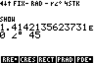

# RPN83P User Guide: Complex Numbers

This document describes the Complex Number features of the RPN83P application.
It has been extracted from [USER_GUIDE.md](USER_GUIDE.md) due to its length.

Complex numbers can be entered in rectangular form `a+bi`, polar radian form `r
e^(i theta)`, or polar degree form (`theta` in degrees). They can be also be
displayed in all three forms. The entry modes and the display modes are
independent of each other. For example, a complex number can be entered in
rectangular form, even if the current display mode is polar form. Internally,
complex numbers are *always* stored in rectangular format.

**Version**: 0.11.0 (2024-05-28)

**Parent Document**: [USER_GUIDE.md](USER_GUIDE.md)

**Project Home**: https://github.com/bxparks/rpn83p

## Table of Contents

- [Complex Numbers and Screen Size](#complex-numbers-and-screen-size)
- [Complex Number Entry](#complex-number-entry)
    - [Linking Using 2ND LINK](#linking-using-2nd-link)
    - [Inlining Using 2ND i and 2ND ANGLE](#inlining-using-2nd-i-and-2nd-angle)
    - [Solitary 2ND i](#solitary-2nd-i)
- [Complex Display Modes](#complex-display-modes)
    - [Display Mode Affects Linking](#display-mode-affects-linking)
    - [Polar Mode Overflow](#polar-mode-overflow)
- [Complex SHOW](#complex-show)
- [Complex FIX, SCI, ENG](#complex-fix-sci-eng)
- [Complex Functions](#complex-functions)
    - [Complex Functions Example 1](#complex-functions-example-1)
    - [Complex Functions Example 2](#complex-functions-example-2)
    - [Complex Functions Example 3](#complex-functions-example-3)
- [Complex Result Modes](#complex-result-modes)
- [Complex Numbers and Trigonometric Modes](#complex-numbers-and-trigonometric-modes)
- [Complex Numbers in Storage Registers](#complex-numbers-in-storage-registers)

## Complex Numbers and Screen Size

Complex numbers are rendered using the Small Font of the TI-83 and 84
calculators instead of the Large Font. With the Large Font, we are limited to 16
digits on a single line (including the stack label), which are not sufficient to
display the 2 floating point numbers of a complex number. The Small Font allows
us to display about 24 digits on a single line, which allows us to allocate 10
digits for each component of a complex number.

Here is what the screen looks like with just Large Font (left), and a mix of
Small and Large Fonts (right):


Readability suffers a bit using the small font, but it seems reasonable.

## Complex Number Entry

There are 2 ways to enter complex numbers on the RPN83P app:

- *linking* two real numbers in the `X` and `Y` registers into a single complex
  number
- *inlining* both components on a single line into the `X` register

### Linking Using 2ND LINK

The linking method borrows from the HP-42S which provides a `COMPLEX` key. It
takes the `Y` and `X` registers and combines them into a complex number `Y +
Xi`. By convention, the real part is entered first, `ENTER` is pressed, then the
imaginary part is entered second. (Interestingly, this is the opposite order
compared to the semantically related `ATN2` function or the `>POL` conversion
function.) If the `COMPLEX` key is pressed again on a complex number, the
reverse happens. The complex number is broken up into 2 real numbers, with the
`Y` register containing the real part, and the `X` register containing the
imaginary part.

The TI-83 Plus and TI-84 Plus calculators do not have a `COMPLEX` button. The
closest alternative key seems to be the `2ND LINK` button which is otherwise
unused in RPN83P.

For example, the number `1-2i` would be entered like this:

| **Keys**          | **Display** |
| ----------------  | --------------------- |
| `1`               |  |
| `ENTER`           |  |
| `2`               |  |
| `(-)`             |  |
| `2ND LINK`        |  |

Notice that the RPN83P follows the convention used by the HP-35s in rendering
the complex number with an imaginary `i` delimiter between the two components.
The negative sign on the `-2` appears *after* the `i`, because it is a delimiter
not a multiplier of the number `-2`.

Pressing `2ND LINK` on a complex number performs the *reverse* operation. The
complex number is broken up into its real components, with the real part going
into `Y` and the imaginary part going into `X`.

| **Keys**          | **Display** |
| ----------------  | --------------------- |
| (from above)      |  |
| `2ND LINK`        |  |

### Inlining Using 2ND i and 2ND ANGLE

The inlined entry method borrows from the HP-35s which allows a complex number
to be entered in its entirety on a single line. The `2ND i` button (above the
`.` button), and the `2ND LINK` button (above the `x,t,theta,n` button) are used
to delimit the 2 components of a complex number.

To enter `1-2i` in rectangular mode, we would type:

| **Keys**          | **Display** |
| ----------------  | --------------------- |
| `1`               |  |
| `2ND i`           |  |
| `2`               |  |
| `(-)`             |  |
| `ENTER`           |  |

To enter `2 e^(i 60deg)` in polar-degree mode, we would type:

| **Keys**          | **Display** |
| ----------------  | --------------------- |
| `2`               |  |
| `2ND ANGLE`       |  |
| `60`              |  |
| `ENTER`           |  |

Notice that the complex number separator is the combination of an Angle symbol
and a Degree symbol, which indicates that the input is expecting the angle to be
entered in degrees. After the `ENTER`, the input buffer is parsed and a complex
number is pushed into the `X` register of the RPN stack.

Note also that the number was *entered* in polar form, but the number is
*displayed* in rectangular form. That is because the rendering of complex number
is controlled by the [Complex Display Mode](#complex-display-modes), currently
set to `RECT`, which is independent of how the complex number is entered.

We can enter complex numbers using angles in radians by typing `2ND ANGLE`
twice. For example, to enter `2 Angle 1.047`, use the following keystrokes:

| **Keys**                  | **Display** |
| ----------------          | --------------------- |
| `2`                       |  |
| `2ND ANGLE` `2ND ANGLE`   |  |
| `1.047`                   |  |
| `ENTER`                   |  |

The polar-degree mode was chosen to be the default, and the polar-radian mode
available with an extra keystroke, because it seemed like the degree mode would
be more useful when a complex number is inlined. For example, a [three-phase
electric power](https://en.wikipedia.org/wiki/Three-phase_electric_power) supply
has three lines, each 120 degrees out of phase with each other. In contrast, the
same angle in radians would involve a factor of `Pi` (120 deg = 2pi/3 =
2.094395102 radians) so would be easier to enter using the `2ND LINK`
functionality.

### Solitary 2ND i

A solitary `2ND i` should be interpreted as `0 i 0` (0+0i) if the parsing rules
were strictly followed, because the empty string on both sides of the `2ND i`
delimiter should be interpreted as a `0`. However it seemed convenient to make
an exception for a solitary `2ND i` so that it is parsed as `0 i 1` instead.
This makes it easier to enter the pure imaginary number `i`.

| **Keys**      | **Display** |
| --------------| --------------------- |
| `2ND i`       |  |
| `ENTER`       |  |

This special rule is triggered only by a solitary `2ND i`. If there is any digit
before or after the `2ND i`, regular parsing rules are used. For example, `1 2ND
i` is interpreted to be `1+0i` not `1+1i`.

**HP-35s Compatibility Note 1**: The HP-35s uses a Theta symbol to display
complex numbers in polar notation. The problem with the Theta symbol is that in
the Small Font of the TI calculators, it looks too similar to the digit `0`. The
Angle symbol seemed like a better choice as a delimiter because it is visually
distinct from other digit characters. It is also the symbol used by the HP-42S.

**HP-35s Compatibility Note 2**: The HP-35s uses `SHIFT Theta` button to enter
complex numbers in polar notation. The `Theta` symbol is available on a TI
calculator as `ALPHA Theta`. However, I found switching from `2ND i` to `ALPHA
Theta` to invoke this delimiter was too confusing for the muscle memory. The
`2ND ANGLE` key, on the other hand, was previously unused in the RPN83P app, and
it matches the Angle symbol used to display complex numbers in polar notation.

## Complex Display Modes

Just as there are 3 modes that complex numbers can be entered, there are 3 modes
that complex numbers can be displayed. The complex display modes are: `RECT`,
`PRAD`, and `PDEG`. These are available in row 2 of the `MODE` menu group, under
`ROOT > MODE`, but the fastest way to reach this menu row is to use the `MODE`
button shortcut on keyboard:

- 
    - 

When a complex number is on the stack, the `RECT`, `PRAD`, and `PDEG` menu
buttons will display the number in different forms, and the status line
indicator will change accordingly:

| **Keys**  | **Display** |
| --------- | --------------------- |
| `RECT`    |  |
| `PRAD`    |  |
| `PDEG`    |  |

Note that unlike most calculators with complex number support, the trigonometric
modes (`DEG`, `RAD`) do *not* affect the rendering of complex numbers. The
trigonometric modes affect only the *computation* of trigonometric functions.
The complex display modes (`RECT`, `PRAD`, `PDEG`) are independent of the
trigonometric modes.

### Display Mode Affects Linking

The `2ND LINK` function is the only complex functionality that is affected by
the complex display mode. The `2ND LINK` function merges 2 real numbers from `Y`
and `X` registers and it uses the *display mode* that is currently in effect to
perform that merge. (It did not make sense for it to do anything else.)

In other words:

- if `RECT`: the resulting number is `Y+Xi`
- if `PRAD`: the resulting number is `Y e^(i X)`
- if `PDEG`: the resulting number is `Y e^(i * X*pi/180)`, where `X` has been
  converted from degrees to radians

For example, let's set the display mode to `PDEG`, and link the numbers `1` and
`60` into a complex number in `PDEG` mode:


| **Keys**              | **Display** |
| ----------------      | --------------------- |
| `MODE` `DOWN` `PDEG`  |  |
| `1`                   |  |
| `ENTER`               |  |
| `60`                  |  |
| `2ND LINK`            |  |

The *unlinking* process is also affected by the complex display mode. Let's
change the display mode to `RECT`, then hit `2ND LINK` to perform the unlinking.
The display before and after the `2ND LINK` looks like this:

| **Keys**              | **Display** |
| ----------------      | --------------------- |
| (from above)          |  |
| `RECT`                |  |
| `2ND LINK`            |  |

### Polar Mode Overflow

When a large complex number is converted to polar form, the magnitude value in
the polar form (the `r` term) may overflow the usual floating point limit of the
calculator (`9.999999999E99`). That's because `r=sqrt(a^2+b^2)`. For example,

```
(9e99 + 9e99i) = 1.2728e100 e^(i 0.785398163)
```

The number `1.2728e100` would normally generate an overflow error, but through a
quirk in the underlying TI-OS, the `PRAD` and `PDEG` display modes will display
these polar forms correctly. However, if we try to unlink the 2 components using
the `2ND LINK` function, an `Err: Overflow` code will be generated, because the
magnitude `1.2728e100` is too large to be stored in the RPN register:

| **Keys**              | **Display** |
| ----------------      | --------------------- |
| `9E99` `2ND i` `9E99` |  |
| `PRAD`                |  |
| `PDEG`                |  |
| `2ND` `LINK`          |  |

## Complex SHOW

The `SHOW` functionality (implemented by `2ND ENTRY`) supports complex numbers.
All 14 internal digits of both the real and imaginary parts will be shown, using
the current display mode (`RECT`, `PRAD`, `PDEG`).

Here is the number `1+i` in 3 different modes using the SHOW function:




## Complex FIX, SCI, ENG

The floating point formatting modes `FIX`, `SCI`, and `ENG` can be applied to
complex numbers. Here are screenshots of a complex number using `FIX4`,
`SCI4`, and `ENG4`:


## Complex Functions

The TI-OS provides versions of many functions that support complex numbers.
Almost all of those functions have been implemented in the RPN83P app, and
are transparently invoked by using a complex number argument. The following
RPN83P functions have been extended to support complex numbers:

- arithmetic: `+`, `-`, `*`, `/`
- algebraic: `1/X`, `X^2`, `SQRT`, `X^3`, `3ROOTX`, `Y^X`, `XROOTY`
- transcendental: `LOG`, `10^X`, `LN`, `E^X`, `LOG2`, `2^X`, `LOGB`

Trigonometric and hyperbolic functions do *not* support complex numbers because
the underlying TI-OS functions do not support them.

Additional functions specific to complex numbers are under the `ROOT > CPLX`
menu:

- 
    - 

They are:

- `REAL`: extract the real part of a complex number
- `IMAG`: extract the imaginary part of a complex number
- `CONJ`: compute the complex conjugate of complex number
- `CABS`: compute the magnitude `r=sqrt(a^2+b^2)` of complex number
- `CANG`: compute the angle (i.e. "argument") of the complex number

The `CANG` function returns the angle of the complex number in polar form. In
mathematics, this function is normally called the "argument". But the word
"argument" has too many other meanings in software and computer science.
Therefore, this function is named `CANG` (complex angle) to be more
self-descriptive.

Since `CANG` returns the *angle*, it uses the trigonometric mode (`RAD`, `DEG`)
to determine the unit of that angle. It is currently the *only* complex function
that is affected by the trigonometric mode. An alternative was to use the
complex *display* mode (`RECT`, `PRAD`, `PDEG`) to determine the unit of `CANG`,
but it was too confusing for 2 reasons: 1) When the complex number is displayed
in `RECT` format, there is no obvious reason why it should pick `RAD` over
`DEG`, especially when, 2) The trigonometric mode is shown on the screen and can
indicate one unit (e.g. `DEG`) but the `CANG` function could return another unit
(e.g. radians).

### Complex Functions Example 1

Here is an example of adding the 3 complex numbers as described in p. 9-6 of the
[HP-35s User's Guide](https://literature.hpcalc.org/items/171), shown in the
following diagram:


We can add them like this:

| **Keys**                  | **Display** |
| ----------------          | --------------------- |
| `MODE` `DOWN` `RECT`      |  |
| `185` `2ND ANGLE` `62`    |  |
| `ENTER`                   |  |
| `170` `2ND ANGLE` `143`   |  |
| `+`                       |  |
| `100` `2ND ANGLE` `261`   |  |
| `+`                       |  |
| `MODE` `DOWN` `PRAD`      |  |
| `PDEG`                    |  |

### Complex Functions Example 2

In this contrived example, we compute an expression involving all three
representations of complex numbers:

```
# ignore the following comment line, comments are not supported by MarkDown
\[ \sqrt{(1+i)^{(3 \angle 45^{\circ})} + (1 \angle 2)} \]
```


This can be calculated using the following keystrokes:

| **Keys**                          | **Display** |
| ----------------                  | --------------------- |
| `MODE` `DOWN` `RECT`              |  |
| `1` `2ND i` `1`                   |  |
| `ENTER`                           |  |
| `3` `2ND ANGLE` `45`              |  |
| `^`                               |  |
| `1` `2ND ANGLE` `2ND ANGLE` `2`   |  |
| `+`                               |  |
| `2ND SQRT`                        |  |
| `MODE` `DOWN` `PRAD`              |  |
| `PDEG`                            |  |

### Complex Functions Example 3

In this example, we calculate the magnitude and angle of the complex number
`1+i`. We want the angle in degrees, so we have to first set the trigonometric
mode to `DEG` (using `MODE DEG`), just like trigonometric functions. The complex
display mode (`RECT`, `PRAD`, `PDEG`) does *not* affect the value returned by
`CANG`.

Enter the complex number in rectangular format. We will set complex display mode
to `RECT` to match the input format, but the complex display mode will not
affect these calculations:

| **Keys**                  | **Display** |
| ----------------          | --------------------- |
| `MODE` `DEG`              |  |
| `DOWN` `RECT`             |  |
| `1` `2ND i` `1`           |  |
| `MATH` `CPLX`             |  |
| `CANG`                    |  |
| `2ND ANS`                 |  |
| `CABS`                    |  |

If you want the angle value as shown on the screen, use the `2ND LINK` function
to unlink the 2 components of the complex number. The value in the `X` register
will be the angle value shown on the screen.

## Complex Result Modes

There are 2 result modes under the `MODE` menu group which affect whether some
functions return complex values or real values when the arguments to the
functions are real:

- `RRES` (real results): return only real results for real arguments
- `CRES` (complex results): allow complex results for real arguments

These are available on row 2 of the `MODE` menu group, under `ROOT > MODE`, but
the fastest way to reach this menu row is to use the `MODE` button shortcut:

- 
    - 

Note that these settings do not affect how functions evaluate *complex*
arguments. If the argument is complex, all functions that support complex
numbers will return complex results.

There are currently only a few functions which are affected by these settings:

- `SQRT`, for arguments < 0
- `LOG`, for arguments < 0
- `LN`, for arguments < 0
- `LOG2`, for arguments < 0
- `LOGB`, for arguments < 0
- `Y^X`, for `Y<0` and non-integer values of `X`
- `XROOTY`, for `Y<0` and non-integer values of `X`

If `RRES` is selected, then these functions will return an `Err: Domain` error
message. If `CRES` is selected, these functions will return a complex value.

For example, let's compute the `sqrt(-1)` in `RRES` and `CRES` modes:

| **Keys**                  | **Display** |
| ----------------          | --------------------- |
| `MODE` `DOWN` `RECT`      |  |
| `RRES`                    |  |
| `1` `(-)`                 |  |
| `2ND SQRT`                |  |
| `CRES`                    |  |
| `2ND SQRT`                |  |

## Complex Numbers and Trigonometric Modes

In the `MODE` menu, there are 2 sets of menus related to degrees and radians:
trigonometric modes and complex display modes. They are essentially
independent of each other. This separation is different from other calculators,
and I hope that this is not too confusing.

The trigonometric modes (`RAD`, `DEG`) affect the computation of trigonometric
functions. They determine the unit of the angles consumed or returned by
trigonometric functions. Complex functions (with the sole exception of `CANG`,
see above) are not affected by the trigonometric modes: 

The complex display modes (`RECT`, `PRAD`, `PDEG`) control how complex numbers
are rendered on the screen. These modes do not affect the behavior of any
complex functions (with the sole exception of `2ND LINK`, see above): 

## Complex Numbers in Storage Registers

The RPN stack registers, the storage registers (R00-R99), and the storage
variables (A-Z,Theta) can accept real or complex numbers transparently. For
example, we can store `1+2i` into `R00`, then add `2+3i` into it, to get `3+5i`:

| **Keys**                  | **Display** |
| ----------------          | --------------------- |
| `1` `2ND i` `2`           |  |
| `STO 00`                  |  |
| `2` `2ND i` `3`           |  |
| `STO` `+` `00`            |  |
| `2ND RCL` `00`            |  |
