# RPN83P User Guide: DATE Functions

This document describes the `DATE` features of the RPN83P application. It has
been extracted from [USER_GUIDE.md](USER_GUIDE.md) due to its length. The `DATE`
features are available under the `ROOT > DATE` menu folder in the 3rd row. Press
`HOME` (i.e. `MATH`), `DOWN`, then `DOWN` again to get to:


Here is a quick summary of the features:

- supports the proleptic Gregorian calendar from year 0001 to 9999
- 7 new data types (Date, Time, DateTime, TimeZone, ZonedDateTime, DayOfWeek,
  Duration)
- determine if a given year is a leap year
- calculate day of week (Monday-Sunday) from Date-like objects
- add or subtract Dates, Times, DateTimes, ZonedDateTimes
- convert ZonedDateTime to different (fixed) timezones
- convert between ZonedDateTime to Epoch seconds relative to an Epoch date
- support alternative Epoch dates (Unix, NTP, GPS, TIOS, Y2K, custom)
- set and retrieve datetime from the hardware clock (84+/84+SE only)
- display time and date objects in RFC 3339 (ISO 8601) format

These features were inspired by various datetime libraries:

- Java JDK 11
  [java.time](https://docs.oracle.com/en/java/javase/11/docs/api/java.base/java/time/package-summary.html) package
- C# [Noda Time](https://nodatime.org) library
- Python [datetime](https://docs.python.org/3/library/datetime.html) library

**Version**: 1.0.0 (2024-07-19)

**Parent Document**: [USER_GUIDE.md](USER_GUIDE.md)

**Project Home**: https://github.com/bxparks/rpn83p

## Table of Contents

- [Calendar, Time, and Timezones](#calendar-time-and-timezones)
    - [Gregorian Calendar](#gregorian-calendar)
    - [POSIX time](#posix-time)
    - [Timezones](#timezones)
    - [Date and Time Formats](#date-and-time-formats)
- [Date-related Objects](#date-related-objects)
- [DATE Menus](#date-menus)
- [DATE Buttons](#date-buttons)
- [Data Entry](#data-entry)
    - [ALPHA Entry](#alpha-entry)
    - [Menu Initializer Entry](#menu-initializer-entry)
    - [Type Inferred Entry](#type-inferred-entry)
- [Comma-EE Modes](#comma-ee-modes)
- [Formatting Modes](#formatting-modes)
- [Menu Functions](#date-menu-functions)
    - [Date (D)](#date-d)
        - [Date Entry](#date-entry)
        - [Date Validation](#date-validation)
        - [Date Functions](#date-functions)
        - [Date Components](#date-components)
        - [Date Arithmetic](#date-arithmetic)
    - [Time (T)](#time-t)
        - [Time Entry](#time-entry)
        - [Time Validation](#time-validation)
        - [Time Functions](#time-functions)
        - [Time Components](#time-components)
        - [Time Arithmetic](#time-arithmetic)
    - [DateTime (DT)](#datetime-dt)
        - [DateTime Entry](#datetime-entry)
        - [DateTime Validation](#datetime-validation)
        - [DateTime Functions](#datetime-functions)
        - [DateTime Components](#datetime-components)
        - [DateTime Arithmetic](#datetime-arithmetic)
    - [TimeZone (TZ)](#timezone-tz)
    - [ZonedDateTime (DZ)](#zoneddatetime-dz)
    - [Duration (DR)](#duration-dr)
    - [DayOfWeek (DW)](#dayofweek-dw)
    - [Epoch Date (EPCH)](#epoch-date-epch)
        - [Custom Epoch Date](#custom-epoch-date)
        - [Epoch Conversions](#epoch-conversions)
        - [Epoch Seconds Range](#epoch-seconds-range)
    - [Real Time Clock (CLK)](#real-time-clock-clk)
        - [Setting the Clock Timezone](#setting-the-clock-timezone)
        - [Setting the Clock DateTime](#setting-the-clock-datetime)
        - [Setting the Application Timezone](#setting-the-application-timezone)
        - [Get Current DateTime Now](#get-current-datetime-now)
        - [TI-OS Clock](#ti-os-clock)
- [Timezone Conversions](#timezone-conversions)
- [Leap Year Determination](#leap-year-determination)
- [Date Type Conversions](#date-type-conversions)
    - [DSHK - Shrink](#dshk---shrink)
    - [DEXD - Extend](#dexd---extend)
    - [DCUT - Cut](#dcut---cut)
    - [DLNK - Link](#dlnk---link)
- [Storage Registers](#storage-registers)

## Calendar, Time, and Timezones

The following is a quick summary of the fundamental date and time concepts
used by the `DATE` functions in RPN83P. If you already know most of this,
you can skip this section and continue with the [DATE Menus](#date-menus).

The `DATE` functions of the RPN83P use the [Proleptic Gregorian
calendar](https://en.wikipedia.org/wiki/Proleptic_Gregorian_calendar) with the
year restricted to `[1,9999]`. The [UNIX
time](https://en.wikipedia.org/wiki/Unix_time) (aka POSIX time) system is used
for counting the number of seconds per day. POSIX time is similar to [UTC
time](https://en.wikipedia.org/wiki/Coordinated_Universal_Time). The major
difference is that the duration of a POSIX *second* is not a constant, in
contrast to the SI *second* used by UTC, and POSIX time does not support [leap
seconds](https://en.wikipedia.org/wiki/Leap_second). Time zones are supported as
fixed offsets from UTC. Therefore, automatic [daylight saving
time](https://en.wikipedia.org/wiki/Daylight_saving_time) transitions are *not*
supported. When date and time objects are displayed to the user, the RPN83P has
the option of using the [RFC
3339](https://datatracker.ietf.org/doc/html/rfc3339) standard (very similar to
the [ISO 8601](https://en.wikipedia.org/wiki/ISO_8601) standard). The RPN83P
also provides access to the real time clock (RTC) if it exists on the calculator
(84+, 84+SE, Nspire with TI-84+ keypad, but not the 83+ or 83+SE). The RPN83P
supports converting the current date and time from the RTC into different
timezones.

### Gregorian Calendar

Most of the world currently uses the [Gregorian
Calendar](https://en.wikipedia.org/wiki/Gregorian_calendar) system. The calendar
has a 400-year cycle, with each cycle containing 146097 days. Since 146097 is
divisible by 7, the day of the week (Monday to Sunday) associated with a given
date repeats itself every 400 years as well.

The Gregorian calendar was first introduced on October 15, 1582, but different
countries adopted the calendar at different times over the course of the
subsequent 400+ years. For simplicity, RPN83P does not support exact historical
dates, so it adopts the [Proleptic Gregorian
calendar](https://en.wikipedia.org/wiki/Proleptic_Gregorian_calendar) which
extends the Gregorian calendar backwards from 1582 even for those dates when the
Gregorian calendar did not exist.

There are 2 sources of time keeping that are convenient for humans:
1) the **solar day**, which is the length of time of one cycle of the apparent
motion of the sun across the sky due to the rotation of the earth, and
2) the **solar year** (or tropical year) which is the average length of time
that the sun takes to complete the astronomical seasons (equinox to equinox) due
the motion of the earth around the sun.

Roughly speaking, the solar day is defined to be 86400 seconds (or more
accurately, the second was originally defined to be 1/86400 of a mean solar
day). The solar year is slightly variable, but the mean is [365.2422 mean solar
days](https://en.wikipedia.org/wiki/Tropical_year). The complex rules with
regards to leap years in the Gregorian calendar is consequence of the fact that
the solar year is not a simple integral multiple of the solar day. Since humans
find it convenient for the calendar year to synchronize with the solar year,
the Gregorian calendar inserts leap days into various years occasionally so
that the solar year and the calendar year align. In the Gregorian system, the
year is 146097/400 = 365.2425 days averaged over its 400-year cycle. This is
close enough to the mean solar year of 365.2422 days until about the year 3200
when the Gregorian calendar year will be about [a day behind the actual solar
year](https://en.wikipedia.org/wiki/Tropical_year).

For practical reasons, the RPN83P limits the year range from 0001 to 9999. The
year 0 does not exist because the calendar system increments from 1 BC to 1 AD.
In effect, 1 BC is the year 0000. We avoid the complexity of dealing with
negative years by restricting the year range to be >= 0001. The maximum year of
9999 simplifies the user interface because it can restrict the rendering of the
year component to a maximum of 4 digits.

### POSIX Time

The *second* time unit was originally defined as 1/86400 of a solar day. The
problem with this definition is that the rate of earth's rotation is not a
constant. Eventually, the *second* was redefined to use highly accurate [atomic
clocks](https://en.wikipedia.org/wiki/Atomic_clock) resulting in the definition
of the [SI second](https://en.wikipedia.org/wiki/Second). The [Coordinated
Universal Time (UTC)](https://en.wikipedia.org/wiki/Coordinated_Universal_Time)
system uses the SI *second* unit to track the solar day of the earth in terms of
the SI *seconds*.

The Earth's rotational speed is irregular and slows down by [a few milliseconds
per century](https://en.wikipedia.org/wiki/Earth's_rotation). The UTC time
system resynchronizes the solar day with the day composed of 86400 *SI seconds*
by inserting a [leap second](https://en.wikipedia.org/wiki/Leap_second) every
few years, so that the difference between a UTC day and a solar day is no more
than 0.9s. During a leap second, which happens at the very last second of the
day, the final minute has 61 seconds instead of 60 seconds. A conforming UTC
clock goes from `23:59:59` to `23:59:60`, then rolls over to `00:00:00` to
start the next day. In theory, a negative leap second is possible, in which
case the clock would skip from `23:59:58` to `00:00:00` over a single second.

A [UNIX time](https://en.wikipedia.org/wiki/Unix_time) (aka POSIX time), is a
time measuring system originally implemented on UNIX systems, where the leap
second is ignored for simplicity. More precisely, POSIX time is a time system
where a *POSIX second* is variable in duration. During a positive leap second,
a POSIX second equals 2 *SI seconds*, and a POSIX clock goes from `23:59:58` to
`23:59:59`, which is held for 2 seconds, before rolling over to `00:00:00`.
During a negative leap second, the POSIX second becomes reduced to 0 *SI
seconds*, so that a POSIX clock goes from `23:59:58` to `00:00:00` one second
later, skipping `23:59:59` instantly because the duration of `23:59:59` is
0 seconds long.

For simplicity, like many software libraries, the RPN83P calculator implements
POSIX time, not UTC time. Leap seconds are *not* considered in any
calculations. If two datetimes are subtracted to calculate the duration between
them, the resulting number of seconds is calculated in terms POSIX seconds, not
SI seconds. To obtain the *actual* number of SI seconds between those 2
datetimes, we would need to consult a table of leap seconds and add the number
of leap seconds that occurred between those 2 datetimes.

### Timezones

To maintain the convenience of having the location of the Sun near its highest
point in the sky when the local time is 12:00 noon, the world is divided into
[time zones](https://en.wikipedia.org/wiki/Time_zone). The local time is
shifted from the UTC time, usually in integral multiples of one hour, but there
exist locations which are shifted by a multiple of 30 minutes or 15 minutes.

Further complicating the calculation of the local time, many places observe
[daylight saving time](https://en.wikipedia.org/wiki/Daylight_saving_time)
(DST) during the summer months. The rules for when those DST transitions occur
and the size of the DST shift (it is not always 1 hour) are determined by each
country or jurisdiction. The most complete database of all such rules is the
[IANA TZ database](https://en.wikipedia.org/wiki/Tz_database), incorporating
between 350 to 600 timezones around the world (depending on how a "timezone" is
defined). The RPN83P does not currently support the IANA TZ database. It
supports only fixed UTC offsets.

### Date and Time Formats

The 2 commonly used conventions for representing dates and times on a computer
system is the [RFC 3339](https://www.rfc-wiki.org/wiki/RFC3339) standard and the
[ISO 8601](https://en.wikipedia.org/wiki/ISO_8601) standard. The ISO 8601
document, like all ISO documents, is paywalled so most software developers have
never seen the actual document. There is a significant amount of overlap between
the 2 standards, as shown in this [RFC 3339 vs ISO 8601 Venn
diagram](https://ijmacd.github.io/rfc3339-iso8601/).

The RPN83P follows the RFC 3339 conventions more closely than the ISO 8601. We
use a *space* separator between the date fields and the time fields, instead of
the letter `T`, because the space character is more readable, and because the
letter `T` is slightly wider than the space character. That causes a fully
formatted ZonedDateTime object to overflow the width of a line on the TI-83/84
calculators.

Here are some examples:

- Date: `2024-03-14` (Mar 14, 2024)
- Time: `21:10:11` (9:10:11 pm)
- DateTime: `2024-03-14 21:10:11`
- UTC DateTime: `2024-03-15 05:10:11Z`
- ZonedDateTime: `2024-03-15 21:10:11-08:00`

Other conventions, such as the examples given in [List of date formats by
country](https://en.wikipedia.org/wiki/List_of_date_formats_by_country), are not
supported because they cause too many ambiguities for a calculator app whose
main purpose is to perform calculations on those quantities. (In other words, it
is not the goal of RPN83P to be a *clock* to the user, even though some
real-time clock functions are available on the 84+ and 84+SE which contain a
real-time clock chip.) Here is a sample of date formats which are *not*
supported in the `DATE` functions of RPN83P:

- US dates `mm/dd/yyyy`, not supported
- Canadian dates `dd/mm/yyyy`, not supported
- French dates `dd/mm/yyyy`, not supported
- German dates `dd.mm.yyyy`, not supported
- Indian dates `dd-mm-yyyy`, not supported
- HP calculator dates `mm.ddyyyy`, not supported
- HP calculator dates `dd.mmyyyyy`, not supported
- 2-digit years, absolutely not supported
- 12-hour format `hh:mm:ss AM/PM`, not supported

## Date-related Objects

Prior to the addition of DATE functions, the RPN83P supported 2 data types: real
and complex numbers. The DATE functions add 7 new data types which are *record*
types, composed of fields of more primitive integer types:

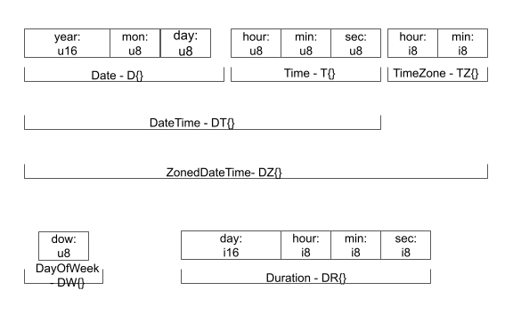

The data types have the following specifications:

- Date `D{year:u16, month:u8, day:u8}`
- Time `T{hour:u8, minute:u8, second:u8}`
- DateTime `DT{year:u16, month:u8, day:u8, hour:u8, minute:u8, second:u8}`
- TimeZone `TZ{hour:i8, minute:i8}`
- ZonedDateTime `DZ{year:u16, month:u8, day:u8, hour:u8, minute:u8, second:u8,
  tzhour:i8, tzminute:i8}`
- DayOfWeek `DW{dow:u8}`
- Duration `DR{days:i16, hours:i8, minutes:i8, seconds:i8}`

The primitive integer types are:

- `u16`: unsigned 16-bit integer, [0, 65535]
- `u8`: unsigned 8-bit integer, [0, 255]
- `i16`: signed 32-bit integer, [-32768, 32767]
- `i8`: signed 8-bit integer, [-128, 127]

If you are familiar with the C++ language, you may think of these Record
specifications as class constructors using brace-initialization, with the class
names being `D`, `T`, `DT`, `TZ`, `DZ`, `DW`, and `DR`.

The RPN stack registers and storage registers have been upgraded to hold these
additional data types.

## DATE Menus

The following menus items are located under the `DATE` menu folder (which can be
found in the 3rd row of the ROOT menu folder: `HOME` (i.e. `MATH`), `DOWN`,
`DOWN`). The subfolders under `DATE` are:

-  (ROOT > DATE)
    - 
    - 
    - `D`: `Date` folder
    - `T`: `Time` folder
    - `DT`: `DateTime` folder
    - `TZ`: `TimeZone` folder
    - `DZ`: `ZonedDateTime` folder
    - `DR`: `Duration` folder
    - `DW`: `DayOfWeek` folder
    - `EPCH`: Epoch folder
    - `CLK`: Clock folder

The DATE functions are organized according to the object type that they are
related to.

## DATE Buttons

Here is a screenshot of the calculator with various buttons that are assigned to
`DATE` related functions:

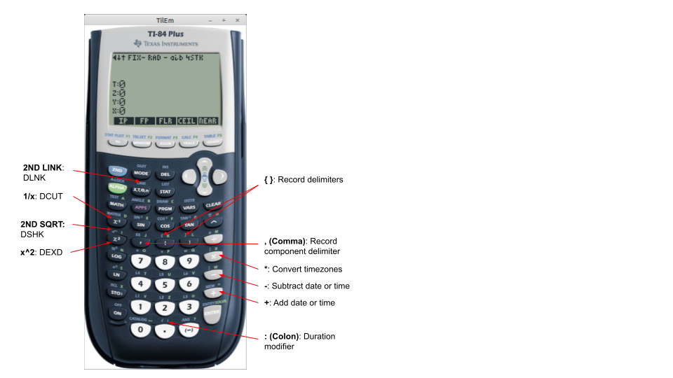

These buttons do *not* require the menu system to be in the `DATE` menu
hierarchy to be active. For example, the arithmetic buttons `+`, `-`, and `*`
act normally for Real and Complex numbers, but invoke slightly different
functions when operating on Date-related objects. Similarly, the `1/x`, `SQRT`
and `x^2` buttons act normally on Real and Complex objects but are bound to the
`DCUT`, `DSHK`, and `DEXD` functions when they operate on Date-related objects.

## Data Entry

### ALPHA Entry

To allow these Record types to be entered using the calculator buttons, the
following keys have been activated:

- `2ND {` (left brace)
- `2ND }` (right brace)
- `ALPHA A` to `ALPHA Z`
- `,` (comma)

The date objects can be entered using the `ALPHA` key to enter the object name
tag, the left brace `{` and right brace `}` keys to delimit the components of
the objects, and the comma key `,` between each component.

For example, to enter the date `March 14, 2024`, we would mentally translate
that into the RFC 3339 format `2024-03-14`, which corresponds to the Date object
`D{2024,3,14}`, which would be entered using the following keystrokes:

| **Keys**          | **Display**                               |
| ----------------  | ---------------------                     |
| `ALPHA D`         |  |
| `2ND {`           |  |
| `2024`            |  |
| `,`               |  |
| `3`               |  |
| `,`               |  |
| `14`              |  |
| `2ND }`           |  |

### Menu Initializer Entry

The key sequence `ALPHA D 2ND {` is cumbersome to type on the TI-83+/84+
keyboard because the letters are arranged alphabetically instead of a QWERTY
layout. Also, the color of the ALPHA letters can be difficult to read on some of
the TI-83+/84+ models under low light conditions.

The Menu Initializer Entry method allows entry of DATE objects without using the
`ALPHA` key at all. Under each DATE object menu folder, the first menu key
causes the initializer sequence of that particular object to be sent directly
into the input buffer.

For example, under the `DATE > D` menu folder, the first menu button is labeled
`D{}`. Pressing the `D{}` button is exactly equivalent to typing in the keyboard
sequence `ALPHA D 2ND {`:

| **Keys**          | **Display**                               |
| ----------------  | ---------------------                     |
| `DATE` `D`        |  |
| `D{}`             |  |
| `2024`            |  |
| `,`               |  |
| `3`               |  |
| `,`               |  |
| `14`              |  |
| `2ND }`           |  |

Here is the complete list of object initializers and their ALPHA keystroke
equivalents:

- `DATE > D > D{}`: `ALPHA D 2ND {`
- `DATE > T > T{}`: `ALPHA T 2ND {`
- `DATE > DT > DT{}`: `ALPHA D ALPHA T 2ND {`
- `DATE > TZ > TZ{}`: `ALPHA T ALPHA Z 2ND {`
- `DATE > DZ > DZ{}`: `ALPHA D ALPHA Z 2ND {`
- `DATE > DR > DR{}`: `ALPHA D ALPHA R 2ND {`
- `DATE > DW > DW{}`: `ALPHA D ALPHA W 2ND {`

### Type Inferred Entry

The Menu Initializer entry method alleviates the need to use the `ALPHA` key.
But one disadvantage of that entry method is that we have to navigate to the
appropriate menu folder under the `DATE` menu.

To allow `DATE` objects to be entered from any context, RPN83P supports **type
inference** using the **arity** of **naked records** whose right-curly-brace
terminator is **optional**. Let's unpack that:

- **naked record**: A record object with just curly braces `{` and `}` without a
  type tag (e.g. `D` or `DT`).
- **[arity](https://en.wikipedia.org/wiki/Arity)**: A fancy word for "the number
  of arguments in a function".
- **type inference**: The program infers the type of the object using the number
  of arguments in the record:
    - 2 arguments: TimeZone `T{..}`
    - 3 arguments: Date `D{..}`
    - 4 arguments: Duration `DR{..}`
    - 6 arguments: DateTime `DT{..}`
    - 8 arguments: ZonedDateTime `DZ{..}`
    - DayOfWeek: not supported, arity of 1 is reserved for future use
    - Time: not supported because arity of 3 conflicts with Date which has the
      same arity
- **optional right brace**: The right curly brace `}` always appears at the end
  of a record so we can make it optional. An `ENTER` key, a function key (e.g.
  `+`, `-`), or a menu function can be pressed without the terminating curly
  brace.

In other words, instead of requiring the object name prefix (e.g. `D` or `DZ`),
only the left curly brace `{` is required, and the right curly brace `}` can be
omitted. For example, the `Date` object `D{2024,3,14}` can be entered as:

| **Keys**          | **Display**                               |
| ----------------  | ---------------------                     |
| `2ND {`           |  |
| `2024`            |  |
| `,`               |  |
| `3`               |  |
| `,`               |  |
| `14`              |  |

Only 5 of the 7 DATE objects support type-inferred entry:
- The DayOfWeek object contains only a single parameter, and would interfere
  with other single-component objects in the future.
- The Time object has 3 parameters which unfortunately interferes with the
  `Date` object which also has 3 parameters.

Here are examples of this entry method for each supported DATE object type:

| **Type**      | **Full Record Entry**         | **Naked Record Entry**    |
| --------------| ----------                    | ----------                |
| DayOfWeek     | `DW{1}`                       | (not supported, reserved) |
| TimeZone      | `TZ{5,30}`                    | `{5,30`                   |
| Date          | `D{2024,3,14}`                | `{2024,3,14`              |
| Time          | `T{15,36,1}`                  | (conflicts with Date)     |
| Duration      | `DR{1,2,3,4}`                 | `{1,2,3,4`                |
| DateTime      | `DT{2024,3,14,15,36,1}`       | `{2024,3,14,15,36,1`      |
| ZonedDateTime | `DT{2024,3,14,15,36,1,-7,0}`  | `{2024,3,14,15,36,1,-7,0` |

## Comma-EE Modes

The TI-83+/84+ keyboard has a comma `,` key as an unshifted primary key. Prior
to v0.10, both the `,` and `2ND EE` keystrokes were mapped to the `EE` function
to allow numbers in scientific notation to be entered easily. However the entry
of the Date objects requires the use of the comma `,` key, so the app now
contains an option to control the behavior of this button under the `MODE` menu:

- 
    - 

If the `,EE` option is selected (factory default), the button behaves as labeled
on the keyboard: the `,` button invokes the comma function, and `2ND EE` invokes
the exponent function. This option is useful to have fast access to the comma
button which is essential for entering the components of the date objects.

If the `EE,` option is selected, the button behavior is inverted: the `,` button
invokes the exponent function, and `2ND EE` button invokes the comma function.
This is option is useful for people who will rarely (or never) use the `DATE`
functions, and want to enter scientific notation numbers easily without going
through an extra `2ND` keystroke.

## Formatting Modes

In the `MODE` menu, there are 2 settings that affect how date objects are
displayed:

- 
    - 

If the `{..}` (Raw Formatting) option is selected (factory default), the date
objects will be displayed in their raw form using curly braces. This will be
identical to the format used to *enter* these objects.

If the `".."` (String Formatting) option is selected, the date objects will be
displayed as human-readable strings using the RFC 3339 specification as much as
practical.

The Raw Formatting (`{..}`) option is the format used to enter the objects, and
is better at showing their internal structure. But it has the disadvantage that
complex objects like ZonedDateTime can overflow the length of a single line.
When this happens, the SHOW Mode (using `2ND ENTRY` keystroke) can be used to
show the entire raw formatting without truncation. The String Formatting mode
(`".."`) is more compact and will always be adjusted to fit entirely into a
single line. Most users will probably switch to String Formatting after an
initial learning period.

In the following sections, the screenshots for both Raw and String Formatting
modes will be shown.

**Pro Tip**: If the `MODE` menu is activated using the `MODE` **button**, the
"Jump Back" feature is enabled so that the `ON/EXIT` button returns to the prior
menu location. This makes it easy to quickly change the `{..}` or `".."`
formatting modes.

## Menu Functions

The DATE menu functions are grouped under the subfolders of `DATE`.

### Date (D)

-  (ROOT > DATE > D)
    - 
    - 
    - 
    - 
    - `D{}`: insert initialization string for `Date` object
    - `>ED`: convert Date to epoch days (assuming UTC)
    - `ED>`: epoch days to Date (assuming UTC)
    - `>ES`: convert Date to epoch seconds (assuming UTC)
    - `ES>`: epoch seconds to Date (assuming UTC)
    - `LEAP`: determine if year of Date is a leap year
    - `DOW`: calculate the DayOfWeek of given Date, DateTime, ZonedDateTime
    - `CVTZ`: convert Date (Y) to TimeZone (X)
    - `.YR`: extract `year` component of Date
    - `.MON`: extract `month` component of Date
    - `.DAY`: extract `day` component of Date
    - `DSHK`: (not defined)
    - `DEXD`: extend Date to DateTime
    - `DCUT`: (not defined)
    - `DLNK`: link Date and Time into DateTime

#### Date Entry

The `Date` object has the form `D{year:u16, month:u8, day:u8}` and represents a
Gregorian calendar date. For example, the date `2024-03-14` is entered into the
calculator as follows, and is displayed in 2 different ways depending on the
MODE setting of `{..}` or `".."`:

| **Keys**              | **MODE `{..}`**                     | **MODE `".."`** |
| ----------------      | ---------------------               | --------------- |
| `D{2024,3,14}`        |    |  |
| `ENTER`               |    |  |
| `2ND ENTER` (SHOW)    |     |  |

**Note**: The Date object `D{2024,3,14}` can be entered in 3 ways:

- ALPHA Entry: `ALPHA D 2ND {` ...
- Menu Initializer: `DATE` `D` `D{}` ...
- Type Inferred: `2ND {` ...

#### Date Validation

Upon input termination, Date components are validated to make sure that it
represents a proper Gregorian calendar date. If the component is invalid, an
`Err:Invalid` error message is displayed.

For example, if we try to enter the invalid date `2024-02-30`, we get:

| **Keys**          | **MODE `{..}`**                              | **MODE `".."`**   |
| ------------------| ---------------------                        | ----------------- |
| `D{2024,2,30}`    |     |  |
| `ENTER`           | 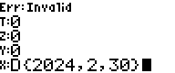    |  |

Notice that for input validation errors like this, the input is not terminated
and the prompt continues to be shown. You can press the `DEL` to delete the
input characters and fix the error.

Here is an incomplete list of validation rules:

- `year` component must be between 1 and 9999
- `month` component must be between 1 and 12
- `day` component must be between 1 and 31, and must be valid for the given
  month

#### Date Functions

The `>ED` function returns the number of days since the Epoch date.
The `ED>` function performs the reverse operation.

The `>ES` function returns the number of seconds since the Epoch date. The `>ES`
function performs the reverse operation. For the purposes of calculating the
epochseconds, the Date object is assumed to be at 00:00:00 (midnight) of that
date in UTC time zone.

The Epoch date is configurable as explained in the [Epoch Date
(EPCH)](#epoch-date-epch) section below but by default, it is set to `UNIX`
which is `1970-01-01`.

For example, let's calculate the those quantities for 2024-03-14:

| **Keys**          | **MODE `{..}`**                          | **MODE `".."`**   |
| -----------       | ---------------------                    | ----------------- |
| `D{2024,3,14}`    |   |  |
| `>ED`             |   |  |
| `ED>`             |   |  |
| `>ES`             |   |  |
| `ES>`             |   |  |

The `LEAP` function determines if the year of the given `Date` object is
a leap year. It returns 1 if true, 0 otherwise.

The `DOW` function returns the `DayOfWeek` object from the given `Date`. The
[DayOfWeek](#dayofweek-dw) object is described in more detail below.

| **Keys**          | **MODE `{..}`**                             | **MODE `".."`**   |
| -----------       | ---------------------                       | ----------------- |
| `D{2024,3,14}`    |   |  |
| `LEAP`            |   |  |
| `2ND ANS` (LASTX) |   |  |
| `DOW`             |   |  |

TODO: Add screenshots of `CVTZ` function.

#### Date Components

There are 3 menu functions which allow the user to extract the individual
components of the `Date` object: `.YR` (year component), `.MON` (month
component), and `.DAY` (day component):

| **Keys**          | **MODE `{..}`**                               | **MODE `".."`**   |
| -----------       | ---------------------                         | ----------------- |
| `D{2024,3,14}`    |   |  |
| `.YR`             |   |  |
| `2ND ANS` (LASTX) |   |  |
| `.MON`            |   |  |
| `2ND ANS` (LASTX) |   |  |
| `.DAY`            |   |  |

#### Date Casting

The last 4 menu functions `DSHK`, `DEXD`, `DCUT`, and `DLNK` allow the `Date`
object to be converted to other Date-related objects (known as "casting"). For
the `Date` object, only the `DEXD` and `DLNK` functions are applicable but all 4
menu functions are present in the menu for consistency with the `DateTime` and
`ZonedDateTime` objects.

The `DEXD` function extends the `Date` object into a `DateTime` object by
appending a `Time` object of midnight `00:00:00`.

| **Keys**                  | **MODE `{..}`**                                 | **MODE `".."`**   |
| -----------               | ---------------------                           | ----------------- |
| `D{2024,3,14}` `ENTER`    |   |  |
| `DEXD`                    |   |  |

The `DLNK` function merges a `Date` object (X or Y) and a given `Time` object in
(X or Y) into a `DateTime` object.

| **Keys**                  | **MODE `{..}`**                                 | **MODE `".."`**   |
| -----------               | ---------------------                           | ----------------- |
| `D{2024,3,14}` `ENTER`    |   |  |
| `T{1,2,3}`                |   |  |
| `DLNK`                    |   |  |

#### Date Arithmetic

Addition and subtraction operations are supported as shown in the following
table:

| **Operation**             | **Result**|
| ------------------------- | ----------|
| {Date} + {integer}        | {Date}    |
| {integer} + {Date}        | {Date}    |
| {Date} - {integer}        | {Date}    |
| {Date} - {Date}           | {integer} |
| {integer} - {Date}        | INVALID   |

When operating on `Date` objects, integer values are assumed to be in units of
`days`. For example, let's add 20 days to the date of 2024-03-14, then
subtract 30 days from that result:

| **Keys**          | **MODE `{..}`**                         | **MODE `".."`**   |
| ------------------| ---------------------                   | ----------------- |
| `D{2024,3,14}`    |    |  |
| `ENTER`           |    |  |
| `20`              |    |  |
| `+`               |    |  |
| `30`              |    |  |
| `-`               |    |  |

We can subtract 2 Date records to obtain the number of whole days between the 2
dates:

| **Keys**          | **MODE `{..}`**                         | **MODE `".."`**   |
| ------------------| ---------------------                   | ----------------- |
| `D{2024,12,25}`   |    |  |
| `ENTER`           |    |  |
| `D{2024,3,14}`    |    |  |
| `-`               |    |  |

There are 286 days from March 14 to Dec 25, 2024.

### Time (T)

-  (ROOT > DATE > T)
    - 
    - 
    - `T{}`: insert initialization string for `Time` object
    - `>S`: convert Time to seconds after midnight
    - `S>`: convert seconds after midnight to Time
    - `.HR`: extract `hour` component of Time
    - `.MIN`: extract `minute` component of Time
    - `.SEC`: extract `second` component of Time

#### Time Entry

The `Time` object has the form `T{hour:u8, minute:u8, second:u8}`. For example,
the time `15:36:01` is entered into the calculator like this:

| **Keys**              | **MODE `{..}`**                     | **MODE `".."`**   |
| ------------------    | ---------------------               | ----------------- |
| `T{15,36,1}`          |    |  |
| `ENTER`               |    |  |
| `2ND ENTER` (SHOW)    |     |  |

**Note**: The Time object `T{15,36,1}` can be entered in 2 ways:

- ALPHA Entry: `ALPHA T 2ND {` ...
- Menu Initializer: `DATE` `T` `T{}` ...
- Type Inferred: (not allowed due to conflict with Date objects)

#### Time Validation

The validation rules for a `Time` record is more straightforward than a `Date`
record:

- the `hour` component must be in the interval [0, 23]
- the `minute` component must be in the interval [0, 59]
- the `second` component must be in the interval [0, 59], leap seconds not
  supported

For example, if we try to enter the invalid Time `23:59:60`, we get:

| **Keys**          | **MODE `{..}`**                           | **MODE `".."`**   |
| ------------------| ---------------------                     | ----------------- |
| `T{23,30,60}`     |  |  |
| `ENTER`           | 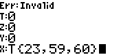 |  |

Notice that for input validation errors like this, the input is not terminated
and the prompt continues to be shown. You can press the `DEL` to delete the
input characters and fix the error.

#### Time Functions

The `>S` and `S>` menu functions convert between a Time object and the
integer number of seconds since midnight `00:00:00`. This will will always be a
non-negative number:

For example, let's convert `15:35:01` to the number of seconds, then back to a
Time object:

| **Keys**          | **MODE `{..}`**                                | **MODE `".."`**   |
| ------------------| ---------------------                          | ----------------- |
| `T{15,36,1}`      |    |  |
| `>S`              |    |  |
| `S>`              |    |  |

#### Time Components

There are 3 menu functions which allow the user to extract the individual
components of the `Time` object: `.HR` (hour component), `.MIN` (minute
component), and `.SEC` (second component):

| **Keys**          | **MODE `{..}`**                               | **MODE `".."`**   |
| -----------       | ---------------------                         | ----------------- |
| `T{15,36,1}`      |   |  |
| `.HR`             |   |  |
| `2ND ANS` (LASTX) |   |  |
| `.MIN`            |   |  |
| `2ND ANS` (LASTX) |   |  |
| `.SEC`            |   |  |

#### Time Arithmetic

Just like `Date` records, addition and subtraction operations are supported as
summarized in the following table:

| **Operation**             | **Result**|
| ------------------------- | --------- |
| {Time} + {integer}        | {Time}    |
| {integer} + {Time}        | {Time}    |
| {Time} - {integer}        | {Time}    |
| {Time} - {Time}           | {integer} |
| {integer} - {Time}        | INVALID   |

There are 2 important differences:

1. The integers are in units of *seconds*, not *days*, and
2. If the resulting `Time` is less than `00:00:00` or greater than `24:00:00`,
the resulting time is renormalized so that it becomes within those bounds. In
other words, addition and subtraction operations are performed modulo 86400
seconds.

Let's perform some arithmetic operations on the Time value, for example, add 234
seconds, then subtract 100,000 seconds:

| **Keys**          | **MODE `{..}`**                         | **MODE `".."`**   |
| ------------------| ---------------------                   | ----------------- |
| `T{15,36,1}`      |    |  |
| `ENTER`           |    |  |
| `234`             |    |  |
| `+`               |    |  |
| `100000`          |    |  |
| `-`               |    |  |

Since 100,000 seconds is more than 1 day, the Time object wraps around.

Just like the Date object, we can subtract 2 Time objects to obtain the number
of seconds between the 2 objects:

| **Keys**          | **MODE `{..}`**                         | **MODE `".."`**   |
| ------------------| ---------------------                   | ----------------- |
| `T{15,36,1}`      |    |  |
| `ENTER`           |    |  |
| `T{17,0,0}`       |    |  |
| `-`               |    |  |

There are 5039 seconds between `15:36:01` and `17:00:00`.

### DateTime (DT)

-  (ROOT > DATE > DT)
    - 
    - 
    - 
    - `DT{}`: insert initialization string for `DateTime` object
    - `>ED`: convert DateTime to epoch days (assuming UTC)
    - `ED>`: epoch days to DateTime (assuming UTC)
    - `>ES`: convert DateTime to epoch seconds (assuming UTC)
    - `ES>`: epoch seconds to DateTime (assuming UTC)
    - `LEAP`: determine if given year is a leap year
    - `DOW`: calculate the DayOfWeek of given DateTime
    - `CVTZ`: convert DateTime (in Y) to the TimeZone (in X)
    - `.D{}`: extract the Date from the DateTime
    - `.T{}`: extract the Time from the DateTime
    - `DSHK`: shrink a DateTime to a Date by truncating the TimeZone
    - `DEXD`: extend DateTime into ZonedDateTime by adding a UTC TimeZone
    - `DCUT`: cut (split) a DateTime into a Date and Time
    - `DLNK`: link (merge) Date and Time into a DateTime

#### DateTime Entry

A DateTime record is a concatenation of the Date record and a Time record. It
has the format `DT{year:u16, month:u8, day:u8, hour:u8, minute:u8, second:u8}`.

For example, the date `2024-03-14 15:36:01` would be entered like this:

| **Keys**                  | **MODE `{..}`**                           | **MODE `".."`**               |
| ------------------------- | ---------------------                     | -----------------             |
| `DT{2024,3,14,15,36,1}`   |     |  |
| `ENTER`                   | 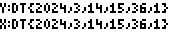    |  |
| `2ND ENTER` (SHOW)        | 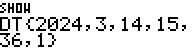     |  |

**Note**: The DateTime object `DT{2024,3,14,15,36,1}` can be entered in 3 ways:

- ALPHA Entry: `ALPHA D ALPHA T 2ND {` ...
- Menu Initializer: `DATE` `DT` `DT{}` ...
- Type Inferred: `2ND {` ...

#### DateTime Validation

The validation rules of the `DateTime` object is the union of the validation
rules for the `Date` record and the rules for the `Time` record.

For example, if we try to enter the invalid DateTime `2024-03-14 23:59:60`, we
get:

| **Keys**                  | **MODE `{..}`**                                | **MODE `".."`**   |
| ------------------        | ---------------------                          | ----------------- |
| `DT{2024,3,14,23,30,60}`  |  |  |
| `ENTER`                   |  | 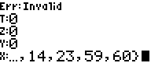 |

#### DateTime Functions

A `DateTime` object support the same `>ED`, `>ED`, `>ES`, and `ES>` functions as
the `Date` object.

For example, let's calculate those quantities for 2024-03-14 15:36:01:

| **Keys**                  | **MODE `{..}`**                               | **MODE `".."`**   |
| -----------               | ---------------------                         | ----------------- |
| `DT{2024,3,14,15,36,1}`   |   |  |
| `>ED`                     |   |  |
| `ED>`                     |   |  |
| `DT{2024,3,14,15,36,1}`   |   |  |
| `>ES`                     |   |  |
| `ES>`                     |   |  |

Notes:

- When performing these calculations, the `DateTime` object is presumed to be in
  the UTC timezone.
- When a `DateTime` is converted into EpochDays, the `Time` component becomes
  truncated to midnight.

#### DateTime Arithmetic

The addition and subtraction operations are available on the `DateTime` object,
just like `Date` and `Time`. The integer numbers are in unit of *second*.

| **Operation**             | **Result**    |
| --------------------------| ------------- |
| {DateTime} + {integer}    | {DateTime}    |
| {integer} + {DateTime}    | {DateTime}    |
| {DateTime} - {integer}    | {DateTime}    |
| {DateTime} - {DateTime}   | {integer}     |
| {integer} - {DateTime}    | INVALID       |

For example, let's subtract 100,000 seconds from `2024-03-14 15:39:55`:

| **Keys**                  | **MODE `{..}`**                               | **MODE `".."`**               |
| ------------------------- | ---------------------                         | -----------------             |
| `DT{2024,3,14,15,36,1}`   |     |  |
| `ENTER`                   |     |  |
| `100000`                  | 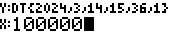    |  |
| `-`                       | 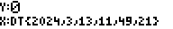    |  |

We can subtract 2 `DateTime` objects:

|  **Keys**                 |  **MODE `{..}`**                              |  **MODE `".."`**              |
| ------------------------- | ---------------------                         | -----------------             |
| `DT{2024,12,25,0,0,0}`    |     |  |
| `ENTER`                   |     |  |
| `DT{2024,3,14,15,36,1}`   |     | 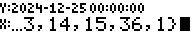 |
| `-`                       |     |  |

There are 24654239 seconds from March 13, 2024 15:39:55 to Christmas Dec 25,
2024 00:00:00.

We can convert the 24654239 seconds quantity into something that is easier to
understand for humans by converting it into a `Duration` object. (The `Duration`
object is described in more detail in the [Duration (DR)](#duration-dr) section
below.)

Go to `DATE` menu folder, then press the `DR` folder. The `SEC>` menu function
converts the number of seconds to a `Duration` object:

|  **Keys**     |  **MODE `{..}`**                                      |  **MODE `".."`**        |
| ----------    | ---------------------                                 | -----------------       |
| `DATE` `DR`   |    |  |
| `SEC>`        |    |  |

We can now see that there are 285 days, 8 hours, 23 minutes, and 59 seconds
between March 13, 2024 15:39:55 to Christmas Dec 25, 2024 00:00:00.

### TimeZone (TZ)

-  (ROOT > DATE > TZ)
    - 
    - 
    - `TZ{}`: insert initialization string for `TimeZone` object
    - `>HR`: convert TimeZone to floating point hours
    - `HR>`: convert floating point hours into TimeZone
    - `.HR`: extract `hour` component of TimeZone
    - `.MIN`: extract `minute` component of TimeZone

### TimeZone Entry

The TimeZone object has the form `TZ{hour:i8, minute:i8}`. It represents a fixed
offset from UTC. As noted earlier, the RPN83P does not currently support
timezones with automatic DST transitions, such as those defined by the IANA TZ
database. Daylight saving time changes must be handled manually. For example,
the standard offset for `America/Los_Angeles` is UTC-08:00 during the winter
months, and changes to UTC-07:00 during the summer months.

| **Keys**              | **MODE `{..}`**                          | **MODE `".."`**   |
| -----------           | ---------------------                    | ----------------- |
| `TZ{-8,0}`            |    |  |
| `ENTER`               |    |  |
| `2ND ENTER` (SHOW)    |     |  |

**Note**: The Time object `TZ(-8,0}` can be entered in 3 ways:

- ALPHA Entry: `ALPHA T ALPHA Z 2ND {` ...
- Menu Initializer: `DATE` `TZ` `TZ{}` ...
- Type Inferred: `2ND {` ...

#### TimeZone Validation

The validation rules for a TimeZone object are:

- a timezone must be a multiple of 0:15 minutes
- a timezone can span from [-23:45,+23:45]. This is sufficient to capture all
  timezones currently in use around the world, which fall within the range of
  UTC-12:00 to UTC+14:00.
- the signs of the `hour` and `minute` components must match each other

Here is an example of an invalid timezone whose `hour` and `minute` have the opposite sign:

| **Keys**    | **MODE `{..}`**                                | **MODE `".."`**   |
| ----------- | ---------------------                          | ----------------- |
| `TZ{-4,30}` |  |  |
| `ENTER`     | 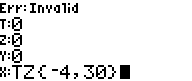 |  |

#### TimeZone Functions

The TimeZone object can be converted to and from a floating point number
representing the number of hours shifted from UTC. These are exposed using the
`TZ>H` and `H>TZ` menu items:


To convert `TZ{-4,-30}` to hours then back to a TimeZone object:

| **Keys**     | **MODE `{..}`**                                   | **MODE `".."`**   |
| -------------| ---------------------                             | ----------------- |
| `TZ{-4,-30}` |    |  |
| `TZ>H`       |    |  |
| `H>TZ`       |    |  |

All current timezones in the world are at multiples of 0:15 minutes. So the
`H>TZ` function will accept only floating values which are multiples of 0.25.
For example, `8.75` for `TZ{8,45}`, and `-2.5` for `TZ{-2,-30}`. Otherwise, an
`Err:Domain` will be shown.

#### TimeZone Arithmetic

Arithmetic operations (addition, subtraction) on TimeZone objects are defined
mostly for consistency, and are not expected to be used often. They can be used
to change from normal UTC offset to DST offset manually, for example, to go from
UTC-08:00 for Pacific Standard Time in the US, to UTC-07:00 for Pacific Daylight
Time during the summer months.

Addition and subtraction operations are supported as shown in the following
table:

| **Operation**             | **Result** |
| ------------------------- | ---------- |
| {TimeZone} + {float}      | {TimeZone} |
| {float} + {TimeZone}      | {TimeZone} |
| {TimeZone} - {float}      | {TimeZone} |
| {TimeZone} - {TimeZone}   | {float}    |
| {float} - {TimeZone}      | INVALID    |

When operating on `TimeZone` objects, float values are in units of `hours` and
must be in multiples of 0.25 hours because UTC offsets must be in multiples of
15 minutes.

For example, let's add 1 hour to UTC-08:00 to get to UTC-07:00:

| **Keys**          | **MODE `{..}`**                              | **MODE `".."`**   |
| ------------------| ---------------------                        | ----------------- |
| `TZ{-8,0}`        |    |  |
| `ENTER`           |    |  |
| `1`               |    |  |
| `+`               |    |  |

We can subtract 2 TimeZone objects to obtain the number of hours between the 2
timezones:

| **Keys**          | **MODE `{..}`**                              | **MODE `".."`**   |
| ------------------| ---------------------                        | ----------------- |
| `TZ{1,0}`         |    |  |
| `ENTER`           |    |  |
| `TZ{-8,0}`        |    |  |
| `-`               |    |  |

There is a 9-hour difference from UTC+01:00 and UTC-08:00.

### ZonedDateTime (DZ)

-  (ROOT > DATE > DZ)
    - 
    - 
    - 
    - 
    - `DZ{}`: insert initialization string for `ZonedDateTime` object
    - `>ED`: convert ZonedDateTime to epoch days (assuming UTC)
    - `ED>`: epoch days to ZonedDateTime (assuming UTC)
    - `>ES`: convert ZonedDateTime to epoch seconds (assuming UTC)
    - `ES>`: epoch seconds to ZonedDateTime (assuming UTC)
    - `ES>@`: epoch seconds to ZonedDateTime (assuming UTC)
    - `LEAP`: determine if given year is a leap year
    - `DOW`: calculate the DayOfWeek of given ZonedZonedDateTime
    - `CVTZ`: convert ZonedDateTime (in Y) to the TimeZone (in X)
    - `.D{}`: extract the Date from the ZonedDateTime
    - `.T{}`: extract the Time from the ZonedDateTime
    - `.DT{}`: extract the DateTime from the ZonedDateTime
    - `.TZ{}`: extract the Time from the ZonedDateTime
    - `DSHK`: shrink a ZonedDateTime into a DateTime by truncating the
        TimeZone
    - `DEXD`: (not defined)
    - `DCUT`: cut (split) a ZonedDateTime into a DateTime and TimeZone
    - `DLNK`: (not defined)

#### ZonedDateTime Entry

The ZonedDateTime is a combination of Date, Time, and TimeZone. It has the form
`DZ{year:u16, month:u8, day:u8, hour:u8, minute:u8, second:u8, tzhour:i8,
tzminute:i8}`. It describes the local time of a specific place that uses a
specific UTC offset.

Here is an example of entering the date `2024-03-14 15:36:01-07:00` which
occurred in `America/Los_Angeles` timezone after the DST shift on March 10,
2024:

| **Keys**                      | **MODE `{..}`**                              | **MODE `".."`**                   |
| -------------------------     | ---------------------                        | -----------------                 |
| `DZ{2024,3,14,15,36,1,-7,0}`  |   |  |
| `ENTER`                       |   |  |
| `2ND ENTER` (SHOW)            | 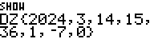  |  |

ZonedDateTime objects with a UTC offset of +00:00 are special, and it is useful
to display them slightly differently. Here is how the date 2024-03-14 22:36:00
UTC is entered and displayed:

| **Keys**                      | **MODE `{..}`**                                  | **MODE `".."`**                   |
| -------------------------     | ---------------------                            | -----------------                 |
| `DZ{2024,3,14,22,36,1,0,0}`   |   |  |
| `ENTER`                       | 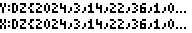  |  |
| `2ND ENTER` (SHOW)            | 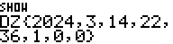  |  |

**Note**: The ZonedDateTime object `DZ{2024,3,14,15,36,1,-7,0}` can be entered
in 3 ways:

- ALPHA Entry: `ALPHA D ALPHA Z 2ND {` ...
- Menu Initializer: `DATE` `DZ` `DZ{}` ...
- Type Inferred: `2ND {` ...

#### ZonedDateTime Validation

The validation rules of the `ZonedDateTime` is the union of the validation rules
for the `Date`, `Time`, and `TimeZone` objects.

#### ZonedDateTime Functions

A ZonedDateTime object can be converted into an integer that represents the
number of seconds from the Epoch date. By default, the Epoch date is 1970-01-01
but it can be changed using the `EPCH` menu items described in the [Epoch
Date](#epoch-date) section below. The menu functions for conversion are the
`D*>S`, `S>DZ`, and `S>UT` functions:


- `D*>S`: convert ZonedDateTime to epochseconds
- `S>UT`: convert the epochseconds to the ZonedDateTime using UTC timezone
- `S>DZ`: convert the epochseconds to the ZonedDateTime using the current
  Application Timezone. The result of this function depends on 2 configurable
  context variables:
    - the [Application Timezone](#setting-the-application-timezone), defined by
      the `TZ` menu function
    - the [Epoch Date](#epoch-date), defined by the `EPCH` menu group

For example, let's `2024-03-14 15:36:01-07:00` to epochseconds, then back to
ZonedDateTime, then to UTC DateTime:

| **Keys**                      | **MODE `{..}`**                                          | **MODE `".."`**                   |
| -------------------------     | ---------------------                                    | -----------------                 |
| `DZ{2024,3,14,15,36,1,-7,0}`  |    |  |
| `D*>S`                        |    |  |
| `S>UT`                        |    |  |
| `D*>S`                        |    |  |
| `S>DZ`                        |    |  |

The final conversion from epochseconds to ZonedDateTime returns the original
`2024-03-14 15:36:01-07:00` because I had set my Application Timezone to
`UTC-07:00`.

#### ZonedDateTime Arithmetic

The addition and subtraction operations are available on the `ZonedDateTime`
object, just like the `DateTime` object. The integer numbers are in unit of
*second*.

| **Operation**                     | **Result**        |
|-----------------------------------|-------------------|
| {ZonedDateTime} + {integer}       | {ZonedDateTime}   |
| {integer} + {ZonedDateTime}       | {ZonedDateTime}   |
| {ZonedDateTime} - {integer}       | {ZonedDateTime}   |
| {ZonedDateTime} - {ZonedDateTime} | {integer}         |
| {integer} - {ZonedDateTime}       | INVALID           |

The resulting ZonedDateTime will have the same TimeZone offset as the input
ZonedDateTime.

For example, let's add 100_000 seconds to `2024-03-14 15:36:01-07:00`:

| **Keys**                      | **MODE `{..}`**                                  | **MODE `".."`**                   |
| -------------------------     | ---------------------                            | -----------------                 |
| `DZ{2024,3,14,15,36,1,-7,0}`  |   |  |
| `ENTER`                       |   |  |
| `100000`                      | 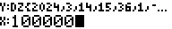  | 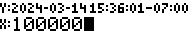 |
| `+`                           | 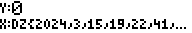  | 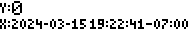 |

We can subtract 2 `ZonedDateTime` objects to obtain the number of seconds
between them. Their TimeZone components are not required to be same. For
example, let's determine the number of seconds from March 14, 2024 UTC-07:00 to
December 25, 2024 UTC:

| **Keys**                      | **MODE `{..}`**                                  | **MODE `".."`**                   |
| -------------------------     | ---------------------                            | -----------------                 |
| `DZ{2024,12,25,0,0,0,0,0}`    |   |  |
| `ENTER`                       | 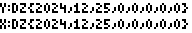  |  |
| `DZ{2024,3,14,15,36,1,-7,0}`  | 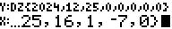  | 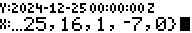 |
| `-`                           |   |  |
| `S>DR`                        |   |  |

As before, we have used the `S>DR` menu function to convert `seconds` to
a `Duration` object which can be more useful in some situations.

### Duration (DR)

-  (ROOT > DATE > DR)
    - 
    - 
    - `DR{}`: insert initialization string for `Duration` object
    - `DAY>`: convert days into Duration
    - `HR>`: convert hours into Duration
    - `MIN>`: convert minutes into Duration
    - `SEC>`: convert seconds into Duration
    - `>S`: convert Duration into seconds
    - `.DAY`: extract `day` component of Duration
    - `.HR`: extract `hour` component of Duration
    - `.MIN`: extract `minute` component of Duration
    - `.SEC`: extract `second` component of Duration

#### Duration Entry

The `Duration` object has the form `DR{days:i16, hours:i8, minutes:i8,
seconds:i8}`. It can be a positive or a negative quantity.

For example, a positive `Duration` object would be:

| **Keys**              | **MODE `{..}`**                           | **MODE `".."`**   |
| -----------           | ---------------------                     | ----------------- |
| `DR{1,2,3,4}`         |    |  |
| `ENTER`               |    |  |
| `2ND ENTER` (SHOW)    |     |  |

A negative duration would be:

| **Keys**              | **MODE `{..}`**                           | **MODE `".."`**   |
| -----------           | ---------------------                     | ----------------- |
| `DR{-4,0,-2,0}`       |    |  |
| `ENTER`               |    |  |
| `2ND ENTER` (SHOW)    |     |  |

Notice that for negative durations, all the components must be negative (or
zero). Also notice that when a Duration component is exactly 0, that component
is omitted from the human-readable string format (in the case above, the `0h`
and `0s` components).

The `days` component is restricted to 4 digits, so the largest magnitude is
`9999`. Therefore, the largest duration that can be represented by the
Duration object is `9999d 23h 59m 59s` or about 24.3 years.

**Note**: The Duration object `DR{1,2,3,4}` can be entered in 4 ways:

- ALPHA Entry: `ALPHA D ALPHA R 2ND {` ...
- Menu Initializer: `DATE` `DR` `DR{}` ...
- Type Inferred: `2ND {` ...
- Compact string: `1` `ALPHA D` `2` `ALPHA H` `3` `ALPHA M` `4` `ALPHA S` (see
  next)

#### Duration Compact Entry

We sometimes want to quickly enter a single component of a Duration object
without having to enter the `0` values for the other components. For example, to
enter "2 minutes", we would have to enter `DR{0,0,2,0}`, and for "12 hours", we
would need to enter `DR{0,12,0,0}`.

The RPN83P app provides a shortcut using compact strings using digits
and one or more of the letters (`S`, `M`, `H`, `D`) in the following way:

- `ddddD` - shortcut for `DR{dddd,0,0,0}`, i.e. "dddd days"
- `hhH` - shortcut for `DR{0,hh,0,0}`, i.e. "hh hours"
- `mmM` - shortcut for `DR{0,0,mm,0}`, i.e. "mm minutes"
- `ssS` - shortcut for `DR{0,0,0,ss}`, i.e. "ss seconds"

The letter modifiers can be strung together in any combination.

For example, here is how to enter the Duration objects (1d 3m) and (2h 4s) using
the compact string notation:

| **Keys**                      | **MODE `{..}`**                                   | **MODE `".."`**   |
| ---------                     | ---------------------                             | ----------------- |
| `1` `ALPHA D` `3` `ALPHA M`   |     |  |
| `ENTER`                       |     |  |
| `2` `ALPHA H` `4` `ALPHA S`   |     |  |
| `ENTER`                       |     |  |

#### Duration Validation

The components of the Duration object has the following validation rules:

- `days` is currently limited to 4 digits [-9999,9999]
- `hours` must be in the interval [-23,23]
- `minutes` must be in the interval [-59,59]
- `seconds` must be in the interval [-59,59]
- all components must have the same sign (or zero)

#### Duration Functions

A Duration object can be converted to its equivalent integer in unit of seconds.
The menu functions are `D*>S` and `S>DR`:


Here are some examples:

| **Keys**          | **MODE `{..}`**                                      | **MODE `".."`**   |
| -----------       | ---------------------                                | ----------------- |
| `DR{1,2,3,4}`     |     |  |
| `D*>S`            |     |  |
| `S>DR`            |     |  |
| `DR{-4,0,-2,0}`   |     |  |
| `D*>S`            |     |  |
| `S>DR`            |     |  |
| `2:H`             |     |  |
| `D*>S`            | 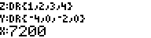    | 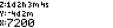 |
| `S>DR`            | 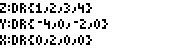    | 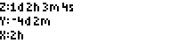 |

#### Duration Arithmetic

Basic addition and subtraction operations are defined on Duration objects:

| **Operation**                 | **Result**        |
|-------------------------------|-------------------|
| {Duration} + {integer}        | {Duration}        |
| {integer} + {Duration}        | {Duration}        |
| {Duration} + {Duration}       | {Duration}        |
| {Duration} - {integer}        | {Duration}        |
| {Duration} - {Duration}       | {Duration} [1]    |
| {integer} - {Duration}        | {Duration} [2]    |

[1] Subtracting 2 Duration objects results in another Duration object. This is
different from other date-time objects where subtracting 2 objects of the same
type produces an integer.

[2] A Duration can be subtracted from an integer and the result is another
Duration. This is an INVALID operation for all other date-time types.

Here are some examples of addition and subtraction operations involving Duration
objects:

| **Keys**          | **MODE `{..}`**                           | **MODE `".."`**   |
| -----------       | ---------------------                     | ----------------- |
| `DR{1,2,0,1}`     |    |  |
| `ENTER`           |    |  |
| `60` (seconds)    |    |  |
| `+`               |    |  |
| `DR{-4,0,-2,0}`   |    |  |
| `-`               |    |  |
| `-2:H`            |    |  |
| `+`               |    |  |
| `+/-` (-)         |    |  |

The Duration object is even more useful when it is used with other date-time
objects like Date, Time, DateTime, and ZonedDateTime. As a rule of thumb, it can
be used where an integer would normally be used:

| **Operation**                 | **Result**        |
|-------------------------------|-------------------|
| {Date} + {Duration}           | {Date}            |
| {Duration} + {Date}           | {Date}            |
| {Date} - {Duration}           | {Date}            |
| {Duration} - {Date}           | INVALID           |
|                               |                   |
| {Time} + {Duration}           | {Time}            |
| {Duration} + {Time}           | {Time}            |
| {Time} - {Duration}           | {Time}            |
| {Duration} - {Time}           | INVALID           |
|                               |                   |
| {DateTime} + {Duration}       | {DateTime}        |
| {Duration} + {DateTime}       | {DateTime}        |
| {DateTime} - {Duration}       | {DateTime}        |
| {Duration} - {DateTime}       | INVALID           |
|                               |                   |
| {TimeZone} + {Duration}       | {TimeZone}        |
| {Duration} + {TimeZone}       | {TimeZone}        |
| {TimeZone} - {Duration}       | {TimeZone}        |
| {Duration} - {TimeZone}       | INVALID           |
|                               |                   |
| {ZonedDateTime} + {Duration}  | {ZonedDateTime}   |
| {Duration} + {ZonedDateTime}  | {ZonedDateTime}   |
| {ZonedDateTime} - {Duration}  | {ZonedDateTime}   |
| {Duration} - {ZonedDateTime}  | INVALID           |

For example, let's add the Duration `2h 33m` to the Time `12:58:32`:

| **Keys**          | **MODE `{..}`**                               | **MODE `".."`**   |
| -----------       | ---------------------                         | ----------------- |
| `T{12,58,32}`     |   |  |
| `ENTER`           |   |  |
| `DR{0,2,33,0}`    |   |  |
| `+`               |   |  |

Another example, let's add 30 days to the DateTime `2024-03-14 12:58:32`:

| **Keys**                  | **MODE `{..}`**                                   | **MODE `".."`**   |
| -----------               | ---------------------                             | ----------------- |
| `DT{2024,3,14,12,58,32}`  |   |  |
| `ENTER`                   | 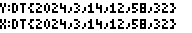  |  |
| `30:D`                    | 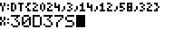  |  |
| `+`                       | 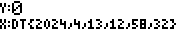  |  |

### DayOfWeek (DW)

-  (ROOT > DATE > DW)
    - 
    - `DW{}`: insert initialization string for `DayOfWeek` object
    - `>ISO`: convert DayOfWeek into ISO day of week number (Mon=1,Sun=7)
    - `ISO>`: convert ISO day of week number into DayOfWeek (Mon=1,Sun=7)
    - `>UNX`: convert DayOfWeek into Unix day of week number (Sun=0,Sat=6)
    - `UNX>`: convert Unix day of week number into DayOfWeek (Sun=0,Sat=6)

#### DayOfWeek Entry

The `DayOfWeek` object has the form `DW{dow:u8}`, where the `dow` field is a
single integer containing the [ISO Weekday
number](https://en.wikipedia.org/wiki/ISO_8601), where Monday is represented by
1 and Sunday is represented by 7. For example, Thursday has an ISO weekday value
of 4 and can be entered as:

| **Keys**              | **MODE `{..}`**                          | **MODE `".."`**   |
| -----------           | ---------------------                    | ----------------- |
| `DW{4}`               |   |  |
| `ENTER`               |   |  |
| `2ND ENTER` (SHOW)    |    |  |

**Note**: The DayOfWeek object `DW{4}` can be entered in 2 ways:

- ALPHA Entry: `ALPHA D ALPHA W 2ND {` ...
- Menu Initializer: `DATE` `DW` `DW{}` ...
- Type Inferred: (not available)

#### DayOfWeek Validation

Upon input termination, the `dow` component is validated and if the component is
invalid, an `Err:Invalid` error message is displayed. For example, if we try to
enter the invalid DayOfWeek value of `DW{0}`, an error is shown:

| **Keys**   | **MODE `{..}`**                                 | **MODE `".."`**   |
| -----------| ---------------------                           | ----------------- |
| `DW{0}`    |  |  |
| `ENTER`    | 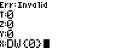 |  |

#### DayOfWeek Functions

The `DOW` menu function returns the DayOfWeek of a given Date, DateTime, or
ZonedDateTime:


| **Keys**                      | **MODE `{..}`**                              | **MODE `".."`**               |
| -------------------------     | ---------------------                        | -----------------             |
| `D{2024,3,14}`                |   |  |
| `DOW`                         |   |  |
| `DT{2024,3,14,15,36,1}`       | 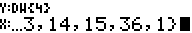  |  |
| `DOW`                         |   |  |
| `DZ{2024,3,14,15,36,1,-7,0}`  | 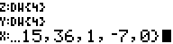  | 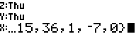 |
| `DOW`                         | 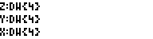  |  |

#### DayOfWeek Arithmetic

Although addition and subtraction operations are not likely to be used often,
they have been implemented for the DayOfWeek object for consistency. For
example, to add 6 days to Thursday, we can enter:

| **Keys**   | **MODE `{..}`**                             | **MODE `".."`**   |
| -----------| ---------------------                       | ----------------- |
| `DW{4}`    |  |  |
| `ENTER`    |  |  |
| `6`        |  |  |
| `+`        |  |  |

We can also subtract 2 DayOfWeek objects to get the number of days between them:

| **Keys**   | **MODE `{..}`**                             | **MODE `".."`**   |
| -----------| ---------------------                       | ----------------- |
| `DW{4}`    |  |  |
| `ENTER`    |  |  |
| `DW{5}`    |  |  |
| `-`        |  |  |

## Timezone Conversions

A ZonedDateTime with a specific timezone (e.g. UTC-07:00) can be converted to
another ZonedDateTime with a different timezone (e.g. UTC+13:00). To allow this
conversion to be performed quickly, the RPN83P app uses the multiplication
button `*` to perform the conversion:

| **Operation**                 | **Result**        |
|-------------------------------|-------------------|
| {ZonedDateTime} * {float}     | {ZonedDateTime}   |
| {ZonedDateTime} * {TimeZone}  | {ZonedDateTime}   |
| {float} * {ZonedDateTime}     | {ZonedDateTime}   |
| {TimeZone} * {ZonedDateTime}  | {ZonedDateTime}   |

The `*` operator takes 2 arguments and extracts the timezones as follows:

- the *source* timezone is contained in the ZoneDateTime object
- the *target* timezone is given as a TimeZone object or a floating point
  equivalent of the timezone (e.g. `UTC-02:30` can be given as `-2.5`)

Let's convert the datetime 2024-03-14 15:36:01-07:00 (Pacific Time, USA) to the
following timezones:

- UTC+13:00 (Auckland, New Zealand)
- UTC+05:30 (India)
- UTC-02:30 (Newfoundland, Canada)
- UTC-00:00 (UTC)

For illustration purposes, I use both the floating point number format and the
`TZ` record format to specify the target timezones below. In practice, I usually
use floating point numbers when doing this calculation because they are easier
to enter on a calculator keypad:

| **Keys**                      | **MODE `{..}`**                               | **MODE `".."`**                   |
| -------------------------     | ---------------------                         | -----------------                 |
| `DZ{2024,3,14,15,36,1,-7,0}`  |   |  |
| `ENTER`                       | 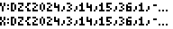  | 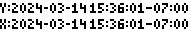 |
| `13`                          | 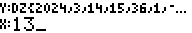  | 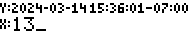 |
| `*`                           | 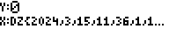  | 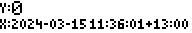 |
| `TZ{5,30}`                    | 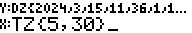  | 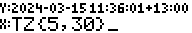 |
| `*`                           | 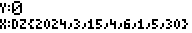  | 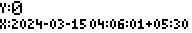 |
| `-2.5`                        | 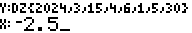  | 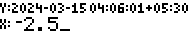 |
| `*`                           |   | 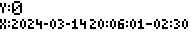 |
| `0`                           | 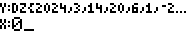  | 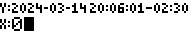 |
| `*`                           | 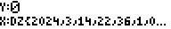  |  |

## Leap Year Determination

The `LEAP` menu function does not quite fit into any of the above categories:


It determines if the given year is a [leap
year](https://simple.wikipedia.org/wiki/Leap_year), returning a `1` if true or
`0` if false. For example:

| **Keys**          | **Display**                    |
| -----------       | ---------------------          |
| `2024` `LEAP`     |     |
| `2025` `LEAP`     |     |
| `2100` `LEAP`     |     |
| `2200` `LEAP`     |     |
| `2300` `LEAP`     |     |
| `2400` `LEAP`     |     |

The boolean expression for this function in the `C` language is:

```
(year%4 == 0) && (year%100 != 0 || year%400 == 0)
```

### Epoch Date (EPCH)

Many computer systems keep track of time by counting the number of seconds from
a specific date, called the
[epoch](https://en.wikipedia.org/wiki/Epoch_%28computing%29). RPN83P supports
different Epoch dates under the `EPCH` menu:

-  (ROOT > DATE > EPCH)
    - 
    - 
    - `UNIX`: select Unix Epoch date of 1970-01-01
    - `NTP`: select NTP Epoch date of 1900-01-01
    - `GPS`: select GPS Epoch date of 1980-01-06
    - `TIOS`: select TI-OS Epoch date of 1997-01-01
    - `Y2K`: select Epoch date of 2000-01-01
    - `CEPC`: select custom Epoch date
    - `EPC`: set custom Epoch date
    - `EPC?`: get current custom Epoch date

The following predefined epoch dates can be selected:

- `UNIX`: 
    - 1970-01-01 00:00:00 UTC (default)
    - [Unix epoch](https://en.wikipedia.org/wiki/Unix_time)
- `NTP`:
    - 1900-01-01 00:00:00 UTC
    - [NTP epoch](https://en.wikipedia.org/wiki/Network_Time_Protocol)
- `GPS`:
    - 1980-01-06 00:00:00 UTC
    - [GPS epoch](https://en.wikipedia.org/wiki/Global_Positioning_System)
- `TIOS`:
    - 1997-01-01 00:00:00 UTC
    - [TIOS epoch](https://wikiti.brandonw.net/index.php?title=83Plus:Ports:45)
      used by the TI calculators
- `Y2K`:
    - 2000-01-01 00:00:00 UTC
    - An epoch date used by some 32-bit systems to avoid the
    [Year 2038 problem](https://en.wikipedia.org/wiki/Year_2038_problem)
- `CEPC`:
    - select the custom epoch date (factory default: `2050-01-01`)
    - the custom epoch date can be changed using the `EPC` menu item (see below)

#### Custom Epoch Date

The custom Epoch date can be changed using the `EPC` (set epoch date) menu
function. The current custom Epoch date value can be retrieved using the `EPC?`
(get epoch date) menu function. For example, let's view the current custom Epoch
date, then set it to `2100-01-01`:

| **Keys**          | **MODE `{..}`**                                | **MODE `".."`**   |
| -----------       | ---------------------                          | ----------------- |
| `EPC?`            |     |  |
| `D{2100,1,1}`     |     |  |
| `EPC`             | 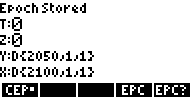    |  |
| `EPC?`            |     |  |

Notice that when the `EPC` (set epoch date) command is invoked, the epoch
selection automatically changes to `CEPC` (custom epoch date) and the dot next
to the `CEPC` menu appears.

#### Epoch Conversions

The Epoch date affects the following menu fuctions:

- 
- 

The first 2 involve Epoch days:

- `D>DY`
    - calculates the `epochdays` representation of a Date object
- `DY>D`
    - converts the `epochdays` to a Date object

The next 3 involve Epoch seconds:

- `Dx>S`
    - calculates the `epochseconds` representation of a ZonedDateTime
- `S>DZ`
    - converts the `epochseconds` to the ZonedDateTime using the
      currently selected Application TimeZone (see `TZ` and `TZ?` below)
- `S>UT`
    - same as `S>DZ` except that the timezone of the resulting ZonedDateTime is
      always UTC+00:00.

For example, let's calculate the epoch seconds of `2024-03-14 15:36:01-07:00`
using 2 different Epochs:

- the Unix epoch date of 1970-01-01 UTC, and
- the NTP epoch date of 1900-01-01 UTC

The example begins with the `MATH` (Home) button to start at a known menu
location, but if you are already within the DATE menu folder, then you can skip
that step:

| **Keys**                          | **MODE `{..}`**                                | **MODE `".."`**   |
| -----------                       | ---------------------                          | ----------------- |
| `MATH` `UP` `DATE` `DOWN` `DOWN`  |    |  |
| `EPCH` `UNIX`                     |    |  |
| `ON/EXIT` `UP`                    |    |  |
| `DZ{2024,3,14,15,36,1,-7,0}`      |    |  |
| `D*>S`                            |    |  |
| `DOWN` `EPCH` `NTP`               |    |  |
| `ON/EXIT` `UP`                    |    |  |
| `2ND ANS` (LASTX)                 |    |  |
| `D*>S`                            |    |  |

#### Epoch Seconds Range

Internally, all date/time calculations are performed using 40-bit signed
integers whose range is `[-549_755_813_888, +549_755_813_887]` seconds. This is
approximately `[-17421,+17421]` years which is more than enough to handle the
entire range of years `[1,9999]` supported by the RPN83P app. The use of 40-bit
signed integers allows RPN83P to avoid the [Year
2038](https://en.wikipedia.org/wiki/Year_2038_problem) problem which affects
many older Unix systems which use a 32-bit signed integer to hold the
epochseconds quantity.

### Real Time Clock (CLK)

The TI-84+ and TI-84+SE models include a real time clock (RTC) chip, unlike the
earlier 83+ and 83+SE models. This allows the 84+ models to set and display the
current date and time.

The menu items which related to the RTC are under the `CLK` menu folder:

-  (ROOT > DATE > CLK)
    - 
    - 
    - `NOW`: get the current hardware clock as Epoch seconds
    - `NOWD`: get the current hardware clock as a Date
    - `NOWT`: get the current hardware clock as a Time
    - `NWDZ`: get the current hardware clock as a ZonedDateTime using the
    Application timezone
    - `NWUT`: get the current hardware clock as a ZonedDateTime using UTC
    timezone
    - `TZ`: set the Application timezone
    - `TZ?`: get the current Application timezone
    - `CTZ`: set the hardware clock timezone
    - `CTZ?`: get the hardware clock timezone
    - `SETC`: set the datetime of the hardware clock

Before we can use retrieve the current date and time from the hardware
clock (RTC) using the various `NOW` and `NWxx` menu commands, we must configure
the hardware clock using the `CTZ` and `SETC` commands, and we must configure
the Application Timezone using the `TZ` command.

#### Setting the Clock Timezone

Before we can set the hardware clock's datetime with the `SETC` command,
we must set its timezone using the `CTZ` menu command. The `CTZ?` command
retrieves the current timezone:


There are 2 options which seem useful:

**Option 1** (recommended): Set the hardware clock timezone to UTC so that it
can be translated to any timezone, without having to worry about DST
transitions:

| **Keys**   | **MODE `{..}`**                                          | **MODE `".."`**   |
| -----------| ---------------------                                    | ----------------- |
| `0`        |     |  |
| `CTZ`      |     |  |
| `CTZ?`     |     |  |

(We could have used `TZ{0,0}` instead of just `0` here).

**Option 2**: Set the hardware clock timezone to the local timezone (e.g.
UTC-08:00 or UTC-07:00, Pacific Time in the US):

| **Keys**   | **MODE `{..}`**                                          | **MODE `".."`**   |
| -----------| ---------------------                                    | ----------------- |
| `TZ{-7,0}` |     |  |
| `CTZ`      |     |  |
| `CTZ?`     |     |  |

(We could have used just `-7` instead of `TZ{-7,0}` here).

My recommendation is to use **Option 1** which sets the hardware clock timezone
to UTC. The problem with Option 2 which sets the clock to the local timezone is
that for regions which has DST rules during parts of the year, the hardware
clock's time will be incorrect during the months when the DST rules are in
effect.

**Side Note**: This issue with configuring the timezone of the hardware clock is
basically the same problem encountered if you configure your computer to
dual-boot both Microsoft Windows and Linux. Windows sets the hardware clock to
the local timezone, but Linux sets the hardware clock to the UTC timezone. Here,
the RPN83P application is the equivalent of Linux, and the underlying TI-OS is
the equivalent of Windows. The difference is that RPN83P has the ability to act
like TI-OS (i.e. Windows) through the `CTZ` configuration.

#### Setting the Clock DateTime

Once the timezone of the hardware clock is set, the actual date-time of the
clock can be configured using the `SETC` (set clock) command:


The `SETC` command takes a ZonedDateTime value as the argument, like this:


| **Keys**                      | **MODE `{..}`**                                   | **MODE `".."`**   |
| -----------                   | ---------------------                             | ----------------- |
| `DZ{2024,3,14,15,36,1,-7,0}`  |  |  |
| `SETC`                        |  |  |

Internally, the TI-84+/84+SE hardware clock keeps track of time as a 32-bit
integer counting the number of seconds from the TI-OS epoch date, which is
1997-01-01 00:00:00 UTC. The ZonedDateTime given to the `SETC` command is
converted into an epochseconds before being handed over to the hardware clock.

#### Setting the Application Timezone

In addition to the timezone of the RTC, RPN83P also allows the **Application**
Timezone to be set using the `TZ` and `TZ?` commands:


The Application Timezone is the timezone inserted into a ZonedDateTime object
when a particular function returns a ZonedDateTime. Currently, the 2 commands
which are affected are:

- `NWDZ` (Get NOW as ZonedDateTime) and
- `S>DZ` (EpochSeconds to ZonedDatetime)

To set the Application Timezone to UTC-07:00 for example, use the following:

| **Keys**  | **MODE `{..}`**                                   | **MODE `".."`**   |
| ----------| ---------------------                             | ----------------- |
| `TZ{-7,0}`|    |  |
| `TZ`      |    |  |
| `TZ?`     |    |  |

#### Get Current DateTime Now

Now that we have configured the hardware clock, we can use the various `NOW` and
`NWxx` commands to retrieve the current date and time from the RTC:


| **Keys**  | **MODE `{..}`**                   | **MODE `".."`**   |
| ----------| ---------------------             | ----------------- |
| `NOW`     |   |  |
| `NOWD`    |  |  |
| `NOWT`    |  |  |
| `NWDZ`    |  |  |
| `NWUT`    |  |  |

#### TI-OS Clock

The same hardware clock can be accessed and configured in the TI-OS using the
`MODE` screen on the first or second page (depending on the OS version), like
this:


The TI-OS does *not* know about timezones. The date-time displayed here will be
in the timezone configured by the `CTZ` command in RPN83P. For example, if `CTZ`
is set to `UTC+00:00`, then the date-time displayed here will be in UTC
timezone. If the `CTZ` timezone was configured to be `UTC-07:00`, the date-time
here will be in `UTC-07:00`.

## Date Type Conversions

Sometimes we want to combined the Date and Time and TimeZone objects into bigger
objects, or take apart bigger objects into smaller components. The `DOPS` menu
folder contains menu items to support those operations:

- 
    - 

For ease of use, these menu functions are also available on the keyboard, by
overloading some button functions:

- `DSHK` (keyboard: `2ND SQRT`)
- `DEXD` (keyboard: `X^2`
- `DCUT` (keyboard: `1/X`)
- `DLNK` (keyboard: `2ND LINK`)

### DSHK - Shrink

The `DSHK` (Date Shrink) command converts a ZonedDateTime into a DateTime by
truncating the TimeZone component. When it is applied again to the DateTime
object, it is converts into a Date object by truncating the Time component.

For example, let's apply the `DSHK` command on the following ZonedDateTime to
convert it to a DateTime, then to a Date object. For illustration purposes, the
first `DSHK` uses the menu function, and the second `DSHK` uses the `2ND SQRT`
keyboard button:

| **Keys**                      | **MODE `{..}`**                   | **MODE `".."`**   |
| ----------                    | ---------------------             | ----------------- |
| `DZ{2024,3,14,15,36,1,-7,0}`  |    |  |
| `ENTER`                       |    |  |
| `DSHK`                        |    |  |
| `2ND SQRT`                    |    |  |

The `ENTER` was used to show the original object on the RPN stack. It was not
necessary to press it before the first `DSHK` command.

### DEXD - Extend

The `DEXD` (Date Extend) command perform the reverse of the `DSHK` command by
appending a `00:00:00` Time component to a Date object, and the `UTC+00:00`
TimeZone component to a DateTime object. For example, let's start with a Date
object and apply the `DEXD` command twice. For illustration purposes, the first
`DEXD` uses the menu function, and the second `DEXD` uses the `X^2` keyboard
button:

| **Keys**                      | **MODE `{..}`**                   | **MODE `".."`**   |
| ----------                    | ---------------------             | ----------------- |
| `D{2024,3,14}`                |    |  |
| `ENTER`                       |    |  |
| `DEXD`                        |    |  |
| `X^2`                         |    |  |

As before, the `ENTER` was used only for the purpose of displaying the original
Date object. It was not necessary to press it before the first `DEXD` command.

### DCUT - Cut

The `DCUT` (Date Cut) command breaks apart big object on the `X` register into 2
smaller ones on the `X` and `Y` registers.

- ZoneDateTime (`X`) becomes DateTime (`X`) and TimeZone (`Y`)
- DateTime (`X`) becomes Date (`X`) and Time (`Y`)

For example, let's apply the `DCUT` command on a ZonedDateTime object twice. For
illustration purposes, the first `DCUT` uses the menu function, and the second
`DCUT` uses the `1/X` keyboard button:

| **Keys**                      | **MODE `{..}`**                   | **MODE `".."`**   |
| ----------                    | ---------------------             | ----------------- |
| `DZ{2024,3,14,15,36,1,-7,0}`  |    |  |
| `ENTER`                       |    |  |
| `DCUT`                        |    |  |
| `1/X`                         |    |  |

### DLNK - Link

The `DLNK` (Date Link) command performs the reverse of the `DCUT` command by
combining the `X` and `Y` stack registers into a single object in `X`.

- DateTime (`X`) and TimeZone (`Y`) becomes a ZoneDateTime (`X`)
- Date (`X`) and Time (`Y`) becomes a DateTime (`X`)

For example, let's incrementally build a ZonedDateTime from a Date, Time and
TimeZone object. For illustration purposes, the first `DLNK` uses the menu
function, and the second `DLNK` uses the `2ND LINK` keyboard button:

| **Keys**                      | **MODE `{..}`**                   | **MODE `".."`**   |
| ----------                    | ---------------------             | ----------------- |
| `D{2024,3,14}`                |    |  |
| `ENTER`                       |    |  |
| `T{15,36,1}`                  |    |  |
| `DLNK`                        |    |  |
| `TZ{-7,0}`                    |    |  |
| `2ND LINK`                    |    |  |

## Storage Registers

Storage registers (R00 to R99) can now hold any date object types. In addition,
storage register arithmetic operations work as expected. In other words, if the
`+` (addition), `-` (subtraction), and `*` (multiplication) operations are
defined on a date object, then the corresponding `STO+`, `STO-`, `STO*`, `RCL+`,
`RCL-`, and `RCL*` operations will also work.

Here are some selected examples:

**Add or Subtract Register**

| **Keys**                      | **MODE `{..}`**                           | **MODE `".."`**   |
| ----------                    | ---------------------                     | ----------------- |
| `D{2024,12,25}`               |     |  |
| `STO 00`                      |     |  |
| `D{2024,3,14}`                |     |  |
| `STO 01`                      |     |  |
| `42`                          |     |  |
| `STO+ 01`                     |     |  |
| `2ND RCL 01`                  |     |  |
| `2ND RCL- 00`                 |     |  |

**Multiply Register (Timezone Conversion)**

| **Keys**                      | **MODE `{..}`**                           | **MODE `".."`**   |
| ----------                    | ---------------------                     | ----------------- |
| `TZ{-4,0}` (EDT)              |       |  |
| `STO 00`                      |       |  |
| `TZ{5,30}` (India)            |       |  |
| `STO 01`                      |       |  |
| `DZ{2024,3,14,15,36,1,-7,0}`  |       |  |
| `2ND RCL* 00`                 |       |  |
| `2ND RCL* 01`                 |       |  |

**WARNING**: Date objects *cannot* be stored in storage variables (A-Z,Theta)
because storage variables can hold only native TI-OS objects. Date objects are
extensions of the RPN83P application which cannot escape the RPN83P environment.
