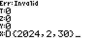
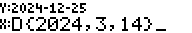
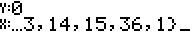
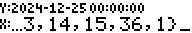
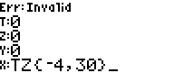
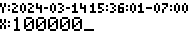
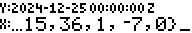

# RPN83P User Guide: DATE

This document describes the `DATE` features of the RPN83P application. It has
been extracted from [RPN83P User Guide](USER_GUIDE.md) due to its length.

The `DATE` features are available under the `ROOT > DATE` menu item in the 3rd
row. [TODO: Insert screenshot of menu row]. Here is a quick summary of the
features:

- determine if a given year is a leap year
- calculate day of week (Monday-Sunday) from Date
- add or subtract duration from Date
- calculate duration difference between 2 Dates
- add or subtract duration from Time
- calculate duration difference between 2 Times
- add or subtract duration from DateTime
- calculate duration difference between 2 DateTimes
- convert DateTime to different (fixed) timezones
- convert between DateTime to epoch seconds from a fixed Epoch date
- support multiple Epoch dates (Unix, NTP, GPS, custom, etc)
- set and retrieve the current date and time from the real time clock (RTC) of
  83+SE, 84+, and 84+SE (83+ does not have an RTC so is not supported)

**Version**: 0.10.0 (2024-03-14)

**Project Home**: https://github.com/bxparks/rpn83p

## Table of Content

- [Calendar, Time, and Timezones](#calendar-time-and-timezones)
    - [Gregorian Calendar](#gregorian-calendar)
    - [POSIX time](#posix-time)
    - [Timezones](#timezones)
    - [Date and Time Formats](#date-and-time-formats)
- [Date Menus](#date-menus)
- [Date Buttons](#date-buttons)
- [Date-related Objects](#date-related-objects)
    - [Data Entry](#data-entry)
    - [Display Format Modes](#display-format-modes)
    - [Date Object](#date-object)
    - [Time Object](#time-object)
    - [DateTime Object](#datetime-object)
    - [TimeZone Object](#timezone-object)
    - [ZonedDateTime Object](#zoneddatetime-object)
    - [DayOfWeek Object](#dayofweek-object)
    - [Duration Object](#duration-object)
- [Timezone Conversions](#timezone-conversions)
- [Epoch Date Conversions](#epoch-date-conversions)
- [Real Time Clock](#real-time-clock)
- [Record Components](#record-components)

## Calendar, Time, and Timezones

The following is a quick summary of the fundamental date and time concepts
used by the `DATE` functions in RPN83P. If you already know most of this,
you can skip this section and continue with the [DATE Menus](#date-menus).

The `DATE` functions of the RPN83P uses the [Proleptic Gregorian
calendar](https://en.wikipedia.org/wiki/Proleptic_Gregorian_calendar) with the
year restricted to `[1,9999]`. The [UNIX
time](https://en.wikipedia.org/wiki/Unix_time) (aka POSIX time) system is used
for counting the number of seconds per day. POSIX time is similar to [UTC
time](https://en.wikipedia.org/wiki/Coordinated_Universal_Time). The major
difference is that the duration of a POSIX *second* is not a constant, in
contrast to the SI *second* used by UTC, and POSIX time does not support [leap
seconds](https://en.wikipedia.org/wiki/Leap_second). Time zones are supported as
fixed offsets from UTC. Therefore, [daylight saving
time](https://en.wikipedia.org/wiki/Daylight_saving_time) transitions are *not*
supported. When date and time objects are displayed to the user, the RPN83P uses
the [RFC 3339](https://datatracker.ietf.org/doc/html/rfc3339) standard which is
a standard that is readily accessible, unlike the similar [ISO
8601](https://en.wikipedia.org/wiki/ISO_8601) standard which is paywalled and
more difficult to access. The RPN83P also provides access to the real time clock
(RTC) included in several of the TI calculators that it is compatible with
(83+SE, 84+, 84+SE, but not the 83+). The RPN83P supports quickly converting the
current date and time from the RTC into different timezones.

### Gregorian Calendar

Most of the world currently uses the [Gregorian
Calendar](https://en.wikipedia.org/wiki/Gregorian_calendar) system. The
calendar has a 400-year cycle, with each cycle containing 146097 days. Since
146097 is divisible by 7 only once, the day of the week (Monday to Sunday)
associated with a given date repeats itself every 400 years as well.

The Gregorian calendar was first introduced on October 15, 1582, but different
countries adopted the calendar at different times over the course of the
subsequent 400+ years. For simplicity, RPN83P does not support exact historical
dates, so it adopts the [Proleptic Gregorian
calendar](https://en.wikipedia.org/wiki/Proleptic_Gregorian_calendar) which
extends the Gregorian calendar backwards from 1582 even for those dates when the
Gregorian calendar did not exist.

There are 2 sources of time keeping that are convenient for humans:
1) the **solar day**, which is the length of time of one cycle of the apparent
motion of the sun across the sky due to the rotation of the earth, and
2) the **solar year** (or tropical year) which is the average length of time
that the sun takes to complete the astronomical seasons (equinox to equinox) due
the motion of the earth around the sun.

Roughly speaking, the solar day is defined to be 86400 seconds (or more
accurately, the second was originally defined to be 1/86400 of a mean solar
day). The solar year is slightly variable, but the mean is [365.2422 mean solar
days](https://en.wikipedia.org/wiki/Tropical_year). The complex rules with
regards to leap years in the Gregorian calendar is consequence of the fact that
the solar year is not a simple integral multiple of the solar day. Since humans
find it convenient for the calendar year to synchronize with the solar year,
the Gregorian calendar inserts leap days into various years occasionally so
that the solar year and the calendar year align. In the Gregorian system, the
year is 146097/400 = 365.2425 days averaged over its 400-year cycle. This is
close enough to the mean solar year of 365.2422 days until about the year 3200
when the Gregorian calendar year will be about [a day behind the actual solar
year](https://en.wikipedia.org/wiki/Tropical_year).

For practical reasons, the RPN83P limits the year range from 0001 to 9999. The
year 0 does not exist because the calendar system increments from 1 BC to 1 AD.
In effect, 1 BC is the year 0000. We avoid the complexity of dealing with
negative years by restricting the year range to be >= 0001. The maximum year of
9999 simplifies the user interface because it can restrict the rendering of the
year component to a maximum of 4 digits.

### POSIX Time

The *second* time unit was originally defined as 1/86400 of a solar day. The
problem with this definition is that the rate of earth's rotation is not a
constant. Eventually, the *second* was redefined to use highly accurate [atomic
clocks](https://en.wikipedia.org/wiki/Atomic_clock) resulting in the definition
of the [SI second](https://en.wikipedia.org/wiki/Second). The [Coordinated
Universal Time (UTC)](https://en.wikipedia.org/wiki/Coordinated_Universal_Time)
system uses the SI *second* unit to track the solar day of the earth in terms of
the SI *seconds*.

The Earth's rotational speed is irregular and slows down by [a few milliseconds
per century](https://en.wikipedia.org/wiki/Earth's_rotation). The UTC time
system resynchronizes the solar day with the day composed of 86400 *SI seconds*
by inserting a [leap second](https://en.wikipedia.org/wiki/Leap_second) every
few years, so that the difference between a UTC day and a solar day is no more
than 0.9s. During a leap second, which happens at the very last second of the
day, the final minute has 61 seconds instead of 60 seconds. A conforming UTC
clock goes from `23:59:59` to `23:59:60`, then rolls over to `00:00:00` to
start the next day. In theory, a negative leap second is possible, in which
case the clock would skip from `23:59:58` to `00:00:00` over a single second.

A [UNIX time](https://en.wikipedia.org/wiki/Unix_time) (aka POSIX time), is a
time measuring system originally implemented on UNIX systems, where the leap
second is ignored for simplicity. More precisely, POSIX time is a time system
where a *POSIX second* is variable in duration. During a positive leap second,
a POSIX second equals 2 *SI seconds*, and a POSIX clock goes from `23:59:58` to
`23:59:59`, which is held for 2 seconds, before rolling over to `00:00:00`.
During a negative leap second, the POSIX second becomes reduced to 0 *SI
seconds*, so that a POSIX clock goes from `23:59:58` to `00:00:00` one second
later, skipping `23:59:59` instantly because the duration of `23:59:59` is
0 seconds long.

For simplicity, like many software libraries, the RPN83P calculator implements
POSIX time, not UTC time. Leap seconds are *not* considered in any
calculations. If two datetimes are subtracted to calculate the duration between
them, the resulting number of seconds is calculated in terms POSIX seconds, not
SI seconds. To obtain the *actual* number of SI seconds between those 2
datetimes, we would need to consult a table of leap seconds and add the number
of leap seconds that occurred between those 2 datetimes.

### Timezones

To maintain the convenience of having the location of the Sun near its highest
point in the sky when the local time is 12:00 noon, the world is divided into
[time zones](https://en.wikipedia.org/wiki/Time_zone). The local time is
shifted from the UTC time, usually in integral multiples of one hour, but there
exist locations which are shifted by a multiple of 30 minutes or 15 minutes.

Further complicating the calculation of the local time, many places observe
[daylight saving time](https://en.wikipedia.org/wiki/Daylight_saving_time)
(DST) during the summer months. The rules for when those DST transitions occur
and the size of the DST shift (it is not always 1 hour) are determined by each
country or jurisdiction. The most complete database of all such rules is the
[IANA TZ database](https://en.wikipedia.org/wiki/Tz_database), incorporating
between 350 to 600 timezones around the world (depending on how a "timezone" is
defined). The RPN83P does not currently support the IANA TZ database. It
supports only fixed UTC offsets.

### Date and Time Formats

The 2 commonly used conventions for representing dates and times on a computer
system is [RFC 3339](https://www.rfc-wiki.org/wiki/RFC3339) and [ISO
8601](https://en.wikipedia.org/wiki/ISO_8601). The ISO 8601 document, like all
ISO documents, is paywalled so most software developers have never seen the
actual document. There is a significant amount of overlap between the 2
standards, as shown in this [RFC 3339 vs ISO 8601 Venn
diagram](https://ijmacd.github.io/rfc3339-iso8601/).

The RPN83P follows the RFC 3339 conventions more closely than the ISO 8601. Here
are some examples:

- Date: `2024-03-14` (Mar 14, 2024)
- Time: `21:10:11` (9:10:11 pm)
- DateTime: `2024-03-14 21:10:11`
- UTC DateTime: `2024-03-15 05:10:11Z`
- ZonedDateTime: `2024-03-15 21:10:11-08:00`

Other conventions, such as the examples given in [List of date formats by
country](https://en.wikipedia.org/wiki/List_of_date_formats_by_country), are not
supported because they cause too many ambiguities for a calculator app whose
main purpose is to perform calculations on those quantities, instead of
displaying a date and time to the user. Here is a sample of date formats which
are *not* supported in the `DATE` functions of RPN83P:

- US dates `mm/dd/yyyy`, not supported
- Canadian dates `dd/mm/yyyy`, not supported
- French dates `dd/mm/yyyy`, not supported
- German dates `dd.mm.yyyy`, not supported
- Indian dates `dd-mm-yyyy`, not supported
- HP calculator dates `mm.ddyyyy`, not supported
- HP calculator dates `dd.mmyyyyy`, not supported
- 2-digit years, absolutely not supported
- 12-hour format `hh:mm:ss AM/PM`, not supported

## DATE Menus

The following menus items are located under the `DATE` menu:

- [TODO: screenshot of [DATE] menu]
    - [TODO: screenshot of [LEAP DOW DY>D D>DY]]
    - [TODO: screenshot of [Dx>S S>DR S>T S>DZ S>UT]]
    - [TODO: screenshot of [H>TZ TZ>H EPCH]]
        - [TODO: screenshot of [UNIX NTP GPS TIOS Y2K]]
        - [TODO: screenshot of [CEPC EPC EPC?]]
    - [TODO: screenshot of [DSHK DEXD DCUT DLNK]]
    - [TODO: screenshot of [NOW NOWD NOWT NWDZ NWUT]]
    - [TODO: screenshot of [TZ TZ? CTZ CTZ? SETC]]

## DATE Buttons

Here is a screenshot of the calculator with various buttons that are assigned to
`DATE` related functions:


## Date-related Objects

Prior to the addition of DATE functions, the RPN83P supported 2 data types: real
and complex numbers. The DATE functions add 7 new data types which are *record*
types, composed of fields of more primitive integer types.

- Date `D{year:u16, month:u8, day:u8}`
- Time `T{hour:u8, minute:u8, second:u8}`
- DateTime `DT{year:u16, month:u8, day:u8, hour:u8, minute:u8, second:u8}`
- Duration `DR{days:i16, hours:i8, minutes:i8, seconds:i8}`
- TimeZone `TZ{hour:i8, minute:i8}`
- ZonedDateTime `DZ{year:u16, month:u8, day:u8, hour:u8, minute:u8, second:u8,
  tzhour:i8, tzminute:i8}`
- DayOfWeek `DW{dow:u8}`

If you are familiar with the C++ language, you may think of these Record
specifications as class constructors using brace-initialization, with the class
names being `D`, `T`, `DT`, `DR`, `TZ`, `DZ`, and `DW`.

The primitive integer types are:

- `u16`: unsigned 16-bit integer, [0, 65535]
- `u8`: unsigned 8-bit integer, [0, 255]
- `i16`: signed 32-bit integer, [-32768, 32767]
- `i8`: signed 8-bit integer, [-128, 127]

The RPN stack registers and storage registers have been upgraded to hold these
additional data types.

### Data Entry

To allow these Record types to be entered using the calculator buttons, the
following keys have been activated:

- `2ND {` and `2ND }`
- `ALPHA A` to `ALPHA Z`
- `,`

Prior to v0.10, both the `,` and `2ND EE` keystrokes were mapped to the `EE`
function to allow numbers in scientific notation to be entered easily. However
the entry of the Date objects requires the use of the comma `,` key, so the app
now contains an option to control the behavior of this button under the `MODE`
menu:

- [TODO: screenshot of [,EE EE, {..}, ".."]]

If the `,EE` option is selected, the button behaves as labeled on the keyboard:
- hitting `,` invokes the `,` function, and
- hitting `2ND EE` invokes the `EE` function.

If the `EE,` option is selected, the button actions are reversed:
- hitting `,` invokes the `EE` function, and
- hitting `2ND EE` invokes the `,` function.

The date record types are entered using the `ALPHA` key to enter the record
name, and the left brace `{` and right brace `}` keys to delimit the components
of the records. For example, to enter the Date value `D{2024,3,14}`, the
following keystrokes would be used:

```
ALPHA D
2ND {
2024
,
3
,
14
2ND }
```

For brevity and readability, this long sequence of keystrokes will be shortened
to something like `D{2024,3,14}` in the subsequent sections.

### Display Format Modes

In the `MODE` menu, there are 2 settings that affect how date record objects are
displayed:

- 
    - 

If the `{..}` option is selected (factory default), the records will be
displayed in their entry form using the curly braces. If the `".."` option is
selected, the records will be displayed as a human-readable string. In the
following sections, the displayed string in both modes will be shown.

**Pro Tip**: If the `MODE` menu is activated using the `MODE` **button**, the
"Jump Back" feature is enabled so that the `ON/EXIT` button returns to the prior
menu location. This makes it easier to quickly change the `{..}` or `".."`
display modes.

### Date Object

The `Date` object has the form `D{year:u16, month:u8, day:u8}` and represents a
Gregorian calendar date. For example, the date `2024-03-14` is entered into the
calculator as follows, and is displayed in 2 different ways depending on the
MODE setting of `{..}` or `".."`:

| **Keys**          | **MODE `{..}`**                 | **MODE `".."`** |
| ----------------  | ---------------------           | --------------- |
| `D{2024,3,14}`    |  |  |
| `ENTER`           |  |  |

#### Date Validation

Upon input termination, Date components are validated to make sure that it
represents a proper Gregorian calendar date. If the component is invalid, an
`Err:Invalid` error message is displayed. For example, if we try to enter the
invalid date `2024-02-30`, we get:

| **Keys**          | **MODE `{..}`**                   | **MODE `".."`**   |
| ------------------| ---------------------             | ----------------- |
| `D{2024,2,30}`    | |  |
| `ENTER`           | |  |

Notice that for input validation errors like this, the input is not terminated
and the prompt continues to be shown. You can pressed the `DEL` to delete the
input characters and fix the error.

Here is an incomplete list of validation rules:

- `year` component must be between 1 and 9999
- `month` component must be between 1 and 12
- `day` component must be between 1 and 31, and must be valid for the given
  month

#### Date Operations

Addition and subtraction operations are supported as shown in the following
table:

| **Operation**             | **Result**|
| ------------------------- | ----------|
| {Date} + {integer}        | {Date}    |
| {integer} + {Date}        | {Date}    |
| {Date} - {integer}        | {Date}    |
| {Date} - {Date}           | {integer} |
| {integer} - {Date}        | INVALID   |

When operating on `Date` objects, integer values are assumed to be in units of
`days`. For example, let's add 20 days to the date of 2024-03-14, then
subtract 30 days from that result:

| **Keys**          | **MODE `{..}`**                       | **MODE `".."`**   |
| ------------------| ---------------------                 | ----------------- |
| `D{2024,3,14}`    |    |  |
| `ENTER`           |    |  |
| `20`              |    |  |
| `+`               |    |  |
| `30`              |    |  |
| `-`               |    |  |

We can subtract 2 Date records to obtain the number of whole days between the 2
dates:

| **Keys**          | **MODE `{..}`**                       | **MODE `".."`**   |
| ------------------| ---------------------                 | ----------------- |
| `D{2024,12,25}`   |    |  |
| `ENTER`           |    |  |
| `D{2024,3,14}`    |    |  |
| `-`               |    |  |

There are 286 days from March 14 to Dec 25, 2024.

### Time Object

The `Time` object has the form `T{hour:u8, minute:u8, second:u8}`. For example,
the time `15:36:01` is entered into the calculator like this:

| **Keys**          | **MODE `{..}`**                   | **MODE `".."`**   |
| ------------------| ---------------------             | ----------------- |
| `T{15,36,1}`      |    |  |
| `ENTER`           |    |  |

#### Time Validation

The validation rules for a `Time` record is more straightforward than a `Date`
record:

- the `hour` component must be in the interval [0, 23]
- the `minute` component must be in the interval [0, 59]
- the `second` component must be in the interval [0, 59], leap seconds not
  supported

#### Time Operations

Just like `Date` records, addition and subtraction operations are supported as
summarized in the following table:

| **Operation**             | **Result**|
| ------------------------- | --------- |
| {Time} + {integer}        | {Time}    |
| {integer} + {Time}        | {Time}    |
| {Time} - {integer}        | {Time}    |
| {Time} - {Time}           | {integer} |
| {integer} - {Time}        | INVALID   |

There are 2 important differences:

1. The integers are in units of *seconds*, not *days*, and
2. If the resulting `Time` is less than `00:00:00` or greater than `24:00:00`,
the resulting time is renormalized so that it becomes within those bounds. In
other words, addition and subtraction operations are performed modulo 86400
seconds.

Let's perform some arithmetic operations on the Time value, for example, add 234
seconds, then subtract 100,000 seconds:

| **Keys**          | **MODE `{..}`**                       | **MODE `".."`**   |
| ------------------| ---------------------                 | ----------------- |
| `T{15,36,1}`      |    |  |
| `ENTER`           |    |  |
| `234`             |    |  |
| `+`               |    |  |
| `100000`          |    |  |
| `-`               |    |  |

Since 100,000 seconds is more than 1 day, the Time object wraps around.

Just like the Date object, we can subtract 2 Time objects to obtain the number
of seconds between the 2 objects:

| **Keys**          | **MODE `{..}`**       | **MODE `".."`**   |
| ------------------| --------------------- | ----------------- |
| `T{15,36,1}`      |    |  |
| `ENTER`           |    |  |
| `T{17,0,0}`       |    |  |
| `-`               |    |  |

There are 5039 seconds between `15:36:01` and `17:00:00`.

### DateTime Object

A DateTime record is a concatenation of the Date record and a Time record. It
has the format `DT{year:u16, month:u8, day:u8, hour:u8, minute:u8, second:u8}`.

For example, the date `2024-03-14 15:36:01` would be entered like this:

| **Keys**                  | **MODE `{..}`**                       | **MODE `".."`**               |
| ------------------------- | ---------------------                 | -----------------             |
| `DT{2024,3,14,15,36,1}`   |    |  |
| `ENTER`                   |    |  |

#### DateTime Validation

The validation rules of the `DateTime` is the union of the validation rules
for the `Date` record and the rules for the `Time` record.

#### DateTime Operations

The addition and subtraction operations are available on the `DateTime` object,
just like `Date` and `Time`. The integer numbers are in unit of *second*.

| **Operation**             | **Result**    |
| --------------------------| ------------- |
| {DateTime} + {integer}    | {DateTime}    |
| {integer} + {DateTime}    | {DateTime}    |
| {DateTime} - {integer}    | {DateTime}    |
| {DateTime} - {DateTime}   | {integer}     |
| {integer} - {DateTime}    | INVALID       |

For example, let's subtract 100,000 seconds from `2024-03-14 15:39:55`:

| **Keys**                  | **MODE `{..}`**                           | **MODE `".."`**               |
| ------------------------- | ---------------------                     | -----------------             |
| `DT{2024,3,14,15,36,1}`   |    |  |
| `ENTER`                   |    |  |
| `100000`                  |    |  |
| `-`                       |    |  |

We can subtract 2 `DateTime` objects:

|  **Keys**                 |  **MODE `{..}`**                          |  **MODE `".."`**              |
| ------------------------- | ---------------------                     | -----------------             |
| `DT{2024,12,25,0,0,0}`    |    |  |
| `ENTER`                   |    |  |
| `DT{2024,3,14,15,36,1}`   |    |  |
| `-`                       |    |  |

There are 24654239 seconds from March 13, 2024 15:39:55 to Christmas Dec 25,
2024 00:00:00.

We can convert the 24654239 seconds quantity into something that is easier to
understand for humans by converting it into a `Duration` object. (The
`Duration` object is described in more detail in the [Duration
Object](#duration-object) below.) Scroll down the `DATE` menu rows until the
`S>DR` menu item appears, as shown in the table below. Press that menu item to
convert 24654239 seconds into a `Duration` object:

|  **Keys** |  **MODE `{..}`**                                  |  **MODE `".."`**        |
| ----------| ---------------------                             | -----------------       |
|           |   |  |
| `S>DR`    |   |  |

We can now see that there are 285 days, 8 hours, 23 minutes, and 59 seconds
between March 13, 2024 15:39:55 to Christmas Dec 25, 2024 00:00:00.

### TimeZone Object

The TimeZone object has the form `TZ{hour:i8, minute:i8}`. It represents a fixed
offset from UTC. As noted earlier, the RPN83P does not currently support
timezones with automatic DST transitions, such as those defined by the IANA TZ
database. Daylight saving time changes must be handled manually. For example,
the standard offset for `America/Los_Angeles` is UTC-08:00 during the winter
months, and changes to UTC-07:00 during the summer months.

| **Keys**   | **MODE `{..}`**                     | **MODE `".."`**   |
| -----------| ---------------------               | ----------------- |
| `TZ{-8,0}` |  |  |
| `ENTER`    |  |  |

#### TimeZone Validation

The validation rules for a TimeZone object are:

- a timezone must be a multiple of 0:15 minutes
- a timezone can span from [-23:45,+23:45]. This is sufficient to capture all
  timezones currently in use around the world, which fall within the range of
  UTC-12:00 to UTC+14:00.
- the signs of the `hour` and `minute` components must match each other

Here is an example of an invalid timezone whose `hour` and `minute` have the opposite sign:

| **Keys**    | **MODE `{..}`**                             | **MODE `".."`**   |
| ----------- | ---------------------                       | ----------------- |
| `TZ{-4,30}` |  |  |
| `ENTER`     |  |  |

#### TimeZone Operations

No arithmetic operations (addition, subtraction) are defined on TimeZone
objects, because they did not seem useful for real-life calculations.

The TimeZone object can be converted to and from a floating point number
representing the number of hours shifted from UTC. These are exposed using the
`H>TZ` and `TZ>H` menu items:


To convert `TZ{-4,~30}` to hours then back to a TimeZone object:

| **Keys**     | **MODE `{..}`**                                | **MODE `".."`**   |
| -------------| ---------------------                          | ----------------- |
| `TZ{-4,-30}` |     |  |
| `TZ>H`       |     |  |
| `H>TZ`       |     |  |

### ZonedDateTime Object

The ZonedDateTime is a combination of Date, Time, and TimeZone. It has the form
`DZ{year:u16, month:u8, day:u8, hour:u8, minute:u8, second:u8, tzhour:i8,
tzminute:i8}`. It describes the local time of a specific place that uses a
specific UTC offset.

Here is an example of entering the date `2024-03-14 15:36:01-07:00` which
occurred in `America/Los_Angeles` timezone after the DST shift on March 10,
2024:

| **Keys**                      | **MODE `{..}`**                           | **MODE `".."`**                   |
| -------------------------     | ---------------------                     | -----------------                 |
| `DZ{2024,3,14,15,36,1,-7,0}`  |   |  |
| `ENTER`                       |   |  |
| `2ND ENTER` (`SHOW`)          |   |  |

ZonedDateTime objects with a UTC offset of +00:00 are special, and it is useful
to display them slightly differently. Here is how the date 2024-03-14 22:36:00
UTC is entered and displayed:

| **Keys**                      | **MODE `{..}`**                               | **MODE `".."`**                   |
| -------------------------     | ---------------------                         | -----------------                 |
| `DZ{2024,3,14,22,36,1,0,0}`   |   |  |
| `ENTER`                       |   |  |
| `2ND ENTER` (`SHOW`)          |   |  |

#### ZonedDateTime Validation

The validation rules of the `ZonedDateTime` is the union of the validation rules
for the `Date`, `Time`, and `TimeZone` objects.

#### ZonedDateTime Operations

The addition and subtraction operations are available on the `ZonedDateTime`
object, just like the `DateTime` object. The integer numbers are in unit of
*second*.

| **Operation**                     | **Result**        |
|-----------------------------------|-------------------|
| {ZonedDateTime} + {integer}       | {ZonedDateTime}   |
| {integer} + {ZonedDateTime}       | {ZonedDateTime}   |
| {ZonedDateTime} - {integer}       | {ZonedDateTime}   |
| {ZonedDateTime} - {ZonedDateTime} | {integer}         |
| {integer} - {ZonedDateTime}       | INVALID           |

The resulting ZonedDateTime will have the same TimeZone offset as the input
ZonedDateTime.

For example, let's add 100_000 seconds to `2024-03-14 15:36:01-07:00`:

| **Keys**                      | **MODE `{..}`**                               | **MODE `".."`**                   |
| -------------------------     | ---------------------                         | -----------------                 |
| `DZ{2024,3,14,15,36,1,-7,0}`  |   |  |
| `ENTER`                       |   |  |
| `100000`                      |   |  |
| `+`                           |   |  |

We can subtract 2 `ZonedDateTime` objects to obtain the number of seconds
between them. Their TimeZone components are not required to be same. For
example, let's determine the number of seconds from March 14, 2024 UTC-07:00 to
December 25, 2024 UTC:

| **Keys**                      | **MODE `{..}`**                               | **MODE `".."`**                   |
| -------------------------     | ---------------------                         | -----------------                 |
| `DZ{2024,12,25,0,0,0,0,0}`    |   |  |
| `ENTER`                       |   |  |
| `DZ{2024,3,14,15,36,1,-7,0}`  |   |  |
| `-`                           |   |  |
| `S>DR`                        |   |  |

As before, we have used the `S>DR` menu function to convert `seconds` to
a `Duration` object which can be more useful in some situations.

### DayOfWeek Object

The `DayOfWeek` object has the form `DW{dow:u8}`, where the `dow` field is a
single integer containing the [ISO Weekday
number](https://en.wikipedia.org/wiki/ISO_8601), where Monday is represented by
1 and Sunday is represented by 7. For example, Thursday has an ISO weekday value
of 4 and can be entered as:

| **Keys**   | **MODE `{..}`**                      | **MODE `".."`**   |
| -----------| ---------------------                | ----------------- |
| `DW{4}`    |  |  |
| `ENTER`    |  |  |

#### DayOfWeek Validation

Upon input termination, the `dow` component is validated and if the component is
invalid, an `Err:Invalid` error message is displayed. For example, if we try to
enter the invalid DayOfWeek value of `DW{0}`, an error is shown:

| **Keys**   | **MODE `{..}`**                              | **MODE `".."`**   |
| -----------| ---------------------                        | ----------------- |
| `DW{0}`    |  |  |
| `ENTER`    |  |  |

#### DayOfWeek Operations

Although it is unlikely to be used often, addition and subtraction operations
have been implemented for the DayOfWeek object, mostly for consistency. To add 6
days to Thursday, we can enter:

| **Keys**   | **MODE `{..}`**                          | **MODE `".."`**   |
| -----------| ---------------------                    | ----------------- |
| `DW{4}`    |  |  |
| `ENTER`    |  |  |
| `6`        |  |  |
| `+`        |  |  |

You can subtract 2 DayOfWeek objects, to get the number of days between them:

```
DW{3} ENTER
DW{4} -
(displays -1)
```

There are -1 days from Thursday to Wednesday.

### Duration Object

The `Duration` object has the form `DR{days:i16, hours:i8, minutes:i8,
seconds:i8}`. It can be a positive or a negative quantity. For example, a
positive `Duration` object would be:

```
DR{1,2,3,4}
```

This is displayed as the following if the string display mode `".."` is
selected:

```
1d 2h 3m 4s
```

A negative duration would be:

```
DR{-4,0,-2,0}
```

which would be displayed as

```
-4d 2m
```

Notice that for negative durations, all the components must be negative (or
zero). Also notice that when a Duration component is exactly 0, that component
is omitted from the human-readable string format (in the case above, the `0h`
and `0s` components).

The `days` component is restricted to 4 digits, so the largest magnitude is
9999. Therefore, the largest duration that can be represented by the `Duration`
object is `9999d 23h 59m 59s` or about 24.3 years.

#### Duration Shorthand Entry

Often, we want to enter a single component without having to enter a `0` for the
other components. For example, to enter just "2 minutes", we would have to enter
`DR{0,0,2,0}`, and for "12 hours", we would need to enter `DR{0,12,0,0}`. The
RPN83P has an alternative shorthand entry format, using the `ALPHA :` character.
The following suffixes are recognized by the input system:

- `ss:S` - shorthand for `DR{0,0,0,ss}`, i.e. "ss seconds"
- `mm:M` - shorthand for `DR{0,0,mm,0}`, i.e. "mm minutes"
- `hh:H` - shorthand for `DR{0,hh,0,0}`, i.e. "hh hours"
- `dddd:D` - shorthand for `DR{dddd,0,0,0}`, i.e. "dddd days"

For example, to enter 2 minutes, we can type:

```
2:M
```

Hitting `ENTER` shows;

```
DR{0,0,2,0} (in MODE {..})
2m (in MODE "..")
```

To enter 12 hours, we can type:

```
12:H
```

Hitting `ENTER` shows:

```
DR{0,12,0,0} (in MODE {..})
12h (in MODE "..")
```

#### Duration Validation

The components of the Duration object has the following validation rules:

- the `days` component is currently limited to 4 digits [-9999,9999] (it could
  be extended to +/- 32767 with a little bit of coding)
- `hours` must be in the interval [-23,23]
- `minutes` must be in the interval [-59,59]
- `seconds` must be in the interval [-59,59]
- all components must have the same sign (or zero)

For example, if the signs are not consistent, an `Err:Invalid` will be shown:

```
DR{1, -2, 0, 1} ENTER
Err:Invalid
```

#### Duration Operations

The Duration object is a convenient object because the addition and subtraction
operations are defined on the Duration object as well as the Date, Time, and
DateTime objects:

```
+-------------------------------+-------------------+
| **Operation**                 | **Result**        |
+-------------------------------+-------------------+
| {Duration} + {integer}        | {Duration}        |
| {integer} + {Duration}        | {Duration}        |
| {Duration} + {Duration}       | {Duration}        |
+-------------------------------+-------------------+
| {Duration} - {integer}        | {Duration}        |
| {Duration} - {Duration}       | {Duration} [*]    |
+-------------------------------+-------------------+
| {integer} - {Duration}        | INVALID           |
+===============================+===================+
| {Date} + {Duration}           | {Date}            |
| {Duration} + {Date}           | {Date}            |
+-------------------------------+-------------------+
| {Date} - {Duration}           | {Date}            |
| {Duration} - {Date}           | INVALID           |
+===============================+===================+
| {Time} + {Duration}           | {Time}            |
| {Duration} + {Time}           | {Time}            |
+-------------------------------+-------------------+
| {Time} - {Duration}           | {Time}            |
| {Duration} - {Time}           | INVALID           |
+===============================+===================+
| {DateTime} + {Duration}       | {DateTime}        |
| {Duration} + {DateTime}       | {DateTime}        |
+-------------------------------+-------------------+
| {DateTime} - {Duration}       | {DateTime}        |
| {Duration} - {DateTime}       | INVALID           |
+===============================+===================+
| {ZonedDateTime} + {Duration}  | {ZonedDateTime}   |
| {Duration} + {ZonedDateTime}  | {ZonedDateTime}   |
+-------------------------------+-------------------+
| {ZonedDateTime} - {Duration}  | {ZonedDateTime}   |
| {Duration} - {ZonedDateTime}  | INVALID           |
+-------------------------------+-------------------+

[*] For other record types, subtracting 2 objects of the same type produces an
integer. For Duration objects, it seemed more convenient to return a Duration
instead.
```

A good rule of thumb is that anywhere an integer can be used in a binary
operator involving a Date, Time, or DateTime object, a Duration object can be
used instead.

For example, let's add 2h 33m to the Time `12:58:32`:

```
T{12:58:32} ENTER
DR{0,2,33,0} +
(displays T{15,31,32})
```

For example, let's add 30d to the DateTime `2024-03-14 12:58:32`:

```
DT{2024,3,14,12,58,32} ENTER
30:D +
(displays DT{2024,4,13,12,58,32})
```

## Timezone Conversions

A ZonedDateTime with a specific timezone (e.g. UTC-07:00) can be converted to
another ZonedDatetime with a different timezone (e.g. UTC+13:00). The RPN83P
provides a mechanism to perform timezone conversions quickly by overloading the
multiplication operator `*` in the following way:

```
+-----------------------------------+-------------------+
| **Operation**                     | **Result**        |
+-----------------------------------+-------------------+
| {ZonedDateTime} * {integer}       | {ZonedDateTime}   |
| {ZonedDateTime} * {TimeZone}      | {ZonedDateTime}   |
| {integer} * {ZonedDateTime}       | {ZonedDateTime}   |
| {TimeZone} * {ZonedDateTime}      | {ZonedDateTime}   |
+-----------------------------------+-------------------+
```

The `*` operator takes 2 arguments. The source timezone is contained in the
ZoneDateTime object. The target timezone can be represented by a TimeZone object
or by a shortform floating point number that represents the number of hours
offset from UTC. For example, `UTC-08:00` can be encoded by just `-8`.

For example, let's convert the timestamp 2024-03-14 15:36:01
in America/Los_Angeles (which is UTC-07:00) in the summer time to
Pacific/Auckland (which is currently UTC+13:00):

```
DZ{2024,3,14,15,35,1,-7,0} ENTER
TZ{13,0} *
(displays DZ{2024,3,15,11,35,1,13,...})
(select MODE "..")
(displays 2024-03-15 11;35:01+13:00)
```

Let's convert the same time to the time in India which is at UTC+05:30. We can
represent the target time zone using the floating point number `5.5`:

```
5.5 *
(displays 2024-03-15 04:05:41+05:30)
```

Let's convert this to the timezone in Newfoundland, Canada which is at
UTC-02:30:

```
-2.5 *
(displays 2024-03-14 20:05:01-02:30)
```

Finally, let's convert this to UTC:

```
0 *
(displays 2024-03-14 22:35:01 Z)
```

## Epoch Date Conversions

Many computer systems keep track of time by counting the number of sections from
a specific date, called the
[epoch](https://en.wikipedia.org/wiki/Epoch_%28computing%29)  RPN83P supports
the following epoch dates under the `EPCH` menu:

[TODO: screenshot of EPCH menu row]

The following predefined epoch dates can be selected:

- `UNIX`: 1970-01-01 00:00:00 UTC (default)
    - [Unix epoch](https://en.wikipedia.org/wiki/Unix_time)
- `NTP`: 1900-01-01 00:00:00 UTC
    - [NTP epoch](https://en.wikipedia.org/wiki/Network_Time_Protocol)
- `GPS`: 1980-01-06 00:00:00 UTC
    - [GPS epoch](https://en.wikipedia.org/wiki/Global_Positioning_System)
- `TIOS`: 1997-01-01 00:00:00 UTC
    - [TIOS epoch](https://wikiti.brandonw.net/index.php?title=83Plus:Ports:45)
- `Y2K`: 2000-01-01 00:00:00 UTC
    - An epoch date used by some 32-bit systems to avoid the
    [Year 2038 problem](https://en.wikipedia.org/wiki/Year_2038_problem)

The `CEPC` menu items allow custom epoch dates:

- `CEPC`: user-defined custom epoch

[TODO: screenshot of [CPEC] option selected]

### Custom Epoch Date

The custom Epoch date is selected using the `CEPC` menu item. The actual value
of the custom epoch date is set using the `EPC` (set epoch). The `EPC?` (get
epoch) command allows the user to retrieve the currently defined custom epoch
date.

For example, to set the custom epoch date to `2050-01-01`, type:

```
D{2050,1,1}
EPC
```

Pressing the `EPC?` retrieves the current epoch date:
```
EPC?
(displays D{2050,1,1})
```

### EpochSecond Conversions

There are 4 menu functions which convert between date-time objects and epoch
seconds or epoch days:

[TODO: screenshot of [DY>D] [D>DY]]
[TODO: screenshot of [S>DZ] [S>UT]]

- `Dx>S`
    - calculates the `seconds` representation of the input object. If the input
      is a ZonedDateTime, then the output is the number of seconds from the
      current Epoch date.
- `S>DZ`
    - converts the number of epochseconds to the `ZonedDateTime` (using the
      currently select TimeZone)
- `S>UT`
    - same as `S>DZ` except that the timezone of the resulting ZonedDateTime is
      always UTC+00:00.
- `D>DY`
    - converts the current Date object into the number of whole days from the
      current epoch date.
- `DY>D`
    - converts the number of epoch days to a Date object

### Range of Epoch Seconds

Internally, all date/time calculations are performed using 40-bit signed
integers whose range is `[-549_755_813_888, +549_755_813_887]` seconds. This is
approximately `[-17421,+17421]` years which is more than enough to handle the
entire range of years `[1,9999]` supported by this framework. The use of 40-bit
signed integers allows RPN83P to avoid the [Year
2038](https://en.wikipedia.org/wiki/Year_2038_problem) problem which affects
many older Unix systems which uses a 32-bit signed integer to hold the
epochseconds quantity.

## Real Time Clock

### RTC Timezone

### Application TimeZone

## Record Components

### DCUT - Cut

### DLNK - Link

### DEXD - Extend

### DSHK - Shrink
