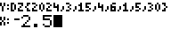
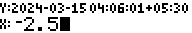
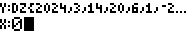

# RPN83P User Guide: DATE

This document describes the `DATE` features of the RPN83P application. It has
been extracted from [RPN83P User Guide](USER_GUIDE.md) due to its length.

The `DATE` features are available under the `ROOT > DATE` menu item in the 3rd
row:


Here is a quick summary of the features:

- determine if a given year is a leap year
- calculate day of week (Monday-Sunday) from Date
- add or subtract duration from Date
- calculate duration difference between 2 Dates
- add or subtract duration from Time
- calculate duration difference between 2 Times
- add or subtract duration from DateTime
- calculate duration difference between 2 DateTimes
- convert DateTime to different (fixed) timezones
- convert between DateTime to epoch seconds from a fixed Epoch date
- support multiple Epoch dates (Unix, NTP, GPS, custom, etc)
- set and retrieve the current date and time from the real time clock (RTC) of
  83+SE, 84+, and 84+SE (83+ does not have an RTC so is not supported)

**Version**: 0.10.0 (2024-03-14)

**Project Home**: https://github.com/bxparks/rpn83p

## Table of Content

- [Calendar, Time, and Timezones](#calendar-time-and-timezones)
    - [Gregorian Calendar](#gregorian-calendar)
    - [POSIX time](#posix-time)
    - [Timezones](#timezones)
    - [Date and Time Formats](#date-and-time-formats)
- [Date Menus](#date-menus)
- [Date Buttons](#date-buttons)
- [Date-related Objects](#date-related-objects)
    - [Data Entry](#data-entry)
    - [Formatting Modes](#formatting-modes)
    - [Date Object](#date-object)
    - [Time Object](#time-object)
    - [DateTime Object](#datetime-object)
    - [TimeZone Object](#timezone-object)
    - [ZonedDateTime Object](#zoneddatetime-object)
    - [DayOfWeek Object](#dayofweek-object)
    - [Duration Object](#duration-object)
- [Timezone Conversions](#timezone-conversions)
- [Epoch Date](#epoch-date)
    - [Custom Epoch Date](#custom-epoch-date)
    - [Epoch Conversions](#epoch-conversions)
    - [Epoch Seconds Range](#epoch-seconds-range)
- [Real Time Clock](#real-time-clock)
    - [Setting the Clock Timezone](#setting-the-clock-timezone)
    - [Setting the Clock DateTime](#setting-the-clock-datetime)
    - [Setting the Application Timezone](#setting-the-application-timezone)
    - [Get Current DateTime Now](#get-current-datetime-now)
    - [Clock Through TI-OS](#clock-through-ti-os)
- [Date Type Conversions](#date-type-conversions)
    - [DSHK - Shrink](#dshk---shrink)
    - [DEXD - Extend](#dexd---extend)
    - [DCUT - Cut](#dcut---cut)
    - [DLNK - Link](#dlnk---link)
- [Storage Registers](#storage-registers)

## Calendar, Time, and Timezones

The following is a quick summary of the fundamental date and time concepts
used by the `DATE` functions in RPN83P. If you already know most of this,
you can skip this section and continue with the [DATE Menus](#date-menus).

The `DATE` functions of the RPN83P uses the [Proleptic Gregorian
calendar](https://en.wikipedia.org/wiki/Proleptic_Gregorian_calendar) with the
year restricted to `[1,9999]`. The [UNIX
time](https://en.wikipedia.org/wiki/Unix_time) (aka POSIX time) system is used
for counting the number of seconds per day. POSIX time is similar to [UTC
time](https://en.wikipedia.org/wiki/Coordinated_Universal_Time). The major
difference is that the duration of a POSIX *second* is not a constant, in
contrast to the SI *second* used by UTC, and POSIX time does not support [leap
seconds](https://en.wikipedia.org/wiki/Leap_second). Time zones are supported as
fixed offsets from UTC. Therefore, [daylight saving
time](https://en.wikipedia.org/wiki/Daylight_saving_time) transitions are *not*
supported. When date and time objects are displayed to the user, the RPN83P uses
the [RFC 3339](https://datatracker.ietf.org/doc/html/rfc3339) standard which is
a standard that is readily accessible, unlike the similar [ISO
8601](https://en.wikipedia.org/wiki/ISO_8601) standard which is paywalled and
more difficult to access. The RPN83P also provides access to the real time clock
(RTC) included in several of the TI calculators that it is compatible with
(83+SE, 84+, 84+SE, but not the 83+). The RPN83P supports quickly converting the
current date and time from the RTC into different timezones.

### Gregorian Calendar

Most of the world currently uses the [Gregorian
Calendar](https://en.wikipedia.org/wiki/Gregorian_calendar) system. The
calendar has a 400-year cycle, with each cycle containing 146097 days. Since
146097 is divisible by 7 only once, the day of the week (Monday to Sunday)
associated with a given date repeats itself every 400 years as well.

The Gregorian calendar was first introduced on October 15, 1582, but different
countries adopted the calendar at different times over the course of the
subsequent 400+ years. For simplicity, RPN83P does not support exact historical
dates, so it adopts the [Proleptic Gregorian
calendar](https://en.wikipedia.org/wiki/Proleptic_Gregorian_calendar) which
extends the Gregorian calendar backwards from 1582 even for those dates when the
Gregorian calendar did not exist.

There are 2 sources of time keeping that are convenient for humans:
1) the **solar day**, which is the length of time of one cycle of the apparent
motion of the sun across the sky due to the rotation of the earth, and
2) the **solar year** (or tropical year) which is the average length of time
that the sun takes to complete the astronomical seasons (equinox to equinox) due
the motion of the earth around the sun.

Roughly speaking, the solar day is defined to be 86400 seconds (or more
accurately, the second was originally defined to be 1/86400 of a mean solar
day). The solar year is slightly variable, but the mean is [365.2422 mean solar
days](https://en.wikipedia.org/wiki/Tropical_year). The complex rules with
regards to leap years in the Gregorian calendar is consequence of the fact that
the solar year is not a simple integral multiple of the solar day. Since humans
find it convenient for the calendar year to synchronize with the solar year,
the Gregorian calendar inserts leap days into various years occasionally so
that the solar year and the calendar year align. In the Gregorian system, the
year is 146097/400 = 365.2425 days averaged over its 400-year cycle. This is
close enough to the mean solar year of 365.2422 days until about the year 3200
when the Gregorian calendar year will be about [a day behind the actual solar
year](https://en.wikipedia.org/wiki/Tropical_year).

For practical reasons, the RPN83P limits the year range from 0001 to 9999. The
year 0 does not exist because the calendar system increments from 1 BC to 1 AD.
In effect, 1 BC is the year 0000. We avoid the complexity of dealing with
negative years by restricting the year range to be >= 0001. The maximum year of
9999 simplifies the user interface because it can restrict the rendering of the
year component to a maximum of 4 digits.

### POSIX Time

The *second* time unit was originally defined as 1/86400 of a solar day. The
problem with this definition is that the rate of earth's rotation is not a
constant. Eventually, the *second* was redefined to use highly accurate [atomic
clocks](https://en.wikipedia.org/wiki/Atomic_clock) resulting in the definition
of the [SI second](https://en.wikipedia.org/wiki/Second). The [Coordinated
Universal Time (UTC)](https://en.wikipedia.org/wiki/Coordinated_Universal_Time)
system uses the SI *second* unit to track the solar day of the earth in terms of
the SI *seconds*.

The Earth's rotational speed is irregular and slows down by [a few milliseconds
per century](https://en.wikipedia.org/wiki/Earth's_rotation). The UTC time
system resynchronizes the solar day with the day composed of 86400 *SI seconds*
by inserting a [leap second](https://en.wikipedia.org/wiki/Leap_second) every
few years, so that the difference between a UTC day and a solar day is no more
than 0.9s. During a leap second, which happens at the very last second of the
day, the final minute has 61 seconds instead of 60 seconds. A conforming UTC
clock goes from `23:59:59` to `23:59:60`, then rolls over to `00:00:00` to
start the next day. In theory, a negative leap second is possible, in which
case the clock would skip from `23:59:58` to `00:00:00` over a single second.

A [UNIX time](https://en.wikipedia.org/wiki/Unix_time) (aka POSIX time), is a
time measuring system originally implemented on UNIX systems, where the leap
second is ignored for simplicity. More precisely, POSIX time is a time system
where a *POSIX second* is variable in duration. During a positive leap second,
a POSIX second equals 2 *SI seconds*, and a POSIX clock goes from `23:59:58` to
`23:59:59`, which is held for 2 seconds, before rolling over to `00:00:00`.
During a negative leap second, the POSIX second becomes reduced to 0 *SI
seconds*, so that a POSIX clock goes from `23:59:58` to `00:00:00` one second
later, skipping `23:59:59` instantly because the duration of `23:59:59` is
0 seconds long.

For simplicity, like many software libraries, the RPN83P calculator implements
POSIX time, not UTC time. Leap seconds are *not* considered in any
calculations. If two datetimes are subtracted to calculate the duration between
them, the resulting number of seconds is calculated in terms POSIX seconds, not
SI seconds. To obtain the *actual* number of SI seconds between those 2
datetimes, we would need to consult a table of leap seconds and add the number
of leap seconds that occurred between those 2 datetimes.

### Timezones

To maintain the convenience of having the location of the Sun near its highest
point in the sky when the local time is 12:00 noon, the world is divided into
[time zones](https://en.wikipedia.org/wiki/Time_zone). The local time is
shifted from the UTC time, usually in integral multiples of one hour, but there
exist locations which are shifted by a multiple of 30 minutes or 15 minutes.

Further complicating the calculation of the local time, many places observe
[daylight saving time](https://en.wikipedia.org/wiki/Daylight_saving_time)
(DST) during the summer months. The rules for when those DST transitions occur
and the size of the DST shift (it is not always 1 hour) are determined by each
country or jurisdiction. The most complete database of all such rules is the
[IANA TZ database](https://en.wikipedia.org/wiki/Tz_database), incorporating
between 350 to 600 timezones around the world (depending on how a "timezone" is
defined). The RPN83P does not currently support the IANA TZ database. It
supports only fixed UTC offsets.

### Date and Time Formats

The 2 commonly used conventions for representing dates and times on a computer
system is [RFC 3339](https://www.rfc-wiki.org/wiki/RFC3339) and [ISO
8601](https://en.wikipedia.org/wiki/ISO_8601). The ISO 8601 document, like all
ISO documents, is paywalled so most software developers have never seen the
actual document. There is a significant amount of overlap between the 2
standards, as shown in this [RFC 3339 vs ISO 8601 Venn
diagram](https://ijmacd.github.io/rfc3339-iso8601/).

The RPN83P follows the RFC 3339 conventions more closely than the ISO 8601. Here
are some examples:

- Date: `2024-03-14` (Mar 14, 2024)
- Time: `21:10:11` (9:10:11 pm)
- DateTime: `2024-03-14 21:10:11`
- UTC DateTime: `2024-03-15 05:10:11Z`
- ZonedDateTime: `2024-03-15 21:10:11-08:00`

Other conventions, such as the examples given in [List of date formats by
country](https://en.wikipedia.org/wiki/List_of_date_formats_by_country), are not
supported because they cause too many ambiguities for a calculator app whose
main purpose is to perform calculations on those quantities. (In other words, it
is not the goal of RPN83P to be a *clock* to the user, even though some
real-time clock functions are available on the 84+ and 84+SE which contain a
real-time clock chip.) Here is a sample of date formats which are *not*
supported in the `DATE` functions of RPN83P:

- US dates `mm/dd/yyyy`, not supported
- Canadian dates `dd/mm/yyyy`, not supported
- French dates `dd/mm/yyyy`, not supported
- German dates `dd.mm.yyyy`, not supported
- Indian dates `dd-mm-yyyy`, not supported
- HP calculator dates `mm.ddyyyy`, not supported
- HP calculator dates `dd.mmyyyyy`, not supported
- 2-digit years, absolutely not supported
- 12-hour format `hh:mm:ss AM/PM`, not supported

## DATE Menus

The following menus items are located under the `DATE` menu:

- 
    - 
    - 
    - 
        - 
        - 
    - 
    - 
    - 

## DATE Buttons

Here is a screenshot of the calculator with various buttons that are assigned to
`DATE` related functions:


These buttons do *not* require the menu system to be in the `DATE` menu
hierarchy to be active. For example, the arithmetic buttons `+`, `-`, and `*`
act normally for Real and Complex numbers, but invoke slightly different
functions when operating on Date-related objects. Similarly, the `1/x`, `SQRT`
and `x^2` buttons act normally on Real and Complex objects but are bound to the
`DCUT`, `DSHK`, and `DEXD` functions when they operate on Date-related objects.

## Date-related Objects

Prior to the addition of DATE functions, the RPN83P supported 2 data types: real
and complex numbers. The DATE functions add 7 new data types which are *record*
types, composed of fields of more primitive integer types.

- Date `D{year:u16, month:u8, day:u8}`
- Time `T{hour:u8, minute:u8, second:u8}`
- DateTime `DT{year:u16, month:u8, day:u8, hour:u8, minute:u8, second:u8}`
- TimeZone `TZ{hour:i8, minute:i8}`
- ZonedDateTime `DZ{year:u16, month:u8, day:u8, hour:u8, minute:u8, second:u8,
  tzhour:i8, tzminute:i8}`
- DayOfWeek `DW{dow:u8}`
- Duration `DR{days:i16, hours:i8, minutes:i8, seconds:i8}`

If you are familiar with the C++ language, you may think of these Record
specifications as class constructors using brace-initialization, with the class
names being `D`, `T`, `DT`, `DR`, `TZ`, `DZ`, and `DW`.

The primitive integer types are:

- `u16`: unsigned 16-bit integer, [0, 65535]
- `u8`: unsigned 8-bit integer, [0, 255]
- `i16`: signed 32-bit integer, [-32768, 32767]
- `i8`: signed 8-bit integer, [-128, 127]

The RPN stack registers and storage registers have been upgraded to hold these
additional data types.

### Data Entry

To allow these Record types to be entered using the calculator buttons, the
following keys have been activated:

- `2ND {` (left brace)
- `2ND }` (right brace)
- `ALPHA A` to `ALPHA Z`
- `,` (comma)
- `:` (colon)

Prior to v0.10, both the `,` and `2ND EE` keystrokes were mapped to the `EE`
function to allow numbers in scientific notation to be entered easily. However
the entry of the Date objects requires the use of the comma `,` key, so the app
now contains an option to control the behavior of this button under the `MODE`
menu:

- 
    - 

If the `,EE` option is selected (factory default), the button behaves as labeled
on the keyboard: the `,` button invokes the comma function, and `2ND EE` invokes
the exponent function. This option is useful to have fast access to the comma
button which is essential for entering the components of the date objects.

If the `EE,` option is selected, the button behavior is reversed: the `,` button
invokes the exponent function, and `2ND EE` button invokes the comma function.
This is option is useful for people who will rarely (or never) use the `DATE`
functions, and want to enter scientific notation numbers easily without going
through an extra `2ND` keystroke.

The date objects are entered using the `ALPHA` key to enter the object name tag,
the left brace `{` and right brace `}` keys to delimit the components of the
objects, and the comma key `,` between each component. For example, to enter the
date `March 14, 2024`, we would mentally translate that into the RFC 3339 format
`2024-03-14`, which corresponds to the Date object `D{2024,3,14}`, which would
be entered using the following keystrokes:

```
ALPHA D
2ND {
2024
,
3
,
14
2ND }
```

For brevity and readability, this long sequence of keystrokes will be shortened
to something like `D{2024,3,14}` in the subsequent sections.

### Formatting Modes

In the `MODE` menu, there are 2 settings that affect how date objects are
displayed:

- 
    - 

If the `{..}` (Raw Formatting) option is selected (factory default), the date
objects will be displayed in their raw form using curly braces. This will be
identical to the format used to *enter* these objects.

If the `".."` (String Formatting) option is selected, the date objects will be
displayed as human-readable strings using the RFC 3339 specification as much as
practical.

The Raw Formatting (`{..}`) option is the format used to enter the objects, and
is better at showing their internal structure. But it has the disadvantage that
complex objects like ZonedDateTime can overflow the length of a single line.
When this happens, the [SHOW Mode](USER_GUIDE.md#show-mode) (using `2ND ENTRY`
keystroke) can be used to show the entire raw formatting without truncation. The
String Formatting mode (`".."`) is more compact and will always be adjusted to
fit entirely into a single line. Most users will probably switch to String
Formatting after an initial learning period.

In the following sections, the screenshots for both Raw and String Formatting
modes will be shown.

**Pro Tip**: If the `MODE` menu is activated using the `MODE` **button**, the
"Jump Back" feature is enabled so that the `ON/EXIT` button returns to the prior
menu location. This makes it easy to quickly change the `{..}` or `".."`
formatting modes.

### Date Object

The `Date` object has the form `D{year:u16, month:u8, day:u8}` and represents a
Gregorian calendar date. For example, the date `2024-03-14` is entered into the
calculator as follows, and is displayed in 2 different ways depending on the
MODE setting of `{..}` or `".."`:

| **Keys**              | **MODE `{..}`**                   | **MODE `".."`** |
| ----------------      | ---------------------             | --------------- |
| `D{2024,3,14}`        |    |  |
| `ENTER`               |    |  |
| `2ND ENTER` (SHOW)    |     |  |

#### Date Validation

Upon input termination, Date components are validated to make sure that it
represents a proper Gregorian calendar date. If the component is invalid, an
`Err:Invalid` error message is displayed. For example, if we try to enter the
invalid date `2024-02-30`, we get:

| **Keys**          | **MODE `{..}`**                       | **MODE `".."`**   |
| ------------------| ---------------------                 | ----------------- |
| `D{2024,2,30}`    |     |  |
| `ENTER`           |     |  |

Notice that for input validation errors like this, the input is not terminated
and the prompt continues to be shown. You can pressed the `DEL` to delete the
input characters and fix the error.

Here is an incomplete list of validation rules:

- `year` component must be between 1 and 9999
- `month` component must be between 1 and 12
- `day` component must be between 1 and 31, and must be valid for the given
  month

#### Date Operations

Addition and subtraction operations are supported as shown in the following
table:

| **Operation**             | **Result**|
| ------------------------- | ----------|
| {Date} + {integer}        | {Date}    |
| {integer} + {Date}        | {Date}    |
| {Date} - {integer}        | {Date}    |
| {Date} - {Date}           | {integer} |
| {integer} - {Date}        | INVALID   |

When operating on `Date` objects, integer values are assumed to be in units of
`days`. For example, let's add 20 days to the date of 2024-03-14, then
subtract 30 days from that result:

| **Keys**          | **MODE `{..}`**                       | **MODE `".."`**   |
| ------------------| ---------------------                 | ----------------- |
| `D{2024,3,14}`    |    |  |
| `ENTER`           |    |  |
| `20`              |    |  |
| `+`               |    |  |
| `30`              |    |  |
| `-`               |    |  |

We can subtract 2 Date records to obtain the number of whole days between the 2
dates:

| **Keys**          | **MODE `{..}`**                       | **MODE `".."`**   |
| ------------------| ---------------------                 | ----------------- |
| `D{2024,12,25}`   |    |  |
| `ENTER`           |    |  |
| `D{2024,3,14}`    |    |  |
| `-`               |    |  |

There are 286 days from March 14 to Dec 25, 2024.

### Time Object

The `Time` object has the form `T{hour:u8, minute:u8, second:u8}`. For example,
the time `15:36:01` is entered into the calculator like this:

| **Keys**              | **MODE `{..}`**                   | **MODE `".."`**   |
| ------------------    | ---------------------             | ----------------- |
| `T{15,36,1}`          |    |  |
| `ENTER`               |    |  |
| `2ND ENTER` (SHOW)    |     |  |

#### Time Validation

The validation rules for a `Time` record is more straightforward than a `Date`
record:

- the `hour` component must be in the interval [0, 23]
- the `minute` component must be in the interval [0, 59]
- the `second` component must be in the interval [0, 59], leap seconds not
  supported

#### Time Operations

Just like `Date` records, addition and subtraction operations are supported as
summarized in the following table:

| **Operation**             | **Result**|
| ------------------------- | --------- |
| {Time} + {integer}        | {Time}    |
| {integer} + {Time}        | {Time}    |
| {Time} - {integer}        | {Time}    |
| {Time} - {Time}           | {integer} |
| {integer} - {Time}        | INVALID   |

There are 2 important differences:

1. The integers are in units of *seconds*, not *days*, and
2. If the resulting `Time` is less than `00:00:00` or greater than `24:00:00`,
the resulting time is renormalized so that it becomes within those bounds. In
other words, addition and subtraction operations are performed modulo 86400
seconds.

Let's perform some arithmetic operations on the Time value, for example, add 234
seconds, then subtract 100,000 seconds:

| **Keys**          | **MODE `{..}`**                       | **MODE `".."`**   |
| ------------------| ---------------------                 | ----------------- |
| `T{15,36,1}`      |    |  |
| `ENTER`           |    |  |
| `234`             |    |  |
| `+`               |    |  |
| `100000`          |    |  |
| `-`               |    |  |

Since 100,000 seconds is more than 1 day, the Time object wraps around.

Just like the Date object, we can subtract 2 Time objects to obtain the number
of seconds between the 2 objects:

| **Keys**          | **MODE `{..}`**       | **MODE `".."`**   |
| ------------------| --------------------- | ----------------- |
| `T{15,36,1}`      |    |  |
| `ENTER`           |    |  |
| `T{17,0,0}`       |    |  |
| `-`               |    |  |

There are 5039 seconds between `15:36:01` and `17:00:00`.

### DateTime Object

A DateTime record is a concatenation of the Date record and a Time record. It
has the format `DT{year:u16, month:u8, day:u8, hour:u8, minute:u8, second:u8}`.

For example, the date `2024-03-14 15:36:01` would be entered like this:

| **Keys**                  | **MODE `{..}`**                       | **MODE `".."`**               |
| ------------------------- | ---------------------                 | -----------------             |
| `DT{2024,3,14,15,36,1}`   |    |  |
| `ENTER`                   |    |  |
| `2ND ENTER` (SHOW)        |     |  |

#### DateTime Validation

The validation rules of the `DateTime` is the union of the validation rules
for the `Date` record and the rules for the `Time` record.

#### DateTime Operations

The addition and subtraction operations are available on the `DateTime` object,
just like `Date` and `Time`. The integer numbers are in unit of *second*.

| **Operation**             | **Result**    |
| --------------------------| ------------- |
| {DateTime} + {integer}    | {DateTime}    |
| {integer} + {DateTime}    | {DateTime}    |
| {DateTime} - {integer}    | {DateTime}    |
| {DateTime} - {DateTime}   | {integer}     |
| {integer} - {DateTime}    | INVALID       |

For example, let's subtract 100,000 seconds from `2024-03-14 15:39:55`:

| **Keys**                  | **MODE `{..}`**                           | **MODE `".."`**               |
| ------------------------- | ---------------------                     | -----------------             |
| `DT{2024,3,14,15,36,1}`   |    |  |
| `ENTER`                   |    |  |
| `100000`                  |    |  |
| `-`                       |    |  |

We can subtract 2 `DateTime` objects:

|  **Keys**                 |  **MODE `{..}`**                          |  **MODE `".."`**              |
| ------------------------- | ---------------------                     | -----------------             |
| `DT{2024,12,25,0,0,0}`    |    |  |
| `ENTER`                   |    |  |
| `DT{2024,3,14,15,36,1}`   |    |  |
| `-`                       |    |  |

There are 24654239 seconds from March 13, 2024 15:39:55 to Christmas Dec 25,
2024 00:00:00.

We can convert the 24654239 seconds quantity into something that is easier to
understand for humans by converting it into a `Duration` object. (The
`Duration` object is described in more detail in the [Duration
Object](#duration-object) below.) Scroll down the `DATE` menu rows until the
`S>DR` menu item appears, as shown in the table below. Press that menu item to
convert 24654239 seconds into a `Duration` object:

|  **Keys**     |  **MODE `{..}`**                                  |  **MODE `".."`**        |
| ----------    | ---------------------                             | -----------------       |
| (from above)  |            |  |
| `S>DR`        |   |  |

We can now see that there are 285 days, 8 hours, 23 minutes, and 59 seconds
between March 13, 2024 15:39:55 to Christmas Dec 25, 2024 00:00:00.

### TimeZone Object

The TimeZone object has the form `TZ{hour:i8, minute:i8}`. It represents a fixed
offset from UTC. As noted earlier, the RPN83P does not currently support
timezones with automatic DST transitions, such as those defined by the IANA TZ
database. Daylight saving time changes must be handled manually. For example,
the standard offset for `America/Los_Angeles` is UTC-08:00 during the winter
months, and changes to UTC-07:00 during the summer months.

| **Keys**              | **MODE `{..}`**                       | **MODE `".."`**   |
| -----------           | ---------------------                 | ----------------- |
| `TZ{-8,0}`            |    |  |
| `ENTER`               |    |  |
| `2ND ENTER` (SHOW)    |     |  |

#### TimeZone Validation

The validation rules for a TimeZone object are:

- a timezone must be a multiple of 0:15 minutes
- a timezone can span from [-23:45,+23:45]. This is sufficient to capture all
  timezones currently in use around the world, which fall within the range of
  UTC-12:00 to UTC+14:00.
- the signs of the `hour` and `minute` components must match each other

Here is an example of an invalid timezone whose `hour` and `minute` have the opposite sign:

| **Keys**    | **MODE `{..}`**                             | **MODE `".."`**   |
| ----------- | ---------------------                       | ----------------- |
| `TZ{-4,30}` |  |  |
| `ENTER`     |  |  |

#### TimeZone Operations

No arithmetic operations (addition, subtraction) are defined on TimeZone
objects, because they did not seem useful for real-life calculations.

The TimeZone object can be converted to and from a floating point number
representing the number of hours shifted from UTC. These are exposed using the
`H>TZ` and `TZ>H` menu items:


To convert `TZ{-4,~30}` to hours then back to a TimeZone object:

| **Keys**     | **MODE `{..}`**                                | **MODE `".."`**   |
| -------------| ---------------------                          | ----------------- |
| `TZ{-4,-30}` |     |  |
| `TZ>H`       |     |  |
| `H>TZ`       |     |  |

### ZonedDateTime Object

The ZonedDateTime is a combination of Date, Time, and TimeZone. It has the form
`DZ{year:u16, month:u8, day:u8, hour:u8, minute:u8, second:u8, tzhour:i8,
tzminute:i8}`. It describes the local time of a specific place that uses a
specific UTC offset.

Here is an example of entering the date `2024-03-14 15:36:01-07:00` which
occurred in `America/Los_Angeles` timezone after the DST shift on March 10,
2024:

| **Keys**                      | **MODE `{..}`**                           | **MODE `".."`**                   |
| -------------------------     | ---------------------                     | -----------------                 |
| `DZ{2024,3,14,15,36,1,-7,0}`  |   |  |
| `ENTER`                       |   |  |
| `2ND ENTER` (SHOW)            |   |  |

ZonedDateTime objects with a UTC offset of +00:00 are special, and it is useful
to display them slightly differently. Here is how the date 2024-03-14 22:36:00
UTC is entered and displayed:

| **Keys**                      | **MODE `{..}`**                               | **MODE `".."`**                   |
| -------------------------     | ---------------------                         | -----------------                 |
| `DZ{2024,3,14,22,36,1,0,0}`   |   |  |
| `ENTER`                       |   |  |
| `2ND ENTER` (SHOW)            |   |  |

#### ZonedDateTime Validation

The validation rules of the `ZonedDateTime` is the union of the validation rules
for the `Date`, `Time`, and `TimeZone` objects.

#### ZonedDateTime Operations

The addition and subtraction operations are available on the `ZonedDateTime`
object, just like the `DateTime` object. The integer numbers are in unit of
*second*.

| **Operation**                     | **Result**        |
|-----------------------------------|-------------------|
| {ZonedDateTime} + {integer}       | {ZonedDateTime}   |
| {integer} + {ZonedDateTime}       | {ZonedDateTime}   |
| {ZonedDateTime} - {integer}       | {ZonedDateTime}   |
| {ZonedDateTime} - {ZonedDateTime} | {integer}         |
| {integer} - {ZonedDateTime}       | INVALID           |

The resulting ZonedDateTime will have the same TimeZone offset as the input
ZonedDateTime.

For example, let's add 100_000 seconds to `2024-03-14 15:36:01-07:00`:

| **Keys**                      | **MODE `{..}`**                               | **MODE `".."`**                   |
| -------------------------     | ---------------------                         | -----------------                 |
| `DZ{2024,3,14,15,36,1,-7,0}`  |   |  |
| `ENTER`                       |   |  |
| `100000`                      |   |  |
| `+`                           |   |  |

We can subtract 2 `ZonedDateTime` objects to obtain the number of seconds
between them. Their TimeZone components are not required to be same. For
example, let's determine the number of seconds from March 14, 2024 UTC-07:00 to
December 25, 2024 UTC:

| **Keys**                      | **MODE `{..}`**                               | **MODE `".."`**                   |
| -------------------------     | ---------------------                         | -----------------                 |
| `DZ{2024,12,25,0,0,0,0,0}`    |   |  |
| `ENTER`                       |   |  |
| `DZ{2024,3,14,15,36,1,-7,0}`  |   |  |
| `-`                           |   |  |
| `S>DR`                        |   |  |

As before, we have used the `S>DR` menu function to convert `seconds` to
a `Duration` object which can be more useful in some situations.

### DayOfWeek Object

The `DayOfWeek` object has the form `DW{dow:u8}`, where the `dow` field is a
single integer containing the [ISO Weekday
number](https://en.wikipedia.org/wiki/ISO_8601), where Monday is represented by
1 and Sunday is represented by 7. For example, Thursday has an ISO weekday value
of 4 and can be entered as:

| **Keys**              | **MODE `{..}`**                       | **MODE `".."`**   |
| -----------           | ---------------------                 | ----------------- |
| `DW{4}`               |   |  |
| `ENTER`               |   |  |
| `2ND ENTER` (SHOW)    |    |  |

#### DayOfWeek Validation

Upon input termination, the `dow` component is validated and if the component is
invalid, an `Err:Invalid` error message is displayed. For example, if we try to
enter the invalid DayOfWeek value of `DW{0}`, an error is shown:

| **Keys**   | **MODE `{..}`**                              | **MODE `".."`**   |
| -----------| ---------------------                        | ----------------- |
| `DW{0}`    |  |  |
| `ENTER`    |  |  |

#### DayOfWeek Operations

Although it is unlikely to be used often, addition and subtraction operations
have been implemented for the DayOfWeek object, mostly for consistency. To add 6
days to Thursday, we can enter:

| **Keys**   | **MODE `{..}`**                          | **MODE `".."`**   |
| -----------| ---------------------                    | ----------------- |
| `DW{4}`    |  |  |
| `ENTER`    |  |  |
| `6`        |  |  |
| `+`        |  |  |

You can subtract 2 DayOfWeek objects to get the number of days between them:

| **Keys**   | **MODE `{..}`**                          | **MODE `".."`**   |
| -----------| ---------------------                    | ----------------- |
| `DW{4}`    |  |  |
| `ENTER`    |  |  |
| `DW{5}`    |  |  |
| `-`        |  |  |

### Duration Object

The `Duration` object has the form `DR{days:i16, hours:i8, minutes:i8,
seconds:i8}`. It can be a positive or a negative quantity.

For example, a positive `Duration` object would be:

| **Keys**              | **MODE `{..}`**                           | **MODE `".."`**   |
| -----------           | ---------------------                     | ----------------- |
| `DR{1,2,3,4}`         |    |  |
| `ENTER`               |    |  |
| `2ND ENTER` (SHOW)    |     |  |

A negative duration would be:

| **Keys**              | **MODE `{..}`**                           | **MODE `".."`**   |
| -----------           | ---------------------                     | ----------------- |
| `DR{-4,0,-2,0}`       |    |  |
| `ENTER`               |    |  |
| `2ND ENTER` (SHOW)    |     |  |

Notice that for negative durations, all the components must be negative (or
zero). Also notice that when a Duration component is exactly 0, that component
is omitted from the human-readable string format (in the case above, the `0h`
and `0s` components).

The `days` component is restricted to 4 digits, so the largest magnitude is
`9999`. Therefore, the largest duration that can be represented by the
Duration object is `9999d 23h 59m 59s` or about 24.3 years.

#### Duration Shorthand Entry

We sometimes want to quickly enter a single component of a Duration object
without having to enter the `0` values for the other components. For example, to
enter "2 minutes", we would have to enter `DR{0,0,2,0}`, and for "12 hours", we
would need to enter `DR{0,12,0,0}`. The RPN83P app provides a shortcut for
entering these simple Durations using the colon character `:` and a letter (`S`,
`M`, `H`, `D`):

- `dddd:D` - shortcut for `DR{dddd,0,0,0}`, i.e. "dddd days"
- `hh:H` - shortcut for `DR{0,hh,0,0}`, i.e. "hh hours"
- `mm:M` - shortcut for `DR{0,0,mm,0}`, i.e. "mm minutes"
- `ss:S` - shortcut for `DR{0,0,0,ss}`, i.e. "ss seconds"

For example, here is how to enter 4 Duration objects (1 day, 2 hours, 3 minutes,
and 4 seconds) using the colon-shortcut notation:

| **Keys**  | **MODE `{..}`**                               | **MODE `".."`**   |
| --------- | ---------------------                         | ----------------- |
| `1:D`     |        |  |
| `ENTER`   |        |  |
| `2:H`     |       |  |
| `ENTER`   |       |  |
| `3:M`     |     |  |
| `ENTER`   |     |  |
| `4:S`     |     |  |
| `ENTER`   |     |  |

#### Duration Validation

The components of the Duration object has the following validation rules:

- `days` is currently limited to 4 digits [-9999,9999]
- `hours` must be in the interval [-23,23]
- `minutes` must be in the interval [-59,59]
- `seconds` must be in the interval [-59,59]
- all components must have the same sign (or zero)

#### Duration Operations

Basic addition and subtraction operations are defined on Duration objects:

| **Operation**                 | **Result**        |
|-------------------------------|-------------------|
| {Duration} + {integer}        | {Duration}        |
| {integer} + {Duration}        | {Duration}        |
| {Duration} + {Duration}       | {Duration}        |
| {Duration} - {integer}        | {Duration}        |
| {Duration} - {Duration}       | {Duration} [1]    |
| {integer} - {Duration}        | {Duration} [2]    |

[1] Subtracting 2 Duration objects results in another Duration object. This is
different from other date-time objects where subtracting 2 objects of the same
type produces an integer.

[2] A Duration can be subtracted from an integer and the result is another
Duration. This is an INVALID operation for all other date-time types.

Here are some examples of addition and subtraction operations involving Duration
objects:

| **Keys**          | **MODE `{..}`**                           | **MODE `".."`**   |
| -----------       | ---------------------                     | ----------------- |
| `DR{1,2,0,1}`     |    |  |
| `ENTER`           |    |  |
| `60` (seconds)    |    |  |
| `+`               |    |  |
| `DR{-4,0,-2,0}`   |    |  |
| `-`               |    |  |
| `-2:H`            |    |  |
| `+`               |    |  |
| `+/-` (-)         |    |  |

The Duration object is even more useful when it is used with other date-time
objects like Date, Time, DateTime, and ZonedDateTime. As a rule of thumb, it can
be used where an integer would normally be used:

| **Operation**                 | **Result**        |
|-------------------------------|-------------------|
| {Date} + {Duration}           | {Date}            |
| {Duration} + {Date}           | {Date}            |
| {Date} - {Duration}           | {Date}            |
| {Duration} - {Date}           | INVALID           |
|                               |                   |
| {Time} + {Duration}           | {Time}            |
| {Duration} + {Time}           | {Time}            |
| {Time} - {Duration}           | {Time}            |
| {Duration} - {Time}           | INVALID           |
|                               |                   |
| {DateTime} + {Duration}       | {DateTime}        |
| {Duration} + {DateTime}       | {DateTime}        |
| {DateTime} - {Duration}       | {DateTime}        |
| {Duration} - {DateTime}       | INVALID           |
|                               |                   |
| {ZonedDateTime} + {Duration}  | {ZonedDateTime}   |
| {Duration} + {ZonedDateTime}  | {ZonedDateTime}   |
| {ZonedDateTime} - {Duration}  | {ZonedDateTime}   |
| {Duration} - {ZonedDateTime}  | INVALID           |

For example, let's add the Duration `2h 33m` to the Time `12:58:32`:

| **Keys**          | **MODE `{..}`**                               | **MODE `".."`**   |
| -----------       | ---------------------                         | ----------------- |
| `T{12,58,32}`     |   |  |
| `ENTER`           |   |  |
| `DR{0,2,33,0}`    |   |  |
| `+`               |   |  |

Another example, let's add 30 days to the DateTime `2024-03-14 12:58:32`:

| **Keys**                  | **MODE `{..}`**                                   | **MODE `".."`**   |
| -----------               | ---------------------                             | ----------------- |
| `DT{2024,3,14,12,58,32}`  |   |  |
| `ENTER`                   |   |  |
| `30:D`                    |   |  |
| `+`                       |   |  |

## Timezone Conversions

A ZonedDateTime with a specific timezone (e.g. UTC-07:00) can be converted to
another ZonedDateTime with a different timezone (e.g. UTC+13:00). To allow this
conversion to be performed quickly, the RPN83P app uses the multiplication
button `*` to perform the conversion:

| **Operation**                 | **Result**        |
|-------------------------------|-------------------|
| {ZonedDateTime} * {integer}   | {ZonedDateTime}   |
| {ZonedDateTime} * {TimeZone}  | {ZonedDateTime}   |
| {integer} * {ZonedDateTime}   | {ZonedDateTime}   |
| {TimeZone} * {ZonedDateTime}  | {ZonedDateTime}   |

The `*` operator takes 2 arguments and extracts the timezones as follows:

- the *source* timezone is contained in the ZoneDateTime object
- the *target* timezone is given as a TimeZone object or a floating point
  equivalent of the timezone (e.g. `UTC-02:30` can be given as `-2.5`)

Let's convert the datetime 2024-03-14 15:36:01-07:00 (Pacific Time, USA) to the
following timezones:

- UTC+13:00 (Auckland, New Zealand)
- UTC+05:30 (India)
- UTC-02:30 (Newfoundland, Canada)
- UTC-00:00 (UTC)

| **Keys**                      | **MODE `{..}`**                               | **MODE `".."`**                   |
| -------------------------     | ---------------------                         | -----------------                 |
| `DZ{2024,3,14,15,36,1,-7,0}`  |   |  |
| `ENTER`                       |   |  |
| `13`                          |   |  |
| `*`                           |   |  |
| `TZ{5,30}`                    |   |  |
| `*`                           |   |  |
| `-2.5`                        |   |  |
| `*`                           |   |  |
| `0`                           |   |  |
| `*`                           |   |  |

## Epoch Date

Many computer systems keep track of time by counting the number of sections from
a specific date, called the
[epoch](https://en.wikipedia.org/wiki/Epoch_%28computing%29)  RPN83P supports
the following epoch dates under the `EPCH` menu:

- 
    - 
    - 

The following predefined epoch dates can be selected:

- `UNIX`: 
    - 1970-01-01 00:00:00 UTC (default)
    - [Unix epoch](https://en.wikipedia.org/wiki/Unix_time)
- `NTP`:
    - 1900-01-01 00:00:00 UTC
    - [NTP epoch](https://en.wikipedia.org/wiki/Network_Time_Protocol)
- `GPS`:
    - 1980-01-06 00:00:00 UTC
    - [GPS epoch](https://en.wikipedia.org/wiki/Global_Positioning_System)
- `TIOS`:
    - 1997-01-01 00:00:00 UTC
    - [TIOS epoch](https://wikiti.brandonw.net/index.php?title=83Plus:Ports:45)
      used by the TI calculators
- `Y2K`:
    - 2000-01-01 00:00:00 UTC
    - An epoch date used by some 32-bit systems to avoid the
    [Year 2038 problem](https://en.wikipedia.org/wiki/Year_2038_problem)
- `CEPC`:
    - user-configurable custom epoch date, set using the `EPC` menu
    - the factory default is `2050-01-01`

### Custom Epoch Date

The custom Epoch date can be set using the `EPC` (set epoch) menu. It can be
retrieved using the `EPC?` menu. For example, to view the current custom epoch
date, then set it to `2100-01-01`:

| **Keys**          | **MODE `{..}`**                           | **MODE `".."`**   |
| -----------       | ---------------------                     | ----------------- |
| `EPC?`            |     |  |
| `D{2100,1,1}`     |     |  |
| `EPC`             |     |  |
| `EPC?`            |     |  |

### Epoch Conversions

Once an Epoch date has been defined, it is often convenient to convert Gregorian
date and datetimes to a number that counts the number of days or number of
seconds offset from the Epoch date. For example, Unix systems keep track of time
using an `epochSeconds` number which counts the number of seconds from the Unix
Epoch of 1970-01-01 UTC.

In the following examples, the `UNIX` epoch has been selected:


There are 5 menu functions which support conversions from calendar dates and
datetimes to epoch days and seconds:

- 
- 

The first 2 operate on Epoch days:

- `D>DY`
    - converts the current Date object into the number of whole days from the
      current Epoch date.
- `DY>D`
    - converts the number of Epoch days to a Date object

For example, let's calculate the Epoch days of 2024-03-14 using the Unix Epoch
of 1970-01-01:

| **Keys**          | **MODE `{..}`**                       | **MODE `".."`**   |
| -----------       | ---------------------                 | ----------------- |
| `D{2024,3,14}`    |   |  |
| `D>DY`            |   |  |
| `DY>D`            |   |  |

The next 3 operate on Epoch seconds:

- `Dx>S`
    - calculates the `epochseconds` representation of the input object. If the
      input is a ZonedDateTime, then the output is the number of seconds from
      the current Epoch date.
- `S>DZ`
    - converts the number of `epochseconds` to the ZonedDateTime using the
      currently selected App TimeZone (see `TZ` and `TZ?` below)
- `S>UT`
    - same as `S>DZ` except that the timezone of the resulting ZonedDateTime is
      always UTC+00:00.

For example, let's calculate the epoch seconds of `2024-03-14 15:36:01-07:00`
using the Unix epoch date of 1970-01-01 UTC:

| **Keys**                      | **MODE `{..}`**                           | **MODE `".."`**   |
| -----------                   | ---------------------                     | ----------------- |
| `UNIX`                        |    |  |
| `ON` `UP`                     |    |  |
| `DZ{2024,3,14,15,36,1,-7,0}`  |    |  |
| `D*>S`                        |    |  |
| `S>UT`                        |    |  |
| `D*>S`                        |    |  |
| `S>DZ`                        |    |  |

The last result from the `S>DZ` function requires some explanation. That
function converts the `epochseconds` into a ZonedDateTime using the
**Application** Timezone. How is the Application Timezone defined? It is set by
the `TZ` menu command explained in [Setting the Application
Timezone](#setting-the-application-timezone) below. In this example, the
Application Timezone (retrieved by `TZ?`) was set to UTC-07:00.

### Epoch Seconds Range

Internally, all date/time calculations are performed using 40-bit signed
integers whose range is `[-549_755_813_888, +549_755_813_887]` seconds. This is
approximately `[-17421,+17421]` years which is more than enough to handle the
entire range of years `[1,9999]` supported by this framework. The use of 40-bit
signed integers allows RPN83P to avoid the [Year
2038](https://en.wikipedia.org/wiki/Year_2038_problem) problem which affects
many older Unix systems which use a 32-bit signed integer to hold the
epochseconds quantity.

## Real Time Clock

The TI-84+ and TI-84+SE models include a real time clock (RTC) chip, unlike the
earlier 83+ and 83+SE models. This allows the 84+ models to set and display the
current date and time.

The menu items which related to the RTC are the last 2 rows of the `DATE` menu
hierarchy:

- 
    - `NOW`: return the current date-time as epochseconds from the current Epoch
    date
    - `NOWD`: return the current date-time as a `Date` object
    - `NOWT`: return the current date-time as a `Time` object
    - `NWDZ`: return the current date-time as a `ZonedDateTime` object using the
    Application Timezone
    - `NWUT`: return the current date-time as a `ZonedDateTime` object using the UTC
    timezone
- 
    - `TZ`: set the App Timezone
    - `TZ?`: retrieve the App Timezone
    - `CTZ`: set the Clock Timezone
    - `CTZ?`: retrieve the Clock Timezone
    - `SETC`: set the date and time of the Clock

Before we can use retrieve the current date and time from the hardware
clock (RTC) using the various `NOW` and `NWxx` menu commands, we must configure
the hardware clock using the `CTZ` and `SETC` commands, and we must configure
the Application Timezone using the `TZ` command.

### Setting the Clock Timezone

The hardware clock timezone must be set using the `CTZ` menu command before
setting the hardware clock's datetime. There are 2 options which seem most
likely:

**Option 1**: Set the hardware clock timezone to UTC so that it can be
translated to any timezone, without having to worry about DST transitions. Here
is how to set the hardware clock timezone to UTC:

| **Keys**   | **MODE `{..}`**                                      | **MODE `".."`**   |
| -----------| ---------------------                                | ----------------- |
| `0`        |     |  |
| `CTZ`      |     |  |
| `CTZ?`     |     |  |

**Option 2**: Set the hardware clock timezone to the local timezone (e.g.
UTC-08:00 or UTC-07:00, Pacific Time in the US):

| **Keys**   | **MODE `{..}`**                                      | **MODE `".."`**   |
| -----------| ---------------------                                | ----------------- |
| `TZ{-7,0}` |     |  |
| `CTZ`      |     |  |
| `CTZ?`     |     |  |

My recommendation is to use **Option 1** which sets the hardware clock timezone
to UTC. The problem with Option 2 which sets the clock to the local timezone is
that for regions which has DST rules during parts of the year, the hardware
clock's time will be incorrect during the months when the DST rules are in
effect.

### Setting the Clock DateTime

Once the timezone of the hardware clock is set, the actual date-time of the
clock can be configured using the `SETC` (set clock) command. That command takes
a ZonedDateTime value as the argument, like this:

| **Keys**                      | **MODE `{..}`**                               | **MODE `".."`**   |
| -----------                   | ---------------------                         | ----------------- |
| `DZ{2024,3,14,15,36,1,-7,0}`  |  |  |
| `SETC`                        |  |  |

Internally, the TI-84+/84+SE hardware clock keeps track of time as a 32-bit
integer counting the number of seconds from the TI-OS epoch date, which is
1997-01-01 00:00:00 UTC. The ZonedDateTime given to the `SETC` command is
converted into an epochseconds before being handed over to the hardware clock.

### Setting the Application Timezone

In addition to the timezone of the RTC, RPN83P also allows the **Application**
Timezone to be set using the `TZ` and `TZ?` commands. This timezone is
*independent* of the hardware clock timezone. The Application Timezone is the
default timezone inserted into a ZonedDateTime object when a particular function
returns a ZonedDateTime (e.g. `NWDZ`, `S>DZ`).

To set the App Timezone to UTC-07:00 for example, use the following:

| **Keys**  | **MODE `{..}`**                                  | **MODE `".."`**   |
| ----------| ---------------------                            | ----------------- |
| `TZ{-7,0}`|  |  |
| `TZ`      |  |  |
| `TZ?`     |  |  |

### Get Current DateTime Now

Now that we have configured the hardware clock, we can use the various `NOW` and
`NWxx` commands to retrieve the current date and time from the RTC:


| **Keys**  | **MODE `{..}`**                   | **MODE `".."`**   |
| ----------| ---------------------             | ----------------- |
| `NOW`     |   |  |
| `NOWD`    |  |  |
| `NOWT`    |  |  |
| `NWDZ`    |  |  |
| `NWUT`    |  |  |

### Clock Through the TI-OS

The same hardware clock can be accessed and configured using the normal TI-OS
through the `MODE` screen on the first or second page (depending on the OS
version), like this:


The TI-OS does *not* know about the time zone. The date-time displayed here will
be in the timezone configured by the `CTZ` command in RPN83P. For example, if
`CTZ` is set to `UTC+00:00`, then the date-time displayed here will be in UTC
timezone. If the `CTZ` timezone was configured to be `UTC-07:00`, the date-time
here will be in `UTC-07:00`.

## Date Type Conversions

Sometimes we want to combined the Date and Time and TimeZone objects into bigger
objects, or take apart bigger objects into smaller components. Row 4 of the
`DATE` menu () contains menu items
which allow those operations to be performed.

### DSHK - Shrink

The `DSHK` (Date Shrink) command converts a ZonedDateTime into a DateTime by
truncating the Timezone component. When it is applied again to the DateTime object,
it is converts into a Date object by truncating the Time component.

For example, let's apply the `DCUT` command on the following ZonedDateTime to
convert it to a DateTime, then a Date object, by pressing `DCUT` twice:

| **Keys**                      | **MODE `{..}`**                   | **MODE `".."`**   |
| ----------                    | ---------------------             | ----------------- |
| `DZ{2024,3,14,15,36,1,-7,0}`  |    |  |
| `ENTER`                       |    |  |
| `DSHK`                        |    |  |
| `DSHK`                        |    |  |

The `ENTER` was used to show the original object on the RPN stack. It was not
necessary to press it before the first `DSHK` command.

### DEXD - Extend

The `DEXD` (Date Extend) command perform the reverse of the `DSHK` command by
appending the Time component and the TimeZone component successively. For
example, let's start with a Date object and press the `DEXD` command twice:

| **Keys**                      | **MODE `{..}`**                   | **MODE `".."`**   |
| ----------                    | ---------------------             | ----------------- |
| `D{2024,3,14}`                |    |  |
| `ENTER`                       |    |  |
| `DEXD`                        |    |  |
| `DEXD`                        |    |  |

As before, the `ENTER` was used only for the purpose of displaying the original
Date object. It was not necessary to press it before the first `DEXD` command.

### DCUT - Cut

The `DCUT` (Date Cut) command breaks apart big object on the `X` register into 2
smaller ones on the `X` and `Y` registers.

- ZoneDateTime (`X`) becomes DateTime (`X`) and TimeZone (`Y`)
- DateTime (`X`) becomes Date (`X`) and Time (`Y`)

For example, let's apply the `DCUT` command on the following ZonedDateTime:

| **Keys**                      | **MODE `{..}`**                   | **MODE `".."`**   |
| ----------                    | ---------------------             | ----------------- |
| `DZ{2024,3,14,15,36,1,-7,0}`  |    |  |
| `ENTER`                       |    |  |
| `DCUT`                        |    |  |
| `DCUT`                        |    |  |

### DLNK - Link

The `DLNK` (Date Link) command performs the reverse of the `DCUT` command by
combining the `X` and `Y` stack registers into a single object in `X`.

- DateTime (`X`) and TimeZone (`Y`) becomes a ZoneDateTime (`X`)
- Date (`X`) and Time (`Y`) becomes a DateTime (`X`)


For example, let's incrementally build a ZonedDateTime from a Date, Time and
TimeZone object:

| **Keys**                      | **MODE `{..}`**                   | **MODE `".."`**   |
| ----------                    | ---------------------             | ----------------- |
| `D{2024,3,14}`                |    |  |
| `ENTER`                       |    |  |
| `T{15,36,1}`                  |    |  |
| `DLNK`                        |    |  |
| `TZ{-7,0}`                    |    |  |
| `DLNK`                        |    |  |

## Storage Registers

Storage registers (R00 to R24) can now hold any date object types. In addition,
storage register arithmetic operations work as expected. In other words, if the
`+` (addition), `-` (subtraction), and `*` (multiplication) operations are
defined on a date object, then the corresponding `STO+`, `STO-`, `STO*`, `RCL+`,
`RCL-`, and `RCL*` operations will also work.

Here are some selected examples:

**Add or Subtract Register**

| **Keys**                      | **MODE `{..}`**                           | **MODE `".."`**   |
| ----------                    | ---------------------                     | ----------------- |
| `D{2024,12,25}`               |     |  |
| `STO 00`                      |     |  |
| `D{2024,3,14}`                |     |  |
| `STO 01`                      |     |  |
| `42`                          |     |  |
| `STO+ 01`                     |     |  |
| `2ND RCL 01`                  |     |  |
| `2ND RCL- 00`                 |     |  |

**Multiply Register (Timezone Conversion)**

| **Keys**                      | **MODE `{..}`**                           | **MODE `".."`**   |
| ----------                    | ---------------------                     | ----------------- |
| `TZ{-4,0}` (EDT)              |       |  |
| `STO 00`                      |       |  |
| `TZ{5,30}` (India)            |       |  |
| `STO 01`                      |       |  |
| `DZ{2024,3,14,15,36,1,-7,0}`  |       |  |
| `2ND RCL* 00`                 |       |  |
| `2ND RCL* 01`                 |       |  |
