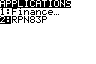
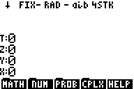
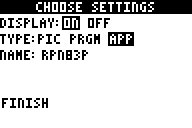

# RPN83P User Guide: Installation

This document describes how to install and run the RPN83P application.

**Version**: 1.0.0 (2024-07-19)\
**Project Home**: https://github.com/bxparks/rpn83p\
**Parent Document**: [USER_GUIDE.md](USER_GUIDE.md)

## Table of Contents

- [Obtaining the Program File](#obtaining-the-program-file)
- [Uploading](#uploading)
- [Starting](#starting)
- [Quitting](#quitting)
- [Auto-start](#auto-start)
- [Supported Hardware](#supported-hardware)
- [Recommended Hardware](#recommended-hardware)

## Obtaining the Program File

The RPN83P app is packaged as a single file named `rpn83p.8xk`. There are at
least 2 ways to obtain this:

- [RPN83P Releases page on GitHub](https://github.com/bxparks/rpn83p/releases)
    - go to the latest release
    - click and download the `rpn83p.8xk` file
- Compile the binary locally
    - See the *Compiling from Source* section in the [README.md](../README.md)
      file.

Each release in the GitHub Releases section also contains an `rpn83p.zip`
release artifact file that holds the same `rpn83p.8xk` binary file and a copy of
the various user-facing Markdown files converted to PDF format. The zip file is
intended for third party software archive sites such as ticalc.org or
cemetech.net.

## Uploading

The `rpn83p.8xk` file must be uploaded to the calculator using a "link" program
from a host computer. There are a number of options:

- **Linux**: Use the [tilp](https://github.com/debrouxl/tilp_and_gfm) program.
  On Ubuntu Linux 22.04 systems, the precompiled package can be installed using
  `$ apt install tilp2`. (I'm not actually sure if the `tilp2` binary is
  actually compiled from the `tilp_and_gfm` source code mentioned above)

- **Windows** or **MacOS**: Use the [TI
  Connect](https://education.ti.com/en/products/computer-software/ti-connect-sw)
  software and follow the instructions in [Transferring FLASH
  Applications](https://education.ti.com/en/customer-support/knowledge-base/sofware-apps/product-usage/11506).

**Warning**: If you are upgrading from a previous version of RPN83P, you may
need to manually remove the `RPN83P` app from the calculator, before uploading
the new `rpn83p.8xk` file. I don't know why, but sometimes the calculator gets
stuck at the `Defragmenting...` step and never finishes uploading the file. To
manually remove, go to `2ND MEM`, `2` (Mem Mgmt/Del), `ALPHA A` (Apps), scroll
down to the `RPN83P`, hit `DEL`, press `2` (Yes).

## Starting

After installing `rpn83p.8xk` file, go to the calculator:

- Press the `APPS` key
- Scroll down to the `RPN83P` entry
- Press the `ENTER` key

The RPN83P starts directly into the calculator mode, no fancy splash screen. You
should see a screen that looks like:

## Quitting

The RPN83P application can be quit using:

- `2ND` `QUIT`: to exit to normal TI calculator
- `2ND` `OFF`: to turn the calculator off (the RPN registers and storage
  registers will be preserved)

Upon exit, the state of the RPN83P app will be saved in an AppVar named
`RPN83SAV`. When the app is restarted, the calculator will resume from exactly
where it left off, including the exact cursor position of any pending input.
When restarted, if the `RPN83SAV` variable does not pass validation (e.g. does
not exist; was archived; is wrong size; contains an incompatible schema version;
does not pass a CRC checksum) then the application starts from a clean slate.

## Auto-start

For convenience, you may choose to auto-start the RPN83P application as soon as
you turn on the calculator.

- Download the
  [Start-Up](https://education.ti.com/en/software/details/en/77ec7de5d3694f4595c262fdfc2acc4b/83startupcustomization) application from TI
- Press `APPS`, then scroll down to `Start-up`
- Configure:
    - Display: `ON`
    - Type: `APP`
    - Name: `RPN83P` (hit `ENTER` and scroll down to select this)
- Select `FINISH` and hit `ENTER`

The LCD screen should look like this before hitting `FINISH`:

Turn off the calculator and turn it back on. It should directly go into the
RPN83P application.

## Supported Hardware

This app was designed for TI calculators using the Z80 processor:

- TI-83 Plus (6 MHz Z80, 24 kB accessible RAM, 160 kB accessible flash, no RTC)
- TI-83 Plus Silver Edition (6/15 MHz Z80, 24 kB accessible RAM, 1.5 MB
  accessible flash, no RTC)
- TI-84 Plus (6/15 MHz Z80, 24 kB accessible RAM, 480 kB accessible flash, RTC)
- TI-84 Plus Silver Edition (6/15 MHz Z80, 24 kB accessible RAM, 1.5 MB
  accessible flash, RTC)
- TI-Nspire Clickpad (blue/white) with TI-84 Plus Keypad (32-bit ARM processor
  emulating a Z80, 24 kB accessible RAM, 1.5 MB accessible flash, RTC)
- TI-Nspire Touchpad (black/white) with TI-84 Plus Keypad (32-bit ARM processor
  emulating a Z80, 24 kB accessible RAM, 1.5 MB accessible flash, RTC)

**Note**: When uploading the `rpn83p.8xk` file from the PC to the Nspire, you
need to select "TI-84 Plus" as the calculator model on the PC instead of
"TI-Nspire". That's because the Nspire is emulating a TI-84+ and the PC cannot
tell the difference.

The app configures itself to run at 15 MHz on supported hardware, while
remaining at 6 MHz on the TI-83+.

I have tested it on the following calculators that I own:

- TI-83 Plus (OS v1.19)
- TI-83 Plus Silver Edition (OS v1.19)
- TI-84 Plus (OS v2.55MP)
- TI-84 Plus Silver Edition (OS v2.55MP)
- TI-Nspire Clickpad with TI-84 Plus Keypad (OS v2.46)
- TI-Nspire Touchpad with TI-84 Plus Keypad (OS v2.56MP)

Community members have verified that it works on the following variants:

- TI-84 Plus Pocket SE
- TI-84 Pocket.fr (French version of the Pocket SE?)

The following calculators are *not* supported because their internal hardware
and firmware are too different:

- TI-73, 80, 81, 82, 85, 86
- TI-83 (without Plus)
- TI-84 Plus C Silver Edition
- TI-84 Plus CE
- TI-83 Premium CE (French version of the TI-84 Plus CE)
- TI-Nspire CAS, CX, CX CAS, CX II, CX II CAS
- TI-89, 89 Titanium, 92, 92 Plus, Voyage 200

## Recommended Hardware

After testing RPN83P on various TI calculator models, I have formed some
opinions. Maybe my observations will help you decide which model to get.

**TI-83 Plus**

The regular TI-83+ is the cheapest of the bunch but it is the slowest. It can
run only at 6 MHz. It has only 160 kB of flash memory, which is enough to hold
RPN83P but not too much more.

The calculator supports only a 2.5mm I/O port, and installing RPN83P requires a
special 2.5mm to USB cable. In the United States, it can be as cheap as
$10-$15, but it can be difficult and expensive to obtain in other parts of the
world.

These calculators tend to be the oldest by age. Many on the used market suffer
from defective vertical and horizontal lines on the screen caused by the
degradation of conductive glue that connects the ribbon cable between the LCD
module and the main motherboard. Sometimes the ribbon cable can be fixed,
sometimes not. You can read this long thread [On the Repair of TI-83+
LCDs](https://www.cemetech.net/forum/viewtopic.php?t=5161) to see if you want to
embark on that adventure.

Having said all that, one of the first calculators I bought was a TI-83+ for $10
cash locally. The LCD screen on that thing is perfect, I think it is actually
better than all my other TI-83+ or TI-84+ calculators. You may get lucky too, or
not.

**TI-83 Plus Silver Edition**

The TI-83+SE will be slightly more expensive than the regular TI-83+ on the used
market.

Just like the regular 83+, the 83+SE supports only a 2.5mm I/O port, and
installing RPN83P requires a special 2.5mm to USB cable.

The TI-83+SE has 1.5 MB of flash memory, 9 times the capacity of the regular
TI-83+. It can also run at 15 MHz, instead of 6 MHz. Basically, this means that
the TI-83+SE has almost the same specs as the newer and more expensive TI-84+SE
(see below).

The most common version of the TI-83+SE comes in a translucent case that is the
same size as the regular TI-83+. The function labels are yellow and the ALPHA
letters are bluish-green. I had initially thought that the labels would be too
difficult to read on the translucent plastic, but after purchasing one of these,
it was not as bad as I had feared, but it was still slightly worse than a
regular 83+ in my opinion.

The buttons on the 83+SE seem slightly more mushy than the regular 83+ but that
could be just my calculator. The 83+SE buttons also *look* slightly more rounded
than the regular 83+ but I think that's because some of the 83+SE buttons are
slightly translucent as well. Overall, I think I prefer the regular 83+ buttons.

**TI-83 Plus Silver Edition VSC**

There is another variation of the TI-83+SE calculator called the TI-83+SE
ViewScreen Calculator (VSC). This version is relatively rare compared to the
normal TI-83+SE with its translucent case, and is intended to allow teachers to
project the calculator screen on a screen for the classroom.

The internal technical specs of the TI-83+SE VSC are identical to its normal
TI-83+SE. But there are physical differences.

The top half of the VSC calculator matches the regular TI-83+ instead of the
TI-83+SE. In other words, the VSC edition uses the black plastic case of the
regular 83+ instead of translucent plastic, and the same buttons as the regular
TI-83+.

The bottom half of the VSC calculator is replaced with a slightly thicker
version that contains a special connector to a [TI
ViewScreen](http://www.datamath.org/Graphing/TI-VSP82.htm) panel. The ViewScreen
is used with an overhead projector to display the calculator display.

The thicker bottom half of the VSC version prevents the hard-shell cover from
sliding under the calculator. This means that the cover is floating around
somewhere else while the caculator is being used, which makes it more
inconvenient and easier to lose the cover.

**TI-84 Plus**

The TI-84 Plus looks physically identical to the TI-84 Plus Silver Edition (see
next). There seems to be no functional difference, except that the TI-84+
supports only 480 kB of flash memory versus the 1.5 MB of the Silver Edition. As
of 2025, I believe Texas Instruments still manufactures the 84+ model, but not
the 84+SE model.

**TI-84 Plus Silver Edition**

The TI-84+SE is the most powerful model in the family, and will usually be the
most expensive model on the used market.

It comes with 1.5 MB of flash and can run at 15 MHz, just like the TI-83+SE.
Both the 84+ and 84+SE models contain a real-time clock. The RPN83P will detect
the RTC and unlock various real-time clock related functions under the `DATE`
menu.

The 84+ and 84+SE support both the 2.5mm port (for backwards compatibility) and
a mini-USB-B port. The RPN83P app can be installed using either port. This means
that only a mini-USB-B cable is required, instead of the special 2.5mm cable. In
some parts of the world, the cost of the cable may be more than the difference
in price between the TI-84+/84+SE over their cheaper TI-83+/83+SE counterparts.

The TI-84+ models are physically larger than the TI-83+ models. The buttons are
slightly bigger to take advantage of the larger case. Some people may prefer
that, but personally, the smaller TI-83+ form factor feels better in my hands
than the larger TI-84+ form factor.

**Nspire Clickpad and Nspire Touchpad**

The Nspire models which support RPN83P come in two flavors as noted in the
previous section:

- the 1st generation Nspire Clickpad in blue/white color and
- the 2nd generation Nspire Touchpad in black/white color.

Both generations use a mini-USB-B port for communication with the host computer
to load applications and upgrade the OS.

The 1st generation Clickpad is powered by 4xAAA batteries. The 2nd generation
Touchpad is triple-powered: it can operate through the USB cable, a Li-Ion
battery pack, or 4xAAA batteries.

The 1st generation Clickpad model has probably the worst calculator keyboard
that I have ever used. Pressing the large button will often accidentally press
the smaller ALPHA buttons which are placed in the interstitial spaces between
the large buttons. The 2nd generation Touchpad model comes with a much better
keyboard.

For RPN83P to work, both the Clickpad and the Touchpad models require the
original keypad to be removed and replaced with the "TI-84 Plus Keypad". This
activates the TI-84+SE emulation mode. The 84+ keypad also provides a 2.5mm jack
for backwards compatible connection between 2 TI calculators.

As noted in the previous section, when uploading the `rpn83p.8xk` file from the
PC to the Nspire, you need to select "TI-84 Plus" as the calculator model on the
PC instead of "TI-Nspire". That's because the Nspire is emulating a TI-84+ and
the PC cannot tell the difference.

There are 2 different versions of the TI-84+ keypad:

- the 1st generation in blue/white, and
- the 2nd generation in black/white.

Both versions should work on both versions of Nspire calculator. But it looks
better to match the color scheme of the 84+ keypad with the color scheme of the
calculator.

The native resolution of the LCD screen on the Nspire is relatively high,
320x240 pixels. But the screen resolution of the TI-83+/84+ calculators is much
lower, 96x64 pixels. In emulation mode, the Nspire uses a 3x3 native pixel block
to represent each pixel of the TI-84+. This consumes 288x192 pixels of the
Nspire LCD screen. The remaining pixels form a border around the TI-84+ screen.
Early Nspire OS versions painted the border in black (maybe greyish) color. But
later Nspire OS versions changed the border to be white, which makes the border
less noticeable.

If you are using the Nspire Clickpad (blue/white) with a very early OS version
(e.g. 1.4.11653 2008-07-09), there is another reason to upgrade to the latest
OS, other than the appearance of the border on the LCD screen. There seems to be
a bug in the early OS with regards to keyboard handling: If you press a key
repeatedly and rapidly, some of the presses may not register. Every few seconds,
there seems to be something that interrupts the keyboard handler, and causes a
button press to be missed. If the Nspire Clickpad is upgraded to the latest OS
(e.g. 3.9.0.463 2014-06-25), the problem seems to disappear.

The physical size of the emulated TI-84+ display on the Nspire LCD is slightly
larger than a real TI-84+. This makes the letters and numbers appear larger than
a real TI-84+, and some people with eye problems or just old eyes may prefer
that over the actual TI-84+.

For both models, the original keypad is required to upgrade the Nspire OS, which
can be downloaded from the ti.com website. The latest version as of this writing
(early 2025) is version 3.9.0.463 dated 2014-06-25. That OS includes the
TI-84+SE emulator version 2.56MP. It seems that the embedded 84+SE emulator uses
even numbers, and the physical 84+ OS uses odd numbers, so the 2.56MP version is
functionally identical to the latest 2.55MP version on the actual TI-84+
calculators.

Both the 1st and 2nd generations of Nspire calculators seem to have 2 sleep
modes: a light-sleep mode and a deep-sleep mode. When the calculator is turned
off, it seems to go into the light-sleep mode, and pressing the ON button brings
the calculator back instantly. If the calculator is left in light-sleep mode for
a long time (24-48 hours is my guess), the calculator goes into deep-sleep mode.
If the ON button is pressed in deep-sleep mode, the calculator seems to
reinitialize itself and takes maybe 25-30 seconds to reload the Nspire OS, then
another 5-8 seconds to load the TI-84+ emulator. The total wait time from
pressing the ON button to getting the prompt in the RPN83P app can be 30-40
seconds. This lengthy wake time from deep-sleep mode can be annoying if you want
to use the calculator for some quick calculations.

All else being equal, I recommend the Nspire Touchpad (black/white) model over
the Nspire Clickpad (blue/white) model. The Touchpad supports 3 power sources
including 4xAAA batteries, it takes slightly less time waking up from deep
sleep, the Touchpad keyboard is actually usable if you want to use it in
TI-Nspire mode, and it looks a lot better in my opinion.

There is one additional difference between an Nspire and a regular TI-83+/84+.
When the Nspire is turned off and in deep-sleep mode, it seems to consume
battery power at a much higher rate than a regular TI-83+ or TI-84+. An Nspire
in the off-state can completely deplete a set of freshly-charged AAA batteries
in only 2-3 months (I use 750 mAh NiMH batteries, see section below). In
contrast, the same set of batteries will work fine after being in an 83+/84+ in
the off-state for 5-6 months. (I don't have the equipment to measure the exact
amount of microamps consumed by each calculator model. But my guess is that the
Nspire consumes 3-5X the idle current of an 83+/84+.)

**Batteries**

A note about batteries. All TI-83+, 84+, and Nspire calculators mentioned above
can be powered by four (4) AAA batteries. Although calculator manufacturers
usually specify alkaline batteries, I always recommend using low self-discharge
(LSD) rechargeable NiMH batteries instead.

Alkaline batteries often leak when they are discharged completely, potentially
destroying the calculator; NiMH almost never leak. Alkaline batteries likely
cause more environment damage than rechargeable NiMH batteries in the long run.

NiMH batteries are now so cheap, it takes only a few recharge cycles to break
even compared to most brands of alkaline batteries. For most people, in most
situations, using NiMH makes more sense than using alkalines.
