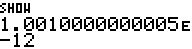
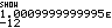
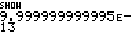

# RPN83P User Guide: Chapter 8: MATH Functions

This document describes the menu functions under the `MATH` menu in RPN83P.

**Version**: 1.1.0 (2025-10-06)\
**Project Home**: https://github.com/bxparks/rpn83p \
**Parent Document**: [USER_GUIDE.md](USER_GUIDE.md)

## Table of Contents

- [MATH Menus](#math-menus)
- [Cube, Cube-Root, XROOTY](#cube-cube-root-xrooty)
- [Atan2](#atan2)
- [Power and Log of Base 2](#power-and-log-of-base-2)
- [Log Base B](#log-base-b)
- [Exp Minus One and Log One Plus](#exp-minus-one-and-log-one-plus)

## MATH Menus

The functions under the `MATH` menu folder are additional mathematical functions
which cannot be exposed through physical buttons because the keyboard of the
TI-83+/84+ do not have labels for them.

-  (ROOT > MATH)
    - 
    - 

The functions are:

- `X^3`: cube of `X`
- `³√X`: cube root of `X`
- `X√Y`: `X` root of `Y`
- `ATN2`: `atan2(X, Y)` in degrees or radians, depending on current mode
    - `Y`: y-component, entered first
    - `X`: x-component, entered second
    - (order of `Y` and `X` is the same as the `>POL` conversion function)
- `2^X`: `2` to the power of `X`
- `LOG2`: log base 2 of `X`
- `LOGB`: log base `X` of `Y`
- `E^X-`: `e^x-1` accurate for small `x`
- `LN1+`: `log(1+x)` accurate for small `x`

I hope these functions are basically self-explanatory. Below are some additional
details about them.

## Cube, Cube-Root, XROOTY

The `X^3` (cube), `³√X` (cube-root), and `X√Y` (x root of y) functions can be
calculated manually using the following operations:

- `X^3`: \[`ENTER`\] \[`X^2`\] \[`*`\]
- `³√X`: \[`3`\] \[`1/X`\] \[`^`\]
- `X√Y`: \[`1/X`\] \[`^`\]

But these menu functions have some advantages:

- they don't consume additional slots on the RPN stack
- they update the LASTX value correctly, instead of saving an intermediate
  result

These functions use the underlying TI-OS functions which can handle negative
numbers in most situations:

| **Keys**              | **Display** |
| ----------------      | --------------------- |
| `8` `(-)` `³√X`       |  |
| `X^3`                 |  |
| `3`                   |  |
| `X√Y`                 |  |

## Atan2

The `ATN2` function performs the same operation as the `TAN^1` arctan function
on the keyboard, except that `ATN2` handles all four quadrants in the X-Y plane
instead of just 2 quadrants for `TAN^1`.

The range of the `ATN2` function is (-180, 180] in degrees. If the `Y` value is
negative, the angle will be returned as negative.

Similar to the polar-rectangular conversion function s`>POL` and `>REC` in the
`CONV` menu, the `Y` value is entered first, then the `X` value.

For example, let's calculate the angle in degrees to the point `(-1, -sqrt(3))`
on the X-Y plane:

| **Keys**              | **Display** |
| ----------------      | --------------------- |
| `MODE` `DEG`          |  |
| `ON/EXIT`             |  |
| `3` `SQRT` `(-)`      |  |
| `1` `(-)`             |  |
| `ATN2`                |  |

## Power and Log of Base 2

The `2^X` calculates the function `2` to the power of `X`. The `LOG2` function
performs the inverse operation of log base 2 of `X`. These operations in base-2
are useful in computer science.

Let's calculate the value of `2^14`, and then take the `log2()` function:

| **Keys**              | **Display** |
| ----------------      | --------------------- |
| `14` `2^X`            |  |
| `LOG2`                |  |

## Log Base B

Occasionally, it's useful to take the log() function in an arbitrary base.
The `LOGB` function takes the log of `Y` in the base of `X`. The formula is
quite simple:

```
LOG_X(Y) = LOG(Y) / LOG(X)
```
Let's take the log base 3 of 59049 (which happens to be 3^10):

| **Keys**              | **Display** |
| ----------------      | --------------------- |
| `59049` `ENTER`       |  |
| `3`                   |  |
| `LOGB`                |  |

## Exp Minus One and Log One Plus

The `E^X-` and `LN1+` functions are special versions of the `exp(x)` and `ln(x)`
functions which are more numerically accurate for small `x`. These situations
can occur in finance calculations as well as physics.

The definitions of these functions are simple:

```
LN1+(x) = log(1+x)
E^X-(x) = e^x-1
```

But special numerical methods are required to avoid cancellation and
roundoff errors for small `x`.

The normal `LN` and `e^x` functions are inverses of each other. Similarly, we
see from their definitions that the `E^X-` and `LN1+` functions are also
inverses of each other.

Here is a demonstration numerical accuracy of the `E^X-` compared to its and its
manual equivalent calculation:

| **Keys**                          | **Display**           |
| ----------------                  | --------------------- |
| `1.001e-12` `E^X-`                |  |
| `2ND` `ENTRY` (SHOW)              |  |
| `2ND ANS` (LASTX) `e^x` `1` `-`   |  |
| `2ND` `ENTRY` (SHOW)              |  |

- The actual answer from wolframalpha.com is \
  `1.0010000000005010005000001671671668333751669168333833750834167097389... ×
  10^-12`.
- The `E^X-` function returns `1.0010000000005e-12`, which is correct to all 14
  internal digits of the TI-OS floating point format.
- The brute-force calculation returns `1e-12` which is incorrect at the 4th
  significant digit.

Here is a similar demonstration of the `LN1+` function compared to its
equivalent manual calculations:

| **Keys**                          | **Display**           |
| ----------------                  | --------------------- |
| `1.001e-12` `LN1+`                    |  |
| `2ND` `ENTRY` (SHOW)              |  |
| `2ND ANS` (LASTX) `1` `+` `LN`    |  |
| `2ND` `ENTRY` (SHOW)              |  |

- The actual answer from wolframalpha.com is \
  `1.0009999999994989995000003343343336664156651656666176686686674991974... ×
  10^-12`.
- The `LN1+` function returns `1.0009999999995e-12`, which is correct to all
  14 internal digits of the TI-OS floating point format.
- The brute-force calculation returns `9.999999999995e-13`, which is incorrect
  at the 4th significant digit.
