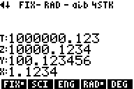
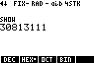

# RPN83P User Guide: MODE Functions

This document describes the menu functions under the `MODE` menu in RPN83P.

**Version**: 1.0.0 (2024-07-19)

**Parent Document**: [USER_GUIDE.md](USER_GUIDE.md)

**Project Home**: https://github.com/bxparks/rpn83p

## Table of Contents

- [Modes](#modes)
    - [Floating Point Display Modes](#floating-point-display-modes)
    - [Trigonometric Modes](#trigonometric-modes)
    - [Complex Result and Display Modes](#complex-result-and-display-modes)
    - [Register and Stack Sizes](#register-and-stack-sizes)
    - [Comma-EE Button Mode](#comma-ee-button-mode)
    - [Raw Versus String Format](#raw-versus-string-format)
- [SHOW Mode](#show-mode)

## Modes

The `MODE` menu folder contains a number of menu items which control the
operating modes or the display modes of the calculator.

- 
    - 
    - 
    - 
    - 

The quickest way to reach this menu folder is to use the `MODE` button on the
keypad, instead of navigating the menu hierarchy. Using the `MODE` button allows
the [Menu Shortcut Jump Back](#menu-shortcut-jump-back) feature to work, so that
pressing `ON/EXIT` takes you right back to the menu before the `MODE` button was
pressed.

### Floating Point Display Modes

The RPN83P app provides access to the same floating point display modes as the
original TI-OS. For reference, here are the options available in the TI-OS when
the `MODE` button is pressed:

In RPN83P, the `MODE` button presents a menu bar instead:

**HP-42S Compatibility Note**: The HP-42S uses the `DISP` button to access this
functionality. For the RPN83P, it seemed to make more sense to the follow the
TI-OS convention which places the floating display modes under the `MODE`
button.

The `NORMAL` mode in TI-OS is named `FIX` in RPN83P following the lead of the
HP-42S. It is also short enough to fit into the menu label nicely, and has the
same number of letters as the `SCI` and `ENG` modes which helps with the
top-line indicator.

Suppose the RPN stack has the following numbers:

Let's see how these numbers are displayed in the various floating point modes.

**FIX Mode**

Here are the numbers rendered in `FIX` mode:

| **Keys**              | **Display** |
| ----------------      | --------------------- |
| `MODE` `FIX` `4`      |  |
| `ENTER`               |  |
| `FIX` `99`            |  |

Setting `FIX 99` goes back to the default floating number of fractional digits
(i.e. the equivalent of `FLOAT` option in the TI-OS `MODE` menu). Any number
greater than `9` would work (e.g. `11`) but I usually use `99`.

**SCI Mode**

Here are the numbers rendered in `SCI` mode:

| **Keys**              | **Display** |
| ----------------      | --------------------- |
| `MODE` `SCI` `4`      |  |
| `ENTER`               |  |
| `SCI` `99`            |  |

Setting `99` as the number of digits in `SCI` mode makes the number of digits
after the decimal point to be dynamic (i.e. the equivalent of `FLOAT` option in
the TI-OS `MODE` menu), but retains the `SCI` notation.

**ENG Mode**

Here are the numbers rendered in `ENG` mode:

| **Keys**              | **Display** |
| ----------------      | --------------------- |
| `MODE` `ENG` `4`      |  |
| `ENTER`               |  |
| `ENG` `99`            |  |

Setting `99` as the number of digits in `ENG` mode makes the number of digits
after the decimal point to be dynamic (i.e. the equivalent of `FLOAT` option in
the TI-OS `MODE` menu), but retains the `ENG` notation.

**HP-42S Compatibility Note**: The RPN83P uses the underlying TI-OS floating
point display modes, so it cannot emulate the HP-42S exactly. In particular, the
`ALL` display mode of the HP-42S is not directly available, but it is basically
equivalent to `FIX 99` on the RPN83P.

### Trigonometric Modes

Just like the TI-OS, the RPN83P supports two angle modes, `RAD` (radians) and
`DEG` (degrees), when calculating trigonometric functions. These are selected
using the options under the `MODE` menu folder, and the current trig mode is
shown on the top status line.

| **Keys**              | **Display** |
| ----------------      | --------------------- |
| `MODE` `RAD`          |  |
| `PI` `6` `/` `SIN`    |  |
| `MODE` `DEG`          |  |
| `30` `SIN`            |  |

**Warning**: The polar to rectangular conversion functions (`>REC` and `>POL`)
are also affected by the current Trig Mode setting.

**HP-42S Compatibility Note**: The RPN83P does not offer the
[gradian](https://en.wikipedia.org/wiki/Gradian) mode `GRAD` because the
underlying TI-OS does not support the gradian mode directly. It is probably
possible to add this feature by intercepting the trig functions and performing
some pre and post unit conversions. But I'm not sure if it's worth the effort
since gradian trig mode is not commonly used.

### Complex Result and Display Modes

The `RRES` and `CRES` menu items control how complex numbers are calculated. The
`RECT`, `PRAD`, and `PDEG` modes control how complex numbers are displayed. All
of these are explained in the [USER_GUIDE_COMPLEX.md](USER_GUIDE_COMPLEX.md)
document.

### Register and Stack Sizes

The `RSIZ` and `RSZ?` menu items control the storage register size. Those are
explained below in [Storage Register Size](#storage-register-size).

The `SSIZ` and `SSZ?` menu items control the RPN stack size. Those were
explained above in [RPN Stack Size](#rpn-stack-size).

### Comma-EE Button Mode

The `,EE` and `EE,` selectors under `ROOT > MODE` configure the behavior of the
`Comma-EE` button:

-  (`ROOT > MODE`)
    - 
    - `,EE`: the `Comma-EE` button behaves as labeled on the keyboard (factory
      default)
    - `EE,`: the `Comma-EE` button is inverted

Prior to v0.10, the `Comma-EE` button invoked the `EE` function for *both* comma
`,` and `2ND EE`. This allowed scientific notation numbers to be entered easily,
without having to press the `2ND` button.

However, in v0.10 when record objects were added to support DATE functions (see
[USER_GUIDE_DATE.md](USER_GUIDE_DATE.md)), the comma symbol was selected to be
the separator between the components of those objects. But that meant that
entering numbers in scientific notation would require the `2ND` key again. For
users who rarely or never use the DATE functions, the `EE,` option can be used
to invert key bindings of the `Comma-EE` button to allow easier entry of
scientific notation.

### Raw Versus String Format

The `{..}` (raw) and `".."` (string) modes control how Record objects (e.g.
Date, Time, DateTime) are displayed. These are explained in the
[USER_GUIDE_DATE.md](USER_GUIDE_DATE.md) document.

## SHOW Mode

Many HP RPN calculators have a display mode that shows all significant digits
that are stored internally. On the HP-42S and HP-16C, the button that activates
this is labeled `SHOW`. On the HP-12C and HP-15C, the button is labeled
`Prefix`.

The RPN83P app uses the `2ND` `ENTRY` key sequence (just above the `ENTER`
button). This key was selected because `ENTRY` is unused in our RPN system, and
because it is located close to the `ENTER` key.

The SHOW mode reverts back to the normal display mode in the following ways:

- `OFF` and `QUIT`: Exit the app. Upon restart, the app goes back to normal
  display mode.
- `DEL`, `CLEAR`, `ENTER`, `ON/EXIT`: Exit SHOW mode to normal mode, but do not
  process the key in normal mode.
- Any other key: Exit SHOW mode, then continue processing the key in normal
  mode.

Prior to v1.1, any key press in SHOW mode was used to exit to normal mode, and
eaten. A second press of the same key was required in normal mode to process it.
This was found to be too cumbersome. It was more intuitive allow a new number to
be entered directly from SHOW mode, without having to press the digit key twice.
If a digit key is entered (0-9), then we go into edit mode and the digit goes
into the input buffer. If a function key is pressed, the function acts upon the
value in the `X` register displayed by `SHOW`.

Unlike the HP-42S which automatically reverts back to the normal mode after a
2-3 second delay, the TI calculator must wait for a keyboard event from the
user.

Floating point numbers are normally shown with 10 significant digits, but
internally the TI-OS stores floating point numbers using 14 digits. The SHOW
mode displays all 14 digits of the `X` register in scientific notation. For
example, `sqrt(2)` is normally displayed as `1.414213562`, but in SHOW mode it
looks like this:

| **Keys**              | **Display** |
| ----------------      | --------------------- |
| `2` `2ND SQRT`        |  |
| `2ND ENTRY` (SHOW)    |  |

If the `X` value is an exact integer internally, then the value is printed in
integer form instead of scientific notation. For example `2^46` is an exact
integer that will normally appear as `7.036874418E13`, but in SHOW mode looks
like this:

| **Keys**              | **Display** |
| ----------------      | --------------------- |
| `2` `46` `^`          |  |
| `2ND ENTRY` (SHOW)    |  |

The SHOW mode has a slight variation in `BASE` mode. For `DEC`, `HEX`, and `OCT`
modes, the `SHOW` function behaves as before, showing the internal floating
point number in scientific or integer notation. However, in `BIN` mode, the
`SHOW` function displays the `X` value in *binary* notation, allowing all digits
of the binary number to be shown. This behavior is consistent with the `SHOW`
function on the HP-42S. For example, the hex number `01D62BB7` in normal `BIN`
mode looks like `<010 1011 1011 0111` because only 16 digits can be displayed on
a single line. But in SHOW mode, all 32 digits (assuming `WSIZ` was 32) will be
displayed like this:

| **Keys**              | **Display** |
| ----------------      | --------------------- |
| `MATH` `DOWN` `BASE`  |  |
| `HEX`                 |  |
| `01D62BB7`            |  |
| `2ND ENTRY` (SHOW)    |  |
| `BIN`                 |  |
| `2ND ENTRY` (SHOW)    |  |

