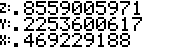

# RPN83P User Guide: Chapter 10: PROB Functions

This document describes the menu functions under the `PROB` menu in RPN83P.

**Version**: 1.1.0 (2025-10-06)\
**Project Home**: https://github.com/bxparks/rpn83p \
**Parent Document**: [USER_GUIDE.md](USER_GUIDE.md)

## Table of Contents

- [Combination (COMB)](#combination-comb)
- [Permutation (PERM)](#permutation-perm)
- [Factorial (N!)](#factorial-n-)
- [Random Number (RAND)](#random-number-rand)
- [Seed of Random Number (SEED)](#seed-of-random-number-seed)

## PROB Menus

The functions under the `PROB` menu folder are related to probability functions.

-  (ROOT > PROB)
    - 

The functions are:

- `COMB`: combination `C(n,r)` = `C(Y, X)`
- `PERM`: permutation `P(n,r)` = `P(Y, X)`
- `N!`: factorial of `X`
- `RAND`: random number in the range `[0,1)`
- `SEED`: set the random number generator seed to `X`, range `[0,1e9)`

## Combination (COMB)

The `COMB` function calculates the combination function defined by:

```
COMB(Y,X) = C(Y,X) = C(n,r) = n!/((n-r)! r!)
```

For implementation efficiency, both the `n` and `r` parameters are restricted to
[0, 65535].

For example, let's calculate C(2000,5):

| **Keys**              | **Display** |
| ----------------      | --------------------- |
| `2000` `ENTER`        |  |
| `5` `COMB`            |  |

## Permutation (PERM)

The `PERM` function calculates the permutation function defined by:

```
PERM(Y,X) = P(Y,X) = P(n,r) = n!/(n-r)!
```

For implementation efficiency, both the `n` and `r` parameters are restricted to
[0, 65535].

For example, let's calculate P(2000,5):

| **Keys**              | **Display** |
| ----------------      | --------------------- |
| `2000` `ENTER`        |  |
| `5` `PERM`            |  |

## Factorial (N!)

The `N!` function calculates the factorial defined by:

```
N! = N(N-1)(N-2)...(2)(1)
```

The parameter `N` must be `>=-0.5` and be an integer or a half-integer.

| **Keys**              | **Display** |
| ----------------      | --------------------- |
| `0` `N!`              |  |
| `69` `N!`             |  |

For half-integers, the underlying TI-OS factorial function uses the properties
of the Gamma function which is a generalization of the factorial function:

```
Gamma(N+1) = N * Gamma(n) = N!
Gamma(1/2) = sqrt(PI)

(N-1/2)! = Gamma(N+1/2) = (N-1/2) Gamma(N-1/2)
```

| **Keys**              | **Display** |
| ----------------      | --------------------- |
| `0.5` `(-)` `N!`      |  |
| `69.5` `N!`           |  |

## Random Number (RAND)

The `RAND` function returns a pseudo-random number in the range of [0,1).

| **Keys**              | **Display** |
| ----------------      | --------------------- |
| `RAND`                |  |
| `RAND`                |  |
| `RAND`                |  |

## Seed of Random Number (SEED)

The pseudo-random number sequence is determined by its seed. Given the same
seed, the sequence of random numbers will be identical.

The `SEED` function uses the underlying TI-OS function which expects a floating
point number between `0 =< SEED < 1e9`.

As explained in the TI-83+ SDK, storing a 0 to the seed will reinitialize the
random number generator to its original state from the factory.

The input value must be a real number, but it does not have to fall within the
specified range. If it does not, it will be modified (exponent reduced, sign
changed, and truncated) to fit in the range.

This example demonstrates that the same SEED returns the same pseudo-random
number:

| **Keys**              | **Display** |
| ----------------      | --------------------- |
| `42.1` `SEED`         |  |
| `RAND`                |  |
| `42.1` `SEED`         |  |
| `RAND`                |  |
