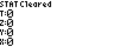
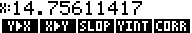
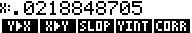

# RPN83P User Guide: STAT Functions

This document describes the `STAT` functions of the RPN83P application which
supports all statistical and curve fitting functionality of the HP-42S.

**Version**: 0.11.0-dev (2024-05-16)

**Parent Document**: [USER_GUIDE.md](USER_GUIDE.md)

**Project Home**: https://github.com/bxparks/rpn83p

## Table of Content

- [STAT Overview](#stat-overview)
- [STAT Registers](#stat-registers)
- [Curve Fitting](#curve-fitting)
- [Curve Fitting Example](#curve-fitting-example)

## STAT Overview

The RPN83P implements *all* 1 and 2 variable statistical and curve fitting
functionality of the HP-42S, as described in Ch. 15 of the _HP-42S User's
Manual_. Additional reference material can be found at:

- https://en.wikipedia.org/wiki/Algorithms_for_calculating_variance
- https://en.wikipedia.org/wiki/Simple_linear_regression
- https://en.wikipedia.org/wiki/Covariance_and_correlation

The STAT functions are available through the `ROOT > STAT` menu folder, which is
also accessible through the `STAT` button on the keypad:

- 
    - 
    - 
        - 
        - 
        - 
    - 
        - 
        - 

Most of the menu names are the same as the HP-42S. Here are some of the
differences:

- The organization of the menu items is different for various reasons:
    - The TI-83+/84+ series calculators have only 5 menu buttons instead of 6 on
      the HP-42S.
    - To simplify the menu navigation, RPN83P uses just 2 levels of menu
      hierarchy instead of the 3 levels used by the HP-42S.
- The RPN83P version of `WMN` (weighted mean) calculates both weighted means of
  `X` and `Y` at the same time.
    - The HP-42S `WMN` returns only the weighted mean of `X`.
    - If the `X` and `Y` values are accidentally swapped during data entry, the
      version of `WMN` on RPN83P will calculate both versions so that you don't
      have to reenter the data.
    - If one of the weighted means does not make sense, for example due to a
      division by 0, a value of `9.9999999E99` is displayed for that value.
- The `N` menu item is a convenience menu function that simply returns the
  number of data points.
- The RPN83P supports both the *sample* standard deviation `SDEV` and the
  *population* standard deviation `PDEV`.
    - The HP-42S calculates only the sample standard deviation `SDEV`.
    - The ratio of `SDEV/PDEV` is `sqrt(N/(N-1))`.
- RPN83P supports the calculation of the
  [covariance](https://en.wikipedia.org/wiki/Covariance_and_correlation).
    - There are 2 forms, the *sample* covariance `SCOV` and *population*
      covariance `PCOV`.
    - They are needed internally for the curve fitting functions, so it seemed
      appropriate to expose them to the user through the menu buttons.
    - The ratio of `SCOV(X,Y)/PCOV(X,Y)` is `N/(N-1)`.
- RPN83P does not (yet) support vectors and matrices, so it is not possible to
  enter the data into a matrix first, then perform the `STAT` functions over the
  matrix.

## STAT Registers

In addition to the visual differences in the STAT menu organization, the
implementation of the STAT registers is significantly different from the
HP-42S.

On the HP-42S, the STAT registers are implemented using the storage registers
from R11 to R23. This means that if the STAT functions are used, then the user
must remember to avoid using these registers for other purposes.

On RPN83P, the STAT registers are separated from regular storage registers by
using a different TI-OS appVar named `RPN83STA`. It is rarely necessary to
access the STAT registers, but if needed, access to them are provided through
the menu functions the `Σ` menu folder instead of through the `RCL` function as
implemented on the HP-42S. These menu labels are identical to the ones used by
the [Plus42](https://thomasokken.com/plus42/) app:

- 
    - 
    - 
    - 

Here is a table that maps a STAT register menu item on the RPN83P to the
corresponding storage register on the HP-42S:

| **RPN83P Menu**   | **HP-42S Register**   | **Content**   |
| ---               | ---                   | ---           |
| `ΣX`              | R11                   | `Σ X`         |
| `ΣX2`             | R12                   | `Σ X^2`       |
| `ΣY`              | R13                   | `Σ Y`         |
| `ΣY2`             | R14                   | `Σ Y^2`       |
| `ΣXY`             | R15                   | `Σ X*Y`       |
| `ΣN`              | R16                   | `N`           |
| `ΣLX`             | R17                   | `Σ ln(X)`     |
| `ΣLX2`            | R18                   | `Σ ln(X)^2`   |
| `ΣLY`             | R19                   | `Σ ln(Y)`     |
| `ΣLY2`            | R20                   | `Σ ln(Y)^2`   |
| `ΣLXL`            | R21                   | `Σ ln(X)*ln(Y)`   |
| `ΣXLY`            | R22                   | `Σ X*ln(Y)`       |
| `ΣYLX`            | R23                   | `Σ Y*ln(X)`       |

Since the STAT registers on RPN83P do not use the normal storage registers, the
`ΣREG` and the `ΣRG?` commands of the HP-42S are not necessary and do not exist
on the RPN83P.

The `CLΣ` menu item clears the STAT registers. On the HP-42S, this command
clears registers R11 to R16 in when `LINΣ` is selected, and clears the entire
R11 to R23 when `ALLΣ` is selected. On RPN83P, the `CLΣ` command clears the
equivalent sets of STAT registers with the difference that the regular storage
registers R11 to R23 are completely unaffected.

On the HP-42S, the `CLΣ` command appears only under the `CLEAR` menu hierarchy.
On the RPN83P, it is far more difficult to reach the `CLR` menu hierarchy, so
the `CLΣ` commands appears in 2 places for convenience: under the `CLR` menu
folder, and under the `STAT` menu folder.

## Curve Fitting

The curve fitting functions are available under the `ROOT > STAT > CFIT` menu
folder:

- 
    - 
    - 

The supported curve fit models are identical to the HP-42S. The linear curve fit
`LINF` is available with either `LINΣ` or `ALLΣ` selected. The other models
(`LOGF`, `EXPF`, `PWRF`) are available only when the `ALLΣ` option is selected.

For completeness, here are the parameters of the curve fitting equation for each
type as given in the HP-42S manual:

- `LINF`: `y = b + m x` (linear)
- `LOGF`: `y = b + m ln x` (logarithmic)
- `EXPF`: `y = b + e^(m x)` (exponential)
- `PWRF`: `y = b + x^m` (power)

where

- `b` is the y-intercept calculated by the `YINT` menu function,
- `m` is the slope calculated by the `SLOP` menu function.

## Curve Fitting Example

Let's perform some curve fitting analysis using the data points given in the
HP-42S manual, the "maximum and minimum monthly winter rainfall values in
Corvallis, Oregon":

```
Month   Y(max)  X(min)
-----   ----    ----
Oct      9.70   0.10
Nov     18.28   0.22
Dec     14.47   2.33
Jan     15.51   1.99
Feb     15.23   0.12
Mar     11.70   0.43
```

We would enter these data points like this:

| **Keys**                      | **Display** |
| ----------------              | --------------------- |
| `STAT` `ALLΣ`                 |  |
| `CLΣ`                         |  |
| `9.70` `ENTER` `0.10` `Σ+`    |  |
| `18.28` `ENTER` `0.22` `Σ+`   |  |
| `14.47` `ENTER` `2.33` `Σ+`   |  |
| `15.51` `ENTER` `1.99` `Σ+`   |  |
| `15.23` `ENTER` `0.12` `Σ+`   |  |
| `11.70` `ENTER` `0.43` `Σ+`   |  |

(Note that the "stack lift" is disabled by the `Σ+` and `Σ-` buttons, similar to
the `ENTER` key. So the `N` values will be replaced by the next `Ymax` value.)

Let's calculate the basic statistics measures:

| **Keys**                      | **Display** |
| ----------------              | --------------------- |
| `STAT` `DOWN`                 |  |
| `SUM`                         |  |
| `MEAN`                        |  |
| `WMN`                         |  |
| `N`                           |  |
| `DOWN`                        |  |
| `SDEV`                        |  |
| `SCOV`                        |  |
| `PDEV`                        |  |
| `PCOV`                        |  |

It is not obvious that the maximum rainfall for a given month is correlated with
the minimum rainfall for the same month. So let's perform some curve fits. First
let's try a linear fit using the `LINF` model:

| **Keys**                      | **Display** |
| ----------------              | --------------------- |
| `CFIT`                        |  |
| `DOWN` `LINF`                 |  |
| `UP` `SLOP`                   |  |
| `YINT`                        |  |
| `CORR`                        |  |

The correlation coefficient of 0.1948376107 is not great. Perhaps there is
another model that fits the data better. We can use the `BEST` function to
calculate the correlation coefficients for all 4 models (`LINF`, `LOGF`, `EXPF`,
`PWRF`) and automatically select the best fitting model:

| **Keys**                      | **Display** |
| ----------------              | --------------------- |
| `DOWN`                        |  |
| `BEST`                        |  |
| `UP` `SLOP`                   |  |
| `YINT`                        |  |
| `CORR`                        |  |

For this data set, the `BEST` command selected the `PWRF` model as the best fit.
The `PWRF` model has the form `y = b x^m`, and the calculator tells us that best
fit the parameters are:

- `m` = `SLOP` = 0.0489070475
- `b` = `YINT` = 13.64510925
- `r` = `CORR` = .2963586116 (correlation coefficient, identical to the value
  returned by `BEST`)

With `r` being only about `0.3`, this is still a weak correlation, but better
than the linear model.

**HP-42S Compatibility Note**: Unlike the HP-42S, the `BEST` command on the
RPN83P returns the `CORR` value of the best curve fitting model. This seemed
like a useful bit of information to show to the user, and it provides visual
feedback that the `BEST` function has finished.

We can perform forecasting with the `Y>X` and `X>Y` menus. Let's try to predict
the maximum rainfall when the minimum rainfall is 1.5. Then let's go in the
opposite direction and predict the minimum rainfall when the max is 12:

| **Keys**                      | **Display** |
| ----------------              | --------------------- |
| `1.5` `X>Y`                   |  |
| `12` `Y>X`                    |  |

These predictions should be regarded with suspicion because the correlation
coefficient of `r=.29635` is quite low, and the power fit may not be a good
model for this data. For example, typing `20` `Y>X` (max rainfall of 20.0) gives
an `X=752.098` (a minimum rainfall of 752) which is not reasonable.
