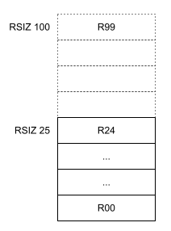
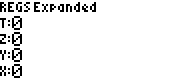

# RPN83P User Guide: Chapter 4: Storage Registers and Variables

This document describes the numerical storage registers and the single-letter
storage variables implemented by RPN83P.

**Version**: 1.1.0 (2025-10-07)\
**Project Home**: https://github.com/bxparks/rpn83p \
**Parent Document**: [USER_GUIDE.md](USER_GUIDE.md)

## Table of Contents

- [Storage Registers](#storage-registers)
    - [Storage Register Arithmetics](#storage-register-arithmetics)
    - [Storage Register Size](#storage-register-size)
    - [Indirect Register Access](#indirect-register-access)
- [Storage Variables](#storage-variables)
    - [Storage Variable Arithmetics](#storage-variable-arithmetics)

## Storage Registers

Similar to the HP-42S, the RPN83P initially provides **25** storage registers,
but can be increased to up to **100** registers using the `RSIZ` command. The
registers are labeled `R00` to `R99`.

The registers are accessed using the `STO` and `2ND` `RCL` keys. To store a
number into register `R00`, press:

- `STO` `00`

To recall register `R00`, press:

- `2ND` `RCL` `00`

To clear the all storage registers, use the `CLRG` soft menu function under the
`CLR` menu folder:

- 
    - 

The message `REGS cleared` will be displayed on the screen.

### Storage Register Arithmetics

Similar to the HP-42S and the HP-15C, storage register arithmetic operations are
supported using the `STO` and `RCL` buttons followed by an arithmetic button.

For example:

- `STO` `+` `00`: add `X` to `R00`
- `STO` `-` `00`: subtract `X` from `R00`
- `STO` `*` `00`: multiply `X` to `R00`
- `STO` `/` `00`: divide `X` into `R00`

Similarly:

- `RCL` `+` `00`: add `R00` to `X`
- `RCL` `-` `00`: subtract `R00` from `X`
- `RCL` `*` `00`: multiply `R00` to `X`
- `RCL` `/` `00`: divide `R00` into `X`

### Indirect Register Access

Indirect access to storage registers (e.g. `STO` `IND` `nn` and `RCL` `IND`
`nn`) is not supported because indirection is mostly used in programming, which
is not yet supported.

### Storage Register Size

The total number of registers is 25 by default (the minimum allowed), but can be
increased up to a maximum of 100 using the `RSIZ` menu function under `MODE`
menu folder (which can be accessed quickly using the `MODE` button):

- 
    - 

**HP-42S Compatibility Note**: The `RSIZ` command is named `SIZE` on the HP-42S.
On RPN83P, there are 3 different "size" commands (`RSIZ`, `SSIZ`, `WSIZ`) and it
seemed too confusing to use just `SIZE` so I named it `RSIZ` instead.

Here is an example of using `RSIZ` to change the number of registers to 50:

| **Keys**              | **Display** |
| ----------------      | --------------------- |
| `MODE` `DOWN` `DOWN`  |  |
| `RSIZ` `50`           |  |
| `ENTER`               |  |

One of the following messages will be displayed, depending on how the number of
storage registers changed:

- `REGS Expanded`
- `REGS Shrunk`
- `REGS Unchanged`

## Storage Variables

In the terminology of the HP-42S calculator, *registers* are numerical and
*variables* are alphanumerical (starting with a letter). The HP-42S supports
variables with alphanumeric names of up to 7 characters long. For example,
pressing `STO ABC` stores the `X` value into a variable named `ABC`.

The RPN83P supports only single-letter variables because it uses the underlying
TI-OS variables which support only a single-letter. These variables are
preserved after quitting the RPN83P application and become accessible to
TI-BASIC programs.

Storage variables can hold either Real or Complex numbers, but unlike the
numerical registers (R00-R99), they *cannot* hold the extended objects types
supported by RPN83P:

- record objects (e.g. Date, Time, DateTime) defined in
  [USER_GUIDE_DATE.md](USER_GUIDE_DATE.md)
- Denominate objects (numbers with units) defined in
  [USER_GUIDE_UNIT.md](USER_GUIDE_UNIT.md).

There are 27 variables available:

- `A`-`Z`, and
- `Theta` (Greek letter above the `3` button)

Those single letters are accessible from the TI-83/84 keyboard using the `ALPHA`
key (which acts like the `2ND` key).

To store a number into `A`, press:

- `STO` `ALPHA` `A` `ENTER`

To recall from variable `A`, press:

- `2ND` `RCL` `ALPHA` `A` `ENTER`

| **Keys**          | **Display** |
| ----------------  | --------------------- |
| `42`              |  |
| `STO ALPHA A`     |  |
| `ENTER`           |  |
| `2ND RCL ALPHA A` |  |
| `ENTER`           |  |

The `ENTER` key is required because both `STO` and `RCL` expect 2 character
arguments (corresponding to the 2-digit storage registers). The TI-OS supports
only a single letter, so the `ENTER` is required to terminate the entry of the
argument.

(I actually tried implementing an automatic `ENTER` after a single letter. But I
found it too easy to enter the wrong letter with the `ALPHA` key with no
opportunity to fix the typing error. By always requiring 2 characters, we can
double-check the letter before hitting the `ENTER` key.)

### Storage Variable Arithmetics

Storage arithmetic operations (`STO+`, `RLC+`, etc) are supported as expected:

- `STO` `+` `A`: add `X` to `A`
- `STO` `-` `A`: subtract `X` from `A`
- `STO` `*` `A`: multiply `X` to `A`
- `STO` `/` `A`: divide `X` into `A`

Similarly:

- `RCL` `+` `A`: add `A` to `X`
- `RCL` `-` `A`: subtract `A` from `X`
- `RCL` `*` `A`: multiply `A` to `X`
- `RCL` `/` `A`: divide `A` into `X`

| **Keys**                      | **Display** |
| ----------------              | --------------------- |
| `3`                           |  |
| `STO ALPHA A` `ENTER`         |  |
| `2`                           |  |
| `2ND RCL * ALPHA A` `ENTER`   |  |
| `STO + ALPHA A` `ENTER`       |  |
| `2ND RCL ALPHA A` `ENTER`     |  |
