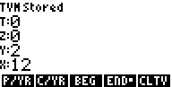
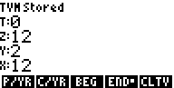

# RPN83P User Guide: TVM Functions

This document describes the `TVM` functions of the RPN83P application which
solves the Time Value of Money equation.

**Version**: 1.0.0 (2024-07-19)

**Parent Document**: [USER_GUIDE.md](USER_GUIDE.md)

**Project Home**: https://github.com/bxparks/rpn83p

## Table of Contents

- [TVM Functions](#tvm-functions)
- [TVM Menu Buttons](#tvm-menu-buttons)
- [TVM Interest Rate](#tvm-interest-rate)
- [TVM Payments Per Year](#tvm-payments-per-year)
- [TVM Compoundings Per Year](#tvm-compoundings-per-year)
- [TVM BEG and END](#tvm-beg-and-end)
- [TVM Solver Control](#tvm-solver-control)
- [TVM Clear](#tvm-clear)
- [TVM Variable Recall](#tvm-variable-recall)
- [TVM Examples](#tvm-examples)
    - [Example 1](#example-1)
    - [Example 2](#example-2)
    - [Example 3](#example-3)
    - [Example 4](#example-4)
    - [Example 5](#example-5)

## TVM Functions

The Time Value of Money (TVM) functionality is inspired by RPN financial
calculators such as the HP-12C, HP-17B, HP-17bii+, and the HP-30b. They are
available through the `ROOT > TVM` menu:

- 
    - 
    - 
    - 

This User Guide assumes that you are already know the theory of the Time Value
of Money, and that you are familiar with TVM functions of RPN financial
calculators. Some introductory information can be found in the manuals of these
calculators:

- [HP-12C User's Guide](https://literature.hpcalc.org/items/47): Section 3:
  Basic Financial Functions
- [HP-17bii+ Owner's Manual](https://literature.hpcalc.org/items/87): Chapter 5: Time Value of Money
- [HP-30b User's Guide](https://literature.hpcalc.org/items/130): Chapter 3:
  Time Value of Money

## TVM Menu Buttons

There are 5 menu items that correspond to the 5 variables in the TVM equation:

- `N`: number of payment periods
- `I%YR`: interest percent per year
- `PV`: present value
- `PMT`: payment per period
- `FV`: future value

When 4 variables are known, the 5th variable can be calculated from the other 4.
Just like the HP-12C and HP-30b, each menu button performs a dual function: it
can either store a value to the corresponding TVM variable, or it can calculate
the TVM variable from the other 4 variables. The rules that determine the course
of action are:

- If a value has been entered into the `X` register, then the next press of a
  TVM menu button **stores** the `X` value to the corresponding variable.
- If the most recent action was another TVM menu button, then the next press of
  a TVM menu button **calculates** that variable from the other 4, and returns
  the result in the `X` register.

Since each button has a dual-function, it can sometimes be confusing to remember
which action a given TVM menu button has performed. This is definitely true on
the HP-12C and the HP-30b which provide no feedback regarding the two different
actions. The RPN83P solves this problem by displaying different status messages
after a TVM menu button has completed. The message will read:

- `TVM Stored` if the menu button **stored** the `X` value into the TVM
  variable,
- `TVM Calculated` if the menu button **calculated** the given TVM variable
  from the other 4 variables.

## TVM Interest Rate

On the HP-12C, the interest rate button is labeled with an `i` and represents
the interest percentage for each *payment period*. On most modern financial
calculators (e.g. HP-10B, HP-10bii, HP-17B, HP-17bii+, HP-20b, HP-30b), the `i`
label has been replaced with `I%YR` (or `I/YR`) which accepts the interest rate
as a nominal *annual* percentage rate. The RPN83P app follows the modern
convention and the interest rate menu button is named `I%YR`.

The relationship between the `i` button (implemented on the HP-12C) and the
`I%YR` button (implemented on modern financial calculators) is:

```
i% = I%YR / PYR
```

where `PYR` is the number of payments per year (see below). In math equations
and inside computer programs, the quantity `i` usually represents the fractional
rate instead of a percentage, so `i = i% / 100`.

## TVM Payments Per Year

The RPN83P app allows the `PYR` quantity to be modified using the `P/YR` menu
button. `PYR` is an input-only parameter, not an output parameter, so the `P/YR`
is not a dual-action button. It performs only a *store* function.

By default, the `P/YR` value is set to 12, which makes it easy to calculate
monthly mortgage payments whose rates are given as yearly percentages.

Here is an example of setting the `P/YR` to a different value, then back to the
default 12:

| **Keys**          | **Display** |
| ---------------   | --------------------- |
| `2` `P/YR`        |  |
| `12` `P/YR`       |  |

When the `P/YR` is different from the default value of `12`, a small dot appears
in the menu label which notifies the user that the default value has changed.

Notice also that when the `P/YR` value is changed, the same value is written
to the `C/YR` parameter (compoundings per year, see below). The default behavior
is to make the `C/YR` value the same as the `P/YR`.

## TVM Compoundings Per Year

In the United States, the number of compoundings per year (`C/YR`) is usually
the same as the number of payments per year (`P/YR`). Therefore, when the `P/YR`
is changed, the same change is applied to `C/YR`.

There are jurisdictions (e.g. Canada, UK) where the compoundings per year is
often different from the payments per year. RPN83P handles this by allowing the
`C/YR` value to be overridden, separately from `P/YR`.

In the following example, the `P/YR` is set to 12, then the `C/YR` is set to 2
(which apparently is common in Canada), then the `C/YR` is set back to 12:

| **Keys**          | **Display** |
| ----------------  | --------------------- |
| `12` `P/YR`       |  |
| `2` `C/YR`        |  |
| `12` `C/YR`       |  |

Similar to `P/YR`, when the value of `C/YR` is different from the default of 12,
a small dot appears in the menu label to warn the user that its value has
changed.

The exact mathematical relationship among `P/YR`, `C/YR`, `I%YR`, and the
internal interest rate per period `i` is given in
[DEVELOPER_TVM.md](DEVELOPER_TVM.md).

## TVM BEG and END

The `BEG` and `END` menu buttons act in the same way as the equivalent buttons
on the HP-12C and HP-30b. The `BEG` button specifies that the payments are made
at the beginning of the payment term. The `END` button specifies that the
payments are made at the end of the payment term. A little dot on the menu
button indicates the currently selected option. Both of these are input-only
buttons. The default value is `END`.

| **Keys**          | **Display** |
| ----------------  | --------------------- |
| `BEG`             |  |
| `END`             |  |

## TVM Solver Control

It is well-known that the `N`, `PV`, `PMT`, and `FV` variables can be solved
using analytical equations. However, there is no closed-form solution for the
`I%YR` quantity, so it must be solved using iterative methods. The TVM Solver is
the submodule that implements the iterative method to solve for `I%YR`.

It can be mathematically deduced (see [DEVELOPER_TVM.md](DEVELOPER_TVM.md)) that
the root-solving equation for `I%YR` can fall into 3 categories:

- 0 solution, or
- 1 unique solution, or
- 0 or 2 solutions.

The TVM Solver tries to handle the various cases as follows:

- If the TVM Solver can determine immediately that the equation has 0 solution,
  it will return a `TVM No Solution` error message.
- If the equation is known to have 1 unique solution, but the TVM Solver fails
  to find a solution, the Solver will return a `TVM Not Found` status code.
- If the equation is known to have 1 unique solution and the TVM Solver is able
  to find it, it returns a `TVM Calculated` status code.
- If the equation is known to have 0 or 2 solutions, and the TVM Solver is able
  to find one of the solutions, it knows immediately that another must exist
  somewhere. The Solver returns `TVM Calculated (Multiple)` status code to
  indicate that another solution exists.
- If the equation is known to have 0 or 2 solutions, but the TVM Solver finds
  neither solution numerically, the solver has no additional information. It
  cannot know whether there are 0 solutions or 2 solutions. So the status code
  will be `TVM Not Found`.
- To prevent excessive execution time, the number of iterations performed by the
  TVM Solver has a maximum limit. The default is 15 iterations. If exceeded, the
  message `TVM Iterations` is displayed.

Due to the complexity of the numerical algorithm and the number of iterations
required, calculating the `I%YR` will take noticeably longer than the other
variables. Somewhere between 1-2 seconds on the TI-84 Plus model have been
observed.

The RPN83P uses the [Newton-Secant
method](https://en.wikipedia.org/wiki/Secant_method) to solve for `I%YR` (see
[DEVELOPER_TVM.md](DEVELOPER_TVM.md) for details). For the purpose of debugging
and to allow extra control for advanced users, three parameters that affect the
progression and termination of the algorithm are exposed:

- `IYR1`: first guess percent per year (default: -50%; allowed: `IYR1 >
  -PYR*100`)
- `IYR2`: second guess percent per year (default: 100%; allowed: `IYR2 >
  -PYR*100`)
- `TMAX`: iteration maximum (default: 15; allowed: 1-255)

For most TVM problems representing real-life situations, the default values
should be sufficient to find a solution. You can override the defaults of these
values by entering a value and pressing the appropriate menu button. A small dot
will be appended to the menu name to indicate that the default value has been
overridden:


We might choose to override `IYR1` and `IYR2` when 2 solutions are known to
exist, but the TVM Solver is unable to find either of them due to the default
initial values. If we know the approximate value of one of the solutions, we can
override the initial guesses to be closer to the solution of interest. This will
help the TVM Solver converge to that solution.

(TODO: Maybe add a menu item to control the convergence error tolerance?
Currently, it is set to 1e-10. Some HP calculators use the number of digits in
the `FIX`, `SCI` or `ENG` display modes to determine the value of the error
tolerance. TI calculators are usually kept in "floating" (aka "display all
digits") mode `FIX(-)`, so I'm not sure it would be useful to use the display
mode to extract size of the tolerance.)

These control parameter can be restored to their default factory values by
pressing the `RSTV` menu. The "overridden" dot on the menu buttons should
disappear.

## TVM Clear

There are 2 reset or clear menu buttons under the TVM menu hierarchy:

- `RSTV`: Reset the TVM Solver control parameters to factory defaults
- `CLTV`: Clear all TVM variables and parameters, including `RSTV` parameters

The `RSTV` clears *only* the 3 parameters related to the TVM Solver which
calculates the interest rate. The factory default values are:

- `IYR1`: -50%
- `IYR2`: 100%
- `TMAX`: 15

The `CLTV` clears *everything* in the TVM submenu, including the `RSTV`
parameters. The following additional variables are cleared or reset to their
factory values:

- `N`, `I%YR`, `PV`, `PMT`, `FV`: 0
- `P/YR`: 12
- `C/YR`: 12
- `BEG`/`END`: set to `END`

## TVM Variable Recall

Remember that most of TVM menu buttons are dual-action:

- `number + button`: sets the TVM variable to `X` value, and
- `button`: calculates the TVM variable from the other 4 variables.

Other TVM menu buttons (i.e. `P/YR`, `C/YR`, `IYR1`, `IYR2`, `TMAX`) are
single-action buttons and support only the storing of their values. There is no
ability to calculate those parameters from other parameters. This convention
used by most (all?) HP financial calculators.

The RPN83P app provides a mechanism to retrieve a TVM variable *without*
performing a calculation. This was useful for debugging during development, but
the functionality was innocuous enough that I retained it for general use. The
recall functionality is available through the `2ND` key:

- `2ND N`: recall the `N` variable
- `2ND I%YR`: recall the `I%YR` variable
- `2ND PV`: recall the `PV` variable
- `2ND PMT`: recall the `PMT` variable
- `2ND FV`: recall the `FV` variable
- `2ND P/YR`: recall the `P/YR` variable
- `2ND C/YR`: recall the `C/YR` variable
- `2ND IYR1`: recall the `IYR1` variable
- `2ND IYR2`: recall the `IYR2` variable
- `2ND TMAX`: recall the `TMAX` variable

(As a rule of thumb, the RPN83P does not use the `2ND` button for its menu
buttons. Usually if a menu button sets an internal variable, the equivalent read
functionality is implemented by another menu button with a name similar to the
original menu with the addition of a question mark (e.g. `WSIZ` and `WSZ?`).
This helps with discovery because each function is directly shown through the
menu system, with no hidden features. But there are so many TVM variables and
parameters, that adding the `?` variant of all those menu buttons would have
made the menu rows too cluttered and hard to navigate. Currently, the TVM
submenu is the only place where the `2ND` button is used for hidden menu
functionality.)

## TVM Examples

### Example 1

Calculate the monthly payment on a 30-year, $500,000 mortgage at 7.5%

- Press `CLTV`
- Press 360 `N` (30 years * 12 payments/year)
- Press 7.5 `I%YR`
- Press 500000 `PV`
- Press 0 `FV`
- Press `PMT`
- Answer: -$3496.072543 (should see `TVM Calculated`)

The sign convention of the TVM equation is such that +'ve represents inflow of
cash, and -'ve represents outflow of cash.

### Example 2

Assuming Example 1, calculate the amount that can be borrowed if the payment is
$3000/month instead of $3496/month

- (Building on Example 1)
- Press -3000 `PMT` (should see `TVM Stored`)
- Press `PV` (should see `TVM Caculated`)
- Answer: $429052.882

### Example 3

Assuming Examples 1 and 2, calculate the interest rate required to get a
$500,000 mortgage with a $3000/month payment

- (Building on Examples 1 and 2)
- Press 500000 `PV` (should see `TVM Stored` message). This resets the current
  `PV` which became modified by the calculation in Example 2.
- Press `I%YR` (should see `TVM Calculated`)
- Answer: 6.00699%

### Example 4

If Susan got paid $0.01 per second, compounded every second, at a 10% per annum
rate, what is her bank balance after 365 days?

- Press `CLTV`
- Press 3600 `ENTER` 24 `*` 365 `*` (should see 31536000)
- Press `N`
- Press DOWN to next menu row
    - Press `P/YR` (set payments per year to the same 31536000)
    - Press UP to return to the TVM menu row
- Press 10 `I%YR`
- Press 0 `PV` (bank balance starts at 0)
- Press -0.01 `PMT` (negative to indicate outward cash flow to bank)
- Press `FV` (should see `TVM Calculated`)
- Answer: $331667.0067

Note that the answer is accurate to all displayed digits because we avoided
roundoff errors by using the new `E^X-` and `LN1+` functions internally.

Source:
- [A Penny for your
  Thoughts](https://people.eecs.berkeley.edu/~wkahan/MathSand.pdf) (1983)
- [Looking for TVM formulas](https://www.hpmuseum.org/forum/thread-1012.html)
  (2014)

### Example 5

The following contrived example has 2 solutions for `I%YR` 14.44% and 53.17%. We
can persuade the TVM module to give us 2 solutions using the `IYR1` and `IYR2`
menu buttons:

- Press `CLTV`
- Press 10 `N`
- Press 50 `PV`
- Press -30 `PMT`
- Press 400 `FV`
- Press 1 `P/YR`
- Press `I%YR` (should see `TVM Calculated (Multiple)`)
- Answer: 53.17221327%
- Modify the TVM Solver initial guesses to find the second solution
    - Press 10 `IYR1`
    - Press 20 `IYR2`
- Press `I%YR` (should see `TVM Calculated (Multiple)`)
- Answer: 14.43587133%

When the calculator knows that there are multiple solutions, and it can find
only one of them, the status message will be "TVM Calculated (Multiple)". After
the first solution is found, the `IYR1` and `IYR2` guesses can be adjusted to
search for the other solution. Unfortunately the calculator cannot give hints
about where the other solution may be found.

Source:
- [Solving the TVM equation for the interest
  rate](https://www.hpmuseum.org/cgi-sys/cgiwrap/hpmuseum/archv021.cgi?read=234439) (2012)
